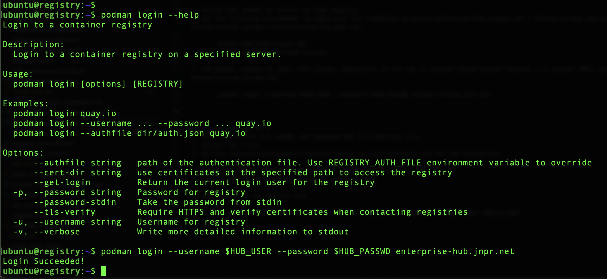
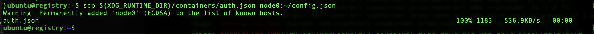
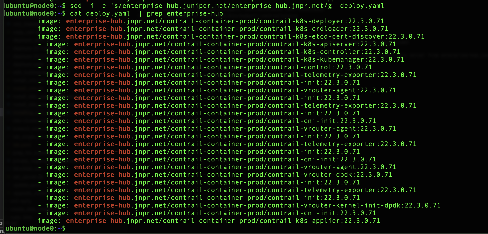
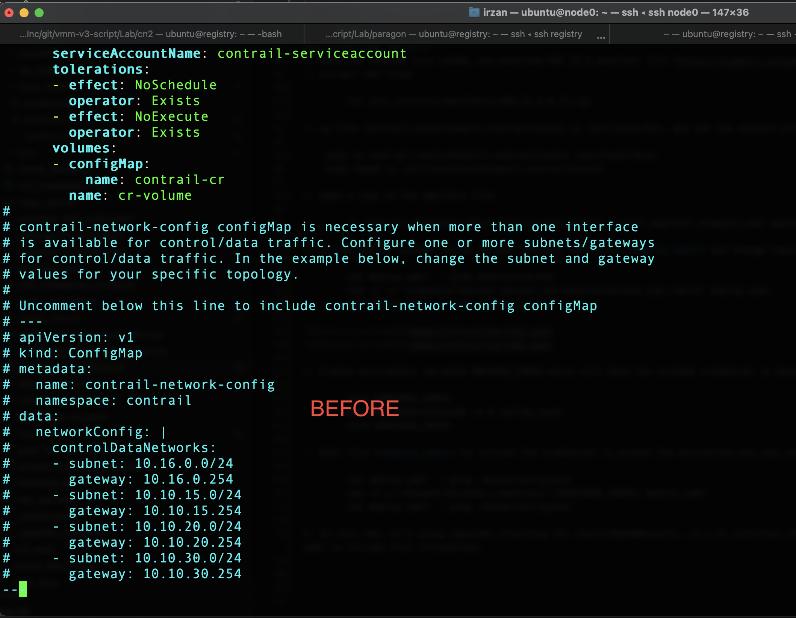
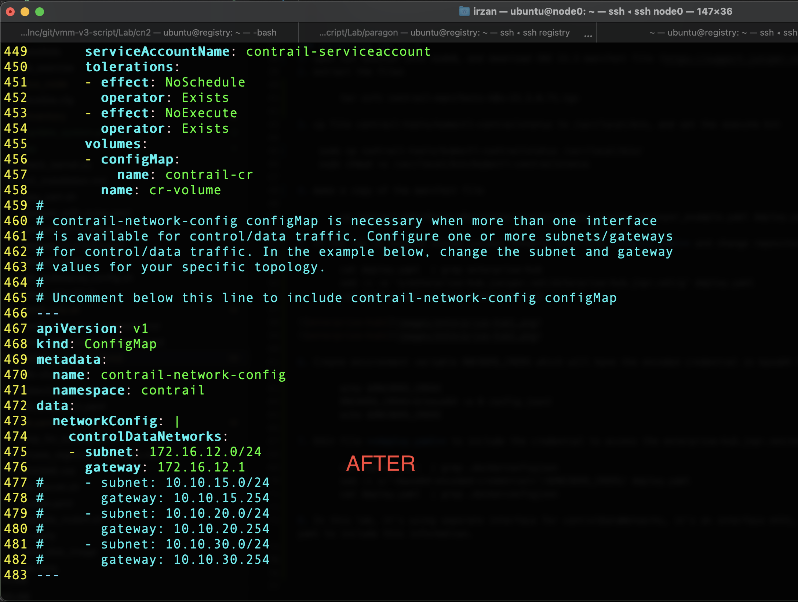
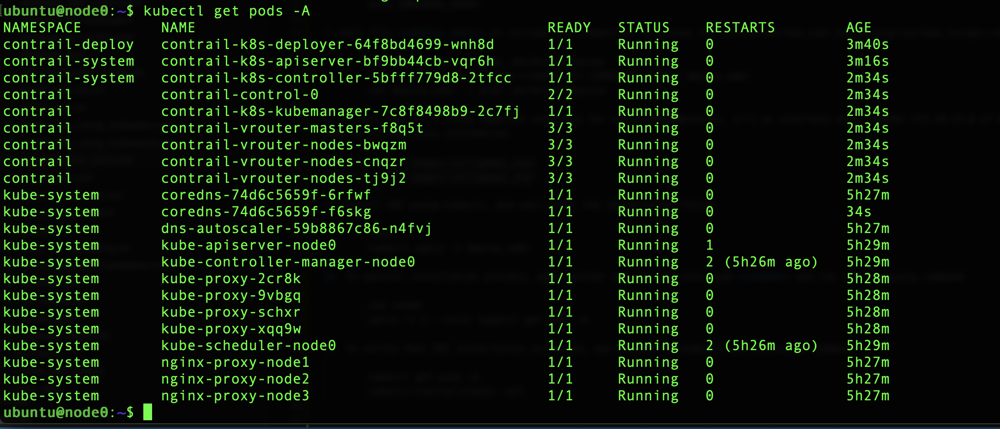
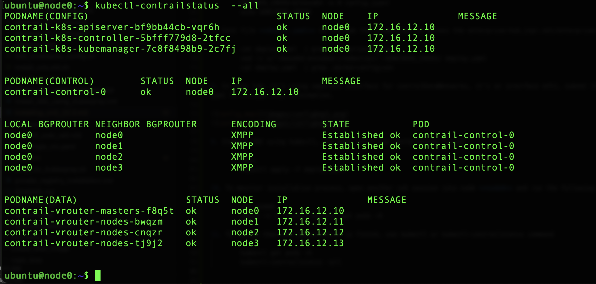

# Installing CN2 23.1
This document provides guideline on how to install CN2 23.1, based on this [documentation](https://www.juniper.net/documentation/us/en/software/cn-cloud-native23.1/cn-cloud-native-k8s-install-and-lcm/index.html)

## updating kubernetes nodes and install the supported kernel version

1. update system using ansible playbook [update_system.yml](linux_node/update_system.yml). the ansible playbook will update system and install the supported kernel on kubernetes nodes
2. at the end, the ansible playbook will reboot the nodes

        cd linux_node
        ansible-playbook update_system.yml

## install k8s using kubespray

follow [this document](install_k8s_using_kubespray.md) to install kubernetes using kubespray

## Installing podman and crio on node registry
1. upload file [install_crio.sh](install_crio.sh) into node registry

        scp install_crio.sh registry:~/

2. open ssh session node registry, and run script install_crio.sh
        
        ssh registry
        ./install_crio.sh

3. Verify that podman is install on node registry
4. Set the following environment variable with the credential to access enterprise-hub.juniper.net / enterprise-hub.jnpr.net. Please contact PLM to get credential to access enterprise-hub.juniper.net/enterprise-hub.jnpr.net

        export HUB_USER=<login ID>
        export HUB_PASSWD=<token access>

5. run podman command to login into juniper repository. If the lab is located inside juniper network (i.e Juniper VMM), use server enterprise-hub.jnpr.net, otherwise use enterprise-hub.juniper.net

        podman login --username $HUB_USER --password $HUB_PASSWD enterprise-hub.jnpr.net

        or 

        podman login --username $HUB_USER --password $HUB_PASSWD enterprise-hub.juniper.net

6. upload file ${XDG_RUNTIME_DIR}/containers/auth.json to node **node0**

        scp ${XDG_RUNTIME_DIR}/containers/auth.json node0:~/config.json
        

### installing CN2 23.1
1. open ssh session into node0, and download CN2 22.4 manifest file (https://support.juniper.net/support/downloads/?p=contrail-networking)
2. extract the files

        tar xvfz contrail-manifests-k8s-23.1.0.282.tgz

3. Or clone the contrail repository

        git clone https://github.com/Juniper/contrail-networking.git

3. cp file contrail-tools/kubectl-contrailstatus to /usr/local/bin, and set the execute bit

        sudo cp contrail-tools/kubectl-contrailstatus /usr/local/bin/
        sudo chmod +x /usr/local/bin/kubectl-contrailstatus

4. make a copy of the manifest file

        cp contrail-manifests-k8s/single-cluster/single_cluster_deployer_example.yaml deploy.yaml

5. If the lab is located inside juniper network, edit file **deploy.yaml** and change repository server from enterprise-hub.juniper.net to enterprise-hub.jnpr.net

        cat deploy.yaml  | grep enterprise-hub
        sed -i -e 's/enterprise-hub.juniper.net/enterprise-hub.jnpr.net/g' deploy.yaml
        cat deploy.yaml  | grep enterprise-hub

        
6. Create environment variable ENCODED_CREDS which will have the encoded credential in base64 format

        echo $ENCODED_CREDS
        ENCODED_CREDS=$(base64 -w 0 config.json)
        echo $ENCODED_CREDS

7. Edit file **deploy.yaml** to include the credential to access the enterprise-hub.jnpr.net/enterprise-hub.juniper.net.  the credential must be encoded in base64.

        cat deploy.yaml  | grep .dockerconfigjson
        sed -i s/'<base64-encoded-credential>'/$ENCODED_CREDS/ deploy.yaml
        cat deploy.yaml  | grep .dockerconfigjson

8. In this lab, it's using separate interface for controlDataNetworks, it's on interface eth1, subnet 172.16.12.0 of k8s nodes(node0, node1, node2, and node3). Edit file deploy.yaml to include this information.

        ---
        apiVersion: v1
        kind: ConfigMap
        metadata:
           name: contrail-network-config
           namespace: contrail
        data:
           networkConfig: |
              controlDataNetworks:
              - subnet: 172.16.12.0/24
                gateway: 172.16.12.1
        
        

9. Install CN2 using kubectl, and wait until the installation finish

        tmux 
        kubectl apply -f deploy.yaml

10. To monitor installation process, open another ssh session into node **node0** and run the following command

        ssh node0
        watch -n 5 --color kubectl get pods -A 

11. To verify that CN2 installation is finish, use kubectl or kubectl-contrailstatus command

        kubectl get pods -A
        kubectl-contrailstatus -all

