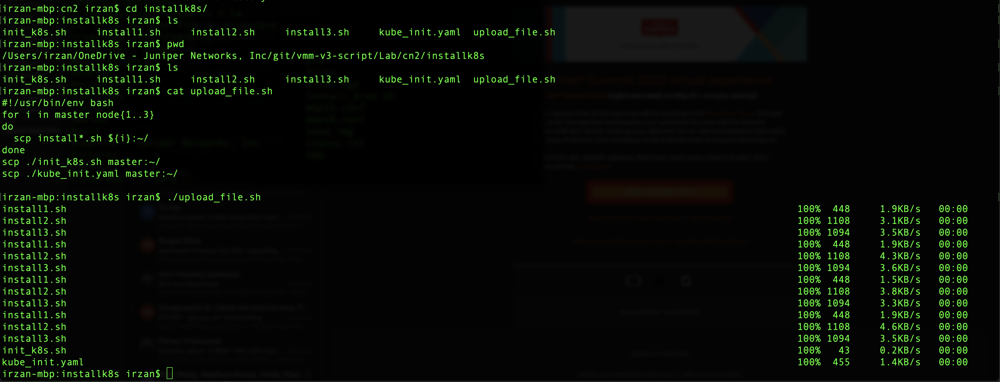
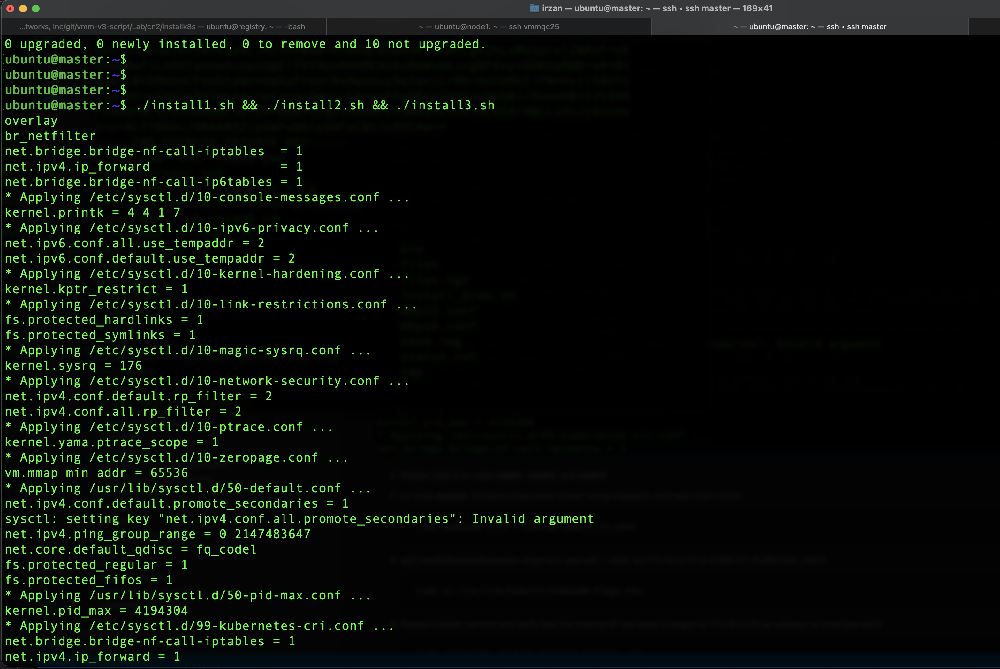
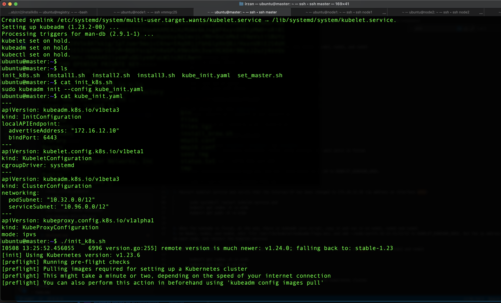
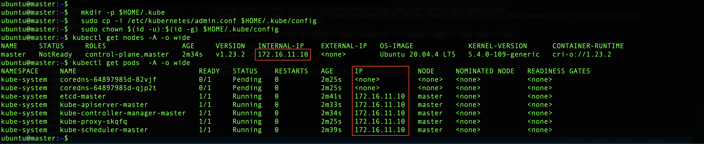
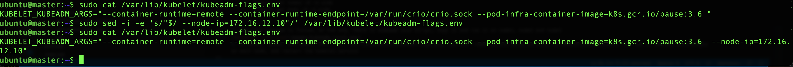
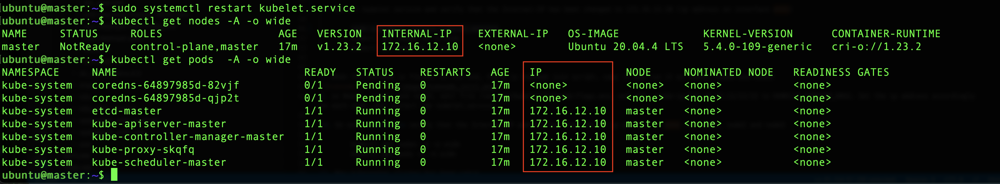
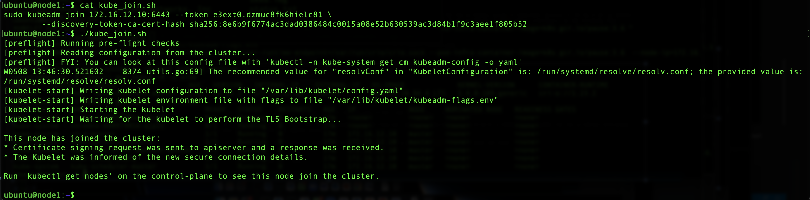
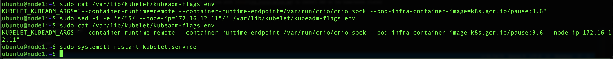
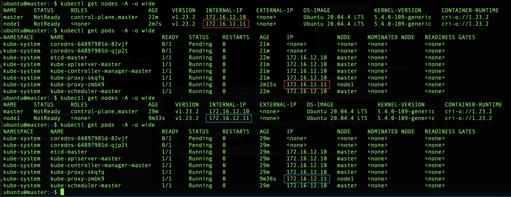
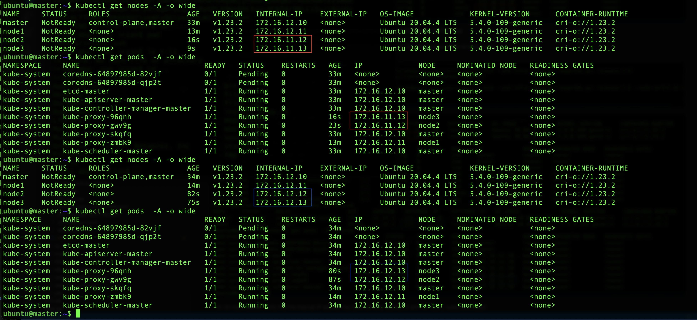

# Installing kubernetes using Kubeadm

## Kubernetes cluster installation

1. copy files in directory [installk8s/](installk8s/) to node node0, node1, node2, and node3

        #!/usr/bin/env bash
        for i in node0 node{1..3}
        do
        scp install*.sh ${i}:~/
        done
        scp ./init_k8s.sh node0:~/
        scp ./kube_init.yaml node0:~/

2. open ssh session into node **node0**
3. Run scripts install1.sh , install2.sh and install3.sh

        ./install1.sh && ./install2.sh && ./install3.sh

4. Repeat step 3 on node **node1**, **node2**, and **node3**
5. on node **node0**, initialize kubernetes cluster using kubeadm, and wait until it finish

        sudo kubeadm init --config kube_init.yaml

6. From **kubectl get nodes -A -o wide** and **kubectl get pods -A -o wide**, it can be seen that the ip address assign to kubernetes services is 172.16.11.10 (ip address of eth0 (management interface). To change the ip address for the kubernetes services to 172.16.12.10 (ip address of eth1 (fabric interface)), do the following steps

7. Edit /var/lib/kubelet/kubeadm-flags.env, and add --node-ip=172.16.12.10 to KUBELET_KUBEADM_ARGS.

        sudo sed -i -e 's/"$/ --node-ip=172.16.12.10"/' /var/lib/kubelet/kubeadm-flags.env 

8. Restart kubelet service and verify that the Internal-IP has been changed to 172.16.12.10 (ip address on interface eth1)
        
        sudo systemctl restart kubelet.service
        kubectl get nodes -A -o wide
        kubectl get pods -A -o wide

9. When the kubeadm is finish, at the end, there is kubeadm join script, copy it and run it on node1, node2 and node3

10. After worker nodes join the kubernetes cluster, it still use management ip address (eth0).

9. On Node1, node2, and node3, to change the kubernetes to use ip address of eth1, then do the following
   - edit file /var/lib/kubelet/kubeadm-flags.env
   - add --node-ip=172.16.12.11/12/13 to KUBELET_KUBEADM_ARGS (Set the ip address accordingly on each node)
   - restart the kubelet.service, sudo systemctl restart kubelet.service

        ssh node1 
        sudo sed -i -e 's/"$/ --node-ip=172.16.12.11"/' /var/lib/kubelet/kubeadm-flags.env
        sudo systemctl restart kubelet.service
        exit

        ssh node2
        sudo sed -i -e 's/"$/ --node-ip=172.16.12.12"/' /var/lib/kubelet/kubeadm-flags.env
        sudo systemctl restart kubelet.service
        exit

        ssh node3 
        sudo sed -i -e 's/"$/ --node-ip=172.16.12.13"/' /var/lib/kubelet/kubeadm-flags.env
        sudo systemctl restart kubelet.service
        exit

10. On node **node0** verify that the Internal-IP address has been set to ip address of eth1 for node1, node2 and node3

        kubectl get nodes -A -o wide
        kubectl get pods -A -o wide

11. Now kubernetes cluster has been setup
12. Please continue with [this](cn2_installation_v22.3.md) to install CN2 on the kubernetes cluster

## How to set kubectl over ssh tunnel

Information on how to set kubectl over ssh, can be found here [reference](https://blog.scottlowe.org/2019/07/30/adding-a-name-to-kubernetes-api-server-certificate/)

This is required if you want to run kubectl command from your workstation/laptop.

Screenshot recording for these steps, can be found [here](https://asciinema.org/a/MhG7mlJTPKY6C3P0dPYAPe8q1)

1. on node0, run 

        kubectl -n kube-system get configmap kubeadm-config -o jsonpath='{.data.ClusterConfiguration}' > kubeadm.yaml

2. edit file kubeadmin, under **apiServer:** add the following:

      apiServer
        certSANs:
        - "127.0.0.1"
        - "172.16.12.10"
        - "10.96.0.1"

3. Move the existing API server certificate to different directory

        mkdir ~/certs
        sudo mv /etc/kubernetes/pki/apiserver.{crt,key} ./certs

4. run kubedm to just generate a new certificate

        sudo kubeadm init phase certs apiserver --config kubeadm.yaml

5. Restart the API server container :
    - run **sudo crictl ps | grep kube-apiserver | grep -v pause** to get the containerID of the kubernetes API server
    - run **sudo crictl update <containerID>** to restart it.

6. copy kubectl config from node **node0** to your local workstation

        mkdir ~/.kube
        scp node0:~/.kube/config ~/.kube/config
        
7. On your workstation, edit file ~/.kube/config. Change the URL from https://172.16.12.10:6443 to https://127.0.0.1:6443

        sed -i -e 's/172.16.12.10/127.0.0.1/' ~/.kube/config

7. Open ssh session with port forwarding on 6443 to node **node0y** (and keep the session alive) or run ssh with -fN option 

        ssh -L 6443:127.0.0.1:6443 node0
        or 
        ssh  -fN -L 6443:127.0.0.1:6443 node0

8. Install kubectl on your workstation, and test kubectl command

        kubectl get nodes
        kubectl get pods -A

