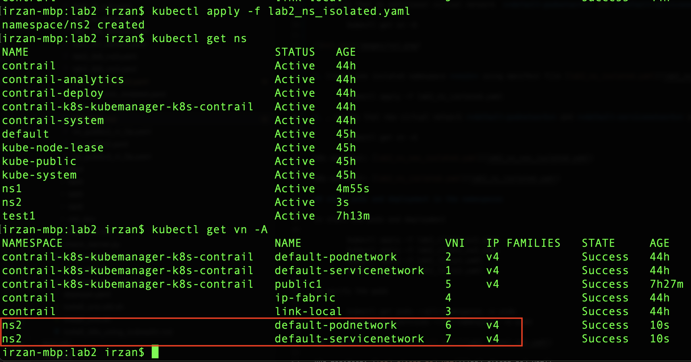
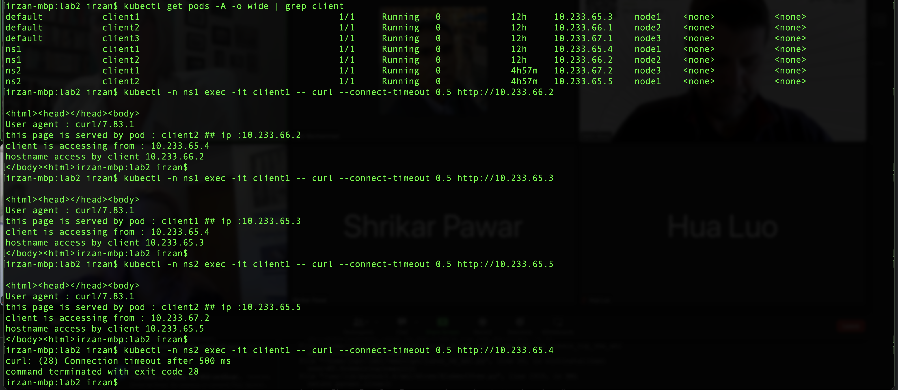
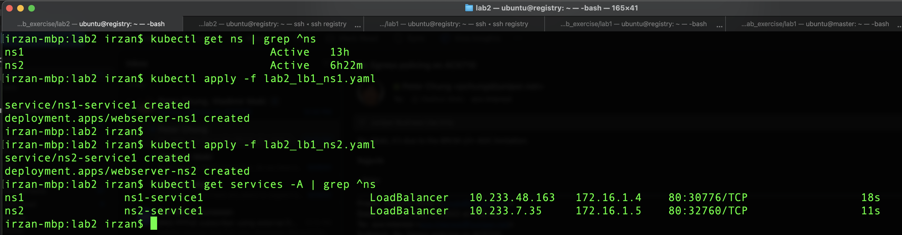
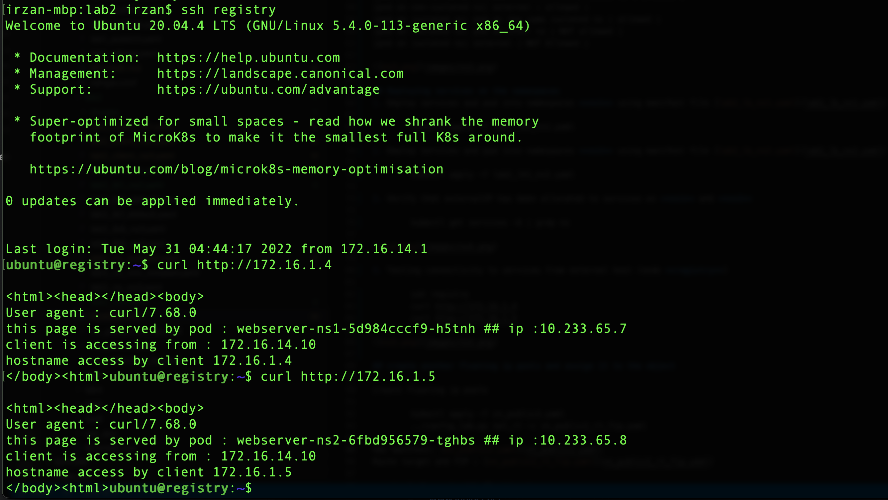

# Lab 2
In this lab exercise, we are going to configure namespace and test an enhancement provided by CN2 to namespace that allow segregation of namespace (namespace isolation)

## Creating non-isolated and isolated namespaces

1. Verify that there is no namespace **ns1** and **ns2** configured on the system

        kubectl get ns

2. verify that virtual network **default-podnetwork** and **default-servicenetwork** are inside namespace **contrail-k8s-kubemanager-k8s-contrail**

        kubectl get vn -A

3. Create one non-isolated namespace **ns1** using manifest file [lab2_ns_non_isolated.yaml](lab2_ns_non_isolated.yaml)

        kubectl apply -f lab2_ns_non_isolated.yaml

4. Verify that no additional virtual network  **default-podnetwork** and **default-servicenetwork** are created.

        kubectl get vn -A

5. Create one isolated namespace **ns2** using manifest file [lab2_ns_isolated.yaml](lab2_ns_isolated.yaml)

        kubectl apply -f lab2_ns_isolated.yaml

6. Verify that new virtual network **default-podnetwork** and **default-servicenetwork** are created inside this new namespace **ns2**. When an isolated namespace is created, then virtual network **default-podnetwork** and **default-servicenetwork** will be created for this isolated namespace

        kubectl get vn -A

## Deploying pods into namespaces
1. Deploy pods into non-isolated namespace **ns1**, use manifest [lab2_client_ns1.yaml](lab2_client_ns1.yaml)

        kubectl apply -f lab2_client_ns1.yaml

2. Deploy pods into isolated namespace **ns2**, use manifest [lab2_client_ns2.yaml](lab2_client_ns2.yaml)

        kubectl apply -f lab2_client_ns2.yaml
3. Verify the ip addresses assigned to these pods

        kubectl get pods -A -o wide 

4. Test communication between pods on different namespace, and the result should be the following
   - communication between pods on non-isolated namespaces are allowed, for example, pod **client1** on namespace **default** is able to communicate with pod **client1** on namespace **ns1**
   - Pods on isolated namespace can only communicate with other pods on the same isolated namespace. for example pod **client1** on namespace **ns2** can only communicated with other pod on namespace **ns2**
   - communication from pods to internet is allowed

| from | destination | communication|
|-|-|-|
|pod on non-isolated ns| pod on the same non-isolated ns | allowed |
|pod on non-isolated ns| pod on other non-isolated ns | allowed |
|pod on non-isolated ns| external | allowed |
|pod on isolated ns| pod on the same isolated ns | allowed |
|pod on isolated ns| pod on other ns | NOT allowed |
|pod on isolated ns| external | NOT Allowed | 

## Deploying services on the namespaces
In this exercise, services will be deployed on namespaces.

By default these services will get externalIP from **default-external** that was configured on lab exercise 1

1. Deploy services and pod into namespaces **ns1** using manifest file [lab2_lb_ns1.yaml](lab2_lb_ns1.yaml)        

        kubectl apply -f lab2_lb1_ns1.yaml

2. Deploy services and pod into namespaces **ns2** using manifest file [lab2_lb_ns2.yaml](lab2_lb_ns2.yaml)        

        kubectl apply -f lab2_lb1_ns2.yaml

3. Verify that externalIP has been allocated to services on **ns1** and **ns2**

        kubectl get services -A | grep ns

4. Testing connectivity to services from external host (node **registry**)

        ssh registry 
        curl http://172.16.1.4
        curl http://172.16.1.5

## Creating another VN for externalIP and deployed services to use this VN
In this exercise, another VN (virtual network) will be created for externalIP, and another service will be created and use this VN for its externalIP. 

The VN and service will be created in the namespace.

1. deploy new VN using manifest file [lab2_public2.yaml](lab2_public2.yaml)

        kubectl apply -f lab2_public.yaml

2. Verify that vn **public2** has been deployed on namespace **ns2**
        
        kubectl get vn -A
3. Deploy service using manifest file [lab2_lb2_ns2.yaml](lab2_lb2_ns2.yaml)

        kubectl apply -f lab2_lb2_ns2.yaml
4. Verify that the new service has been assigned with externalIP from subnet **public2**

        kubectl -n ns2 get services
5. From node **registry**, verify access to this service

        curl http://<ip_of_new_service>

