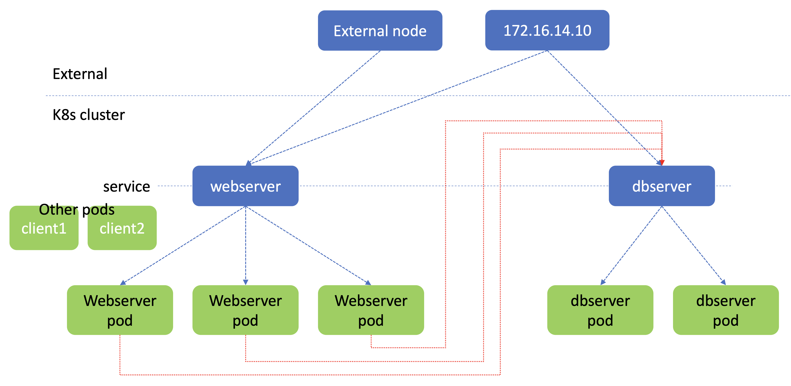
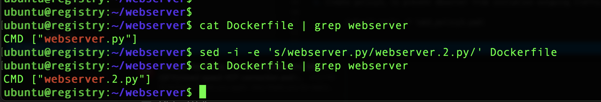
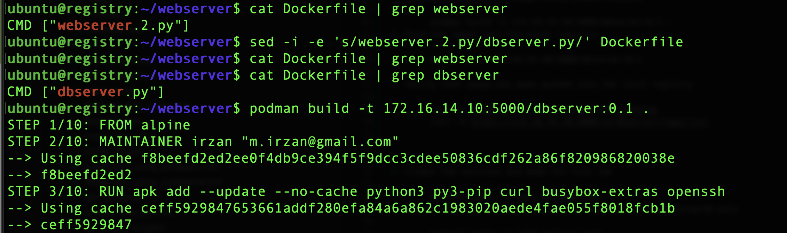
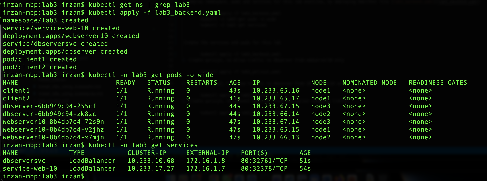
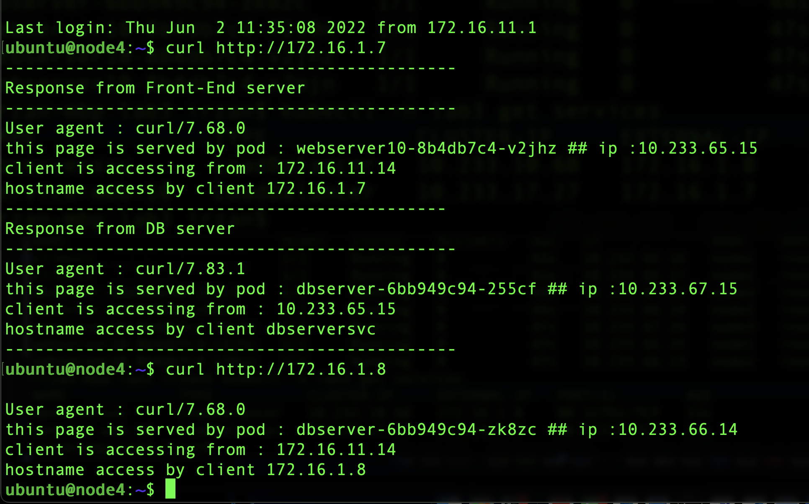
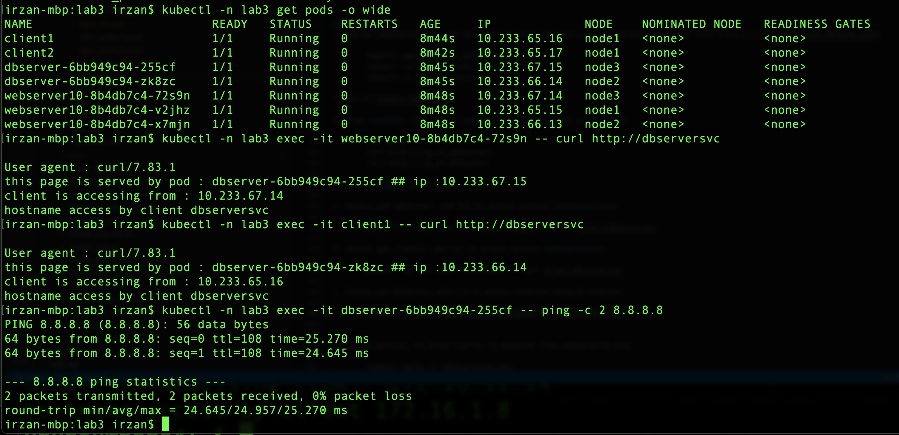
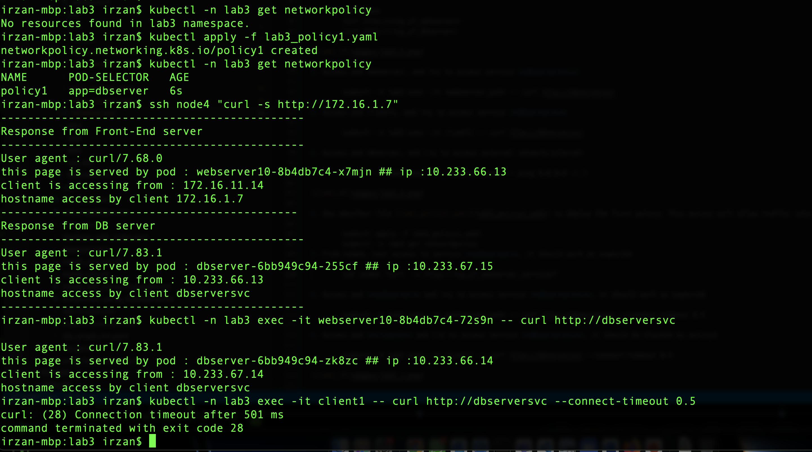
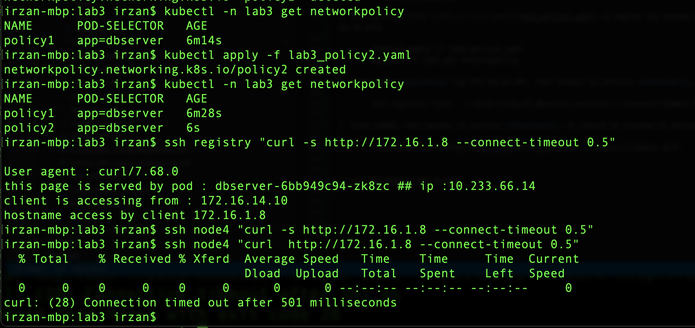
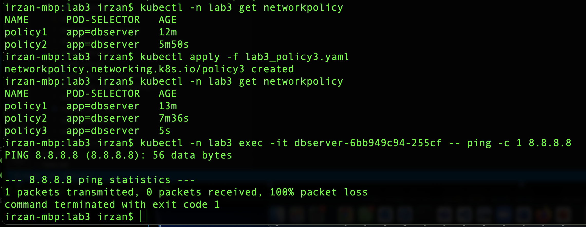

# Contrail firewall policy
In this lab exercise, we are going to test kubernetes network policy which is implemented on CN2 using Contrail Firewall Construct.

The topology that we are going to use for this lab exercise is the following :

The objects inside the cluster are the following
- service webserver with webserver pods
- service dbserver with dbserver pods

Traffic flow
1. incoming request to service webserver will be forwarded to the webserver pod
2. from the webserver pod, it will send the request to service dbserver
3. incoming request to service dbserver will be forwarded to dbserver pod

Default condition
- incoming request from any external server into service webserver and service dbserver are allowed
- incoming request from other pods into service webserver and service dbserver are allowed
- outgoing traffic from pods webserver and pods dbserver are allowed

The policy that we want to implement
- Only request from pods webserver will be allowed into service dbserver/pods dbserver
- only request from external node with ip address 172.16.14.10 will be allowed into service dbserver
- outgoing traffic to external/internet from pods dbserver is not allowed

## Preparing container image for the lab.
we are going to create new container image required for this lab exercise
1. open ssh session into node **registry** and go into directory webserver

        ssh registry
        cd webserver

2. edit file Dockerfile, and rename "webserver.py" to "webserver.2.py"

        cat Dockerfile | grep webserver
        sed -i -e 's/webserver.py/webserver.2.py/' Dockerfile
        cat Dockerfile | grep webserver

3. Create the container image using podman command

        podman build -t 172.16.14.10:5000/webserver:0.2 .
4. Push the image into the local registry

        podman push 172.16.14.10:5000/webserver:0.2
5. Verify that image has been pushed into the local registry

        curl -k https://172.16.14.10:5000/v2/webserver/tags/list

6. edit file Dockerfile, and rename "webserver.2.py" to "dbserver.py"

        cat Dockerfile | grep webserver
        sed -i -e 's/webserver.2.py/dbserver.py/' Dockerfile
        cat Dockerfile | grep webserver
        cat Dockerfile | grep dbserver

3. Create the container image using podman command

        podman build -t 172.16.14.10:5000/dbserver:0.1 .
4. Push the image into the local registry

        podman push 172.16.14.10:5000/dbserver:0.1

5. Verify that image has been pushed into the local registry

        curl -k https://172.16.14.10:5000/v2/_catalog
        curl -k https://172.16.14.10:5000/v2/dbserver/tags/list

## Steps
1. Deploy namespace, pods and services for this lab exercise, by deploying manifest file [lab3_backend.yaml](lab3_backend.yaml)

        kubectl apply -f lab3_backend.yaml
        kubectl -n lab3 get pods -o wide
        kubectl -n lab3 get services

2. from **node4** test access service **webserver** and **dbserver**

        ssh node4
        curl http://<ip_of_webserver>
        curl http://<ip_of_dbserver>

3. Access pod webserver, and try to access service **dbserversvc**

        kubectl -n lab3 exec -it <webserver_pod> -- curl http://dbserversvc

4. Access pod client1, and try to access service **dbservervc**

        kubectl -n lab3 exec -it client1 -- curl http://dbserversvc

5. Access pod dbserver, and try to access external network/internet
        
        kubectl -n lab3 exec -it <dbserver_pod> -- ping 8.8.8.8 -c 2

6. Use manifest file [lab3_policy1.yaml](lab3_policy1.yaml) to deploy the first policy. This policy will allow traffic into pods **dbserver** only from pods **webserver**

        kubectl apply -f lab3_policy1.yaml
        kubectl -n lab3 get networkpolicy
7. From node4, test access to service **webserver**, it should work as expected

        ssh node4 "curl  -s http://<ip_of_webserver_service>"

8. Access pod **webserver** and try to access service **dbserversvc**, it should work as expected

        kubectl -n lab3 exec -it <webserver_pod> -- curl http://dbserversvc --connect-timeout 0.5

8. Access pod **client1** and try to access service **dbserversvc**, it should be blocked by policy1

        kubectl -n lab3 exec -it client1 -- curl http://dbserversvc --connect-timeout 0.5

7. Use manifest file [lab3_policy2.yaml](lab3_policy2.yaml) to deploy the second policy. This policy will allow traffic into pods **dbserver**  from external host, 172.16.14.10 only

        kubectl apply -f lab3_policy2.yaml
        kubectl -n lab3 get networkpolicy

7. From node **registry** (ip 172.16.14.10), test access to service **dbserver**, it should work as expected

        ssh registry "curl  -s http://<ip_of_dbserver_service> --connect-timeout 0.5"

8. From node4, test access to service **dbserver**, it should be blocked by policy2

        ssh node4 "curl http://<ip_of_dbserver_service> --connect-timeout 0.5"

9. Use manifest file [lab3_policy3.yaml](lab3_policy3.yaml) to deploy the third policy. This policy will block access to external from pods **dbserver**  to external host

        kubectl apply -f lab3_policy3.yaml
        kubectl -n lab3 get networkpolicy

10. Access pod dbserver, and try to access external network/internet, it should fail, because it is blocked by policy4
        
        kubectl -n lab3 exec -it <dbserver_pod> -- ping 8.8.8.8 -c 2

        
