# Testing service chaining using BGPaaS 

## Simple topology 

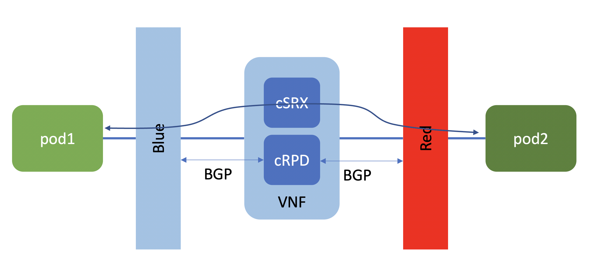

Currently CN2 doesn't support service chaining using policy like in the legacy contrail networking, but CN2 support BGPaaS (BGP as a service), where BGP peer can be configured between pods and CN2 controller.

Inn this lab exercise, we are going to configure service chaining by using BGP to steer traffic from one virtual network to another virtual network.

Object to be configured in this lab exercise:
1. namespace: to run the topology
2. VNF: it is pod consist of cSRX and cRPD. cRPD will provide BGP routing function to exchange routing information with CN2 controller, cSRX is used to process packet when it transverse from one virtual network to another virtual network
3. BGPaaS : CN2 feature, to establish BGP peer between CN2 and VNF (in this case cRPD)
4. Pod1 and Pod2: to test traffic between virtual networks
5. Virtual networks : where pods are connected to.

## Documentation
Documentation on how to configure BGPaaS can be found [here](https://www.juniper.net/documentation/us/en/software/cn-cloud-native22/cn-cloud-native-feature-guide/cn-cloud-native-network-feature/topics/task/cn-cloud-native-bgp-as-service.html)

## uploading cSRX and cRPD image into local repository
1. Download csrx and crpd software, and upload them into node registry
2. Load csrx and crpd software image into local repository

        podman image load -i junos-csrx-docker-22.1R1.10.img
        podman image load -i junos-routing-crpd-amd64-docker-22.1R1.10.tgz

3. Create tag for csrx and crpd images
4. Push csrx and crpd image into the local repository

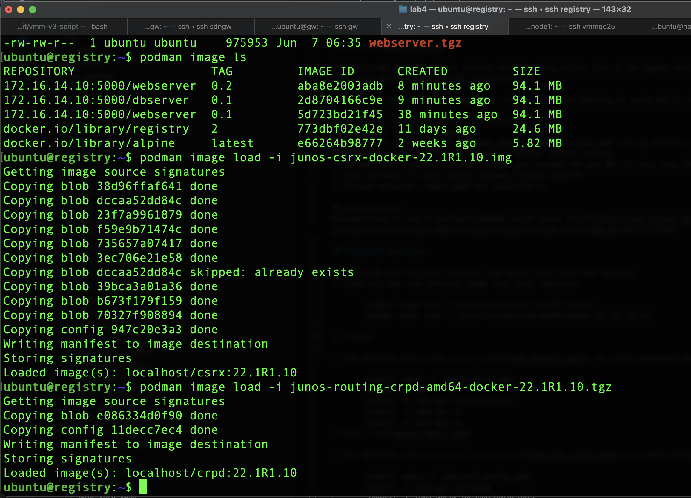
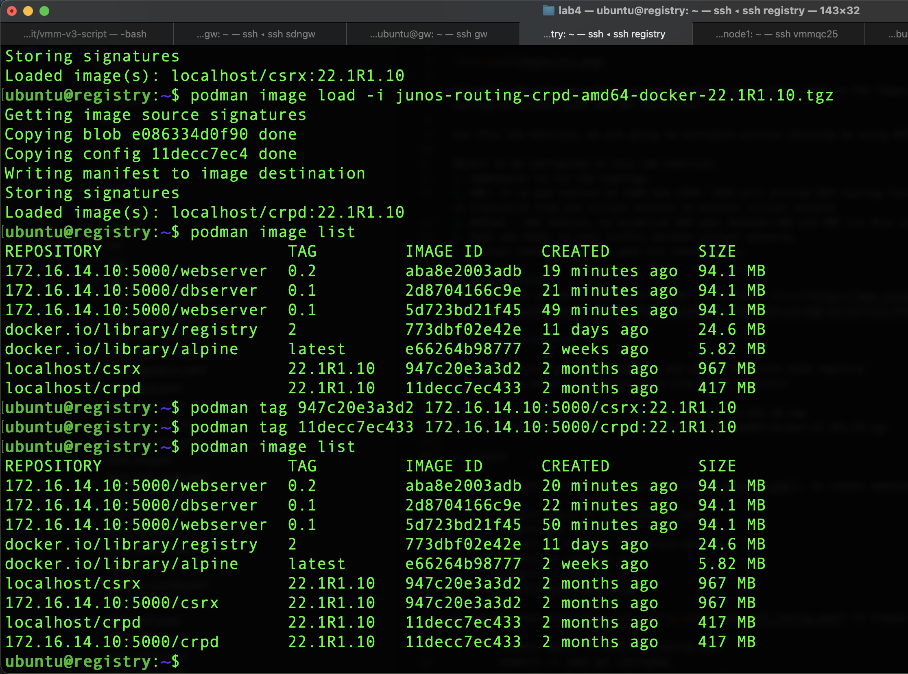
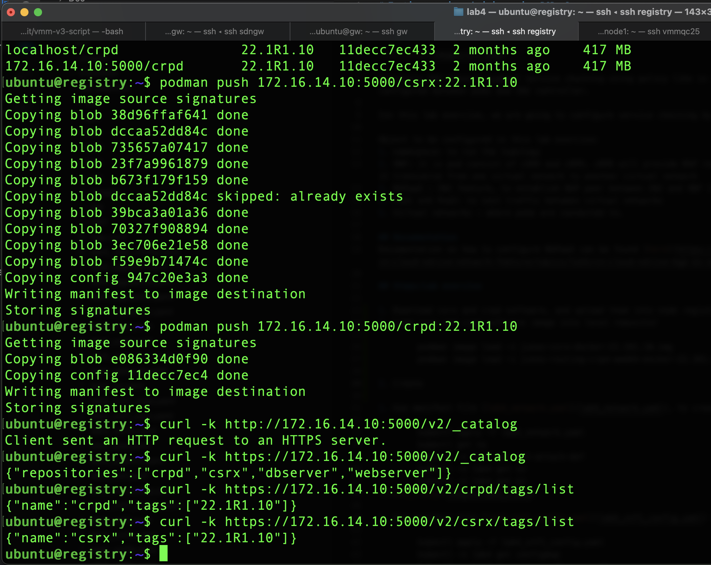

## Steps/Lab exercise

1. Use manifest file [lab4_network.yaml](lab4_network.yaml), to create namespace and virtual network

        kubectl apply -f lab4_network.yaml
        kubectl get ns
        kubectl -n lab4 get net-attach-def
        kubectl -n lab4 get vn
        kubectl -n lab4 get sn
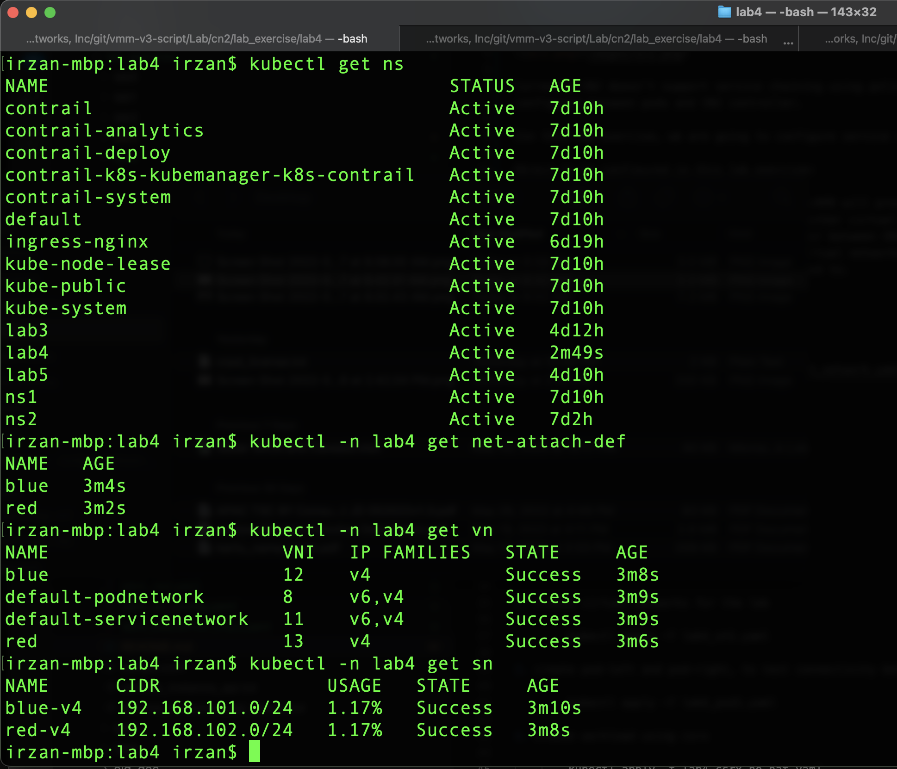

2. Use manifest file [lab4_vnf1_config.yaml](lab4_vnf1_config.yaml) to create configmap vnf1 which will provide initial configuration to cSRX and cRPD

        kubectl apply -f lab4_vnf1_config.yaml
        kubectl -n lab4 get configmap
        kubectl -n lab4 describe configmap vnf1

3. use manifest file [lab4_nvf1.yaml](lab4_vnf1.yaml) to create pod NVF1 which consist of cSRX and cRPD
        
        kubectl apply -f lab4_vnf1.yaml
        kubectl -n lab4 get pods
        kubectl -n lab4 describe pods vnf1      ## to get ip address information on interface eth1 and eth2 of pod vnf1

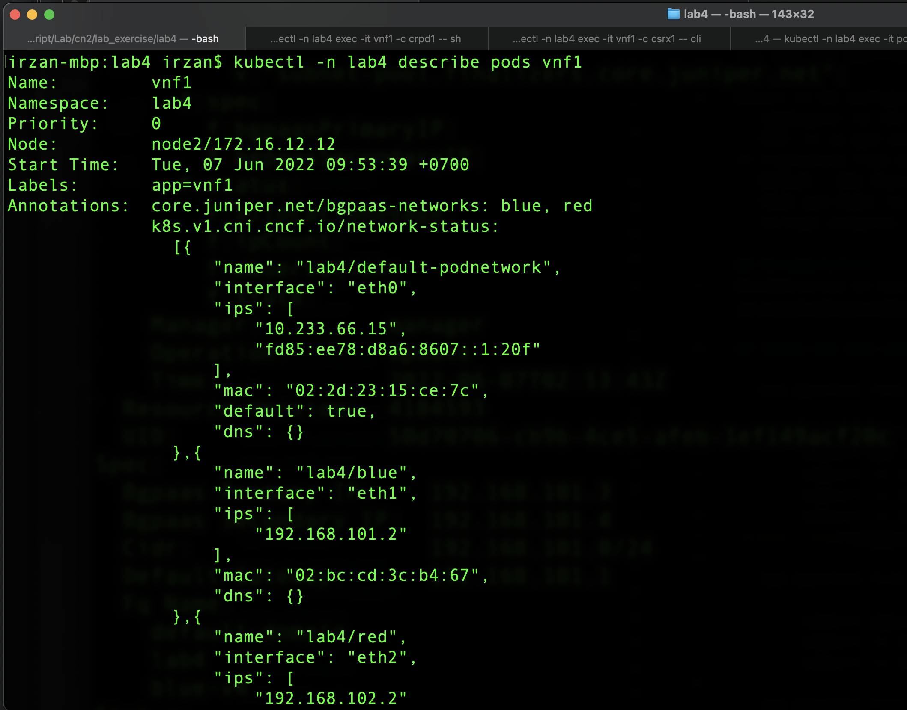

4. use manifest file [lab4_bgpaas1.yaml](lab4_bgpaas1.yaml) to create BGPaaS object on CN2

        kubectl apply -f lab4_bgpaas1.yaml
        kubectl -n lab4 get bgpaas
        kubectl -n lab4 describe bgpaas bgpaas1

5. use kubectl to verify the BGPaaS primary and secondary IP address for VN **blue** and **red**

        kubectl -n lab4 describe subnet blue-v4
        kubectl -n lab4 describe subnet red-v4

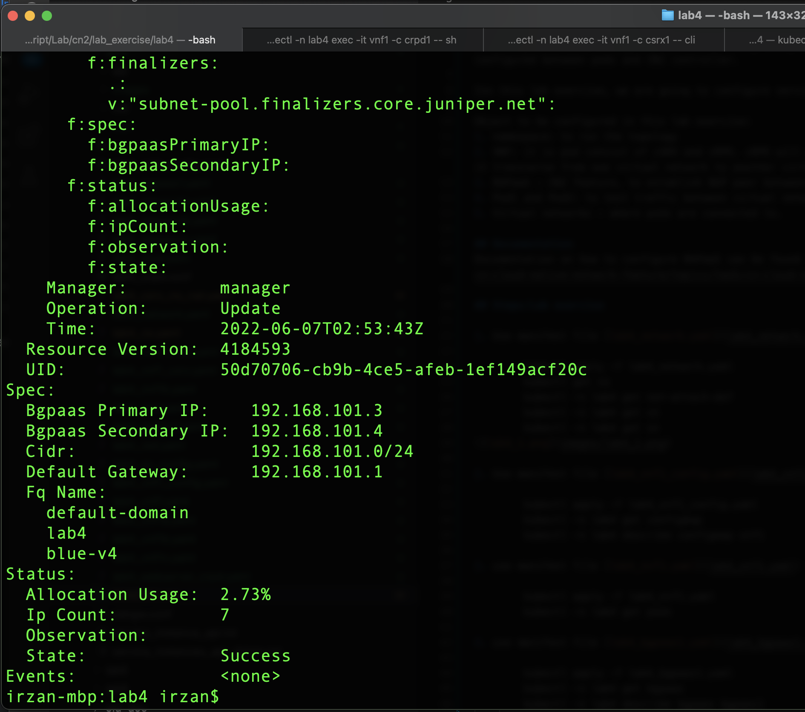

6. use manifest file [lab4_pod.yaml](lab4_pod.yaml) to create pods pod1 and pod2 to test traffic between virtual network

        kubectl apply -f lab4_pod.yaml
        kubectl -n lab4 get pods

7. From pod1 try to ping to interface eth1 of vnf1, and from pod2 try to ping interface eth2 of vnf1

        kubectl -n lab4 exec -it pod1 -- ping -c 1 192.168.101.2
        kubectl -n lab4 exec -it pod2 -- ping -c 1 192.168.101.2
   if pod1 or pod2 or both are not able to ping interface eth1/eth2 of vnf1, you may have to recreate pod vnf1

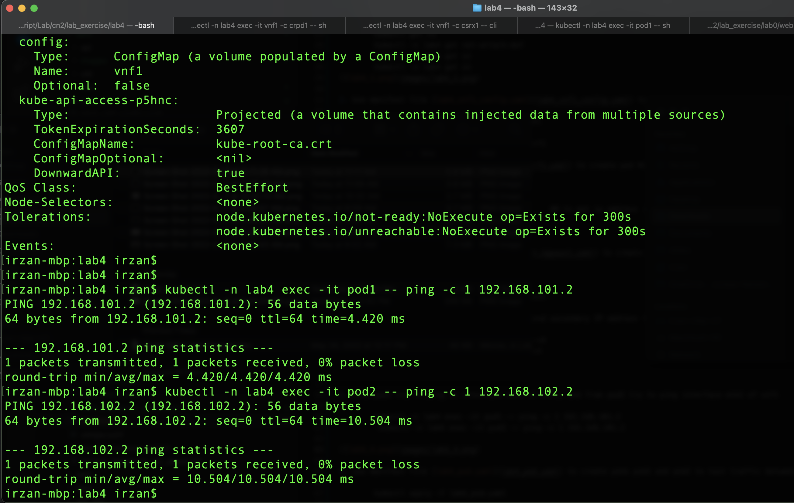

8. From pod1, try to ping ip address of interface eth1 of pod2, it should fail because BGP peers between cRPD and CN2 controller are not established yet
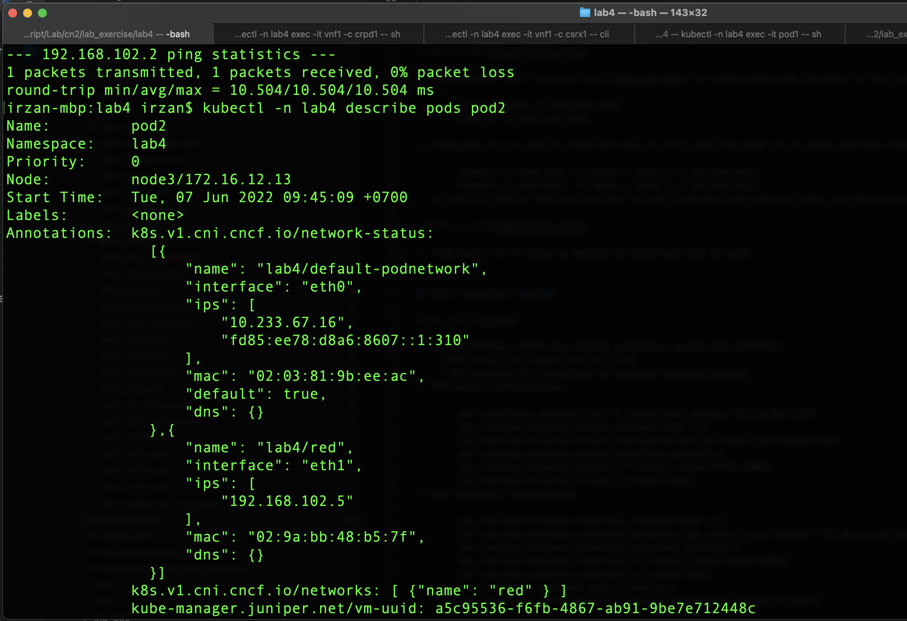
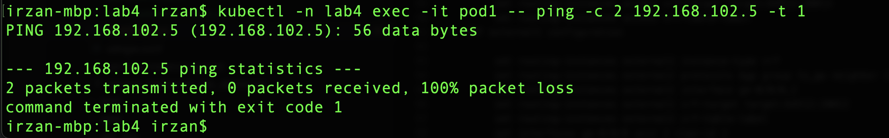

9. open session into container **crpd1** on pods **vnf1**, load the license, load configuration, and commit the configuration

        kubectl -n lab4 exec -it vnf1 -c crpd1 -- cli
        show bgp summary
        request system license add /src/crpd_license
        edit
        load merge relative /src/crpd_config
        commit
        run show bgp sum

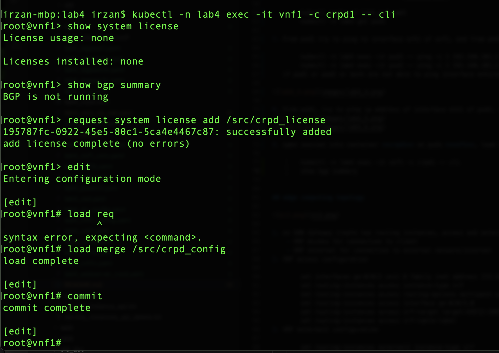
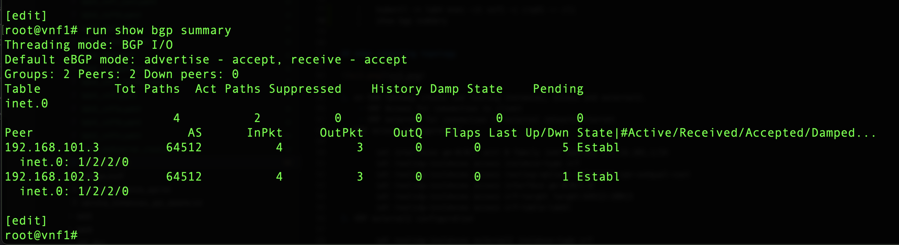

10. open session into pod **pod1**, test connectivity to ip address of eth1 of pod **pod2**, open another session to container csrx1 and verify that sessions are active 

        kubectl -n lab4 exec -it pod1 -- sh
        ping 192.168.102.5
        ./hit_url.py target=192.168.102.5 count=9999

        kubectl -n lab4 exec -it vnf1 -c csrx1 -- sh
        show securiy flow session 
        show securiy flow session summary

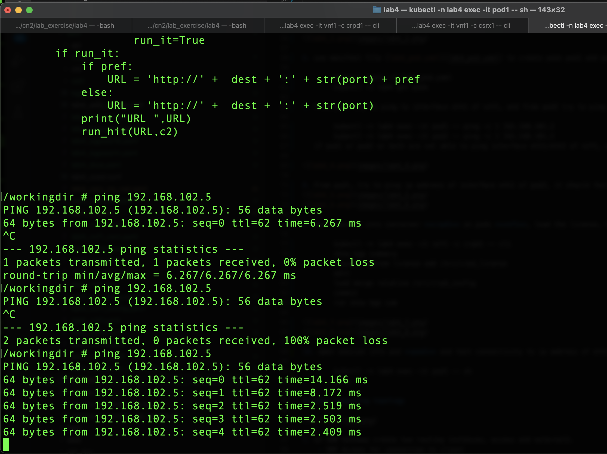
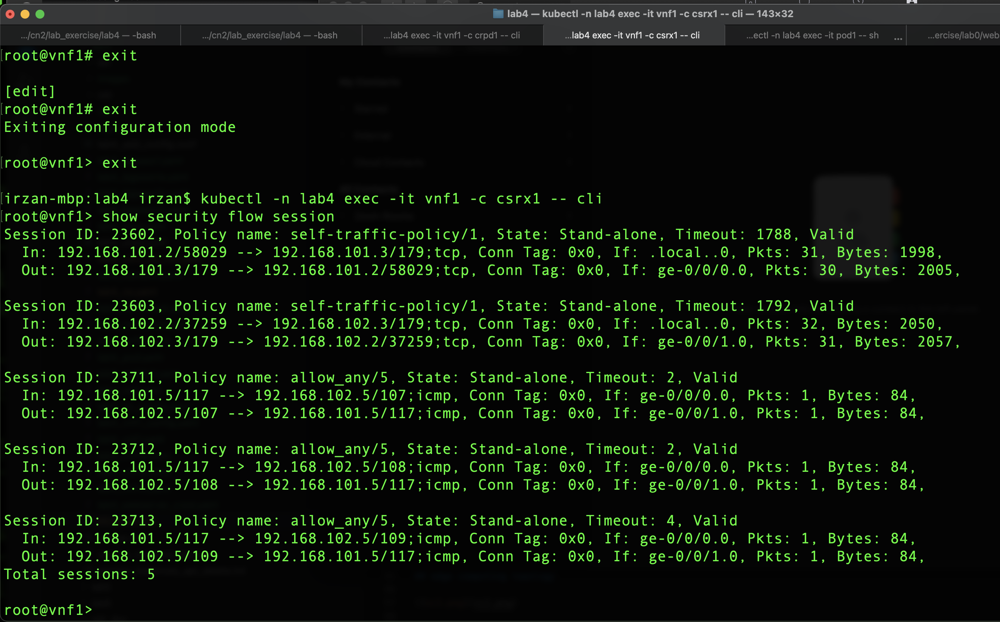
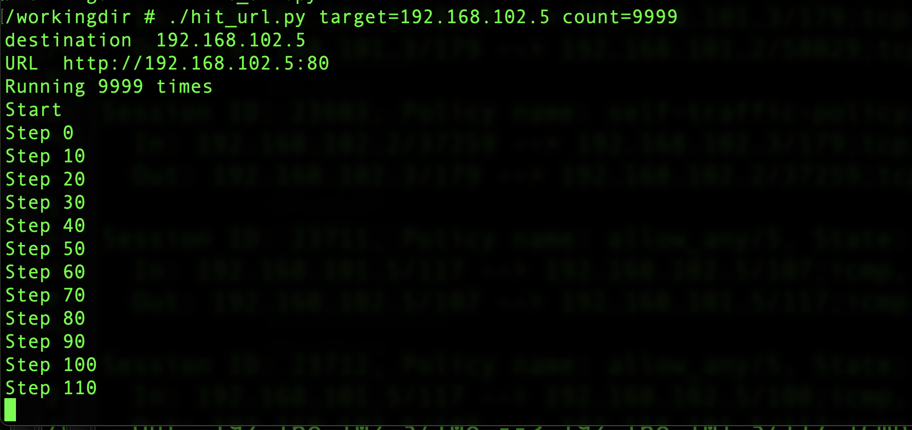
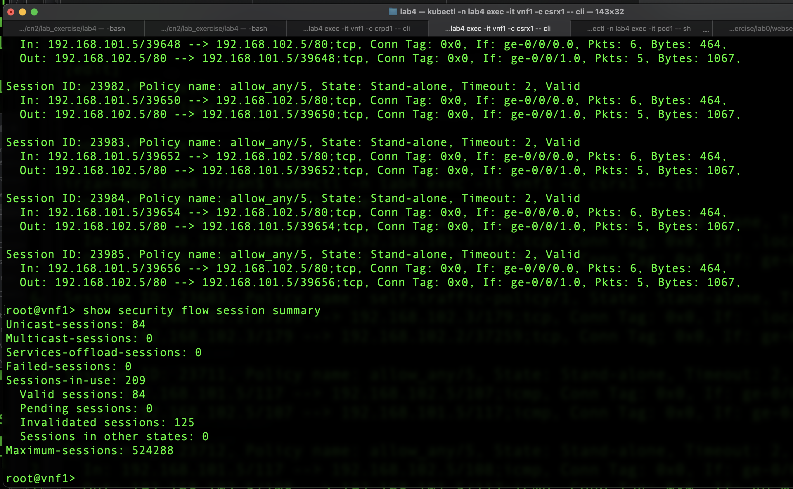

## edge computing topology

In this lab exercise, the service will be extended to the external client. so in this case cSRX will provide security services to external user

the topology is  the following

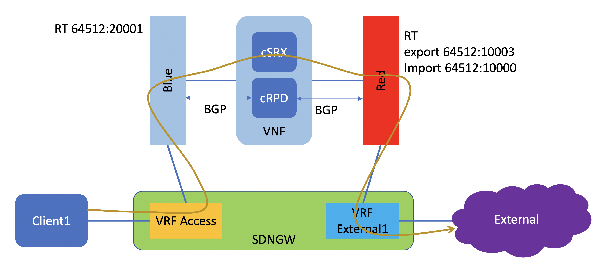

1. on SDN Gateway create two routing instances, access and external1.
    - VRF Access for connection to client
    - VRF external1 for connection to external network/internet

2. Add the following configuration on the SDN gateway for VRF access configuration

        set routing-instances access instance-type vrf
        set routing-instances access routing-options multipath vpn-unequal-cost
        set routing-instances access interface ge-0/0/3.0
        set routing-instances access vrf-target target:64512:20001
        set routing-instances access vrf-table-label
3. Commit the configuration on the sdn gateway and verify that on routing table access.inet.0 and external1.inet.0, have not received routing update regaring VN **blue** and **red**

        ssh sdngw "show route table access.inet.0"
        ssh sdngw "show route table external1.inet.0"

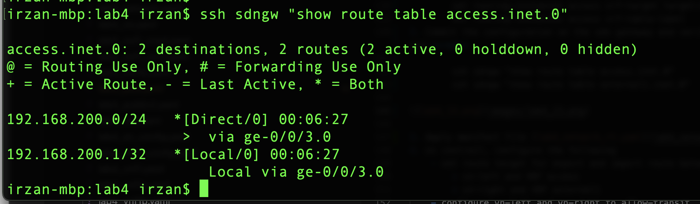

4. Apply manifest file [lab4_network_rt.yaml](lab4_network_rt.yaml) to add route target to virtual network **blue** and **red**

        kubectl -n lab4 describe vn blue    ## to verify that route target has not been configured yet
        kubectl -n lab4 describe vn red    ## to verify that route target has not been configured yet

        kubectl apply -f lab4_network_rt.yaml

        kubectl -n lab4 describe vn blue    ## to verify that route target has been configured yet
        kubectl -n lab4 describe vn red    ## to verify that route target has been configured yet

5. open session to container **crpd1** on pod **vnf1**, delete the export policy configured on bgp peer, and add **as-override**

        kubectl -n lab4 exec -it vnf1 -c crpd1 -- cli
        delete protocols bgp group to_left neighbor 192.168.101.3 export
        delete protocols bgp group to_right neighbor 192.168.102.3 export
        set protocols bgp group to_left neighbor 192.168.101.3 as-override
        set protocols bgp group to_right neighbor 192.168.102.3 as-override
        commit

6. on node **sdngw**, add the following configuration

        ssh sdngw
        edit
        set routing-options autonomous-system loops 4
        commit

7. The following steps is required because cSRX is not able to pickup routing update on the linux kernel.
8. Open cli session into container **crpd1** on pod **vnf1**, and add the following static route configuration

        kubectl -n lab4 exec -it vnf1 -c crsx1 -- cli
        edit
        set routing-options static route 0.0.0.0/0 next-hop 192.168.102.1/32
        set routing-options static route 192.168.200.0/24 next-hop 192.168.101.1/32
        commit

8. from your workstation, open ssh session to node **proxy**

        ssh -fN proxy

9. On the webbrowser, proxy with the following parameter
   - type: manual proxy
   - SOCKS host : 127.0.0.1
   - Port 1080

        this is the configuration on firefox web browser
        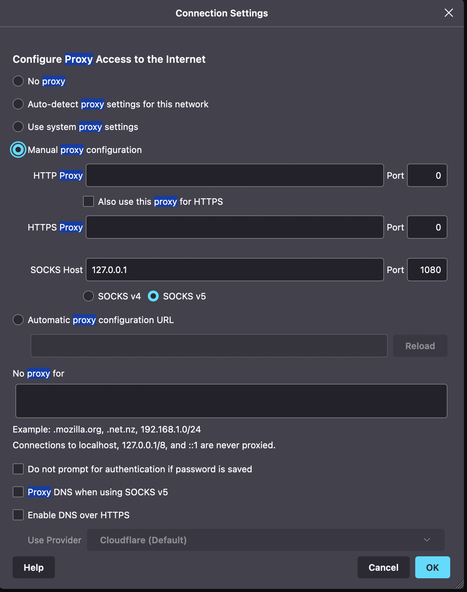

10. Open browser tab, and open session to http://172.16.11.1:6087/vnc.html. This is the web UI to access console of node **client1**
        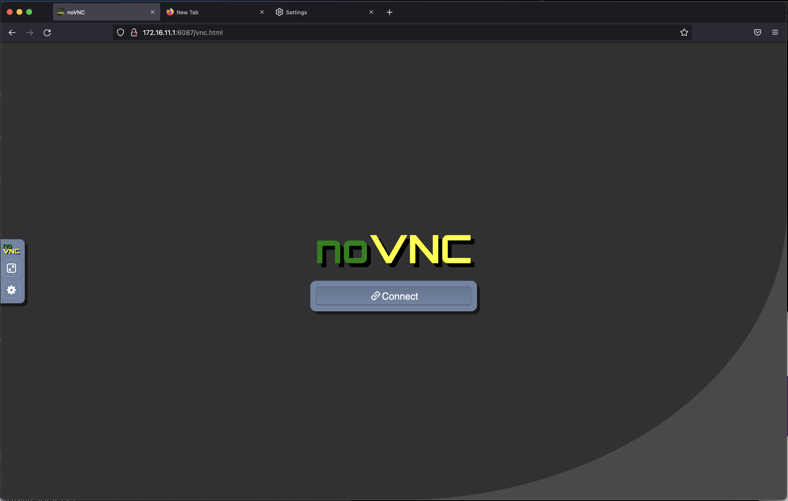

11. click connect, and login using user/password : ubuntu/pass01

    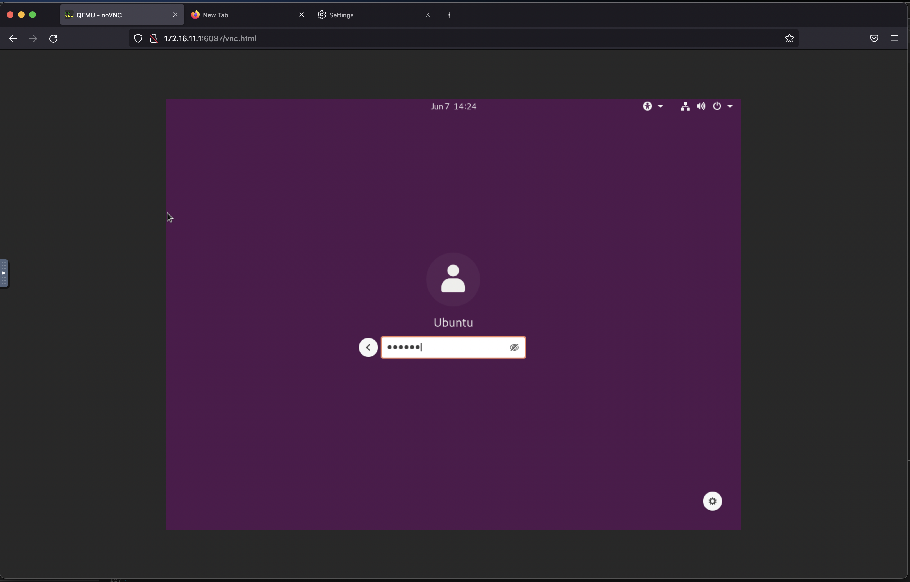

12. Set the netconfiguration with the following paramenter
    - ip address : 192.168.200.11
    - netmask : 255.255.255.0
    - gateway : 192.168.200.1
    - DNS : 66.129.233.81, 66.129.233.82
    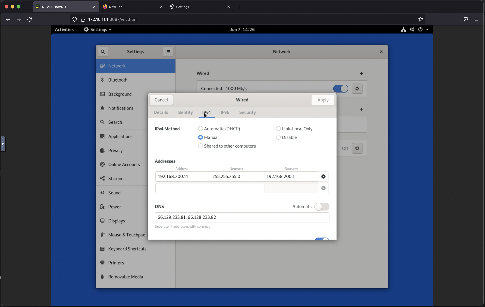

13. On node **client**, open terminal or web browser to iniate traffic to internet, and on container **csrx1** pod **nfv1** verify these traffic from the sesssion flow information

