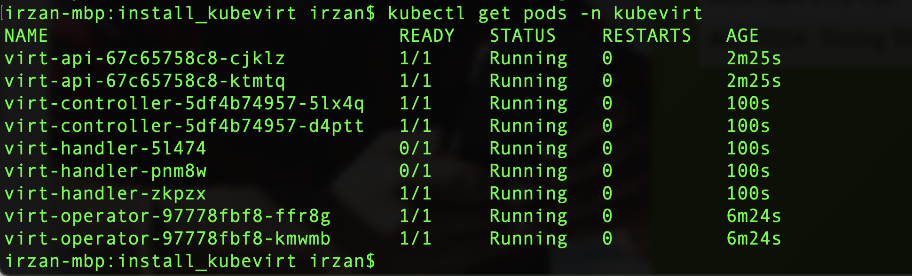
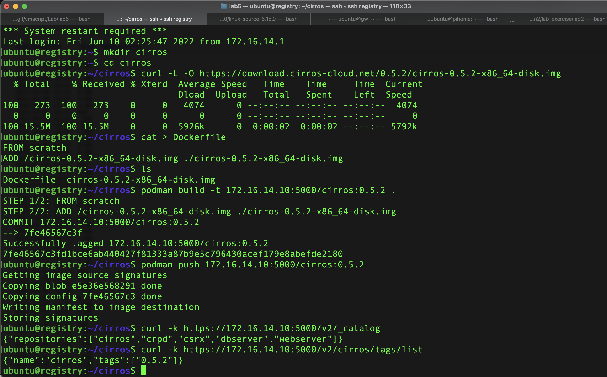
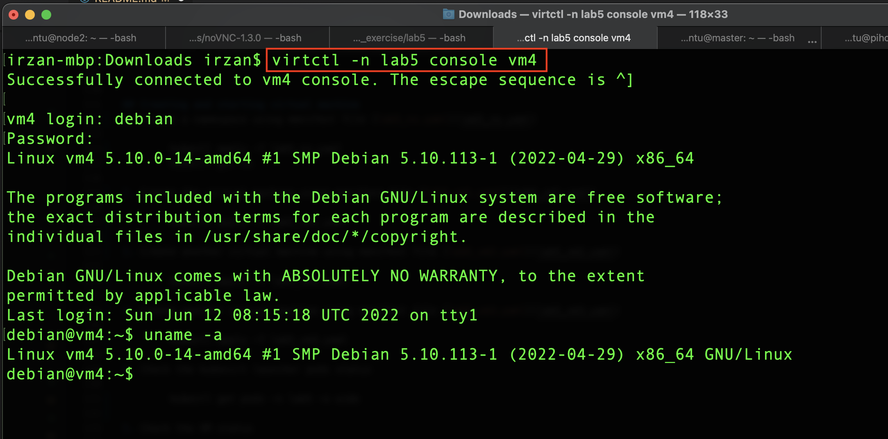
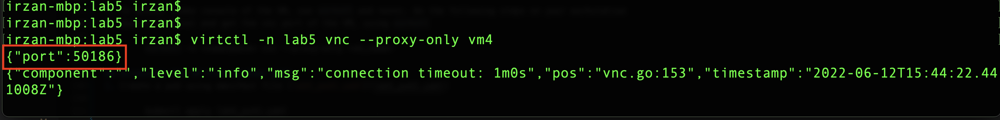
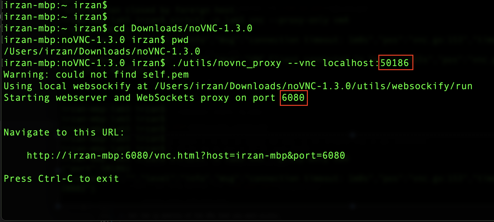
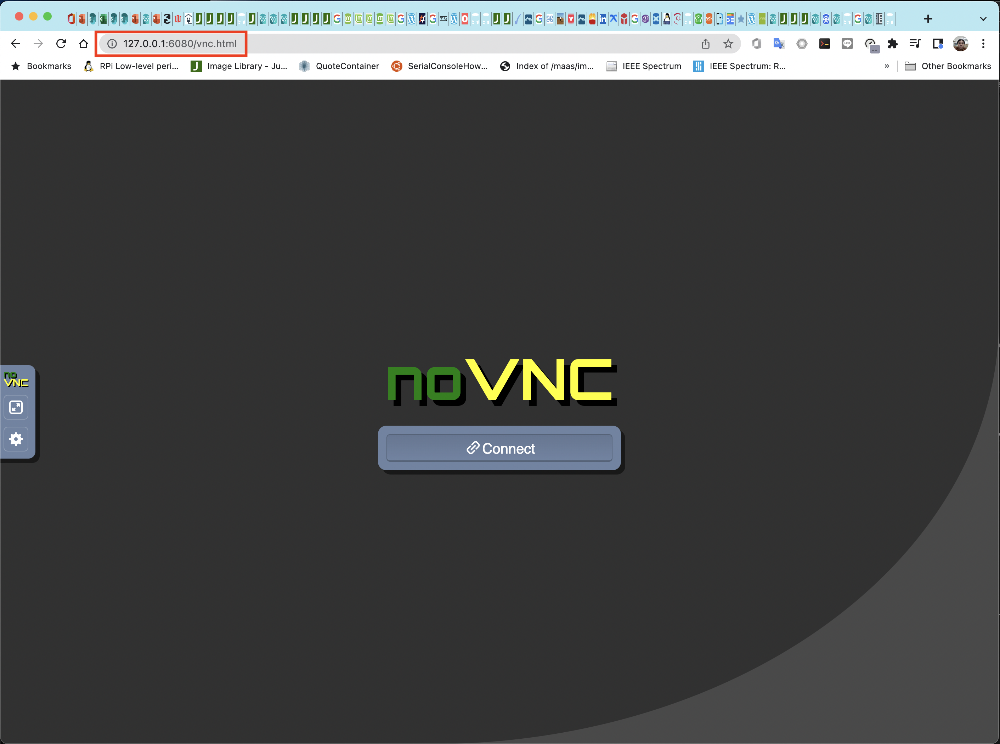
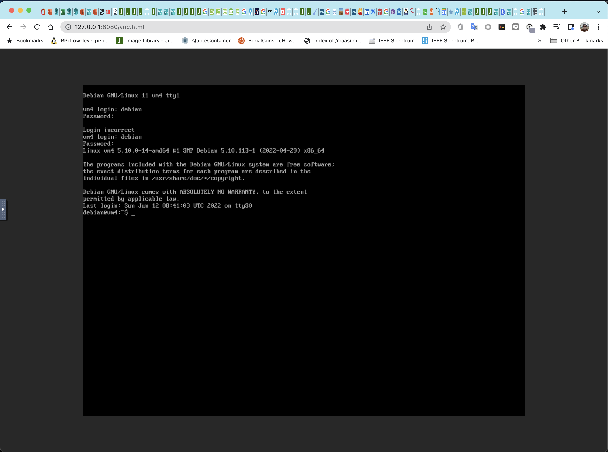

# Using Kubevirt run virtual machine on kubernetes cluster
In this lab exercise, kubevirt will be configured to allow VM(Virtual machine) to be run on kubernetes worker node.

CN2 will provide common virtual network for Pods/Container and Virtual Machine

## Installing kubevirt 

Documentation on how to install kubevirt on k8s + contrail networking is [here](https://www.juniper.net/documentation/en_US/contrail20/topics/task/installation/how-to-enable-kubevirt-kubernetes.html)

1. check the latest version of kubevirt on [this url](https://kubevirt.io/blogs/releases.html)
2. Run script [install_kubevirt.sh](install_kubevirt/install_kubevirt.sh) to install kubevirt into kubernetes cluster
3. run the following command to monitor the installation process

        kubectl -n kubevirt wait kv kubevirt --for condition=Available

3. on the compute node, run the following command to verify that hardware virtualization is supported

        sudo virt-host-validate qemu 

        note:
        if command virt-host-validate is not available, then install it using sudo apt -y install libvirt-clients

4. if hardware virtualization is not supported, then software emulation fallback must be enabled. do the following steps to enable software emulation

        kubectl create cm kubevirt-config -n kubevirt
        kubectl edit cm kubevirt-config -n kubevirt

        add the following entries 

            data:
                debug.useEmulation: "true"
5. Restart the virt-handler pods

        kubectl -n kubevirt delete pod -l k8s-app=virt-handler

6. Download virtctl on node **node0** or your workstation (https://github.com/kubevirt/kubevirt/releases) and install it.

7. Installing noVNC to acccess video console of the VMs, download the source code of  noVNC from https://github.com/novnc/noVNC/releases and extract the files

## Creating Linux Cirros container image for VM in the kubevirt
1. Open ssh sesssion into node **registry**
2. Create directory cirros

        mkdir cirros
        cd cirros

2. Download the VM image that you want to use. For example for linux cirros, you can download it from [https://download.cirros-cloud.net/](https://download.cirros-cloud.net/)

        curl -O -L https://download.cirros-cloud.net/0.6.1/cirros-0.6.1-x86_64-disk.img
        mv cirros-0.6.1-x86_64-disk.img cirros.img

3. Create Dockerfile with the following content

        FROM scratch 
        ADD /cirros.img ./cirros.img

4. Build the container image using the command podman build -t <image_name>:<version> .

        podman build -t 172.16.14.10:5000/cirros:0.6.1 .
        podman image ls
        podman  image push 172.16.14.10:5000/cirros:0.6.1
        curl -k https://172.16.14.10:5000/v2/_catalog
        curl -k https://172.16.14.10:5000/v2/cirros/tags/lis

    

## Creating ubuntu container image for VM in the kubervirt
1. Open ssh sesssion into node **registry**
2. Create directory ubuntu

        mkdir ubuntu
        cd ubuntu

2. Download the VM image that you want to use. For ubuntu linux, you can download it from [https://cloud-images.ubuntu.com/](https://cloud-images.ubuntu.com//)

        curl -O -L https://cloud-images.ubuntu.com/bionic/current/bionic-server-cloudimg-amd64.img
        qemu-img resize bionic-server-cloudimg-amd64.img 10G

3. Create Dockerfile with the following content

        FROM scratch 
        ADD /bionic-server-cloudimg-amd64.img ./bionic-server-cloudimg-amd64.img

4. Build the container image using the command podman build -t <image_name>:<version> .

        podman build -t 172.16.14.10:5000/ubuntu:18.04 .
        podman image ls
        podman  image push 172.16.14.10:5000/ubuntu:18.04
        curl -k https://172.16.14.10:5000/v2/_catalog
        curl -k https://172.16.14.10:5000/v2/cirros/tags/list

## Creating and starting virtual machine
1. Create a namespace using manifest file [lab5_ns.yaml](lab5_ns.yaml)

        kubectl apply -f lab5_ns.yaml
        kubectl get ns

2. Create the virtual machine using manifest file [lab5_vm1.yaml](lab5_vm1.yaml)

        kubectl apply -f lab5_vm1.yaml

3. Create another virtual machine using manifest file [lab5_vm2.yaml](lab5_vm2.yaml)

        kubectl apply -f lab5_vm2.yaml

4. Create another virtual machine using manifest file [lab5_vm3.yaml](lab5_vm3.yaml)

        kubectl apply -f lab5_vm3.yaml

4. Check the kubevirt launcher pods status

        kubectl get pods -n lab5 -o wide

5. Check the VM status 

        kubectl get vmi -n lab5 -o wide

6. To access serial console of the VM, use virtctl

        virtctl -n <namespace> console <vm_name>

7. To access video console of the VM, use virtctl and novnc. Do the following steps on your workstation
9. Open a terminal and get the vnc port of the VM, using virtctl, and take a note of the port number

        virtctl -n <namespace> vnc --proxy-only <vm_name>

10. Open another terminal, go to the directory where novnc files was extracted, run the novnc_proxy scripts, and take a note on the websocker proxy port

        cd <noVNC_directory>
        ./utils/novnc_proxy --vnc localhost:<vnc_port>

11. Open the URL of the noncn_proxy script on the web browser, then it will open access to the video console of the VM
        http://127.0.0.1:<websocket_port>/vnc.html

## Accessing the VM from another pods
1. Create a pod using manifest file [lab5_pod1.yaml](lab5_pod1.yaml)

        kubectl apply lab5_pod1.yaml

2. Get the ip address of the VMs that you want access

        kubectl -lab5 get pods -o wide

3. Access pod **pod1**, and try to open ssh session into the VM. for cirros VM the default username/password is cirros/gocubsbo, for ubuntu VM, the username/password is ubuntu/pass01
        
        kubectl -l lab5 exec -it pod1 -- sh
        ssh ubuntu@<ip_of_ubuntu_VM>
        ssh cirros@<ip_of_cirros_VM>
        ssh debian@<ip_of_debian_VM>

## Allowing access into VM from external

In this lab exericse, access into the VM from external external will be enabled.
to provide access from into the VM, on kubernetes cluster, two object can be configured/used, NodePort and LoadBalancer

1. Create NodePort using manifest file [lab5_access_vm1.yaml](lab5_access_vm1.yaml)

        kubectl apply -f lab5_access_vm1.yaml
        kubectl -n lab5 get services

2. The nodePort is using port 30000
3. From node registry, open ssh session on port 30000 to ip address of the worker node (172.16.12.11/12/13)

        ssh registry
        ssh -p 30000 cirros@172.16.12.11

4. Create LoadBalancer using manifest file [lab5_access_vm2.yaml](lab5_access_vm2.yaml)

        kubectl apply -f lab5_access_vm2.yaml
        kubectl -n lab5 get services

5. From node registry, open ssh session to loadbalancer external ip address

        ssh registry
        ssh ubuntu@<external ip address>

## Allowing multiple NIC on the VM
1. To allow multiple NIC on the VM, multus must be installed on the k8s. 
2. To enable multus, deploy it using [this manifest file](https://github.com/k8snetworkplumbingwg/multus-cni/blob/master/deployments/multus-daemonset.yml)

        kubectl create -f https://github.com/k8snetworkplumbingwg/multus-cni/blob/master/deployments/multus-daemonset.yml
3. Create another virtual network for the VM. The manifest file [lab5_network.yaml](lab5_network.yaml) is an example to create additional network in the namespace

        kubectl apply -f lab5_network.yaml

4. Deploy virtual machine with multiple NIC. The manifest file [lab5_vm4.yaml](lab5_vm4.yaml) is an example of VM with multiple NIC

        kubectl apply -f lab5_vm4.yaml

    