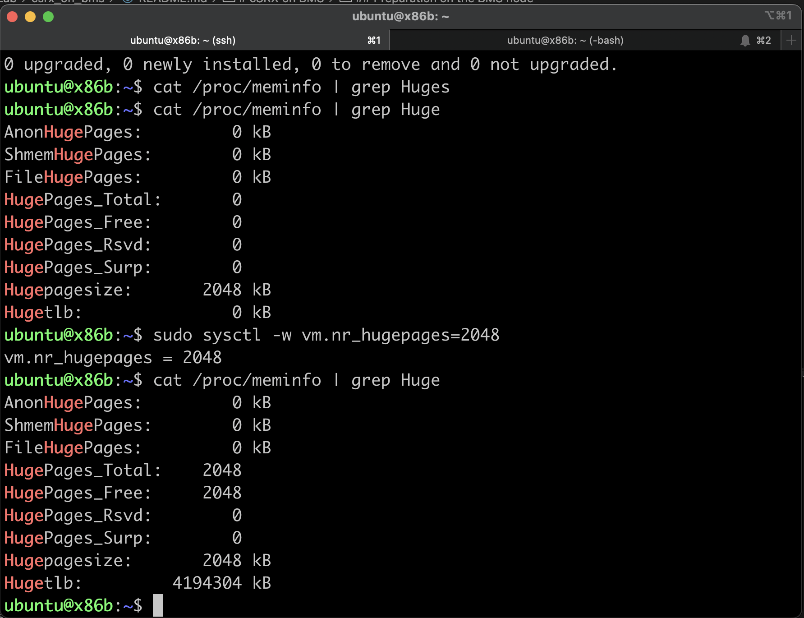
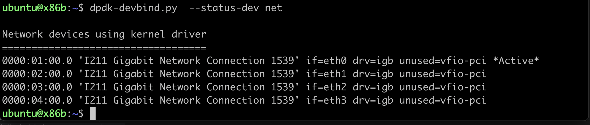
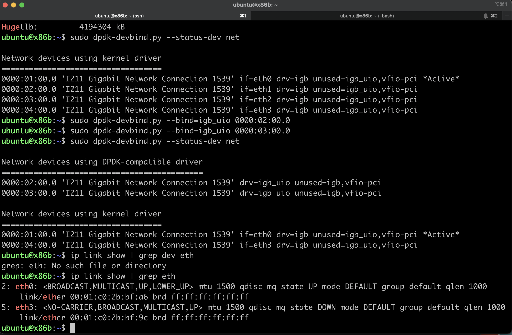

# cSRX on BMS
This document provides guideline on how to deploy cSRX on BMS in DPDK mode.

The BMS is running ubuntu 22.04

the container engine use in this demo is CRI-O with podman as the tool to deploy the container.

## Topology

        -----------------             -------             -------------------
        ! trust network ! ------eth1--! BMS ! --eth2------! untrust network |
        -----------------             -------             -------------------

## Preparation on the BMS node
0. Install podman and crio using this script, [install_crio.sh](./install_crio.sh)

1. install the necessary package
    
        sudo apt install  -y dpdk dpdk-kmods-dkms

2. Load the kernel modules

        sudo lsmod | grep igb
        sudo modprobe igb_uio
        sudo lsmod | grep igb

    

3. Enable hugepages on BMS node

        cat /proc/meminfo | grep Huges
        sudo sysctl -w vm.nr_hugepages=2048
        cat /proc/meminfo | grep Huges

    

3. Check the binding status of the network interface, and record the pci address which will be used by cSRX for the dataport (in this case port eth1 for trust interface, and port eth2 for untrust interface)

        sudo dpdk-devbind.py  --status-dev net
        sudo ip link show | grep eth
    
    

4. Bind the network interface with dpdk

        sudo dpdk-devbind.py --bind=igb_uio <pci_address_of_eth1>
        sudo dpdk-devbind.py --bind=igb_uio <pci_address_of_eth2>
        dpdk-devbind.py  --status-dev net
        sudo ip link show | grep eth

    after the network interface is bind with DPDK, the network interfaces will not be visible to 'ip' or 'ifconfig'

    

5. Start the cSRX with the following command

        #!/bin/bash
        CSRX_NAME="csrx"
        CSRX_IMAGE="localhost/csrx:22.3R2.12"
        PCI_PORT1="0000:02:00.0"
        PCI_PORT2="0000:03:00.0"
        sudo podman volume create ${CSRX_NAME}-config
        sudo podman volume create ${CSRX_NAME}-varlog
        sudo podman run --rm --detach --name ${CSRX_NAME} -h ${HOSTNAME} \
            --privileged \
            -v ${CSRX_NAME}-config:/config -v ${CSRX_NAME}-varlog:/var/log \
            -e CSRX_FORWARD_MODE="routing" -e CSRX_PACKET_DRIVER="poll" \
            -e CSRX_CTRL_CPU="0x01" -e CSRX_DATA_CPU="0x03" \
            -e CSRX_SIZE="large" -e CSRX_ROOT_PASSWORD="pass01" \
            -e CSRX_HUGEPAGES="yes" \
            -e CSRX_PACKET_DRIVER=dpdk \
            -e CSRX_DPDK_VDEV="${PCI_PORT1},${PCI_PORT2}" \
            -it ${CSRX_IMAGE}

6. Verify that cSRX container is running

        sudo podman ps -a
        sudo podman inspect csrx

7. Login into cSRX container, and load the configuration

        sudo podman exec -it csrx cli

8. The following configuration can be used 

        set system services ssh root-login allow
        set interfaces ge-0/0/0 unit 0 family inet address 192.168.101.1/24
        set interfaces ge-0/0/1 unit 0 family inet address 192.168.10.131/24
        set routing-options static route 0.0.0.0/0 next-hop 192.168.10.1/32
        set security nat source rule-set nat-source from zone trust
        set security nat source rule-set nat-source to zone untrust
        set security nat source rule-set nat-source rule nats1 match source-address 0.0.0.0/0
        set security nat source rule-set nat-source rule nats1 match destination-address 0.0.0.0/0
        set security nat source rule-set nat-source rule nats1 match application any
        set security nat source rule-set nat-source rule nats1 then source-nat interface
        set security policies from-zone trust to-zone untrust policy t2u match source-address any
        set security policies from-zone trust to-zone untrust policy t2u match destination-address any
        set security policies from-zone trust to-zone untrust policy t2u match application any
        set security policies from-zone trust to-zone untrust policy t2u then permit
        set security policies from-zone trust to-zone untrust policy t2u then log session-init
        set security policies from-zone trust to-zone untrust policy t2u then log session-close
        set security policies default-policy deny-all
        set security zones security-zone trust interfaces ge-0/0/0.0 host-inbound-traffic system-services all
        set security zones security-zone trust interfaces ge-0/0/0.0 host-inbound-traffic protocols all
        set security zones security-zone untrust interfaces ge-0/0/1.0
        commit

9. Load the license into cSRX 

10. It may take several minutes for process srxpfe to bring up the interface eth1 and eth2

11. Test connectivity between trust and untrust security zone.

