# CUPS BNG 
this lab is about juniper solution for CUPS BNG

## Topology
The topology for this lab
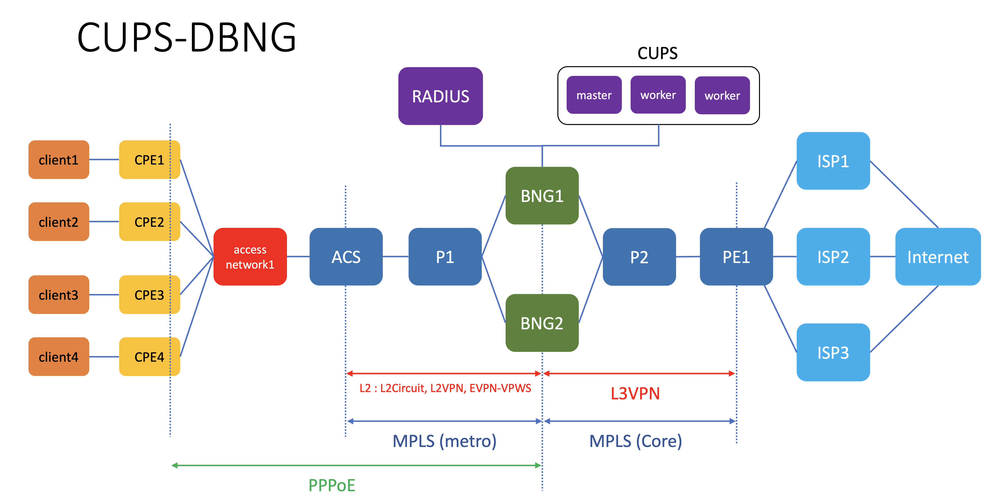

[Documentation](https://www.juniper.net/documentation/us/en/software/bng-cups22.1/cups_controller_installation_guide/bng-cups-install-migrate/topics/topic-map/cups_install.html)

## Software version used in this lab
- CUPS-CP : 22.1R1.10
- Junos for VMX as CUPS-UP : 22.1R1.10
- Freeradius: 3.0.16
- Linux OS for kubernetes node: Ubuntu 18.04.6 with kernel 4.15.0-188-generic 
- CPE : openwrt 19.07.8

## Creating lab topology in Juniper VMM lab
1. Go to directory [cups_bng](./)

2. Edit file [lab.yaml](./lab.yaml). Set the following parameters to choose which vmm server that you are going to use and the login credential:
    - vmmserver 
    - jumpserver
    - user 
    - adpassword
    - ssh_key_name ( please select the ssh key that you want to use, if you don't have it, create one using ssh-keygen and put it under directory **~/.ssh/** on your workstation )
3. If you want to add devices or change the topooogy of the lab, then edit file [lab.yaml](lab.yaml)
4. use [vmm.py](../../vmm.py) script to deploy the topology into the VMM. Run the following command from terminal

        ../../vmm.py upload  <-- to create the topology file and the configuration for the VMs and upload them into vmm server
        ../../vmm.py start   <-- to start the topology in the vmm server

5. Verify that you can access node **gw** using ssh (username: ubuntu,  password: pass01 ). You may have to wait for few minutes for node **gw** to be up and running
6. Run script [vmm.py](../../vmm.py) to send and run initial configuration on node **gw**

        ../../vmm.py set_gw

7. Verify that you can access other nodes (linux and junos VM), such **master**, **node1**, **node2**, etc. Please use the credential to login.

        ssh master

8. Run script [vmm.py](../../vmm.py) to send and run initial configuration on linux nodes. This script will also reboot the VM. So wait before you test connectivity into the VM

        ../../vmm.py set_host

9. Verify that you can access linux and junos VMs, such **master**, **node1**, **sdngw**, without entering the password. You may have to wait for few minutes for the nodes to be up and running

        ssh master
        ssh node0
        ssh node1

## Updating system on linux nodes
1. Run ansible playbook [update_system.yaml](linux_node/update_system.yaml) to update system on linux node and install the necessary package into (node0, node1, node2, radius, deployer)

        cd linux_node
        ansible-playbook update_system.yaml

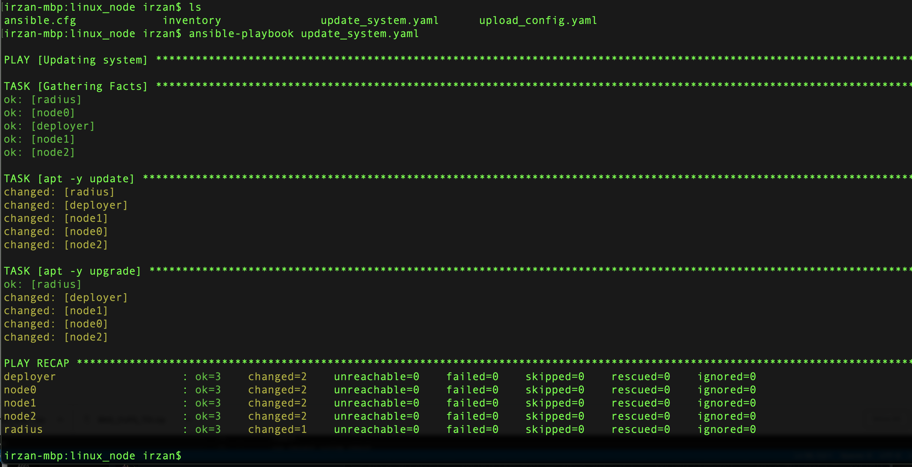

2. the nodes (node0, node1, node2, radius, deployer) may need to be rebooted

## deploying configuration into existing junos devices 
1. go to directory [junos_config](./junos_config/)
2. Run ansible-playbook [junos_config/upload_config.yaml](junos_config/upload_config.yaml) and it will upload BNG standalone configuration into node **bng1**, **bng2**, **acs** and **pe1**

        cd junos_config
        ansible-playbook upload_config.yaml
3. Node bng1 and bng2 may need to be rebooted because of the new configuration for subscriber management.

        ssh bng1 
        edit
        commit
        run request system reboot

        ssh bng2
        edit
        commit
        run request system reboot

## installing license into node bng1 and bng2

1. upload vmx and vbng license into node bng1 and bng2

        scp vbng_trial_demolab.txt bng1:~/
        scp vbng_trial_demolab.txt bng2:~/
        scp vmx_trial_demolab.txt bng1:~/
        scp vmx_trial_demolab.txt bng2:~/

2. on bng1 and bng2, load the licenses

        ssh bng1
        request system license add vbng_trial_demolab.txt
        request system license add vmx_trial_demolab.txt
        show system license

        ssh bng2
        request system license add vbng_trial_demolab.txt
        request system license add vmx_trial_demolab.txt
        show system license

## installing freeradius software 
1. open ssh session into node **radius**
2. from your workstation, upload file [clients.conf](radius/clients.conf) and [authorize](radius/authorize)

        cd radius
        scp clients.conf radius:~/
        scp authorize radius:~/

3. install freeradius software on node **radius**

        ssh radius
        sudo apt -y update 
        sudo apt -y upgrade
        sudo apt -y  install freeradius

4.  On node **radius**, copy file authorize into directory /etc/freeradius/3.0/mods-config/files/ , and file clients.conf to directory /etc/freeradius/3.0/. Just overwrite the existing file. Restart the freeradius services

        sudo cp ~/clients.conf /etc/freeradius/3.0/
        sudo cp ~/authorize /etc/freeradius/3.0/mods-config/files/
        sudo systemctl restart freeradius

## installing FRR into node gw
1. upload file [03_net.yaml](gw/03_net.yaml) and [set_bgp.sh](gw/set_bgp.sh) into node gw

        scp gw/03_net.yaml gw:~/
        scp gw/set_bgp.sh gw:~/

2. copy file 03_net.yaml into directory /etc/netplan, reactivate the network configuration, and verify that interface vlan1, vlan2, and vlan3 are configured

        ssh gw 
        sudo cp 03_net.yaml /etc/netplan
        sudo netplan apply
        ip addr show dev vlan1
        ip addr show dev vlan2
        ip addr show dev vlan3

3. Install FRR routing software on node **gw**
        
        ssh gw
        sudo apt -y update
        sudo apt -y upgrade
        sudo apt -y install frr

4. Edit the the FRR configuration to enable BGP, and restart FRR service

        sudo cat /etc/frr/daemons | grep bgp
        sudo sed -i -e 's/bgpd=no/bgpd=yes/' /etc/frr/daemons
        sudo cat /etc/frr/daemons | grep bgp
        sudo systemctl restart frr

5. Run script set_bgp.sh to configure FRR 

        ./set_bgp.sh

6. Enter cli of FRR, and verify that the configuration is loaded, and bgp peer to node **pe1** is up

        sudo vtysh 
        enable
        show run
        show ip bgp summary

## configure ovs switch on node ACS1
1. open ssh session into node **acs1**
2. bring down interface bracs and delete interface bracs

        ssh acs1
        sudo ip link show dev bracs
        sudo ip link set dev bracs down
        sudo ip link del dev bracs
        sudo ip link show dev bracs
3. Edit file /etc/network/interfaces, and delete or comment out entries for interface bracs

3. verify that node **acs1** is able to access internet
4. Install openvswitch on node **acs1**

        sudo apk update
        sudo apk add openvswitch
        sudo rc-update add ovs-modules
        sudo rc-update add ovsdb-server
        sudo rc-update add ovs-vswitchd
        sudo c-service ovs-modules start
        sudo rc-service ovsdb-server start
        sudo rc-service ovs-vswitchd start
        sudo reboot

5. Configure openvswitch

        
        sudo ovs-vsctl add-br access
        sudo ovs-vsctl add-port access eth1 tag=101
        sudo ovs-vsctl add-port access eth2 tag=102
        sudo ovs-vsctl add-port access eth3 tag=111
        sudo ovs-vsctl add-port access eth4 tag=112
        sudo ovs-vsctl add-port access eth5 
        sudo ovs-vsctl show

## Test subscriber management configuration
1. Open ssh session into node **proxy** and keep this session open
2. From the console, URL to access console of client1, client2, client3 and client4 are displayed

        ssh proxy

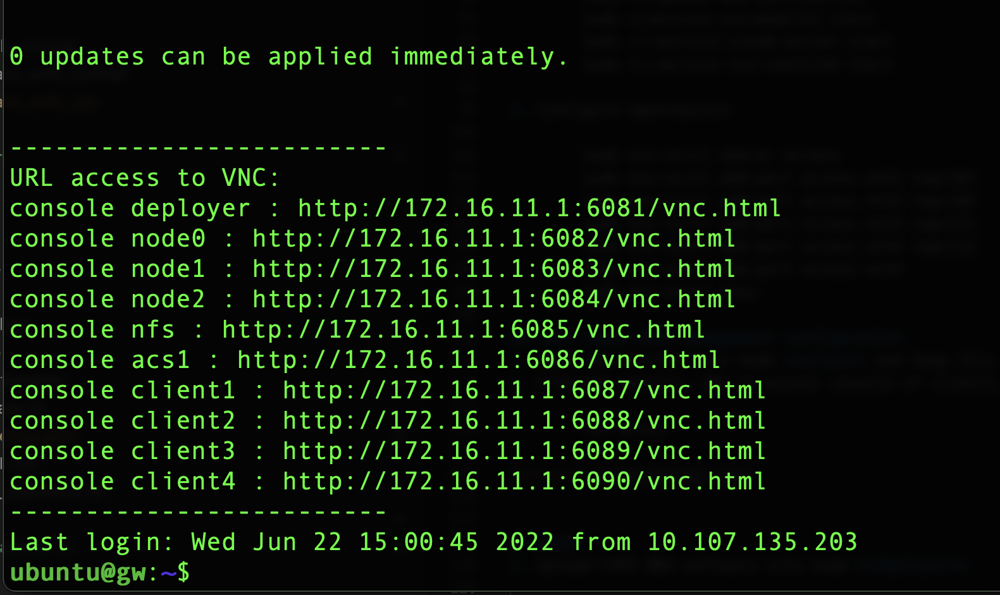

3. on the web browser, set the proxy to manual with socks proxy on ip address 127.0.0.1 and port 1080. This is the sample of configuration on firefox
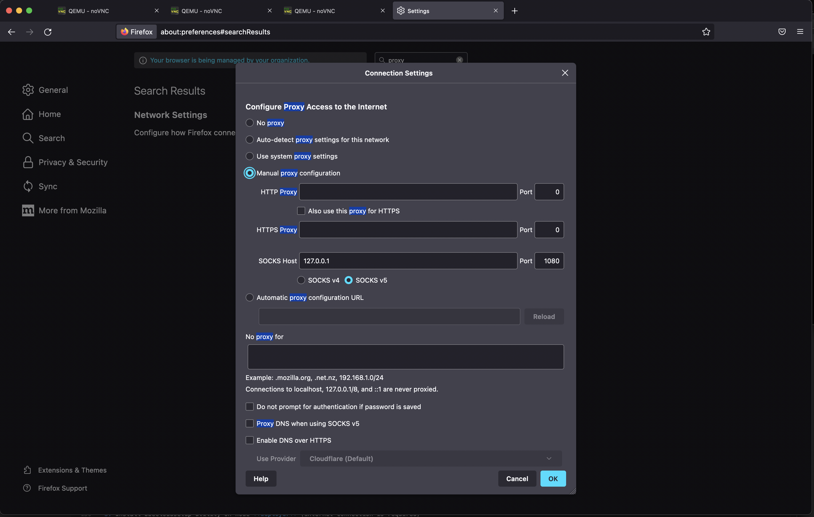

4. To access console of node **client1**, type in the url found on step 2, and click connect to open console of node **client1**. Username and password to access node **client1** is ubuntu/pass01

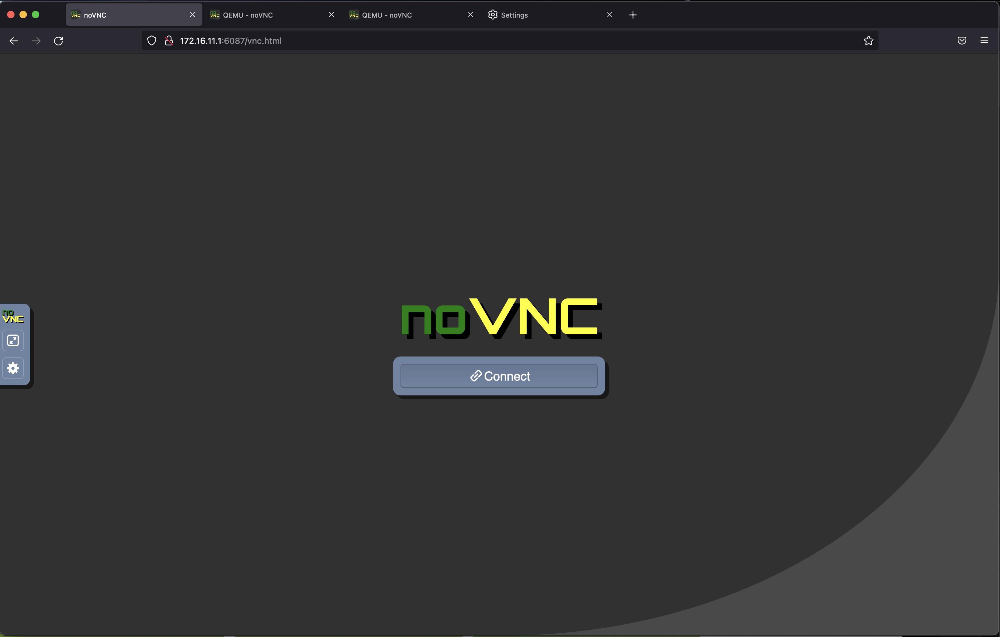
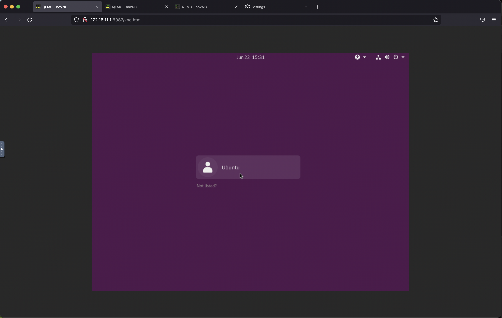

5. Open terminal on node **client1**, and verify that it has received ip address from node **cpe1**

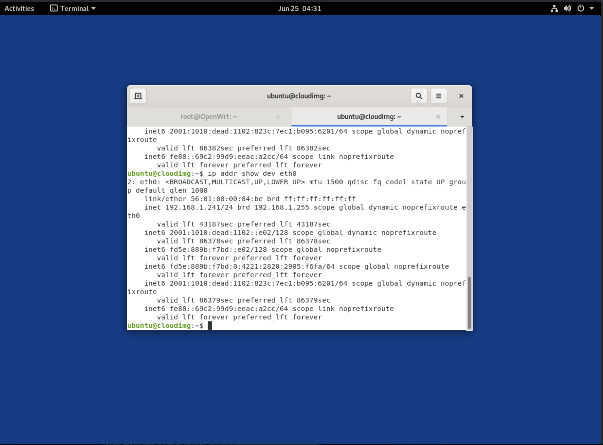

6. open ssh session into node **cpe1**

        ssh root@192.168.1.1

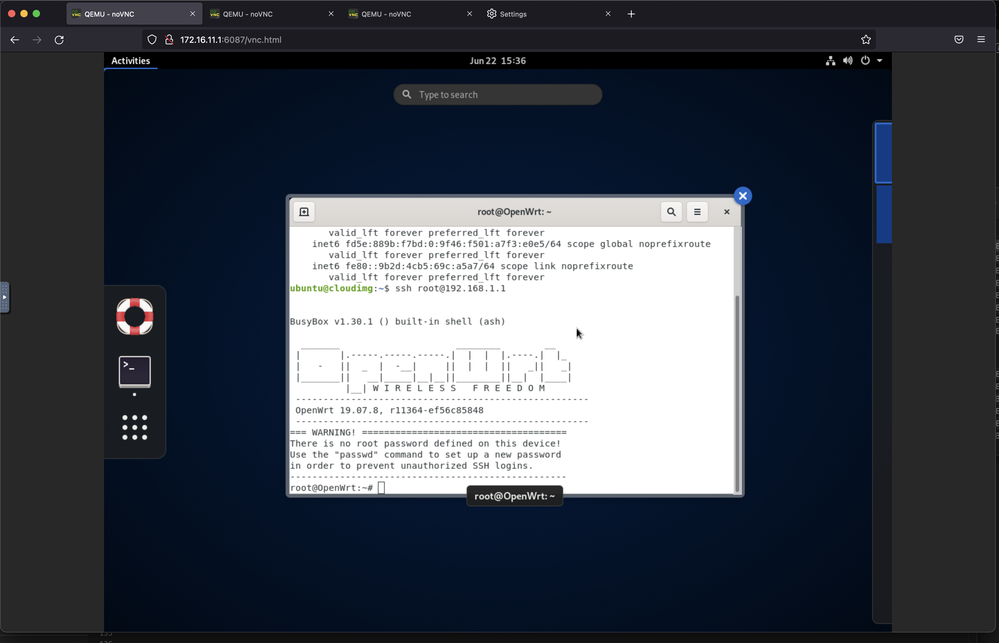

7. Change the configuration on node **cpe1**, by editing file /etc/config/network, put the following configuration for interface wan, and delete configuration for interface wan6

       config interface wan
               option ifname 'eth1'
               option proto 'pppoe'
               option username 'cpe1'
               option password 'pass01'
               option ipv6 'auto'

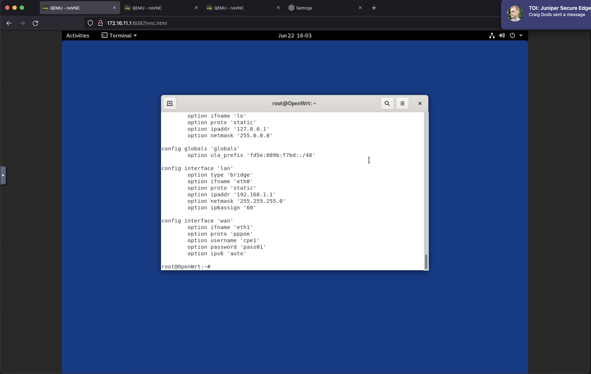
8. on the cli of node **cpe1**, bring up interface wan and verify that interface ppp0 is up

        ifup wan
        ip addr show

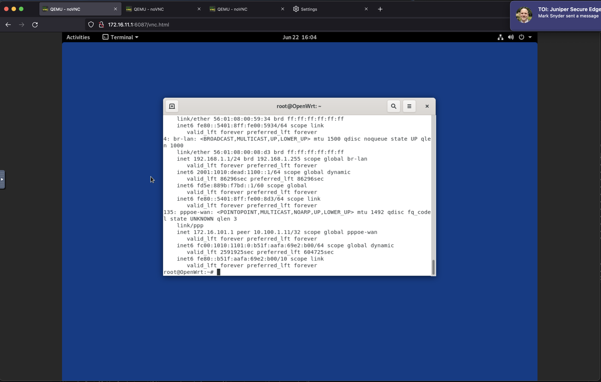

9. open ssh session into node **bng1**, and verify that client cpe1 is connected
10. on Client1, open another terminal windows, and verify that interface eth0 has been assigned with ipv4 and ipv6 addresses

        ip addr show dev eth0

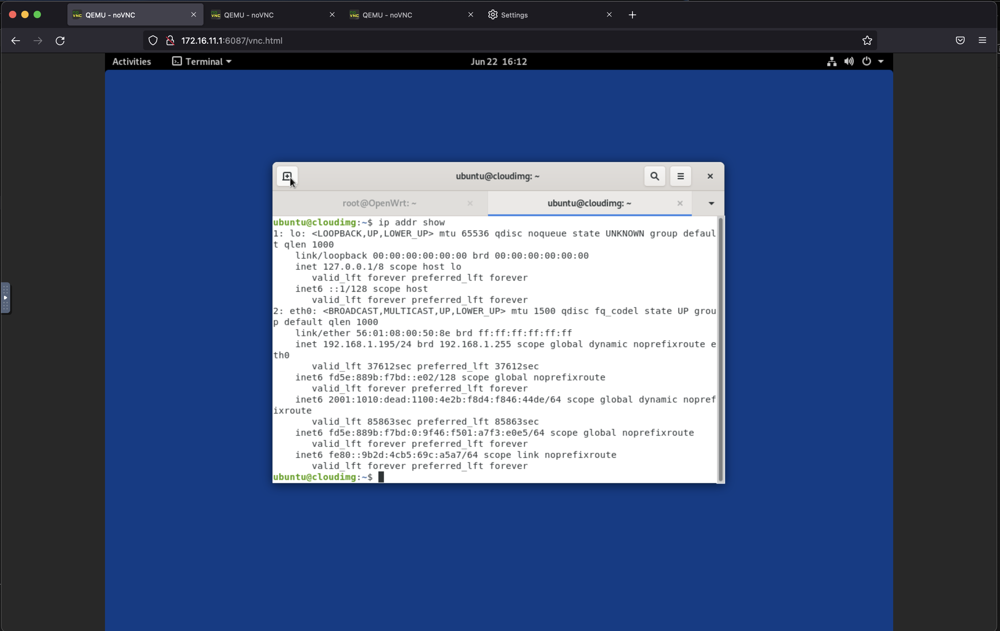

11. Test connectivity to 172.16.255.255 and 2001:1010:dead:beef:ffff:ffff:ffff:1. These ip addresses are on node **gw**

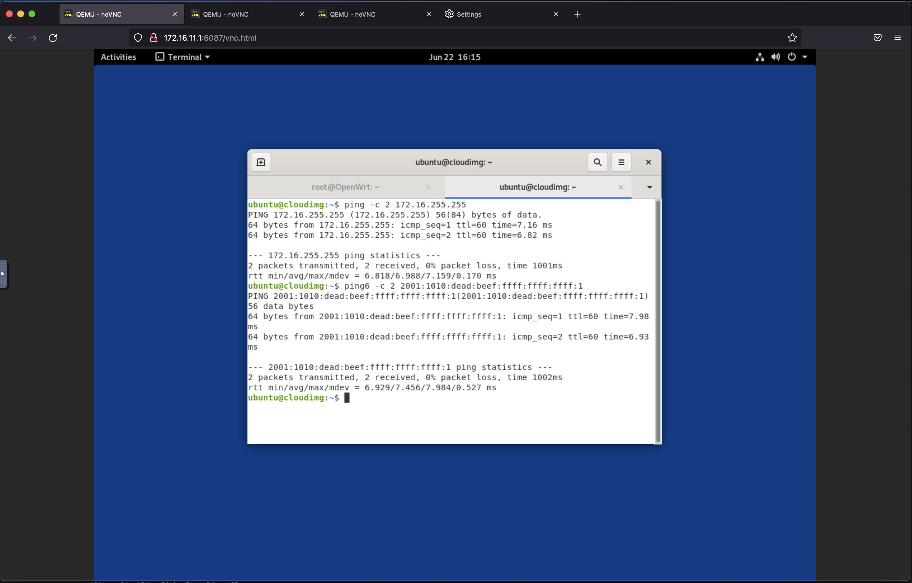

10. for other CPE configuration, please use the following table

Client node | CPE | BNG that terminate the L2Circuit | username/password for CPE | vlan on access 
-|-|-|-|-
client1|cpe1|bng1|cpe1/pass01| 101
client2|cpe2|bng1|cpe2/pass01| 102
client3|cpe3|bng2|cpe3/pass03|111
client4|cpe4|bng2|cpe4/pass01|112

11. on the node **acs** :
   - traffic from vlan 101 and 102 are send to **bng1** using pseudowire
   - traffic from vlan 111 and 112 are send to **bng2** using pseudowire

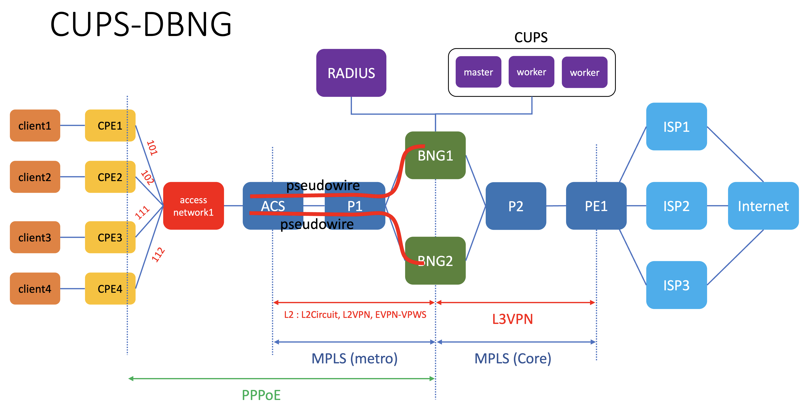
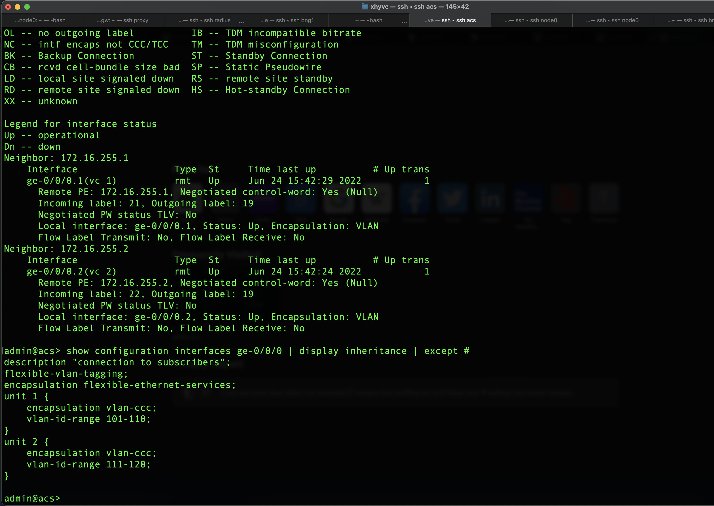

12. on node **bng1** and **bng2**, information about connected subscribers

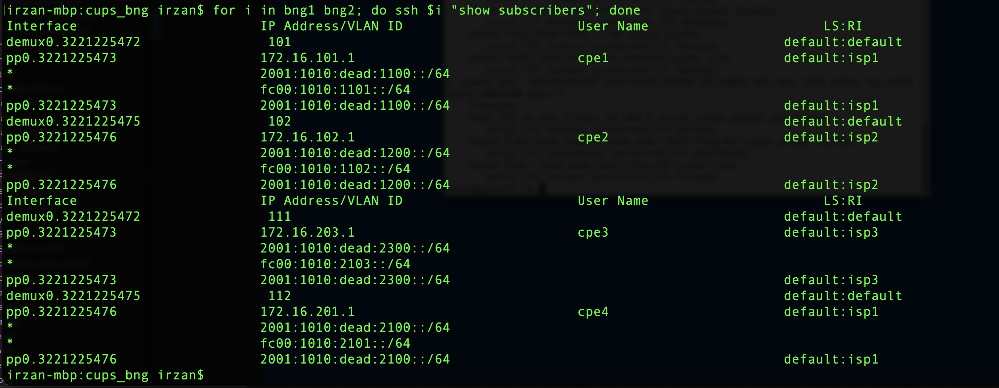

13. Now the BNGs (BNG1 and BNG2) are configured with standalone subscriber management configuration

## Installing CUPS BNG software: creating k8s cluster

1. Upload CUPS BNG software into node **deployer** 

        scp jnpr-bng-cups-controller-pkg-<version>.tar.gz deployer:~/

2. open ssh session into node **deployer** and extract the file

        tar xvfz jnpr-bng-cups-controller-pkg-<version>.tar.gz

3. Install bbecloudsetup utility on node **deployer** (internet connection is required)

        sudo apt -y update && sudo apt -y upgrade
        sudo apt install -y ./bbecloudsetup_<version>_all.deb

4. Upload file [setup_k8s_node.sh](setup_k8s_node.sh) to node0, node1, node2

        for i in node{0..2}; do scp ./setup_k8s_node.sh ${i}:~/; done

5. Open ssh sesssion into node0, and run script setup_k8s_node.sh, and repeat this for node1, and node2

        ssh node0
        tmux
        ./setup_k8s_node.sh

6. On node **deployer**, copy /home/ubuntu/.ssh into /root/.ssh

        sudo cp /home/ubuntu/.ssh/* /root/.ssh

7. on Node **deployer**, test ssh to node0, node1, and node2 using user root

        ssh root@node0
        ssh root@node1
        ssh node@node2

8. On node **deployer**, run the bbecloudsetup, it will install the k8s cluster and the dbng software

        ssh deployer
        tmux
        bbecloudsetup
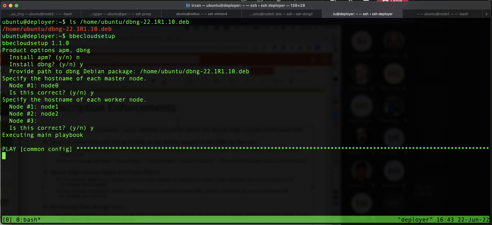        

9. If the installation process failed, then open ssh session into **node0** , copy the kubebelet configuration and repeat previous step (run bbecloudsetup)

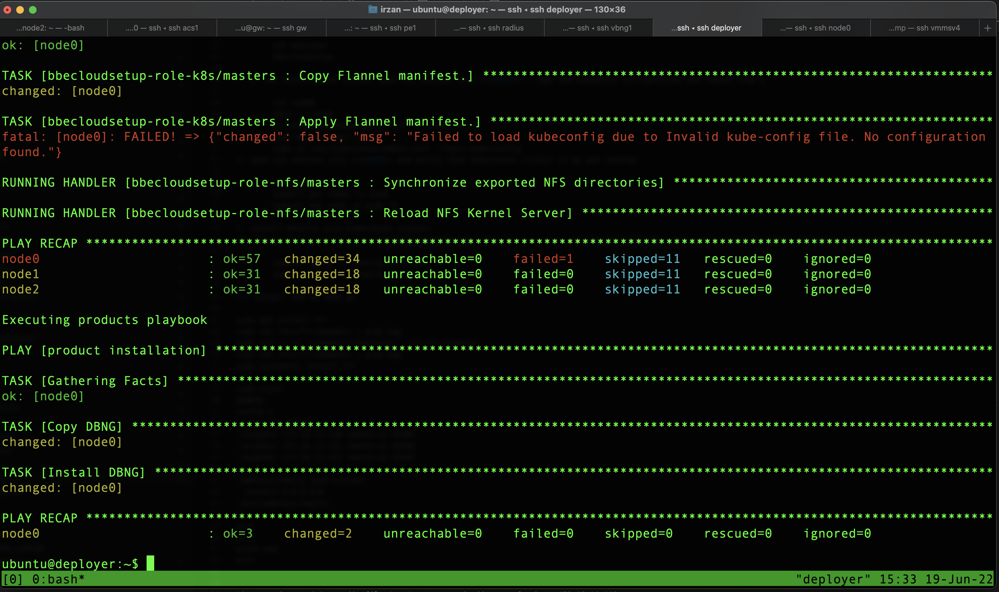

        ssh node0
        mkdir ~/.kube
        sudo cp /etc/kubernetes/admin.conf  ~/.kube/config
        sudo mkdir /root/.kube
        sudo cp /etc/kubernetes/admin.conf  /root/.kube/config

        ssh deployer
        tmux
        bbecloudsetup

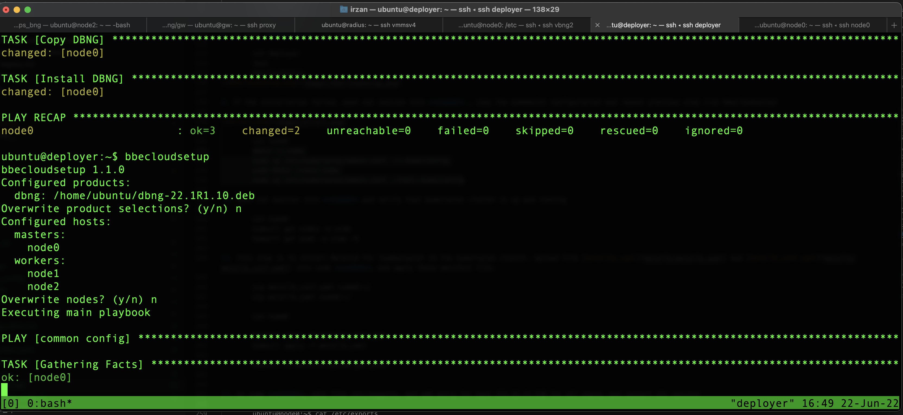 

10. open ssh session into **node0** and verify that kubernetes cluster is up and running

        ssh node0
        kubectl get nodes -o wide
        kubectl get pods -o wide -A

11. The following  steps are to install MetalLB for loadbalancer on the kubernetes cluster. By default, the bbeclousetup script doesn't install any load balancer on the kubernetes cluster. This step is optional if we don't want the ip address of the kubernetes node accessible from external network.

12. Upload file [metallb_conf.yaml](metallb/metallb_conf.yaml) into node0

        scp metallb_conf.yaml node0:~/

13. Open ssh into node **node0**, and install metallb. Please refer to [this documentation](https://metallb.universe.tf/installation/) on how to install it. 
        ssh node0
        
        kubectl apply -f https://raw.githubusercontent.com/metallb/metallb/v0.13.7/config/manifests/metallb-native.yaml
        kubectl apply -f metallb_conf.yaml

        kubectl -n metallb-system get pods

14. Open ssh session to gw, and verify that BGP peer with kubernetes nodes are up

        ssh gw "echo 'show ip bgp sum' | sudo vtysh"
        
12. on node **node0**, edit file /etc/exports, and add entry for host 172.16.11.110 for all share, and restart nfs service. This step is required because when dbng service is started, it will try to mount from node0 (172.16.11.110), and by default the installation script doesn't include node0 in file /etc/exports, and then dbng service will fail to start.

        ubuntu@node0:~$ cat /etc/exports
        /mnt/sharedfolder/dbng-core  172.16.11.110(no_subtree_check,rw,sync)
        /mnt/sharedfolder/dbng-core  172.16.11.111(no_subtree_check,rw,sync)
        /mnt/sharedfolder/dbng-core  172.16.11.112(no_subtree_check,rw,sync)
        /mnt/sharedfolder/dbng-db  172.16.11.110(no_subtree_check,rw,sync)
        /mnt/sharedfolder/dbng-db  172.16.11.111(no_subtree_check,rw,sync)
        /mnt/sharedfolder/dbng-db  172.16.11.112(no_subtree_check,rw,sync)
        /mnt/sharedfolder/dbng-opcfg  172.16.11.110(no_subtree_check,rw,sync)
        /mnt/sharedfolder/dbng-opcfg  172.16.11.111(no_subtree_check,rw,sync)
        /mnt/sharedfolder/dbng-opcfg  172.16.11.112(no_subtree_check,rw,sync)
        sudo systemctl restart nfs-server
        sudo exportfs

## Install CUPS-BNG
1. open ssh session into node0, setup CUPS-BNG, leave all parameter to default except for external IP, set it to 172.16.1.1

        ssh node0
        sudo dbng setup

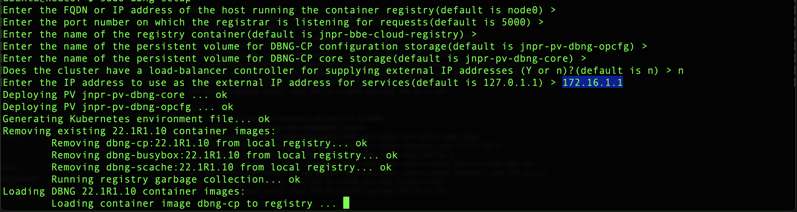

2. start the CUPS-BNG

        dbng start

3. Verify that CUPS-BNG is install and running

        dbng status
        kubectl -n jnpr-dbng get pods -o wide
        kubectl -n jnpr-dbng get services

## Configuring control plane

1. upload BNG-CUPS configuration, [dbng.conf](junos_config/dbng.conf) into node0

        scp junos_config/dbng.conf node0:~/

1. open ssh into node0, open dbng cli, enter the shell and copy the file into dbng CP pod

        ssh node0
        dbng cli
        start shell
        scp ubuntu@172.16.11.110:~/dbng.conf .
        exit

2. Load configuration into CP

        dbng cli
        edit
        load merge relatif /dbng.conf
        commit

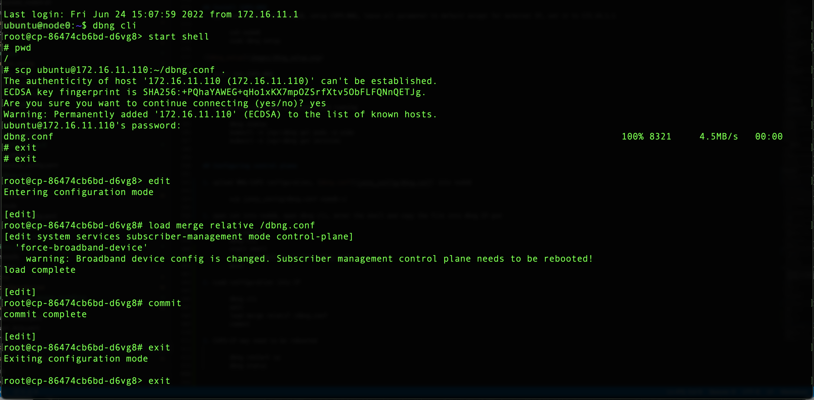

3. Reboot service CP of the CUPS

        dbng restart cp
        dbng status

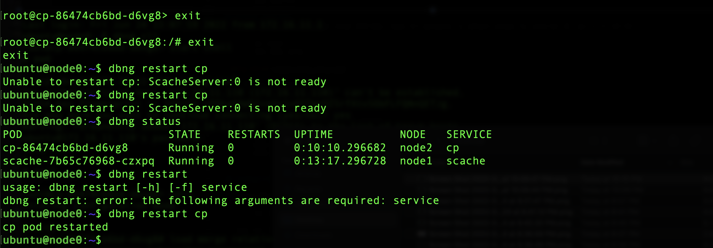

## Changing the configuration on BNG1 and BNG2
1. open ssh session into bng1 and change the configuration for apply-group to the following

        original configuration: apply-groups [ pw bng bng_common l2c ri ];
        configuration: apply-groups [ pw bng bng_common evpn-vpws ri ];
        new configuration: apply-groups [ pw_b l2c bng_common cups_up ri_b ]

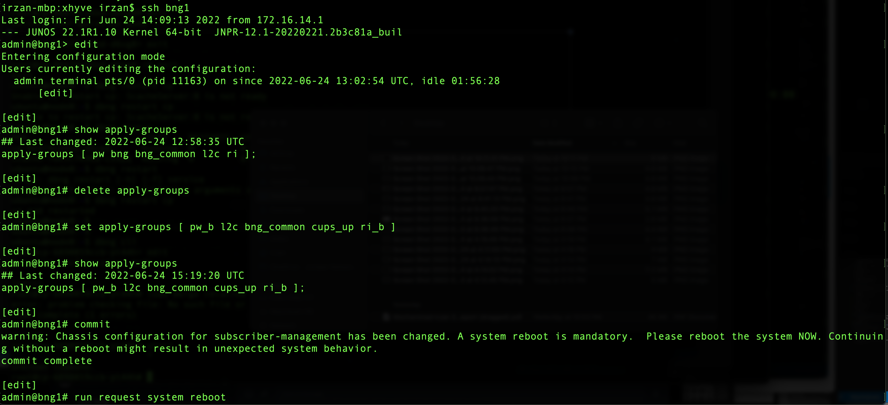

2. Reboot node bng1
3. Repeat step 1 and 2 for BNG2

## Verify connection between CP and UP
1. open ssh session into node0, start dbng cli and verify that CP is communicating with UPs

        ssh node0
        dbng cli
        show system subscriber-management control-plane associations 

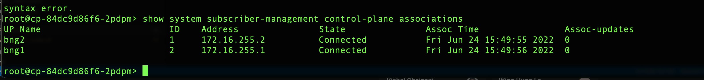

2. open ssh session into bng1 and bng2, and verify that UP is communicating with CP

        ssh bng1
        

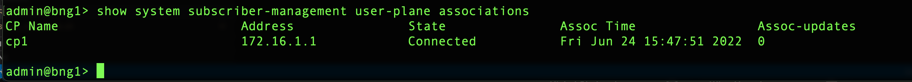

        ssh bng1
        show system subscriber-management user-plane associations

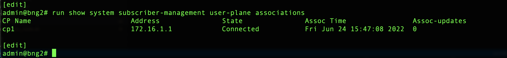

## initiating connection from CPEs.
1. Access console of client1
2. open terminal, and open ssh session into 192.168.1.1 (cpe1)

        ssh root@192.168.1.1

3. Start wan interface on cpe1

        ifup wan

4. Repeat step 1-3 on client2, client3, client4

5. open ssh into node0 and start dbng cli and run the following command to verify that subscribers have been connected

        ssh node0
        dbng cli
        show system subscribers

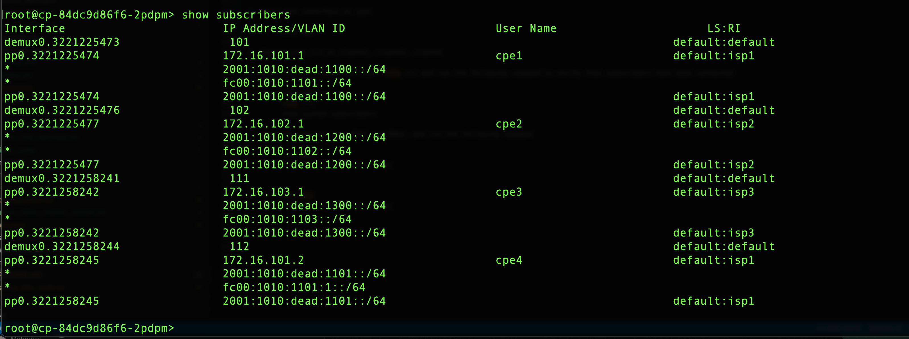

7. open ssh session into BNG1 and BNG2, and run the following command 

        ssh bng1
        show user-plane subscribers

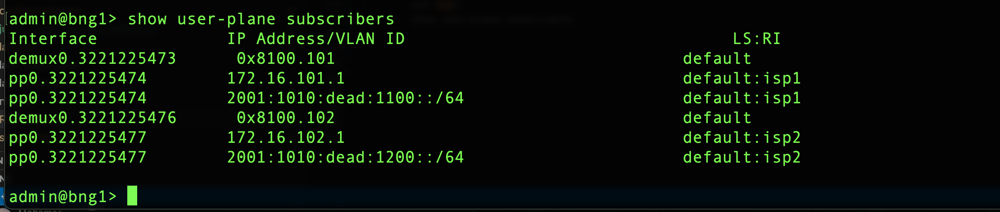

        ssh bng2
        show user-plane subscribers

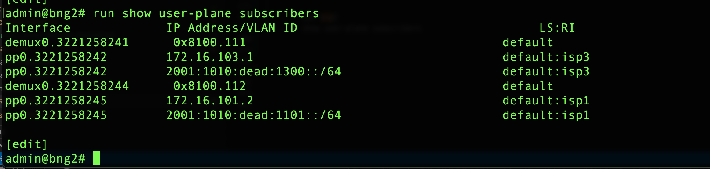

Now you can test different scenarios on CUPS-BNG

