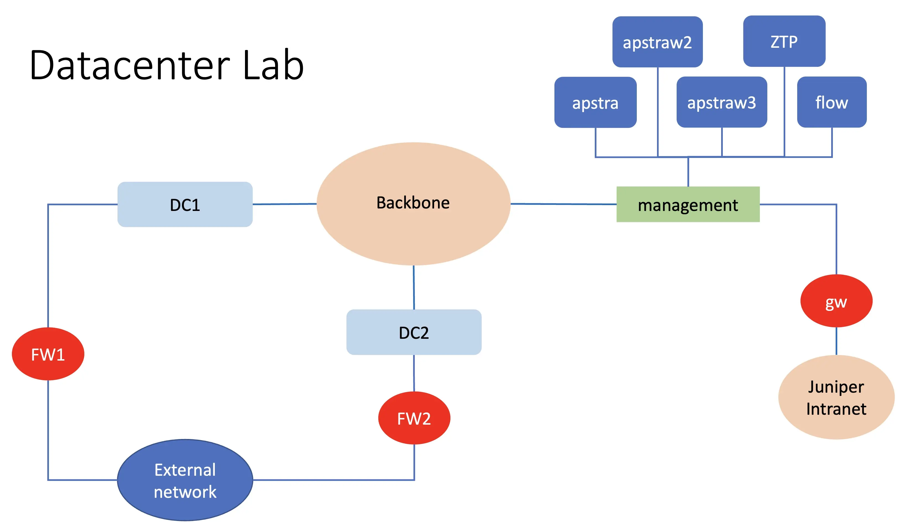
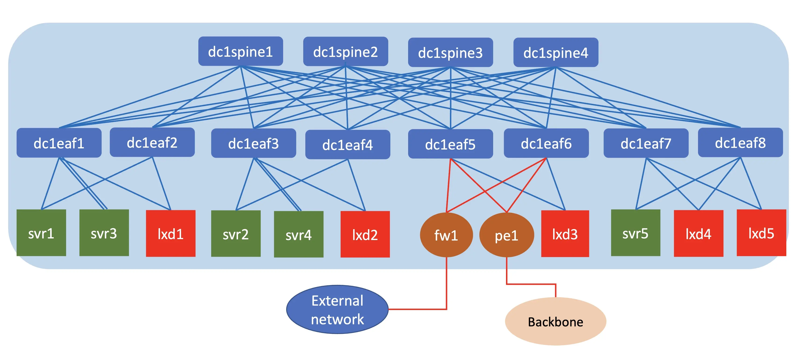
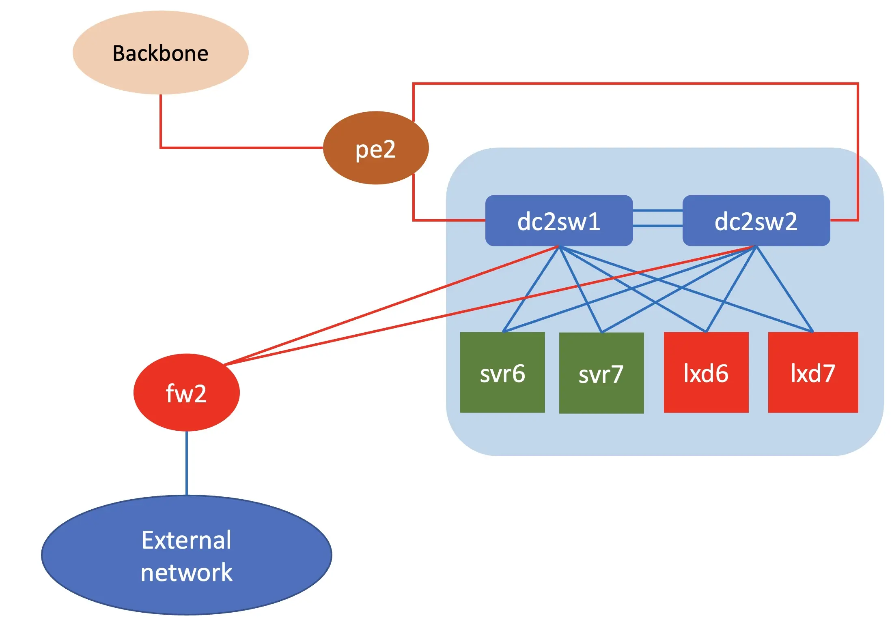

# Running Juniper Apstra 6.0 and vJunosSwitch
this script is to run Juniper Apstra 6.0, Apstra ZTP server and vJunosSwitch (25.2R1.9) on juniper's VMM

## Topology
The logical topology of the testbed is as follows :

### DC1

### DC2

## Devices in the lab

- DC1:
    - spine : Spine1, Spine2, spine3, spine4 (vJunosSwitch)
    - leaf : leaf1, leaf2, leaf3, leaf4, leaf5, leaf6, leaf7, leaf8 (vJunosSwitch)
    - BMS : svr1, svr2, svr3, svr4, svr5, (linux())
    - BMS with hypervisor (KVM) : lxd1, lxd2, lxd3, lxd4, lxd5 (linux)
- DC2
    - collapsed switches: sw1, sw2 (vJunosSwitch)
    - BMS : svr7, svr8 (linux)
    - BMS with hypervisor (KVM) :  lxd7, lxd8 (linux)
- External
    - fw1,fw2 : firewall (vSRX)
    - GW: Linux router that provide connection to internet
- IP/Wan Backbone
- Apstra
    - Juniper Apstra 6.0
    - ZTP server 6.0
    - Flow server 6.0

## Credential to access devices
- Ubuntu linux
    - user: ubuntu
    - password: pass01
- Alpine linux
    - user: ubuntu
    - password: pass01
- vJunosRouter and vSRX
    - user: admin
    - password: admin
- vJunosSwitch
    - user: aosadmin
    - password: aosadmin123

## Deploying lab topology

This lab consist of multiple topologies :
- Apstra server [lab.yaml](apstra/lab.yaml)
- DC1 [lab.yaml](dc1/lab.yaml)
- DC2 [lab.yaml](dc2/lab.yaml)

Each topology is created independently and connected through the IP backbone in the lab.

## Deploying Apstra server 

Screenshot recording for this can be found [here](https://asciinema.org/a/747217)

1. Go to directory [apstra](./apstra)

        cd apstra 

2. Edit file [lab.yaml](./apstra/lab.yaml). Set the following parameters to choose which vmm server that you are going to use and the login credential:
    - vmmserver 
    - user 
3. If you want to add devices or change the topooogy of the lab, then edit file [lab.yaml](lab.yaml)
4. use [vmm.py](../../vmm.py) script to deploy the topology into the VMM. Run the following command from terminal

        ../../../vmm.py upload  <-- to create the topology file and the configuration for the VMs and upload them into vmm server
        ../../../vmm.py start   <-- to start the topology in the vmm server

5. Verify that you can access node **gw** using ssh (username: ubuntu,  password: pass01 ). You may have to wait for few minutes for node **gw** to be up and running
6. Run script [vmm.py](../../../vmm.py) to send and run initial configuration on node **gw**

        ../../../vmm.py set_gw
7. Run ansible-playbook [apstra/setup/update_nodes.yaml](apstra/setup/update_nodes.yaml) to install the necessary software on node gw

        cd setup
        ansible-playbook update_nodes.yaml

8. Run script [vmm.py](../../vmm.py) to create wireguard configuration

        ../../../vmm.py get_wg_config

9. Upload file tmp/wg0_gw.conf into node **gw**, copy it into wireguard directory, and start the wireguard service

        scp tmp/wg0_gw.conf gw:~/wg0.conf
        ssh gw "sudo cp ~/wg0.conf /etc/wireguard/ && sudo systemctl enable wg-quick@wg0 && sudo systemctl start wg-quick@wg0"

10. on your workstation, install wireguard vpn 

        brew install wireguard-go.  # for example this how to install wireguard on macosx using

10. On your workstation, copy file tmp/wg0_ws.conf into your local wireguard directory, start wireguard, and test connectivity to the lab

        sudo cp tmp/wg0_ws.conf /usr/local/etc/wireguard/wg0.conf
        sudo wg-quick up wg0
        ssh ubuntu@192.168.199.0
        ping 172.16.55.254

## Setup IP addresses of Juniper Apstra nodes
Screenshot recording for this can be found [here](https://asciinema.org/a/747219)

1. In this lab, there are 5 apstra nodes, 1 x Apstra controller, 2 x Apstra worker node, 1 x Apstra ZTP server and 1 x Apstra flow server.
2. These are the ip address for Apstra nodes

    node | IP address| gateway| DNS
    -|-|-|-
    apstra| 172.16.55.1/24|172.16.55.254|172.16.55.254
    apstraw2|172.16.55.2/24|172.16.55.254|172.16.55.254
    apstraw3|172.16.55.3/24|172.16.55.254|172.16.55.254
    ztp| 172.16.55.4/24|172.16.55.254|172.16.55.254
    flow| 172.16.55.5/24|172.16.55.254|172.16.55.254

3. To setup those apstra node, use serial console of the VM
4. to open console of VM of juniper Apstra. Open ssh session into node vmm, and run command **vmm serial -t apstra** (this is for controller node)

        ssh vmm
        vmm serial -t apstra

5. Open session session into node apstra, and start the initial configuration, such as changing login password and set ip address to static
6. Repeat the process for node apstraw2, apstraw3, ztp and flow
7. Open ssh session into node gw, and test connectivity to the apstra node

        ssh gw
        ping 172.16.55.1
        ssh admin@172.16.55.1
8. Or if wireguard session has been established, test connectivity directly with the apstra nodes from your workstation

        ping 172.16.55.1
        ssh admin@172.16.55.1
        curl http://172.16.55.1
        curl -k https://172.16.55.1

## Deploying topology DC1

Screenshot recording for this can be found [here]()

1. Go to directory [dc1](./dc1)

        cd dc1

2. Edit file [lab.yaml](./dc1/lab.yaml). Set the following parameters to choose which vmm server that you are going to use and the login credential:
    - vmmserver 
    - user 
3. If you want to add devices or change the topology of the lab, then edit file [lab.yaml](lab.yaml)
4. use [vmm.py](../../vmm.py) script to deploy the topology into the VMM. Run the following command from terminal

       ../../../vmm.py upload  <-- to create the topology file and the configuration for the VMs and upload them into vmm server
       ../../../vmm.py start   <-- to start the topology in the vmm server

5. Verify that you can access node **gw** using ssh (username: ubuntu,  password: pass01 ). You may have to wait for few minutes for node **gw** to be up and running
6. Run script [vmm.py](../../../vmm.py) to send and run initial configuration on node **gw**

        ../../../vmm.py set_gw
7. Open ssh session into node **vmm** and access serial console of node svr0

       ssh vmm
       vmm serial -t svr0

8. Run the following script on node **svr0**

       cat << EOF | sudo tee /etc/netplan/01_net.yaml
       network:
         version: 2
         ethernets:
           eth0:
             addresses: [ 172.16.51.100/24]
             nameservers:
               addresses: [ 172.16.51.254]
               search: [vmmlab.com]
             routes:
             - to: default
               via: 172.16.51.254
       EOF
       sudo hostname svr0
       hostname | sudo tee /etc/hostname
       sudo netplan apply

9. Run script [vmm.py](../../vmm.py) to send and run initial configuration on node all ubuntu nodes

       ../../../vmm.py set_host

10. Run ansible-playbook [dc1/setup/update_nodes.yaml](dc1/setup/update_nodes.yaml) to install the necessary software on node gw

        cd setup
        ansible-playbook update_nodes.yaml
        ./reboot_vm.sh

11. Run script [vmm.py](../../vmm.py) to get the mac addresses of vJunosSwitch and vJunosEvolved nodes in the lab. Record this information, it is required for ZTP configuration on the next steps
        
        ../../../vmm.py get_vjunos_mac

## Initial setup of Apstra 

Screenshot recording for this can be found [here](https://youtu.be/Jnnpxnlu764)

1. login into web dashboard of Apstra server, https://172.16.55.1
2. Add license into Apstra
3. Add worker nodes, apstraw2 and apstraw3, into apstra controller. 
4. Add user for ZTP server. 
    
        user: ztp
        global_roles: device_ztp

5. get the list of mac addresses for all network devices in the datacenter (spine and leaf switches)
6. login into dashboard of Apstra ZTP server, https://172.16.55.4 
7. configure DHCP: subnet, ip pool and ip addresses reservation. For ip address reservation use the mac address information from the previous steps.
8. Configure ztp.json  with the junos version and custom script for vJunosSwitch and vJunosEvolved. To accept any version for vJunos, just delete the existing version from the dashboard, and remove the URL for the image.

9. Use the following for the custom script for vJunosSwitch : 

       #!/bin/sh
       cli -c "configure; set system commit synchronize; set chassis evpn-vxlan-default-switch-support; set chassis fpc 0 pic 0 number-of-ports 12; commit and-quit"

10. Use the following for the custom script for vJunosEvolved

        #!/bin/sh 
        cli -c "configure; set forwarding-options tunnel-termination; commit and-quit"

## Connecting topology Apstra and topology DC1

Screenshot recording for this can be found [here](https://asciinema.org/a/747229)

1. upload script [create_wg_gwapstra.sh](dc1/wireguard_config/create_wg_gwapstra.sh) into node **gw** of topology Apstra (ip address 172.16.55.254), open ssh session into node **gw** of topology apstra, and run the script. It will create wireguard interface for connection to topology DC1

       scp dc1/wireguard_config/create_wg_gwapstra.sh ubuntu@172.16.55.254:~/
       ssh ubuntu@172.16.55.254
       ./create_wg_gwapstra.sh
       ip link show
       ip addr show dev eth0

2. Get ip address of interface eth0 of node **gw** of topology apstra, and record it. it is required for the next step.

       ssh ubuntu@172.16.55.254 "ip addr show dev eth0"

3. upload script [create_wg_gwdc1.sh](dc1/wireguard_config/create_wg_gwdc1.sh) into node **gw** of topology DC1, open ssh session into node **gw** of topology DC1, and run the script. It will create wireguard interface for connection to topology Apstra.

       scp dc1/wireguard_config/create_wg_gwdc1.sh gw:~/
       ssh gw
       ./create_wg_gwdc1.sh <ip_of_eth0_of_node_gw_topology_apstra>
       ip link show

4. Test connectivity to apstra server

       ping 172.16.55.1
       ping 172.16.55.4
       curl -k https://172.16.55.1

## Configure dhcp-relay on node svr0

Screenshot recording for this can be found [here](https://youtu.be/wjjGzq_HzVU)

Since the dhcp and ZTP server are located on different subnet/topology (topology Apstra), then dhcp relay must be configured on topology DC1 to forward dhcp request from vJunos Nodes to the apstra ZTP server.

Since dhcp-relay can't be configured on node **gw** of topology DC1, so dhcp-relay is configured on node svr0.

1. open ssh session into node svr0
       ssh svr0

2. install isc-dhcp-relay application and set the dhcp-relay (server: 172.16.55.4, interface: eth0)

       sudo apt install isc-dhcp-relay -y

3. Then DHCP request from all the vJunos nodes on topology DC1 will be forwarded into Apstra ZTP Server and the vJunos Nodes will be onboarded into Juniper Apstra.

4. Verify that devices (vJunosSwitch and vJunosEvolved) are onboarded on Juniper Apstra Server

## Lab exercise

You can refer to [this document](LabExercise/README.md) for lab exercise

