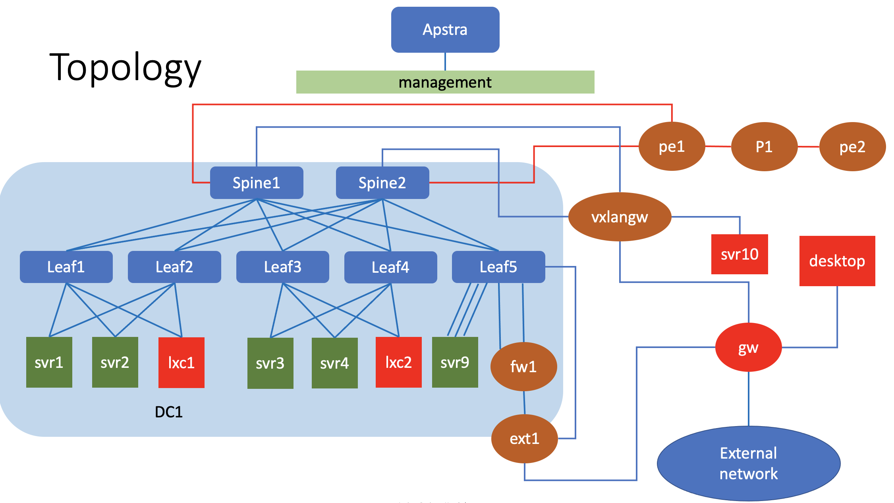
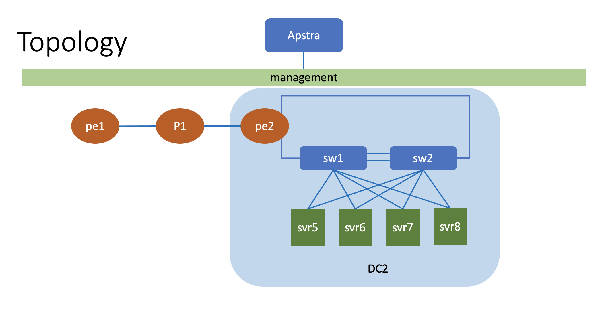
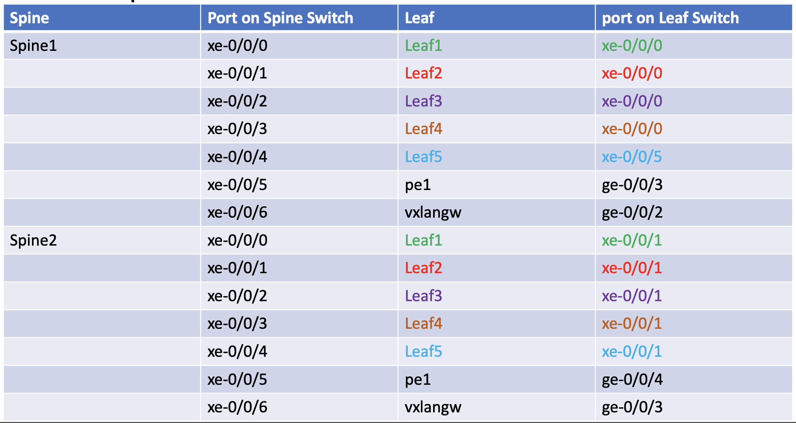
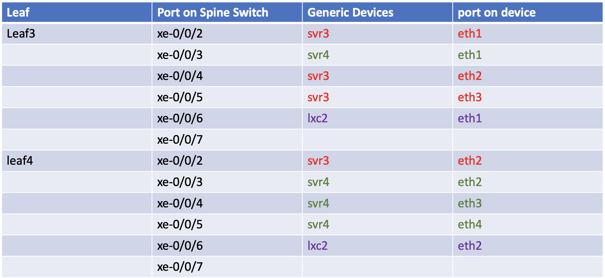
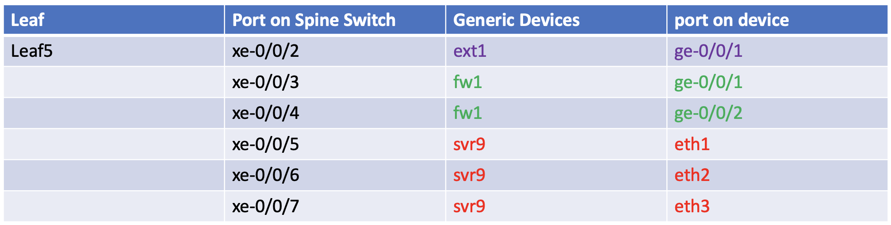
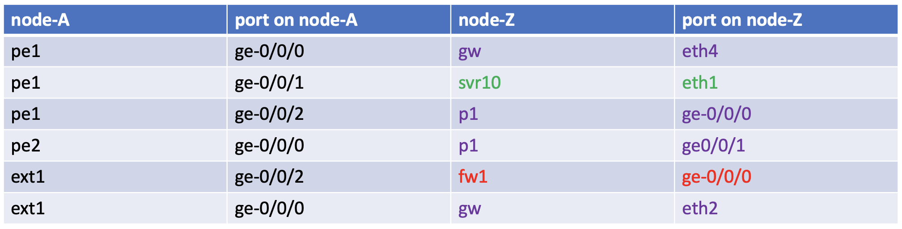
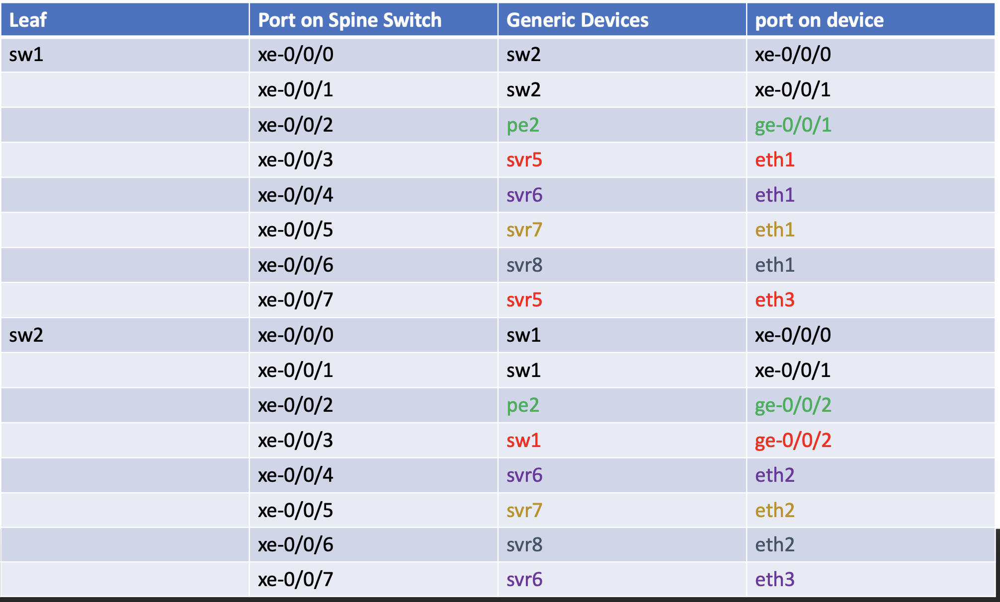
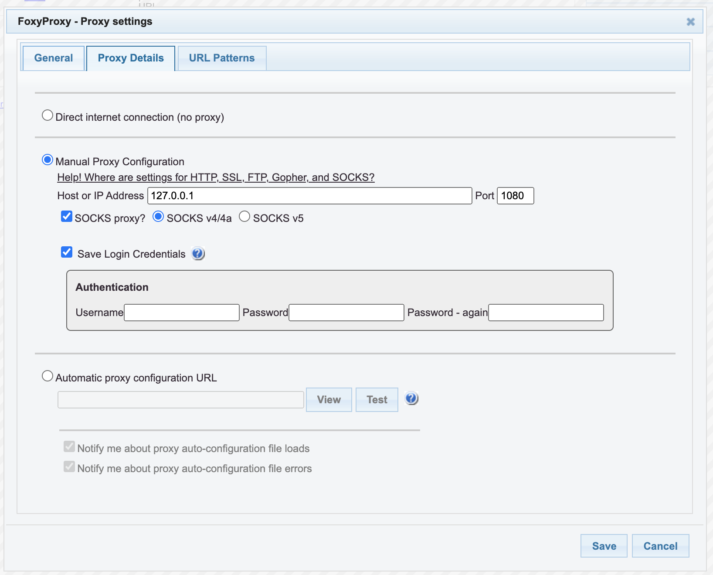
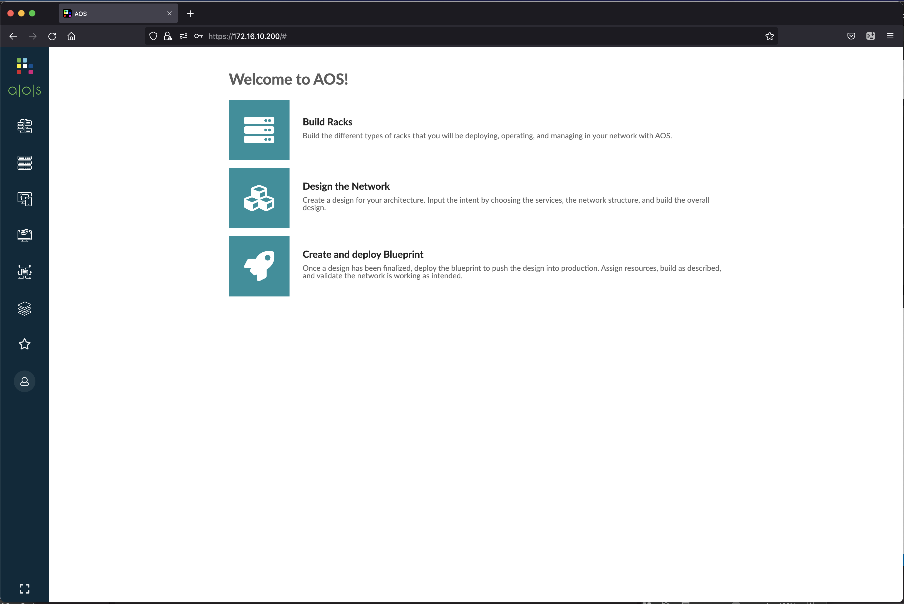

# Running Apstra Fabric conductor 4.0 and vQFX
this script is to run Apstra fabric conductor 4.0 and vQFX on juniper's VMM

## Topology
The logical topology of the testbed is as follows :

### DC1

### DC2

### DC1, Spine-Leaf connection

### DC1, Connection on Leaf

### DC1, External Devices

### DC2, Collapsed DC

## Devices in the lab

- DC1:
    - spine : Spine1, Spine2 (vQFX)
    - leaf : leaf1, leaf2, leaf3, leaf4, leaf5 (vQFX)
    - BMS : svr1, svr2, svr3, svr4, svr9, lxc1, lxc2 (linux)
- DC2
    - collapsed switches: sw1, sw2 (vQFX)
    - BMS : svr5, svr6, svr7, svr8 (linux)
- External
    - ext1 : external router (VMX)
    - fw1 : firewall (vSRX)
    - BMS : svr10 ,  desktop  (linux)
    - GW: Linux router that provide connection to internet
    - vxlangw   
- IP/Wan Backbone :
    - Router : PE1, PE2, P1 (vMX )
- Apstra
    - AFC 4.0

## Credential to access devices
- Ubuntu linux
    - user: ubuntu
    - password: pass01
- Alpine linux
    - user: ubuntu
    - password: pass01
- JUNOS VM
    - user: admin
    - password: pass01

# To create the lab topology and initial configuration of VMs
1. Go to directory [dc_with_apstra.4.0](./)
2. Edit file [lab.yaml](./lab.yaml). Set the following parameters to choose which vmm server that you are going to use and the login credential:
    - vmmserver 
    - jumpserver
    - user 
    - adpassword
    - ssh_key_name ( please select the ssh key that you want to use, if you don't have it, create one using ssh-keygen and put it under directory **~/.ssh/** on your workstation )
3. If you want to add devices or change the topooogy of the lab, then edit file [lab.yaml](lab.yaml)
4. use [vmm.py](../../vmm.py) script to deploy the topology into the VMM. Run the following command from terminal

        ../../vmm.py upload  <-- to create the topology file and the configuration for the VMs and upload them into vmm server
        ../../vmm.py start   <-- to start the topology in the vmm server

5. Verify that you can access node **gw** using ssh (username: ubuntu,  password: pass01 ). You may have to wait for few minutes for node **gw** to be up and running
6. Run script [vmm.py](../../vmm.py) to send and run initial configuration on node **gw**

        ../../vmm.py set_gw

7. Verify that you can access other nodes (linux and junos VM), such **gw**, **desktop**, **spine1**, etc. Please use the credential to login.

        ssh desktop

8. Run script [vmm.py](../../vmm.py) to send and run initial configuration on linux nodes. This script will also reboot the VM. So wait before you test connectivity into the VM

        ../../vmm.py set_host

9. Verify that you can access linux and junos VMs, such  **gw**, **desktop**, **spine1**, etc., without entering the password. You may have to wait for few minutes for the nodes to be up and running

        ssh gw
        ssh desktop
        ssh spine1
        ...

## Setup AOS server
1. Open ssh session to node **afc**

        ssh apstra

2. Login into AOS using the default username/password : admin/admin, and change the default password
 

5. Currently node **AFC** is configured with dhcp for Ip address assignment. If you want change the ip address to static, change it to the following:
    - ip address : 172.16.10.200/24
    - gateway : 172.16.10.1
    - dns : 172.16.10.1

6. Restart AOS services

## Accesing Web UI of AOS

1. From your workstation, open ssh session to node **proxy** and keep this session open if you need to access the web dashboard of Paragon Automation platform

        ssh proxy 

2. If you are using Firefox as web browser, set proxy with the following parameters
    - manual proxy configuration
    - SOCKS host : 127.0.0.1
    - PORT : 1080
    - type: SOCKS v4    
    

3. If you are using Chrome as web browser, install extension Foxy Proxy and configure it with the following parameters
    - manual proxy configuration
    - SOCKS host : 127.0.0.1
    - PORT : 1080
    - type: SOCKS v4    
    
    

4. Open http session to https://172.16.10.200, and login using default credential, user/password: admin/admin
  
  

## Lab exercise

You can refer to [this document](config/README.md) for lab exercise

