# This document provides guideline on how to clone Device provile for Juniper vEVO (virtual Evo)

## Creating Device profile for vEVO
1. on Apstra Dashboard, select Device > Device Profiles
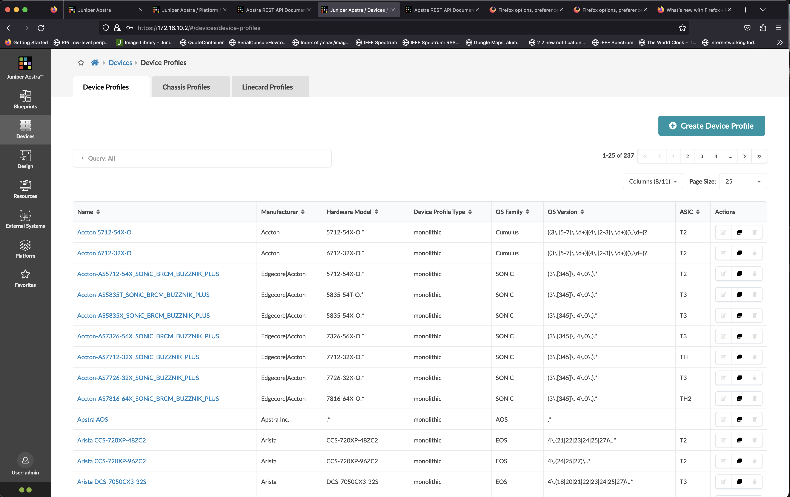
2. click Query All, and search for name PTX
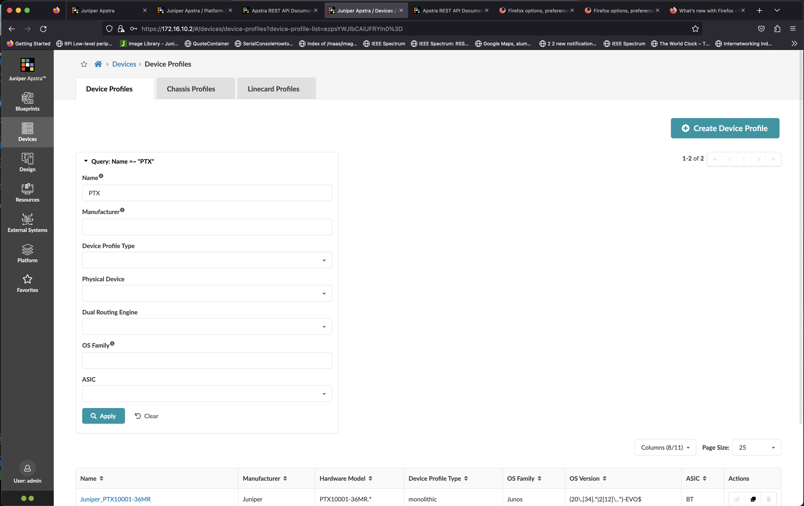
3. Clone device profile **Juniper_PTX10001-36MR**
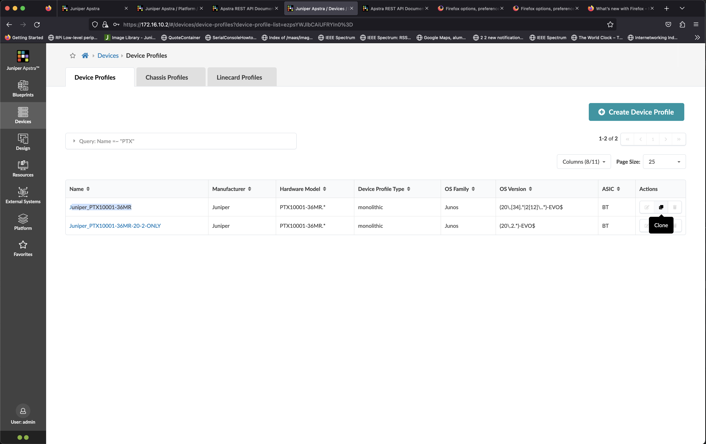
4. Set name of the cloned device profile to **Juniper vEVO** and set physical device to off
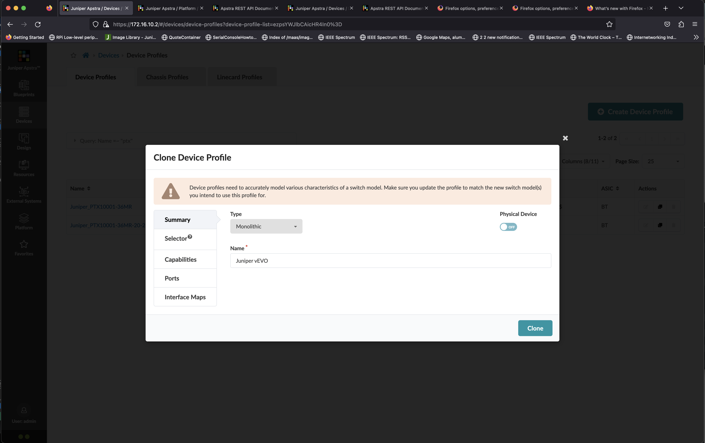
5. Click on Selector, and set the version to (20\\\.[34].*|2[1-3]\\\..*)-EVO$
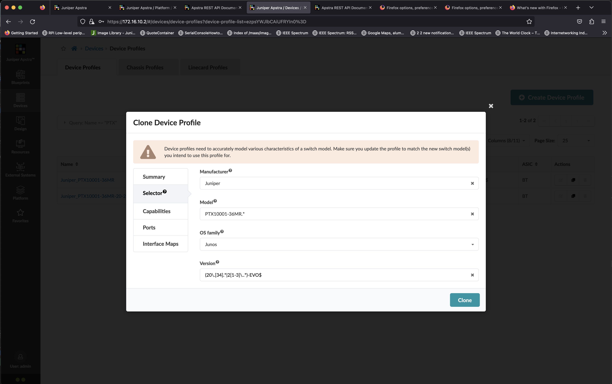
6. Click on Ports, and delete the existing Panel, **Panel #1**
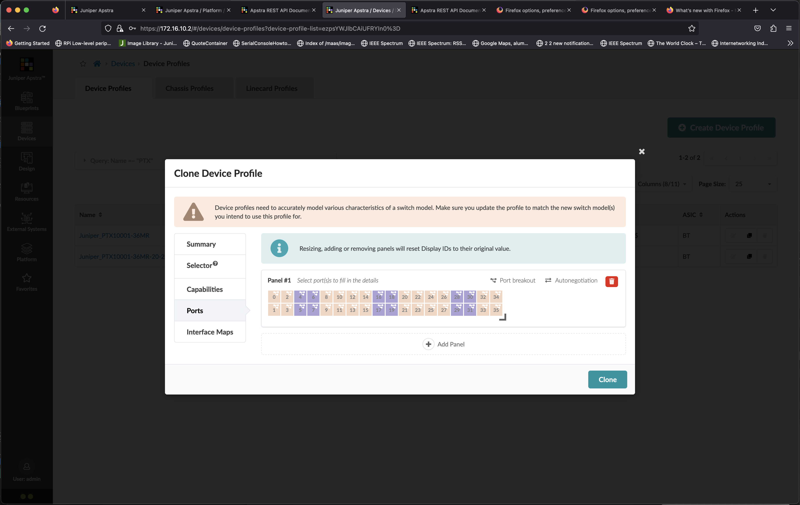
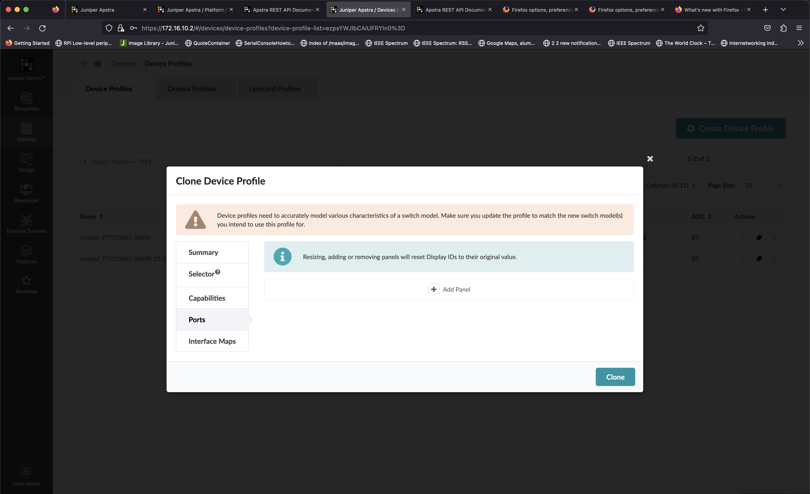
7. Add the new panel
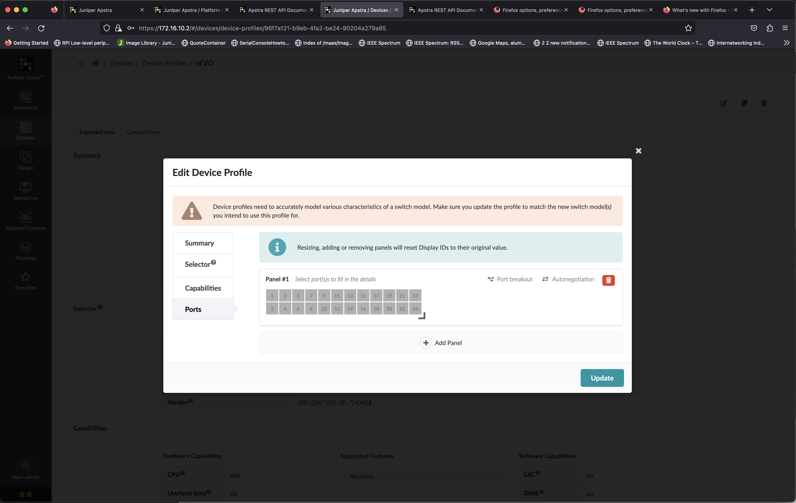
8. set the number of port to 12 ports
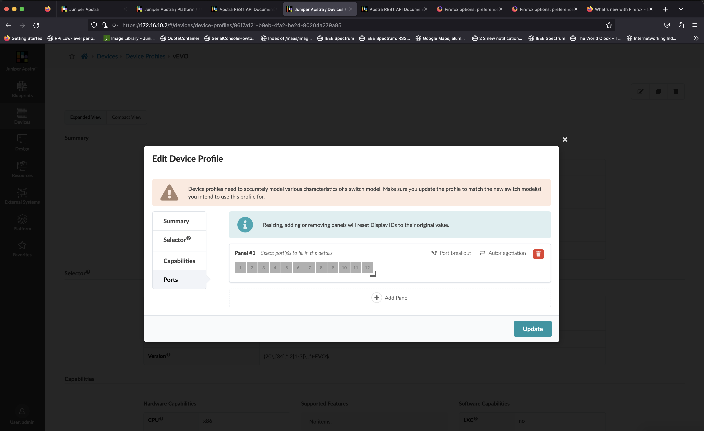
9. click on port 1 to 12 to select port 1 to 12, 
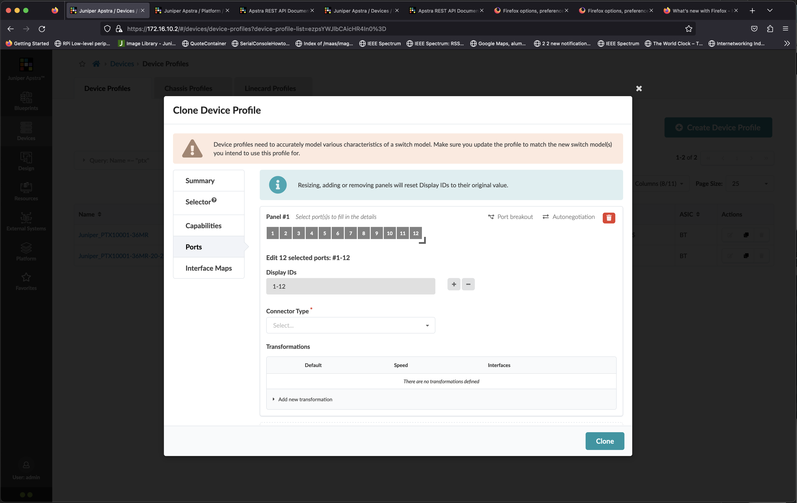
10. on Display ID, click minus (-) sign to set the display ID to 0-11
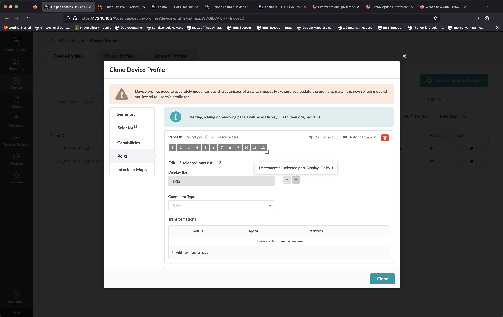

11. set Connector type to SFP+, and click add new transformation
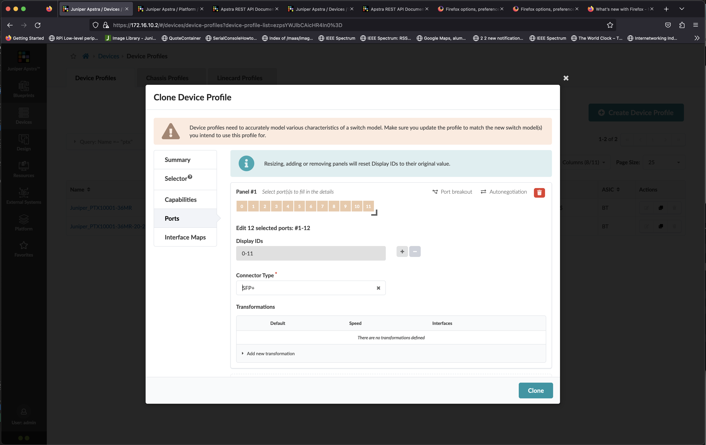
12. Set the template to **et-0/0/<display_id>**, and set interface speed and global speed to 1g, and click add transformation
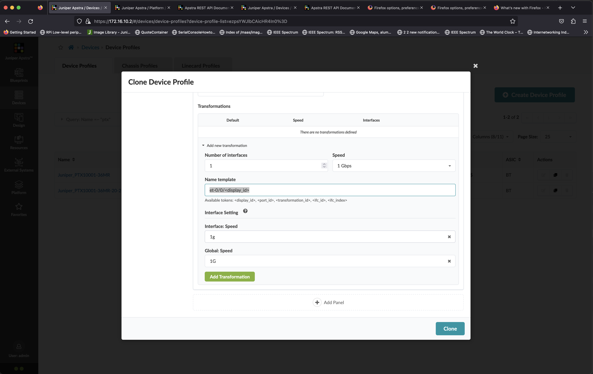
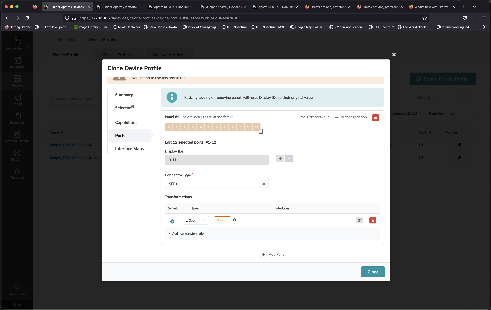
13. Verify that each port is assigned with the correct port according to the following table

    port | template
    -|-
    0|et-0/0/0
    1|et-0/0/1
    2|et-0/0/2
    3|et-0/0/3
    4|et-0/0/4
    5|et-0/0/5
    6|et-0/0/6
    7|et-0/0/7
    8|et-0/0/8
    9|et-0/0/9
    10|et-0/0/10
    11|et-0/0/11

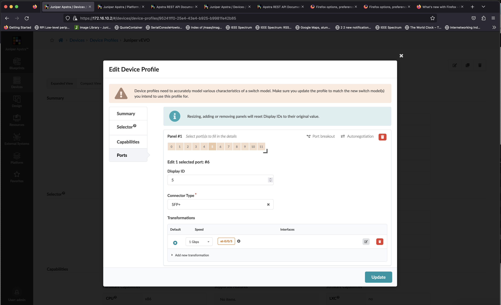

13. Click Clone to save the new Device profile
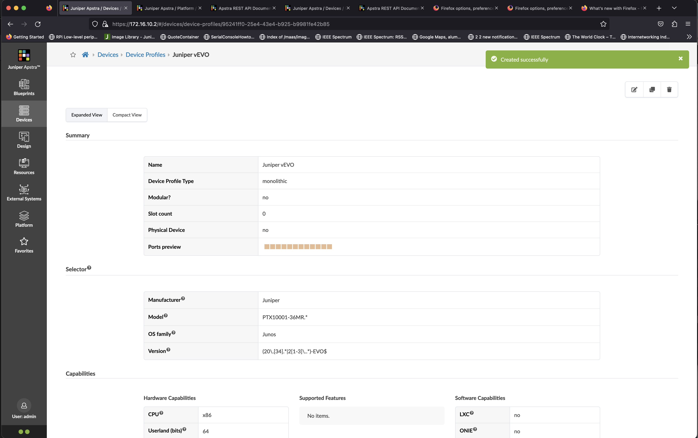
16. Now device profile for vEVO has been created
