# Lab 1, Setup and initial configuration of Juniper Apstra/ZTP Server

## Objective
- Initial configuration of Juniper Apstra and Apstra ZTP server
- Onboard network devices in datacenter fabric automatically using ZTP (zero touch provisioning)

## Topology
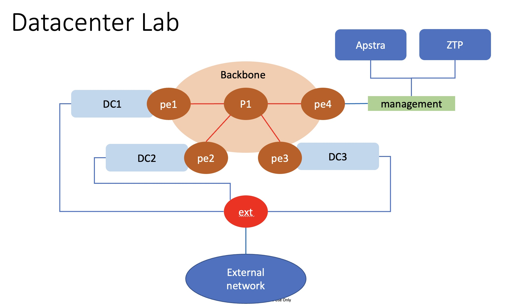
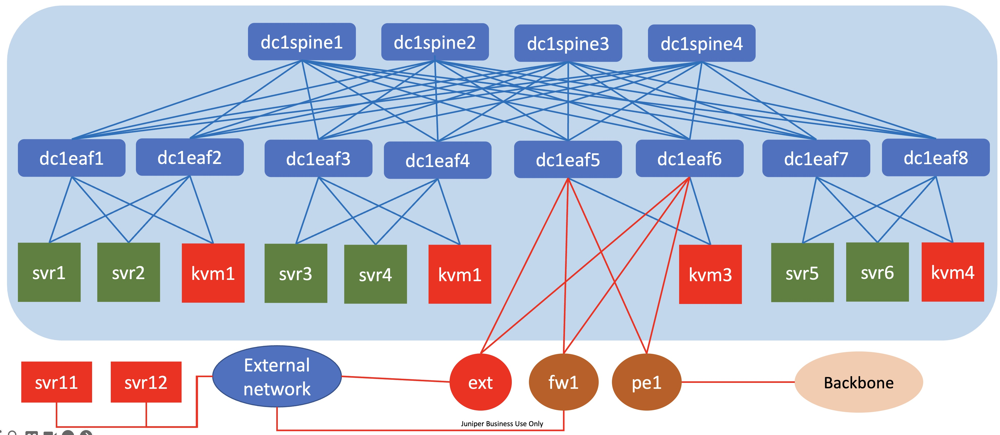
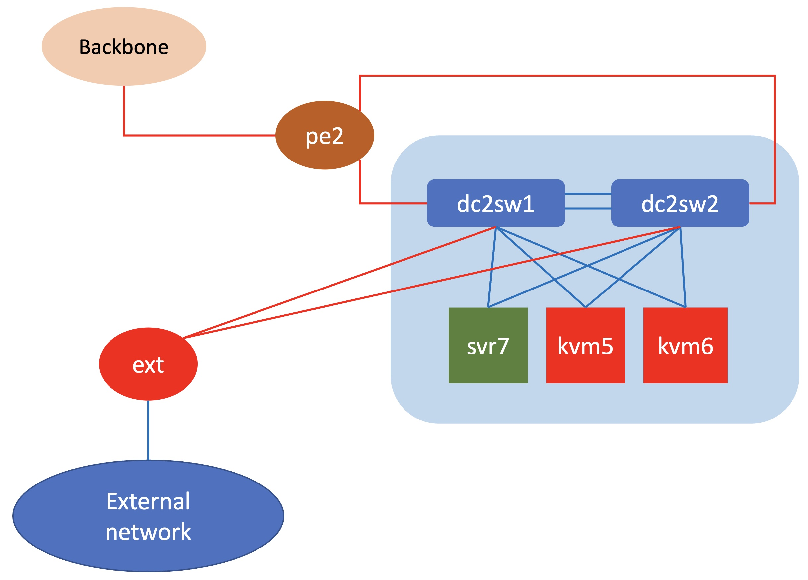
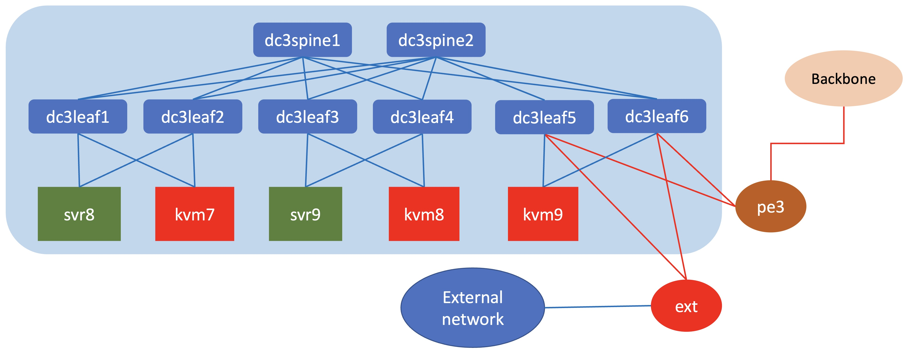

## Devices Type

### DC1/Site1

|Device| Type|
|----|----|
|dc1spine1| vJunosEvolved|
|dc1spine2| vJunosEvolved|
|dc1spine3| vJunosEvolved|
|dc1spine4| vJunosEvolved|
|dc1leaf1| vJunosEvolved|
|dc1leaf2| vJunosEvolved|
|dc1leaf3| vJunosEvolved|
|dc1leaf4| vJunosEvolved|
|dc1leaf5| vJunosEvolved|
|dc1leaf6| vJunosEvolved|
|dc1leaf7| vJunosSwitch|
|dc1leaf8| vJunosSwitch|

### DC2/Site2

|Device| Type|
|----|----|
|dc2sw1| vJunos-Switch|
|dc2sw2| vJunos-Switch|

### DC3/Site3

|Device| Type|
|----|----|
|dc3spine1| vJunosEvolved|
|dc3spine2| vJunosEvolved|
|dc3leaf1| vJunos-Switch|
|dc3leaf2| vJunos-Switch|
|dc3leaf3| vJunos-Switch|
|dc3leaf4| vJunos-Switch|

## IP Address allocation for the lab

| Subnet | IP address | Host |
|-----|------|------|
| 172.16.10.0/24 | 172.16.10.2| apstra|
| | 172.16.10.3| ztp|
| 172.16.11.0/24| 172.16.11.101| dc1spine1|
| | 172.16.11.102| dc1spine2|
| | 172.16.11.103| dc1spine3|
| | 172.16.11.104| dc1spine4|
| | 172.16.11.111| dc1leaf1|
| | 172.16.11.112| dc1leaf2|
| | 172.16.11.113| dc1leaf3|
| | 172.16.11.114| dc1leaf4|
| | 172.16.11.115| dc1leaf5|
| | 172.16.11.116| dc1leaf6|
| | 172.16.11.117| dc1leaf7|
| | 172.16.11.118| dc1leaf8|
| 172.16.12.0/24| 172.16.12.101| dc2sw1|
|| 172.16.12.102| dc2sw2|
| 172.16.13.0/24| 172.16.13.101| dc3spine1|
| | 172.16.13.102| dc3spine2|
| | 172.16.13.111| dc3leaf1|
| | 172.16.13.112| dc3leaf2|
| | 172.16.13.113| dc3leaf3|
| | 172.16.13.114| dc3leaf4|
| 172.16.15.0/24| 172.16.15.11| svr11|
| | 172.16.15.12| svr12|

## Port connectivity between devices

### Site 1

| Device A | Port A | Device Z | Port Z|
|----|----|----|----|
|dc1spine1|et-0/0/0|dc1leaf1|et-0/0/0|
||et-0/0/1|dc1leaf2|et-0/0/0|
||et-0/0/2|dc1leaf3|et-0/0/0|
||et-0/0/3|dc1leaf4|et-0/0/0|
||et-0/0/4|dc1leaf5|et-0/0/0|
||et-0/0/5|dc1leaf6|et-0/0/0|
||et-0/0/6|dc1leaf7|et-0/0/0|
||et-0/0/7|dc1leaf8|et-0/0/0|

| Device A | Port A | Device Z | Port Z|
|----|----|----|----|
|dc1spine2|et-0/0/0|dc1leaf1|et-0/0/1|
||et-0/0/1|dc1leaf2|et-0/0/1|
||et-0/0/2|dc1leaf3|et-0/0/1|
||et-0/0/3|dc1leaf4|et-0/0/1|
||et-0/0/4|dc1leaf5|et-0/0/1|
||et-0/0/5|dc1leaf6|et-0/0/1|
||et-0/0/6|dc1leaf7|et-0/0/1|
||et-0/0/7|dc1leaf8|et-0/0/1|

| Device A | Port A | Device Z | Port Z|
|----|----|----|----|
|dc1spine3|et-0/0/0|dc1leaf1|et-0/0/2|
||et-0/0/1|dc1leaf2|et-0/0/2|
||et-0/0/2|dc1leaf3|et-0/0/2|
||et-0/0/3|dc1leaf4|et-0/0/2|
||et-0/0/4|dc1leaf5|et-0/0/2|
||et-0/0/5|dc1leaf6|et-0/0/2|
||et-0/0/6|dc1leaf7|et-0/0/2|
||et-0/0/7|dc1leaf8|et-0/0/2|

| Device A | Port A | Device Z | Port Z|
|----|----|----|----|
|dc1spine4|et-0/0/0|dc1leaf1|et-0/0/3|
||et-0/0/1|dc1leaf2|et-0/0/3|
||et-0/0/2|dc1leaf3|et-0/0/3|
||et-0/0/3|dc1leaf4|et-0/0/3|
||et-0/0/4|dc1leaf5|et-0/0/3|
||et-0/0/5|dc1leaf6|et-0/0/3|
||et-0/0/6|dc1leaf7|et-0/0/3|
||et-0/0/7|dc1leaf8|et-0/0/3|

| Device A | Port A | Device Z | Port Z|
|----|----|----|----|
|dc1leaf1|et-0/0/4|svr1|eth0|
||et-0/0/5|svr2|eth0|
||et-0/0/6|kvm1|eth0|

| Device A | Port A | Device Z | Port Z|
|----|----|----|----|
|dc1leaf2|et-0/0/4|svr1|eth1|
||et-0/0/5|svr2|eth1|
||et-0/0/6|kvm1|eth1|

| Device A | Port A | Device Z | Port Z|
|----|----|----|----|
|dc1leaf3|et-0/0/4|svr3|eth0|
||et-0/0/5|svr4|eth0|
||et-0/0/6|kvm2|eth0|

| Device A | Port A | Device Z | Port Z|
|----|----|----|----|
|dc1leaf4|et-0/0/4|svr3|eth1|
||et-0/0/5|svr4|eth1|
||et-0/0/6|kvm2|eth1|

| Device A | Port A | Device Z | Port Z|
|----|----|----|----|
|dc1leaf5|et-0/0/4|ext|ge-0/0/1|
||et-0/0/5|pe1|ge-0/0/2|
||et-0/0/6|fw1|ge-0/0/1|
||et-0/0/7|kvm4|eth0|

| Device A | Port A | Device Z | Port Z|
|----|----|----|----|
|dc1leaf6|et-0/0/4|ext|ge-0/0/2|
||et-0/0/5|pe1|ge-0/0/3|
||et-0/0/6|fw1|ge-0/0/2|
||et-0/0/7|kvm4|eth1|

| Device A | Port A | Device Z | Port Z|
|----|----|----|----|
|dc1leaf7|et-0/0/4|svr5|eth0|
||et-0/0/5|svr6|eth0|
||et-0/0/6|kvm3|eth0|

| Device A | Port A | Device Z | Port Z|
|----|----|----|----|
|dc1leaf8|et-0/0/4|svr5|eth1|
||et-0/0/5|svr6|eth1|
||et-0/0/6|kvm3|eth1|

### Site 2

| Device A | Port A | Device Z | Port Z|
|----|----|----|----|
|dc2sw1|ge-0/0/0|dc2sw2|ge-0/0/0|
||ge-0/0/1|dc2sw2|ge-0/0/1|
||ge-0/0/2|ext|ge-0/0/3|
||ge-0/0/3|pe2|ge-0/0/2|
||ge-0/0/4|svr7|eth0|
||ge-0/0/5|kvm5|eth0|
||ge-0/0/6|kvm6|eth0|

| Device A | Port A | Device Z | Port Z|
|----|----|----|----|
|dc2sw2|ge-0/0/0|dc2sw1|ge-0/0/0|
||ge-0/0/1|dc2sw1|ge-0/0/1|
||ge-0/0/2|ext|ge-0/0/4|
||ge-0/0/3|pe2|ge-0/0/3|
||ge-0/0/4|svr7|eth1|
||ge-0/0/5|kvm5|eth1|
||ge-0/0/6|kvm6|eth1|

### Site 3

| Device A | Port A | Device Z | Port Z|
|----|----|----|----|
|dc2spine1|et-0/0/0|dc3leaf1|ge-0/0/0|
||et-0/0/1|dc3leaf2|ge-0/0/0|
||et-0/0/2|dc3leaf3|ge-0/0/0|
||et-0/0/3|dc3leaf4|ge-0/0/0|
||et-0/0/4|dc3leaf5|ge-0/0/0|
||et-0/0/5|dc3leaf6|ge-0/0/0|

| Device A | Port A | Device Z | Port Z|
|----|----|----|----|
|dc3spine2|et-0/0/0|dc3leaf1|ge-0/0/1|
||et-0/0/1|dc3leaf2|ge-0/0/1|
||et-0/0/2|dc3leaf3|ge-0/0/1|
||et-0/0/3|dc3leaf4|ge-0/0/1|
||et-0/0/4|dc3leaf6|ge-0/0/1|
||et-0/0/5|dc3leaf6|ge-0/0/1|

| Device A | Port A | Device Z | Port Z|
|----|----|----|----|
|dc3leaf1|ge-0/0/2|svr8|eth0|
||ge-0/0/3|kvm7|eth0|

| Device A | Port A | Device Z | Port Z|
|----|----|----|----|
|dc3leaf2|ge-0/0/2|svr8|eth1|
||ge-0/0/3|kvm7|eth1|

| Device A | Port A | Device Z | Port Z|
|----|----|----|----|
|dc3leaf3|ge-0/0/2|svr9|eth0|
||ge-0/0/3|kvm8|eth0|

| Device A | Port A | Device Z | Port Z|
|----|----|----|----|
|dc3leaf4|ge-0/0/2|svr9|eth1|
||ge-0/0/3|kvm8|eth1|

| Device A | Port A | Device Z | Port Z|
|----|----|----|----|
|dc3leaf5|ge-0/0/2|ext|ge-0/0/5|
||ge-0/0/3|pe3|ge-0/0/2|
||ge-0/0/4|kvm9|eth0|

| Device A | Port A | Device Z | Port Z|
|----|----|----|----|
|dc3leaf6|ge-0/0/2|ext|ge-0/0/6|
||ge-0/0/3|pe3|ge-0/0/3|
||ge-0/0/4|kvm9|eth1|

## Backbone

| Device A | Port A | Device Z | Port Z|
|----|----|----|----|
|p1|ge-0/0/0|pe1|ge-0/0/1|
||ge-0/0/1|pe2|ge-0/0/1|
||ge-0/0/2|pe3|ge-0/0/1|
||ge-0/0/3|pe4|ge-0/0/1|
|pe1|ge-0/0/0|management of site 1||
|pe2|ge-0/0/0|management of site 2||
|pe3|ge-0/0/0|management of site 3||
|pe4|ge-0/0/0|apstra management||

## Juniper Apstra initial configuration (IP address, login password and Web UI Password)

1. Open console of VM of juniper Apstra. It can be VGA console or serial console

2. Login into AOS using the default username/password : admin/admin, and change the default password
    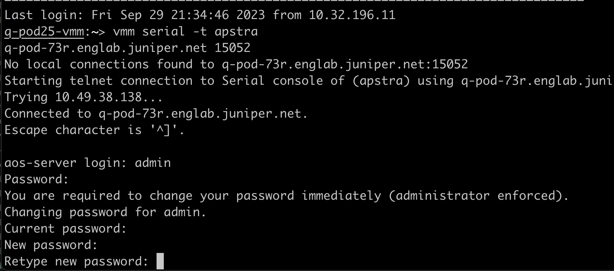

3. Currently node **apstra** is not configured with IP address. Set the following ip address
    - ip address : 172.16.10.2/24
    - gateway : 172.16.10.1
    - dns : 8.8.8.8, 8.8.4.4

4. Restart AOS services
5. Set the Apstra Web UI
6. Open http session to https://172.16.10.2, and login using user admin and password that was set on the previous step

  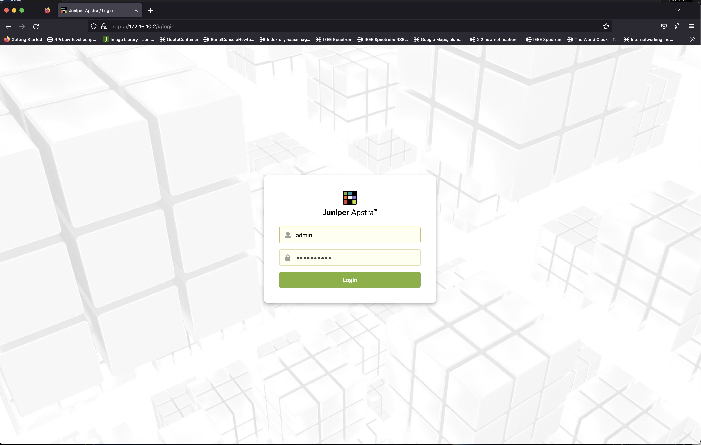

## Create user for ZTP server to communicate with Juniper Apstra
1. on Apstra Dashboard, click **Platform** > **Users**
2. Create user with the following parameter
    - username : ztp
    - password : J4k4rt4#01
    - Global Roles: device_ztp

    

## ZTP Server initial configuration (IP address, etc)
1. Open console of VM of ZTP Server. It can be VGA console or serial console
2. Login into AOS using the default username/password : admin/admin

    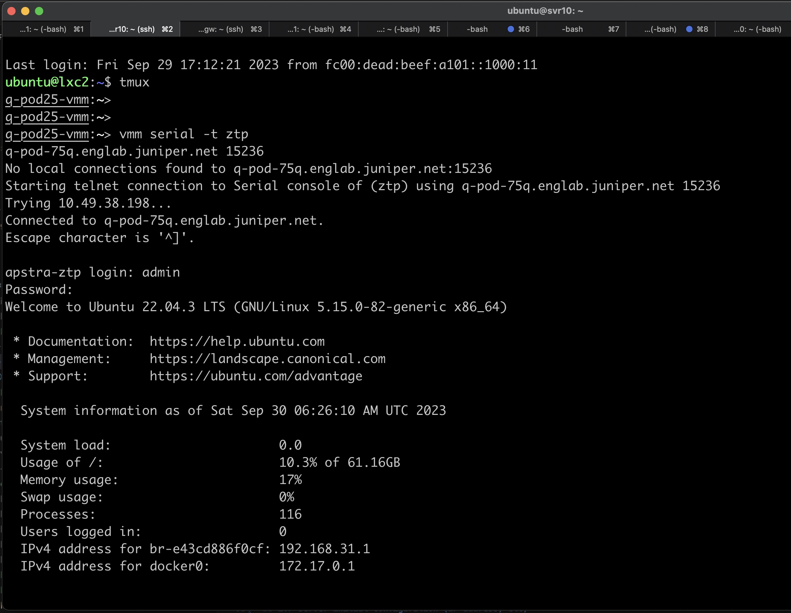

3. Set ip address for the ZTP Server. Use the following script to set ip address

       cat << EOF  | sudo tee /etc/netplan/01-netcfg.yaml
       network:
           version: 2
           # renderer: networkd
           ethernets:
               eth0:
                   dhcp4: false
                   addresses: [ 172.16.10.3/24]
                   routes:
                   - to: 0.0.0.0/0
                     via: 172.16.10.1
                     metric: 1
                   nameservers:
                       addresses: [ 8.8.8.8, 8.8.4.4 ]
       EOF

4. Activate network configuration using the following command and test connectivity to the default gateway or internet

        sudo netplan apply
        ip addr show
        ping -c 5 172.16.10.1
        ping -c 5 8.8.8.8

5. Try to open ssh session into ZTP server from your workstation

        ssh admin@172.16.10.3

6. On ZTP Server, create file /containers_data/status/app/aos.conf with the following content

       {
           "ip": "172.16.10.2",
           "user": "ztp",
           "password": "J4k4rt4#01"
       }
    
    or, the following script can be used to create the file

       cat << EOF | sudo tee /containers_data/status/app/aos.conf
       {
           "ip": "172.16.10.2",
           "user": "ztp",
           "password": "J4k4rt4#01"
       }
       EOF

7. Restart container status 

        docker restart status

8. On Juniper Apstra Dashboard, click **Devices** > **Services**, to verify that the ztp, dhcp, and tftp are up and running

    Before container **status** restarted

    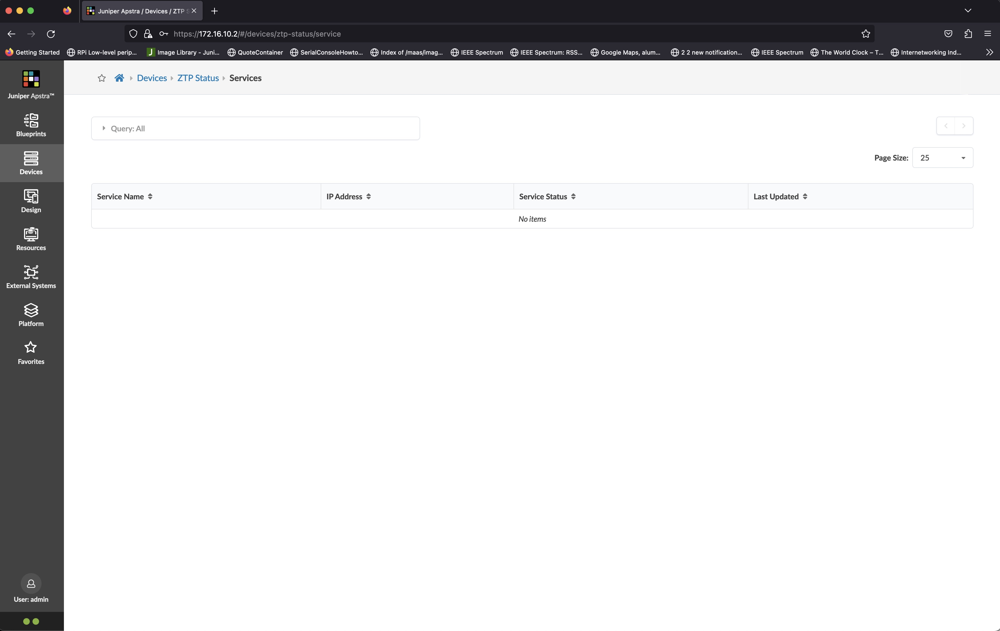

    After container **status** restarted

    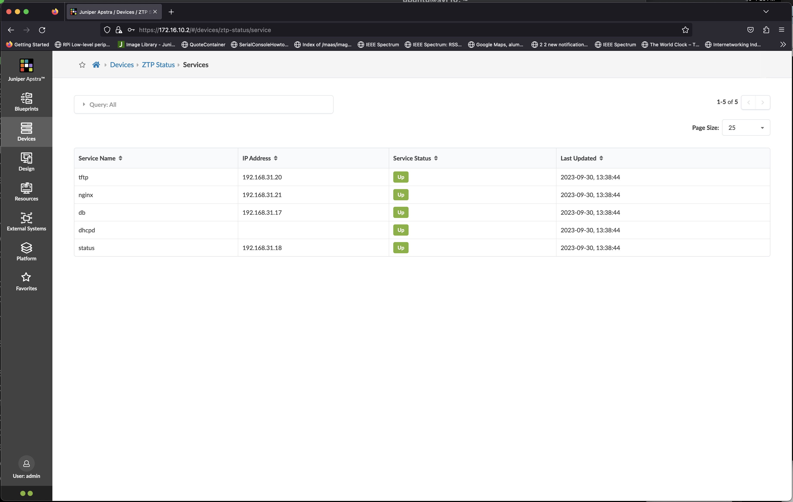

9. On ZTP server, create two files, **/containers_data/tftp/junos_custom1.sh** and  **/containers_data/tftp/junosevo_custom1.sh**. These two files are required to provide initial configuration to vJunos-Switch and vJunosEvolved. The following script can be used to create these files.

       cat << EOF | sudo tee /containers_data/tftp/junos_custom1.sh
       #!/bin/sh 
       cli -c "configure; set system commit synchronize; set chassis evpn-vxlan-default-switch-support; commit and-quit"
       EOF

    this is required for vJunos-Switch, because vJunos-Switch is virtual junos with EX9214 personality, and Apstra assume that it has dual RE (routing engine). On vJunos-Switch, there is only one RE, therefore when apstra try to discover vEX it will fail.

       cat << EOF | sudo tee /containers_data/tftp/junosevo_custom1.sh
       #!/bin/sh 
       cli -c "configure; set forwarding-options tunnel-termination; commit and-quit"
       EOF
    
    this is required to allow VxLAN termination to work on vJunosEvolved.

       sudo chmod +x /containers_data/tftp/junos_custom1.sh
       sudo chmod +x /containers_data/tftp/junosevo_custom1.sh
       ls -la /containers_data/tftp/

10. on ZTP server, edit file **/containers_data/tftp/ztp.json**

        sudo vi /containers_data/tftp/ztp.json
    
    For entry "junos-versions", set it to the junos version used on the QFX or vJunos-Switch
    
    For entry "junos-evo-versions", set it to the junos Evolved version used on the ACX/PTX or vJunosEvolved

    Junos version,  before
    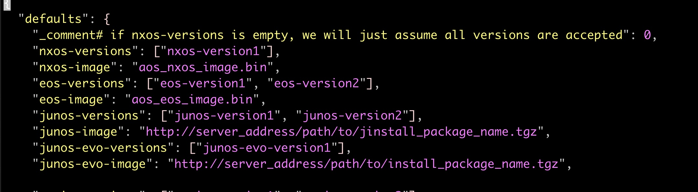
    Junos version, after
    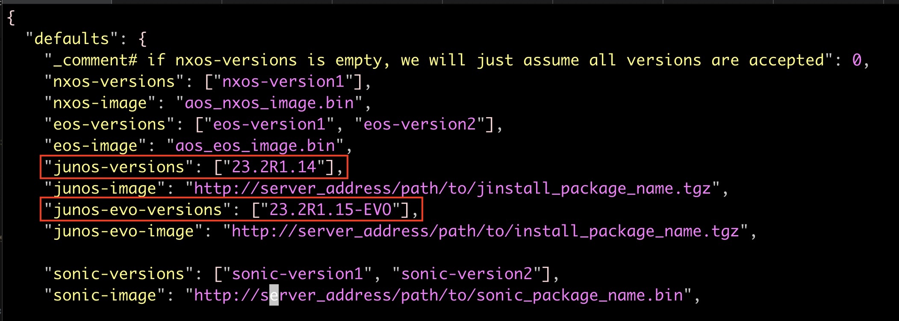d

11. Still on the same file **/containers_data/tftp/ztp.json**, under key "junos" add another key "custom-config"

        "junos": {
            "device-root-password": "root123",
            "device-user-password": "aosadmin123",
            "custom-config": "junos_custom1.sh",
            
            ...
        }
12. Still on the same file **/containers_data/tftp/ztp.json**,  under key "junos-evo" add another key "custom-config"

        "junos": {
            "device-root-password": "root123",
            "device-user-password": "aosadmin123",
            "custom-config": "junosevo_custom1.sh",
            
            ...
        }

    Before
    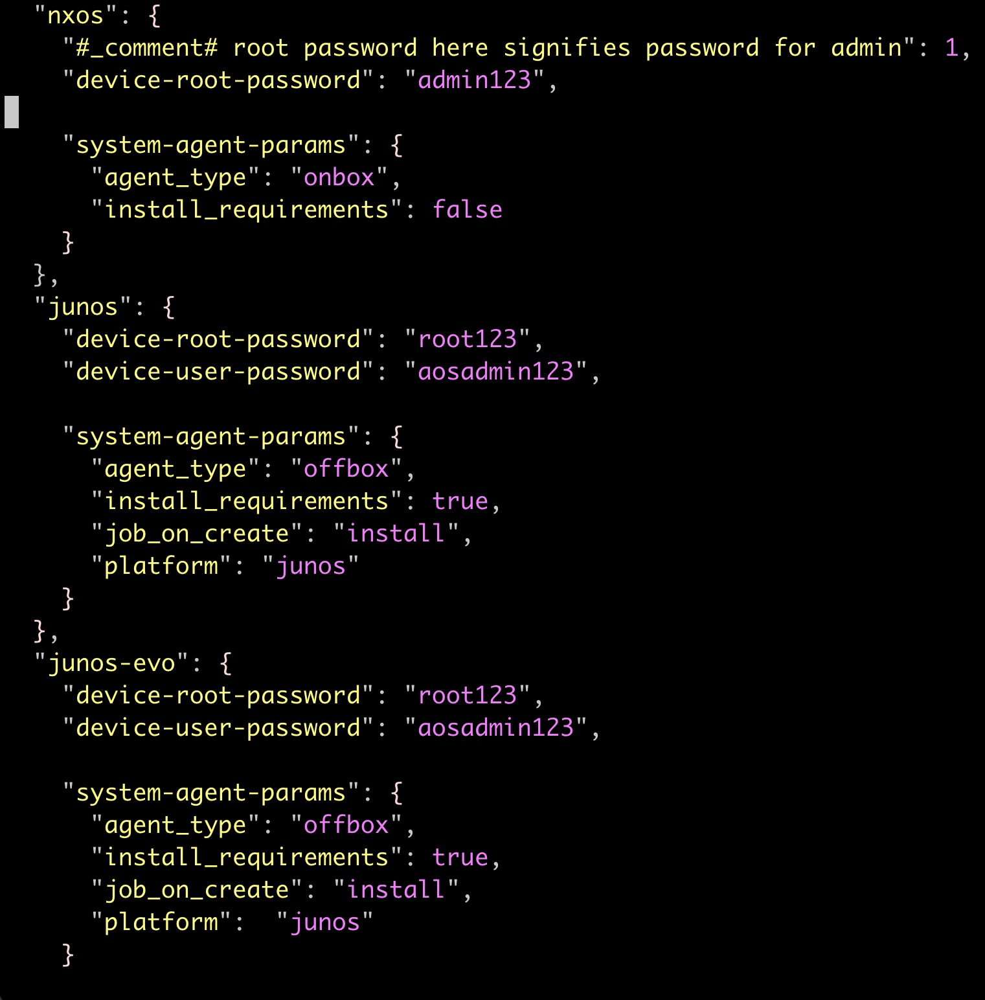
    After
    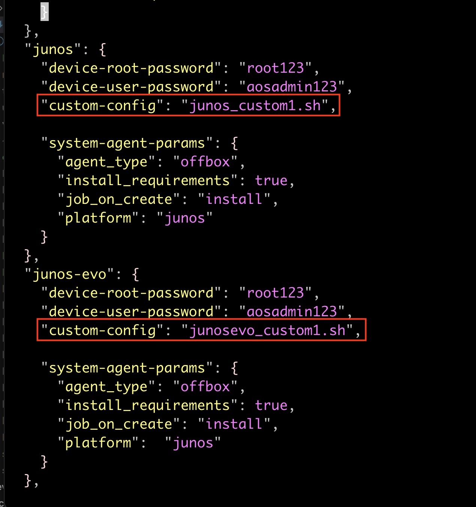

13. Save file **/containers_data/tftp/ztp.json**
14. Copy file **/containers_data/tftp/ztp.py** to **/containers_data/tftp/ztp_py3.py**
15. Edit file **/containers_data/tftp/ztp_py3.py**, to change the reference from python to python3. This is required if the lab is using devices with Junos EVO (ACX7100, PTX10001, vJunosEvolved)  with version 23.2 or later. On Junos EVO 23.2 and later, python version 2 has been removed, and only python3 is available.
16. The following script can be used to edit file **/containers_data/tftp/ztp_py3**

        sudo -s
        cd /containers_data/tftp
        cp ztp.py ztp_py3.py
        sed -i 's/\/bin\/python/\/bin\/python3/' ztp_py3.py
        sed -i 's/ztp.py/ztp_py3.py/g' ztp_py3.py
        ./poap-md5sum ztp_py3.py
        ls -la

17. Edit file **/containers_data/dhcp/dhcpd.conf**
    - remove entries between line with "Step 2" and "Step3"
    - replace the the default domain name
    - change the entry for the dns server, to the real DNS server, for example 8.8.8.8 and 8.8.4.4
    - for entry **class "juniper-evo"**, change **option JUNIPER.config-file-name** from **ztp.py** to **ztp_py3.py**

18. The following script can be used to edit file **/containers_data/dhcp/dhcpd.conf**

        cp /containers_data/dhcp/dhcpd.conf /home/admin/dhcpd.conf
        line1=`grep -n "Step 2"  /containers_data/dhcp/dhcpd.conf | cut -f 1 -d ":"`
        line1=`expr $line1 + 1`
        line2=`grep -n "Step3"  /containers_data/dhcp/dhcpd.conf | cut -f 1 -d ":"`
        line2=`expr $line2 - 1`
        sed -i -e "${line1},${line2}d" /containers_data/dhcp/dhcpd.conf
        sed -i -e 's/dc1.yourdatacenter.com/vmmlab.juniper.net/' /containers_data/dhcp/dhcpd.conf
        sed -i -e 's/10.1.2.13, 10.1.2.14/8.8.8.8,8.8.4.4/' /containers_data/dhcp/dhcpd.conf
        line1=`grep -n "JUNIPER.config-file-name" /containers_data/dhcp/dhcpd.conf | grep ztp.py | cut -f 1 -d ":"`
        sed -i -e "${line1}s/ztp/ztp_py3/" /containers_data/dhcp/dhcpd.conf

19. Create file ztp_config.txt,  where it has ip pool for network devices in DC1 (172.16.11.0/24), DC2 (172.16.12.0/24), DC3 (172.16.13.0/24), and fixed address for each device on every site. 

    This [file](ztp_config.txt), can be used as reference, and change the **hardware ethernet** address to the mac address of every devices of the DC fabric in the lab.

20. Upload file ztp_config.txt into node **ZTP**, and add it into file /containers/dhcp/dhcpd.conf

        cat ~/ztp_config.txt | sudo tee -a  /containers_data/dhcp/dhcpd.conf

21. Restart container **tftp** and **dhcpd**, and verify its status

       docker restart tftp
       docker restart dhcpd
       docker logs tftp
       docker logs dhcpd

22. Verify that node PE1, PE2, PE3, PE4, and P1 are properly configured to allow DHCP requests from site1, site2, and site3 are forwarded to ZTP server which is connected to PE4

23. On Juniper Apstra Dashboard, click **Devices** > **ZTP status** > **Devices** to verify that network devices in the lab have received ip address from the ZTP server and start the ZTP proccess. Wait until all devices  (20 devices) have completed the ZTP proccess.

    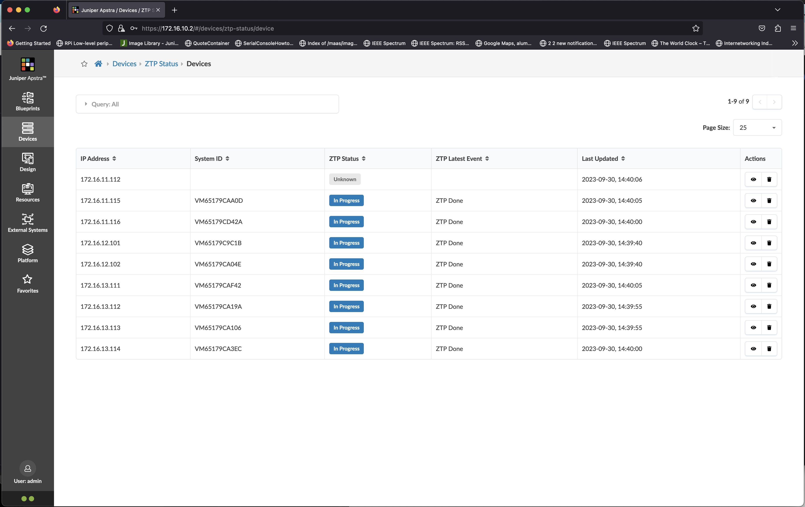
    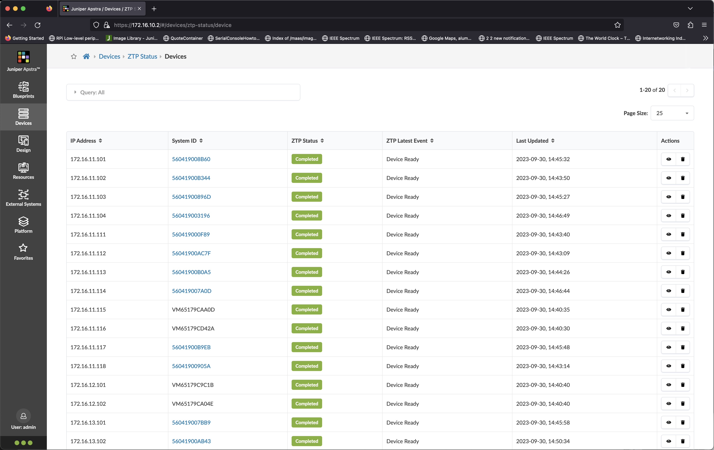

24. On Juniper Apstra Dashboard, click **Devices** > **Managed Devices**, select all devices and click **acknowledge**

    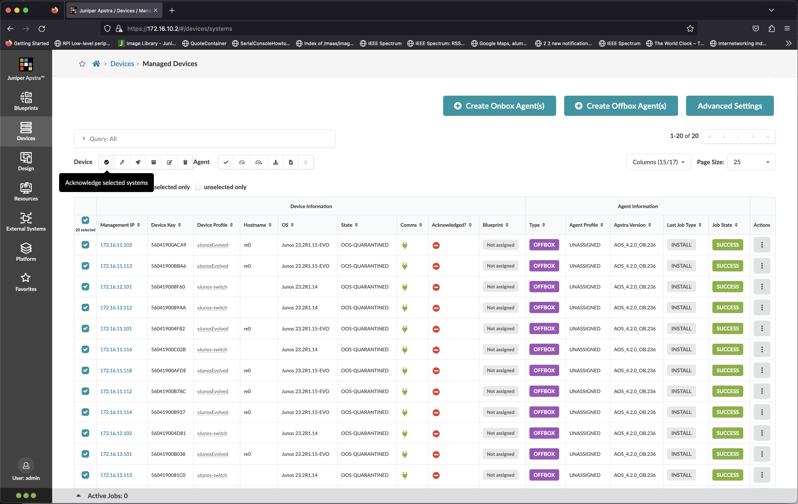
    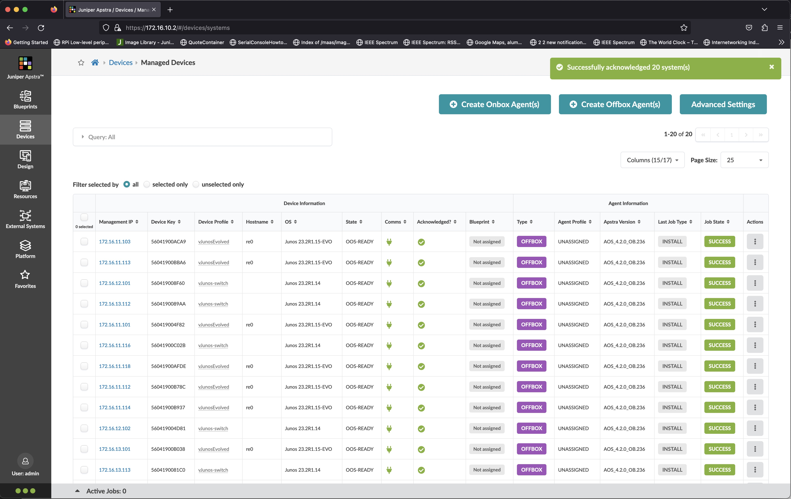

## Create new Device profiles

In this lab exercise, there are two network devices, vJunos-Switch and vJunosEvolved.

On Apstra 4.2.0, device profile vJunos-Switch has 96x1Gbps ports on the panel, and device profile vJunosEvolved has 24 x 400Gbps/120x10Gbps ports.

In this lab exercise, the datacenter devices will not have more than 10 ports, therefore new device profile with 10x10Gbps ports will be created.

1. On Juniper Apstra Dashboard, click **Devices** > **Device profiles**, and click **Query All**

2. Search for Name "vJunos", and click **Apply**, then two device profiles will be found.

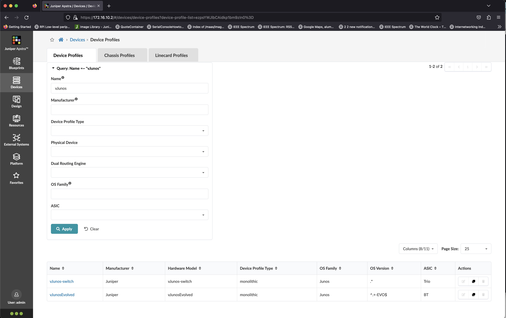
3. Click clone on **vJunos-switch**. 

4. Set new name to **vJunos-switch 10 Port**

5. Click on Ports, and delete the existing panel

6. Click add Panel, and set number of port to 10

7. Select all port (port 1 to port 10)

8. Click **-** on Display ID, so display ID changed from **1-10** to **0-9**

9. Set connector type to SFP+

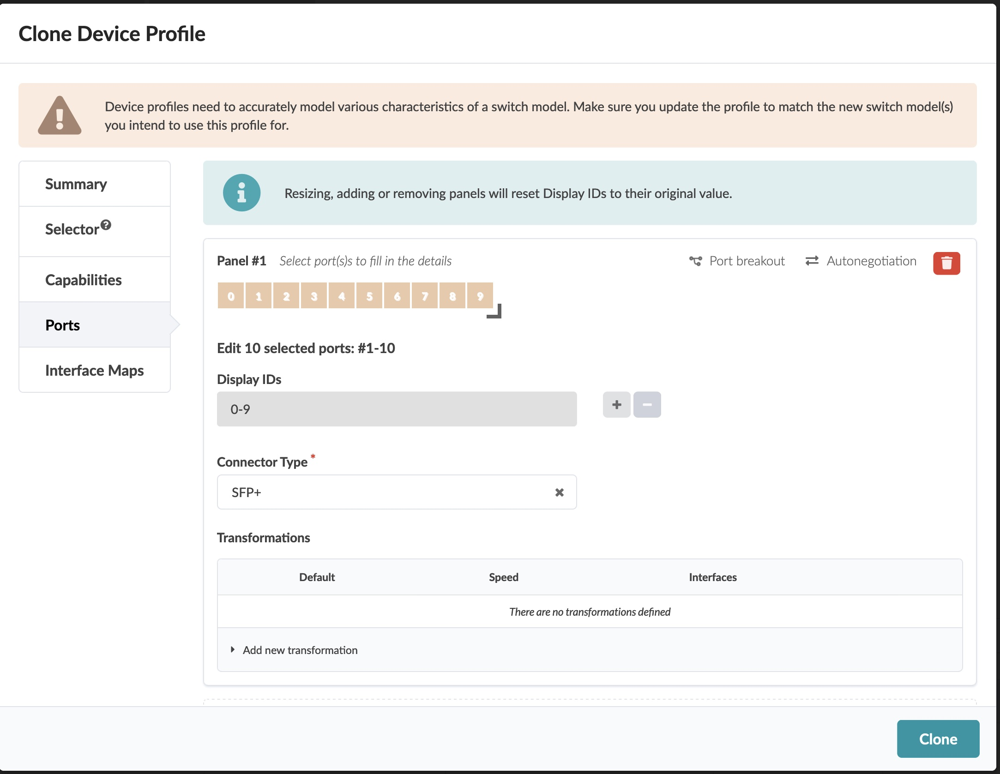

10. Click **add new transformation**, set speed to 10Gbps, and change **Name Template** to **ge-0/0/<display_id>**, and click button **Add Transformation**

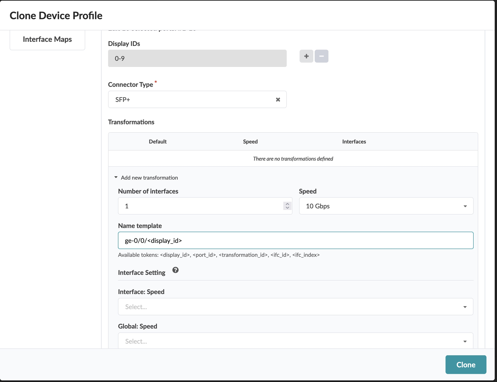
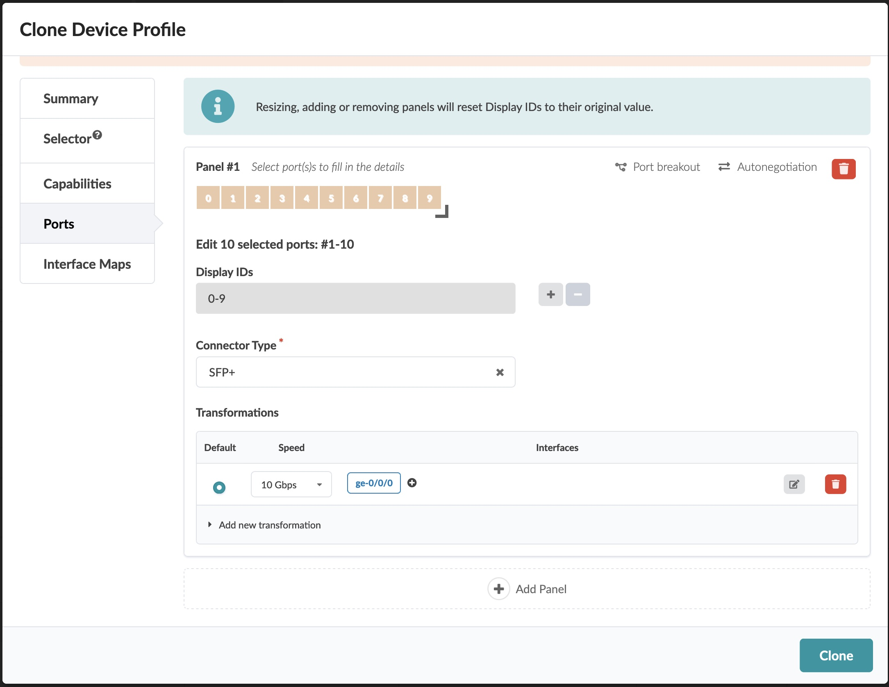

10. Click button **Clone** to save the new device profile

11. On Juniper Apstra Dashboard, click **Devices** > **Device profiles**, and click **Query All**

12. Search for Name "vJunos", and click **Apply, then three device profiles will be found.

13. Click clone on **vJunosEvolved**. 

15. Set new name to **vJunosEvolved 10 Port**

16. Click on Ports, and delete the existing panel

17. Click add Panel, and set number of port to 10

18. Select all port (port 1 to port 10)

19. Click **-** on Display ID, so display ID changed from **1-10** to **0-9**

20. Set connector type to SFP+

21. Click **add new transformation**, set speed to 10Gbps, and change **Name Template** to **et-0/0/<display_id>**, and click button **Add Transformation**

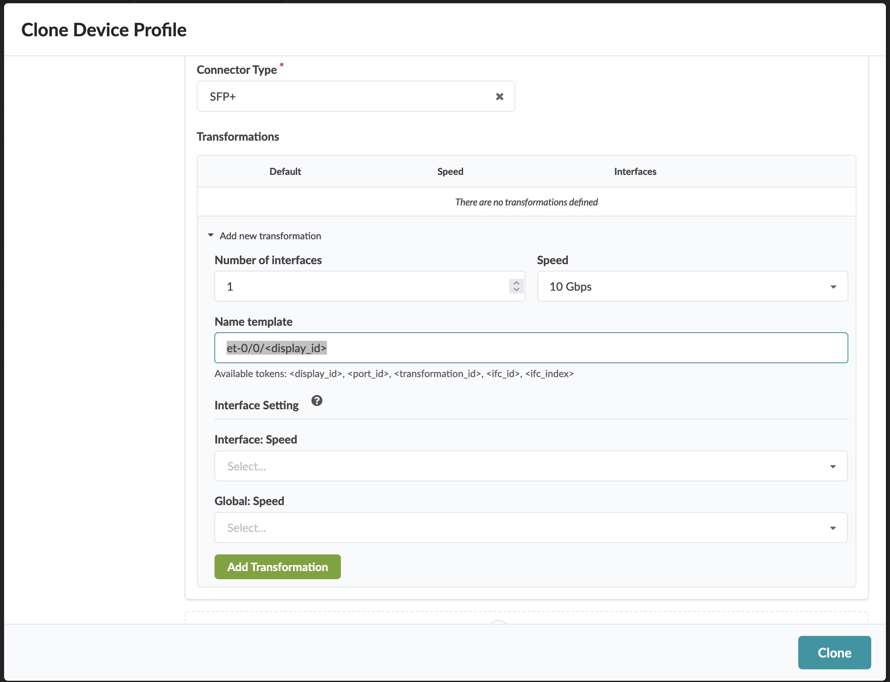

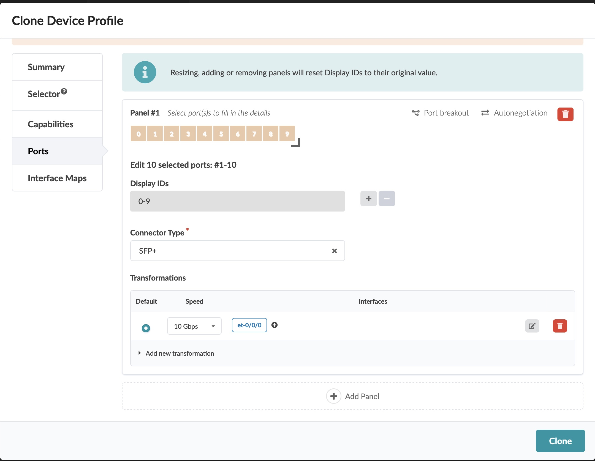

22. Click button **Clone** to save the new device profile

23. Verify that two devices profiles has been created

## Assign devices with new device profiles
1. On Junipr Apstra Dashboard, click **Devices** > **Managed Devices**

2. Select all devices with vJunos-switch device profile, click **update user config** and set device profile to **vJunos-Switch 10 ports"

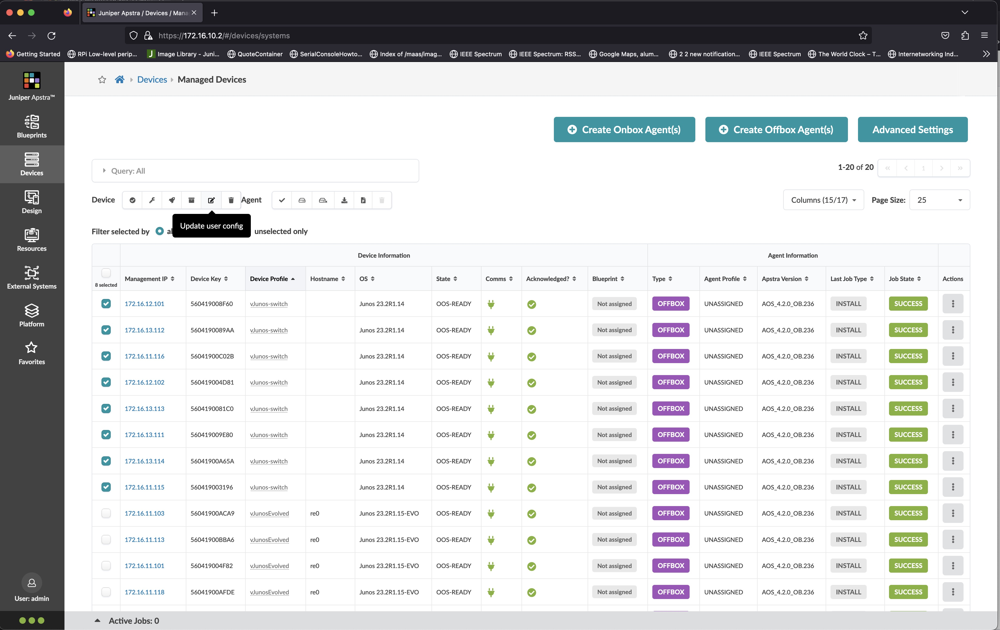
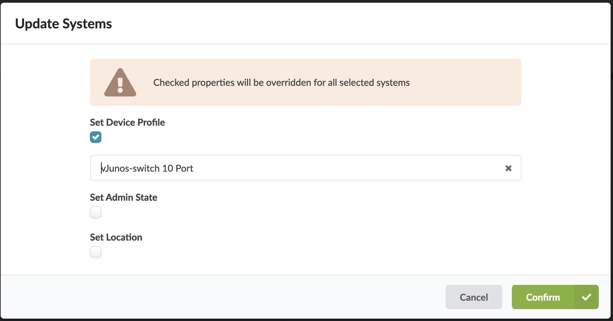

3. Select all devices with vJunosEvolved device profile, click **update user config** and set device profile to **vJunosEvolved 10 ports"

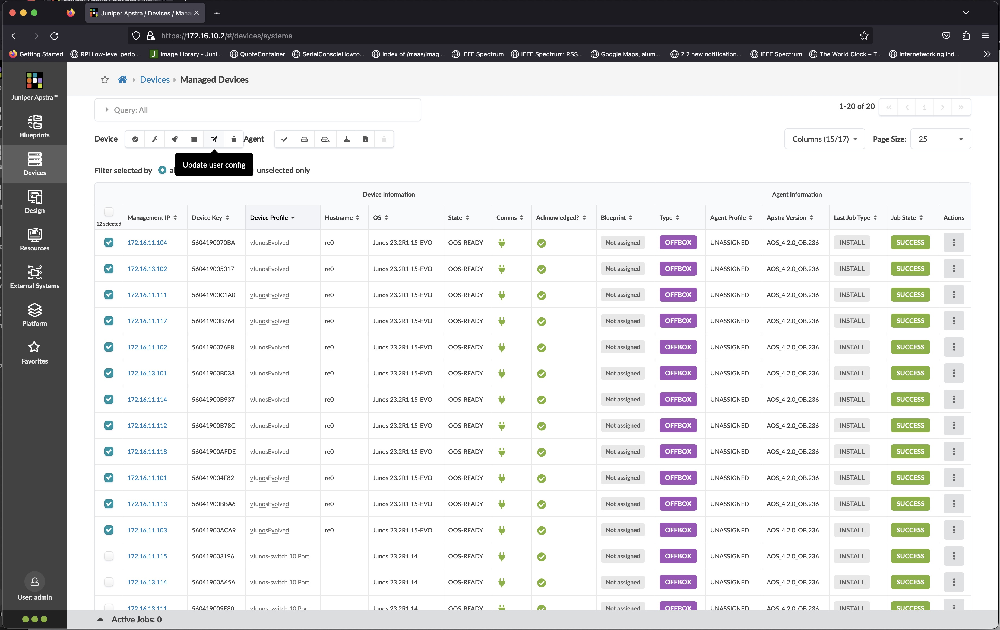
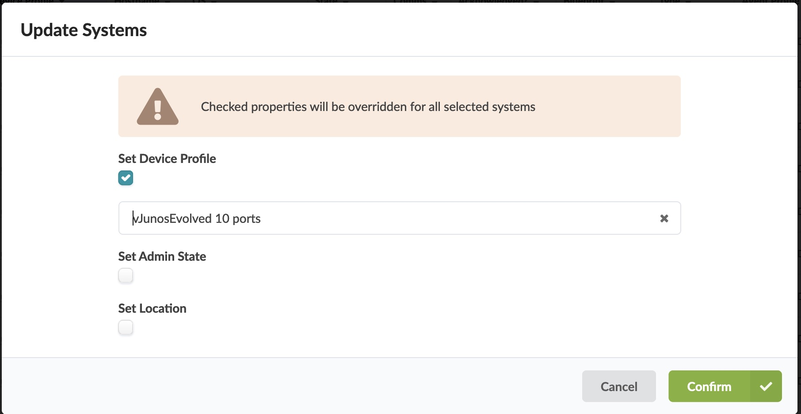
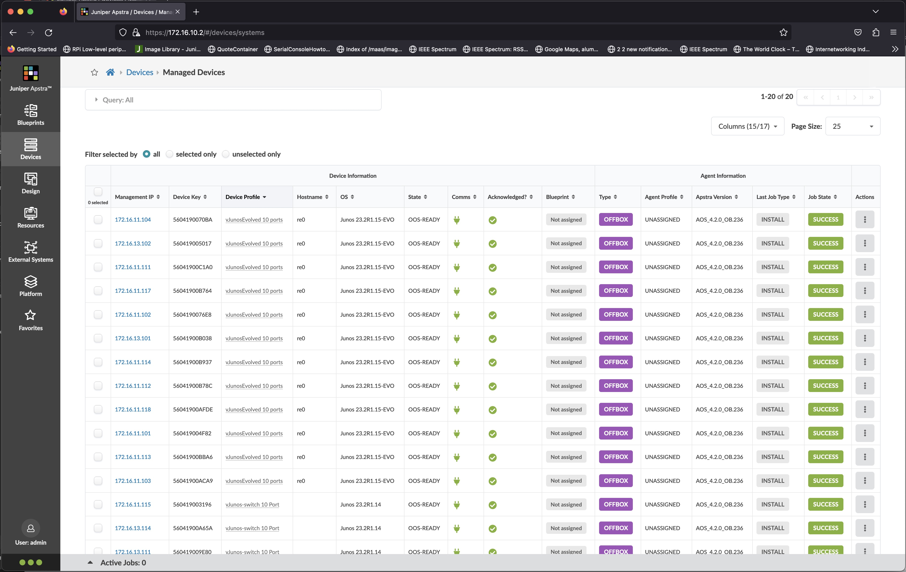

Go to the next [Lab exercise](lab2.md)

or 

Return to [Main Menu](README.md)
