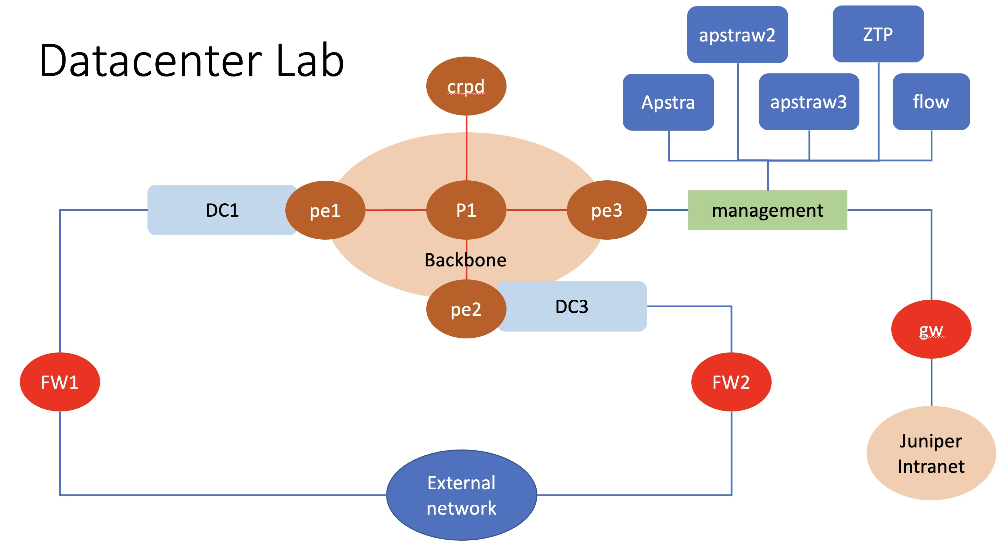
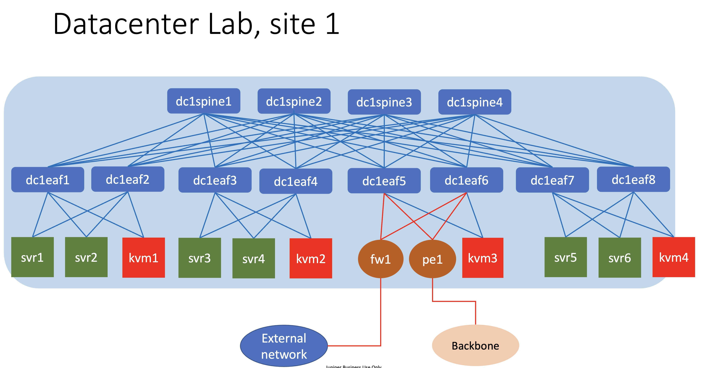
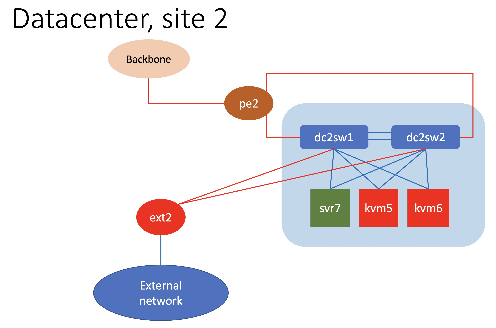
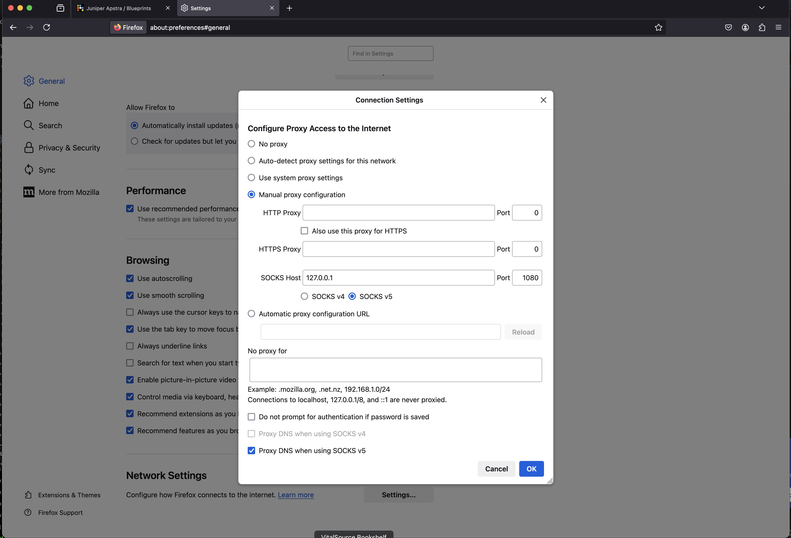
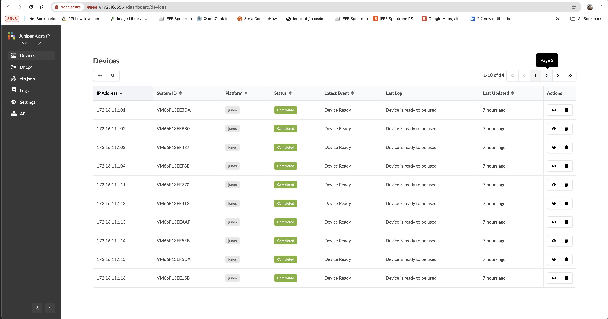
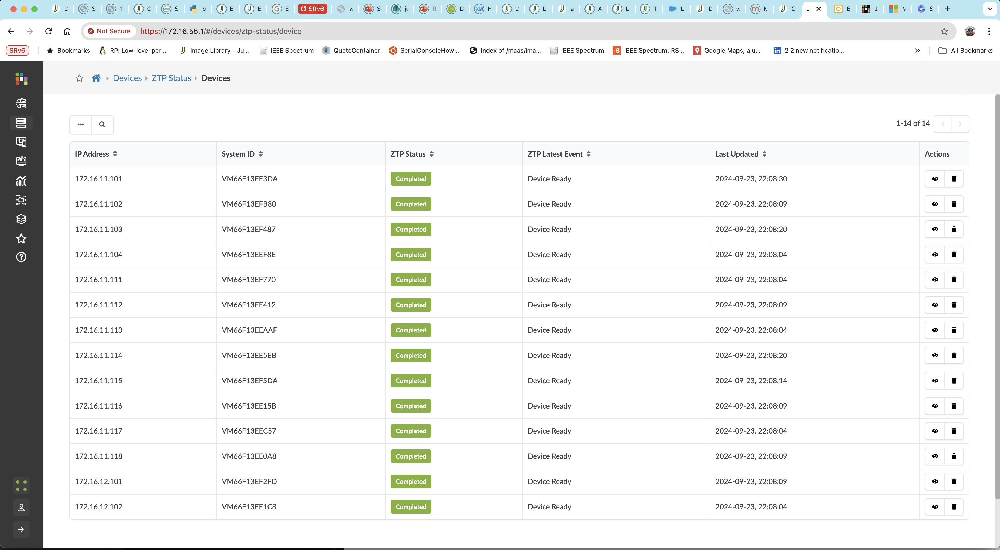

# Running Juniper Apstra 5.0 and vJunosSwitch
this script is to run Juniper Apstra 5.0, Apstra ZTP server and vJunosSwitch (24.2R1.17) on juniper's VMM

## Topology
The logical topology of the testbed is as follows :

### DC1

### DC2

## Devices in the lab

- DC1:
    - spine : Spine1, Spine2, spine3, spine4 (vJunosSwitch)
    - leaf : leaf1, leaf2, leaf3, leaf4, leaf5, leaf6, leaf7, leaf8 (vJunosSwitch)
    - BMS : svr1, svr2, svr3, svr4, svr5, svr6,  (linux())
    - BMS with hypervisor (KVM) : kvm1, kvm2, kvm3, kvm4 (linux)
- DC2
    - collapsed switches: sw1, sw2 (vJunosSwitch)
    - BMS : svr7 (linux)
    - BMS with hypervisor (KVM) :  kvm5, kvm6 (linux)
- External
    - fw1,fw2 : firewall (vSRX)
    - GW: Linux router that provide connection to internet
- IP/Wan Backbone :
    - Router : PE1, PE2, PE3, P1 (vJunosRouter ), RR (for route reflector)
- Apstra
    - Juniper Apstra 5.0
    - ZTP server 5.0
    - Flow server 5.0

## Credential to access devices
- Ubuntu linux
    - user: ubuntu
    - password: pass01
- Alpine linux
    - user: ubuntu
    - password: pass01
- vJunosRouter and vSRX
    - user: admin
    - password: admin
- vJunosSwitch
    - user: aosadmin
    - password: aosadmin123

# To create the lab topology and initial configuration of VMs
0. Video recording for this, can be found [here](https://junipernetworks-my.sharepoint.com/:v:/g/personal/irzan_juniper_net/ESQs9TVFPZBLjxMFxXi7VfwB94hHmZ8p1EViioVqnYw2-A?nav=eyJyZWZlcnJhbEluZm8iOnsicmVmZXJyYWxBcHAiOiJPbmVEcml2ZUZvckJ1c2luZXNzIiwicmVmZXJyYWxBcHBQbGF0Zm9ybSI6IldlYiIsInJlZmVycmFsTW9kZSI6InZpZXciLCJyZWZlcnJhbFZpZXciOiJNeUZpbGVzTGlua0NvcHkifX0&e=BGtJJQ)
1. Go to directory [dc_with_vjunos](./)
2. Edit file [lab.yaml](./lab.yaml). Set the following parameters to choose which vmm server that you are going to use and the login credential:
    - vmmserver 
    - jumpserver
    - user 
    - adpassword
    - ssh_key_name ( please select the ssh key that you want to use, if you don't have it, create one using ssh-keygen and put it under directory **~/.ssh/** on your workstation )
3. If you want to add devices or change the topooogy of the lab, then edit file [lab.yaml](lab.yaml)
4. use [vmm.py](../../vmm.py) script to deploy the topology into the VMM. Run the following command from terminal

        ../../vmm.py upload  <-- to create the topology file and the configuration for the VMs and upload them into vmm server
        ../../vmm.py start   <-- to start the topology in the vmm server

5. Verify that you can access node **gw** using ssh (username: ubuntu,  password: pass01 ). You may have to wait for few minutes for node **gw** to be up and running
6. Run script [vmm.py](../../vmm.py) to send and run initial configuration on node **gw**

        ../../vmm.py set_gw

7. Run script [vmm.py](../../vmm.py) to send and run initial configuration on linux nodes. This script will also reboot the VM. So wait before you test connectivity into the VM

        ../../vmm.py set_host

9. Run script [vmm.py](../../vmm.py) to create wireguard configuration

        ../../vmm.py get_wg_config

10. Upload file tmp/wg0_gw.conf into node **gw**, copy it into wireguard directory, and start the wireguard service

        scp tmp/wg0_gw.conf gw:~/wg0.conf
        ssh gw
        sudo cp wg0.conf /etc/wireguard/
        sudo systemctl enable wg-quick@wg0
        sudo systemctl start wg-quick@wg0

11. On your workstation, copy file tmp/wg0_ws.conf into your local wireguard directory, start wireguard, and test connectivity to the lab

        cp tmp/wg0_ws.conf /usr/local/etc/wireguard/wg0.dc.conf
        sudo wg-quick up wg0.dc
        ssh ubuntu@192.168.199.0
        ping 172.16.55.254

12. run the ansible playbook [update_system.yaml](config/linux_node/update_system.yaml) to update and install the necessary application on various nodes in the lab (kvm1, kvm2, kvm3, kvm4, kvm5, kvm6, kvm7, rr)

        cd config/linux_node/
        ansible-playbook update_system.yaml

## Setup Juniper Apstra
0. Video recording for this, can be found [here](https://junipernetworks-my.sharepoint.com/:v:/g/personal/irzan_juniper_net/EW3d4O04toNPvnoLIz16mZoBPqU0Whh-Y-zoD3OTg2GaVQ?nav=eyJyZWZlcnJhbEluZm8iOnsicmVmZXJyYWxBcHAiOiJPbmVEcml2ZUZvckJ1c2luZXNzIiwicmVmZXJyYWxBcHBQbGF0Zm9ybSI6IldlYiIsInJlZmVycmFsTW9kZSI6InZpZXciLCJyZWZlcnJhbFZpZXciOiJNeUZpbGVzTGlua0NvcHkifX0&e=2E6jU4)
1. In this lab, there are 5 apstra nodes, 1 x Apstra controller, 2 x Apstra worker node, 1 x Apstra ZTP and 1 x Apstra flow.
2. These are the ip address for Apstra nodes

    node | IP address| gateway| DNS
    -|-|-|-
    apstra| 172.16.55.1/24|172.16.55.254|10.49.32.95,10.49.32.97
    apstraw2|172.16.55.2/24|172.16.55.254|10.49.32.95,10.49.32.97
    apstraw3|172.16.55.3/24|172.16.55.254|10.49.32.95,10.49.32.97
    ztp| 172.16.55.4/24|172.16.55.254|10.49.32.95,10.49.32.97
    flow| 172.16.55.5/24|172.16.55.254|10.49.32.95,10.49.32.97

3. To setup those apstra node, use serial console of the VM
4. to open console of VM of juniper Apstra. Open ssh session into node vmm, and run command **vmm serial -t apstra** (this is for controller node)

        ssh vmm
        vmm serial -t apstra

5. Open session session into node apstra, and start the initial configuration, such as changing login password and set ip address to static
6. Repeat the process for node apstraw2, apstraw3, ztp and flow
7. Open ssh session into node gw, and test connectivity to the apstra node

        ssh gw
        ping 172.16.55.1
        ssh admin@172.16.55.1
8. Or if wireguard session has been established, test connectivity directly with the apstra nodes from your workstation

        ping 172.16.55.1
        ssh admin@172.16.55.1

## Accesing Apstra Web UI
there are three options to access Web UI of AOS.
1. Using wireguard VPN
2. using sock proxy with SSH dynamic forwarding
3. Using ssh forwarding

## Accessing Apstra Web UI using wireguard VPN
1. on your workstation, install wireguard vpn 

        brew install wireguard-go

2. If wireguard configuration has not been created, then create it using vmm.py script

        ../../vmm.py create_wg_config

3. it will create to configuration file, tmp/wg0_ws.conf which is the wireguard configuration for your workstation, and tmp/wg0_gw.conf, which is the wireguard configuration for node gw

4. upload file tmp/wg0_gw.conf into node gw, put it into file /etc/wireguard/wg0.conf, and start wireguard services

        scp tmp/wg0_gw.conf gw:~/
        ssh gw "sudo cp ~/wg0_gw.conf /etc/wireguard/wg0.conf"
        ssh gw "sudo wg-quick up wg0"

5. copy file tmp/wg0_ws.conf into your workstation wireguard directory

        cp tmp/wg0_ws.conf /usr/local/etc/wireguard/wg0.conf
        sudo wg-quick up wg0

6. Verify that from your workstation you can access apstra controller

        ping 172.16.55.1
        curl -k https://172.16.55.1
        
7. open dashboard of apstra controller

## Accessing Apstra WEB UI using sock proxy with SSH dynamic forwarding
1. from your workstation, open ssh session to node **proxy** and keep the session open

        ssh proxy

2. Use firefox web browser, open setting configuration, and search for proxy configuration.
3. Under **Configure Proxy Access to the Internet**, and set to **Manual proxy configuratio**
4. under **SOCKS Host** set ip address to **127.0.0.1** and Port to **1080**, and clik **OK** to save it
5. on the URL bar, open access to apstra dashboard https://172.16.55.1

## Accessing Apstra WEB UI using ssh forwarding
1. open ssh session with forwarding to ip address of apstra server (172.16.10.2) and port 443

        ssh -L 9191:172.16.55.1:443 gw

2. from webbrowser on your workstation, open https session to https://127.0.0.1:9191

## Initial setup of Apstra 
1. login into web dashboard of Apstra server
2. Add license into Apstra
3. Add worker nodes into apstra controller. Video recording for cluster setup can be found [here](https://junipernetworks-my.sharepoint.com/:v:/g/personal/irzan_juniper_net/EW3d4O04toNPvnoLIz16mZoBPqU0Whh-Y-zoD3OTg2GaVQ?nav=eyJyZWZlcnJhbEluZm8iOnsicmVmZXJyYWxBcHAiOiJPbmVEcml2ZUZvckJ1c2luZXNzIiwicmVmZXJyYWxBcHBQbGF0Zm9ybSI6IldlYiIsInJlZmVycmFsTW9kZSI6InZpZXciLCJyZWZlcnJhbFZpZXciOiJNeUZpbGVzTGlua0NvcHkifX0&e=g8lcaM)
3. Add user for ZTP server. Video recording for ztp setup can be found [here](https://junipernetworks-my.sharepoint.com/:v:/g/personal/irzan_juniper_net/ETt7cxKXdOBDr6nh_lFij2gBRpWtU6_pmE7bR01NlzIZ4Q?nav=eyJyZWZlcnJhbEluZm8iOnsicmVmZXJyYWxBcHAiOiJPbmVEcml2ZUZvckJ1c2luZXNzIiwicmVmZXJyYWxBcHBQbGF0Zm9ybSI6IldlYiIsInJlZmVycmFsTW9kZSI6InZpZXciLCJyZWZlcnJhbFZpZXciOiJNeUZpbGVzTGlua0NvcHkifX0&e=lkxJsD)
    
        user: ztp
        global_roles: device_ztp

4. configure DHCP on ZTP server. 
5. Configure ztp.json  with the junos version and custom script
6. Under directory /containers_data/tftp/, create file junos_custom1.sh with the following content

       #!/bin/sh 
       cli -c "configure; set system commit synchronize; set chassis evpn-vxlan-default-switch-support; commit and-quit"
    
    or use the following script to create the file

       cat << EOF | sudo tee /containers_data/tftp/junos_custom1.sh
       #!/bin/sh 
       cli -c "configure; set system commit synchronize; set chassis evpn-vxlan-default-switch-support; commit and-quit"
       EOF
       sudo chmod +x /containers_data/tftp/junos_custom1.sh

    this step is required because vJunosSwitch is virtual junos with EX9214 personality, and Apstra assume that it has dual RE (routing engine). On vJunosSwitch, there is only one RE, therefore when apstra try to discover vJunosSwitch it will fail.

7. if vJunos Evolved is used, create the following custom script. Under directory /containers_data/tftp/, create file junosevo_custom1.sh with the following content

       #!/bin/sh 
       cli -c "configure; set forwarding-options tunnel-termination; commit and-quit"
    
    or the following script can be used to create the file

       cat << EOF | sudo tee /containers_data/tftp/junosevo_custom1.sh
       #!/bin/sh 
       cli -c "configure; set forwarding-options tunnel-termination; commit and-quit"
       EOF
       sudo chmod +x /containers_data/tftp/junosevo_custom1.sh

    this step is required to allow VxLAN termination works on vJunosEvo.

## Upload configuration into node PE1, PE2, PE3 and P1

1. router PE1, PE2, PE3, and P1 must be configured to allow ztp/dhcp traffic forwarded between DC1, DC2 and apstra management network.
2. To upload configuration, use ansible script [upload_config.yaml](config/router/upload_config.yaml)

        cd config/router
        ansible-playbook upload_config.yaml

3. Now routers are configured, and vJunosSwitch on DC1 and DC2 will go through the ZTP process.

4. on ZTP UI Dashboard, 

    

5. On Apstra UI Dashboard, go to **Devices**>**ZTP Status**>**Devices**, to verify that network devices (swithes) are discovered through ZTP

    

## Lab exercise

You can refer to [this document](LabExercise/README.md) for lab exercise

