# Running Juniper Apstra 4.1.2 and vJunosSwitch
this script is to run Juniper Apstra 4.1.2, Apstra ZTP server and vJunosSwitch (21.2R3-S1.7) on juniper's VMM

## Topology
The logical topology of the testbed is as follows :
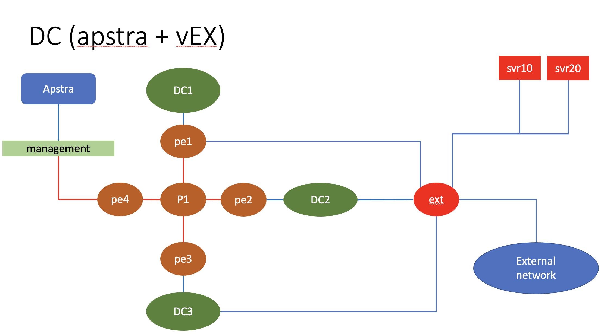

### DC1
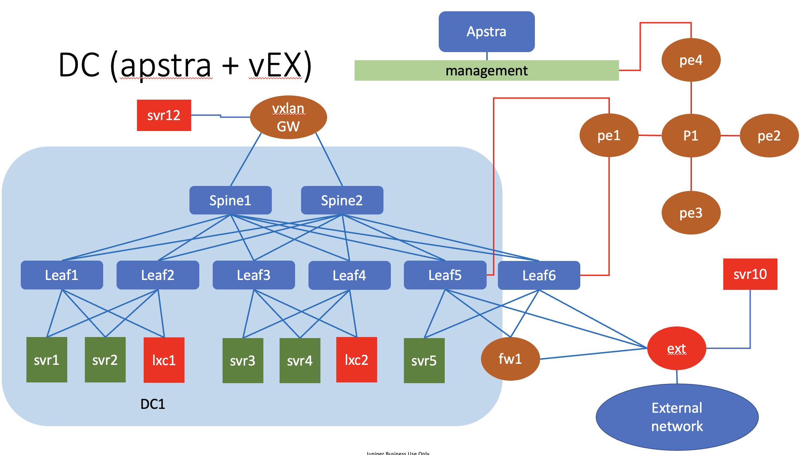

### DC2
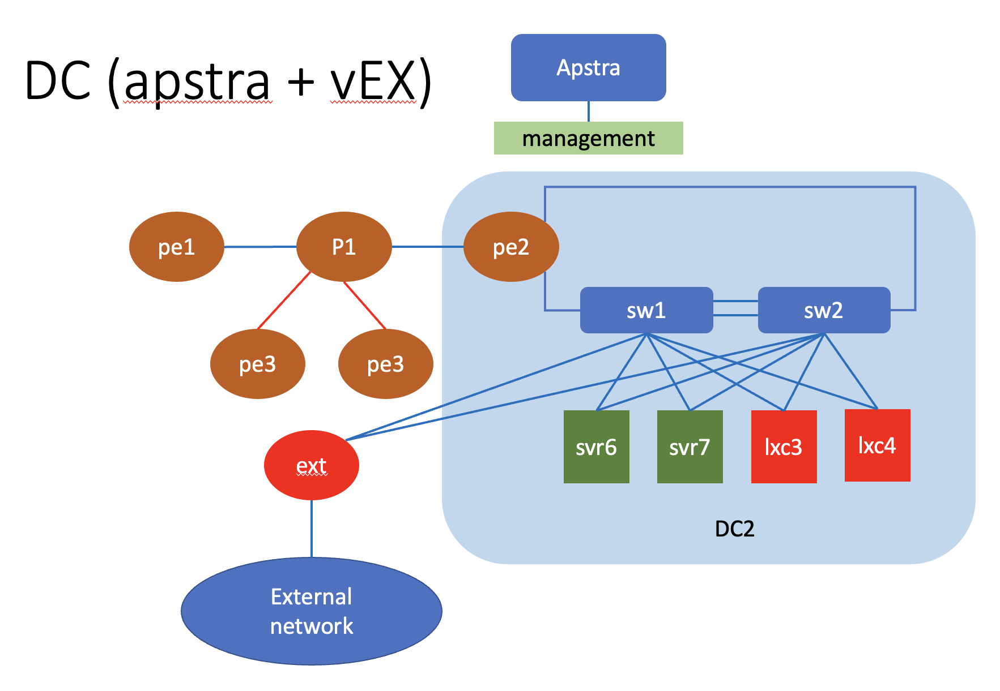

### DC3
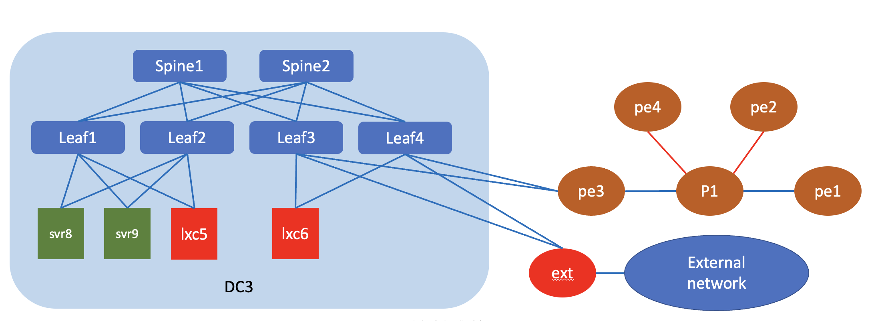

## Devices in the lab

- DC1:
    - spine : Spine1, Spine2 (vJunosSwitch)
    - leaf : leaf1, leaf2, leaf3, leaf4, leaf5, leaf6 (vJunosSwitch)
    - BMS : svr1, svr2, svr3, svr4,  (linux())
    - BMS with hypervisor (KVM) : svr5, lxc1, lxc2 (linux)
- DC2
    - collapsed switches: sw1, sw2 (vJunosSwitch)
    - BMS : svr6, svr7 (linux)
    - BMS with hypervisor (KVM) :  lxc3, lxc4 (linux)
- DC3:
    - spine : Spine1, Spine2 (vJunosSwitch)
    - leaf : leaf1, leaf2, leaf3, leaf4 (vJunosSwitch)
    - BMS : svr8, svr9 (linux())
    - BMS with hypervisor (KVM) : lxc5, lxc6 (linux)
- External
    - ext : external router (VMX)
    - fw1 : firewall (vSRX)
    - BMS : svr10, srv20 ,  (linux)
    - GW: Linux router that provide connection to internet
    - vxlangw   
- IP/Wan Backbone :
    - Router : PE1, PE2, P1 (vJunosRouter )
- Apstra
    - Juniper Apstra 4.2.2
    - ZTP server 4.2.2
## Device Connectivity

## Credential to access devices
- Ubuntu linux
    - user: ubuntu
    - password: pass01
- Alpine linux
    - user: ubuntu
    - password: pass01
- vJunosRouter and vSRX
    - user: admin
    - password: admin
- vJunosSwitch
    - user: aosadmin
    - password: aosadmin123

# To create the lab topology and initial configuration of VMs
1. Go to directory [dc_with_vjunos](./)
2. Edit file [lab.yaml](./lab.yaml). Set the following parameters to choose which vmm server that you are going to use and the login credential:
    - vmmserver 
    - jumpserver
    - user 
    - adpassword
    - ssh_key_name ( please select the ssh key that you want to use, if you don't have it, create one using ssh-keygen and put it under directory **~/.ssh/** on your workstation )
3. If you want to add devices or change the topooogy of the lab, then edit file [lab.yaml](lab.yaml)
4. use [vmm.py](../../vmm.py) script to deploy the topology into the VMM. Run the following command from terminal

        ../../vmm.py upload  <-- to create the topology file and the configuration for the VMs and upload them into vmm server
        ../../vmm.py start   <-- to start the topology in the vmm server

5. Verify that you can access node **gw** using ssh (username: ubuntu,  password: pass01 ). You may have to wait for few minutes for node **gw** to be up and running
6. Run script [vmm.py](../../vmm.py) to send and run initial configuration on node **gw**

        ../../vmm.py set_gw

7. Run script [vmm.py](../../vmm.py) to send and run initial configuration on linux nodes. This script will also reboot the VM. So wait before you test connectivity into the VM

        ../../vmm.py set_host

8. Run script [vmm.py](../../vmm.py) to create ztp configuration for the ZTP server. Then later upload the ztp configuration file (./tmp/ztp_config.txt) into ztp server

        ../../vmm.py get_ztp_config

8. Run script [vmm.py](../../vmm.py) to create wireguard configuration

        ../../vmm.py get_wg_config

## Setup Juniper Apstra
1. Open console of VM of juniper Apstra. Open ssh session into node vmm, and run command **vmm serial -t apstra**

        ssh vmm
        vmm serial -t apstra

2. Login into AOS using the default username/password : admin/admin, and change the default password
 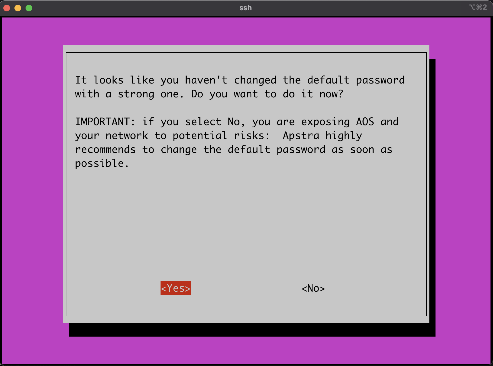

5. Currently node **apstra** is configured with dhcp for Ip address assignment. If you want change the ip address to static, change it to the following:
    - ip address : 172.16.10.2/24
    - gateway : 172.16.10.1
    - dns : 10.49.32.95, 10.49.32.97

6. Restart AOS services
7. Enter the command line of apstra server
8. on the home directory /home/admin, create directory .ssh

        mkdir /home/admin/.ssh

9. from node **gw (ip 172.16.10.1)**, copy directory /home/ubuntu/.ssh into /home/admin/.ssh on node **apstra**. username/password to access 172.16.10.1 is ubuntu/pass01

        scp ubuntu@172.16.10.1:~/.ssh/* ~/.ssh/

## Accesing Apstra Web UI
there are three options to access Web UI of AOS.
1. Using wireguard VPN
2. using sock proxy with SSH dynamic forwarding
3. Using ssh forwarding

## Accessing Apstra Web UI using wireguard VPN
1. on your workstation, install wiregauard vpn 

        brew install wireguard-go

2. If wireguard configuration has not been created, then create it using vmm.py script

        ../../vmm.py create_wg_config

3. it will create to configuration file, tmp/wg0_ws.conf which is the wireguard configuration for your workstation, and tmp/wg0_gw.conf, which is the wireguard configuration for node gw

4. upload file tmp/wg0_gw.conf into node gw, put it into file /etc/wireguard/wg0.conf, and start wireguard services

        scp tmp/wg0_gw.conf gw:~/
        ssh gw "sudo cp ~/wg0_gw.conf /etc/wireguard/wg0.conf"
        ssh gw "sudo wg-quick up wg0"

5. copy file tmp/wg0_ws.conf into your workstation wireguard directory

        cp tmp/wg0_ws.conf /usr/local/etc/wireguard/wg0.conf
        sudo wg-quick up wg0

6. Verify that from your workstation you can access apstra controller

        ping 172.16.10.2
        curl -k https://172.16.10.2
        
7. open dashboard of apstra controller

## Accessing Apstra WEB UI using sock proxy with SSH dynamic forwarding
1. from your workstation, open ssh session to node **proxy** and keep the session open

        ssh proxy

2. Use firefox web browser, open setting configuration, and search for proxy configuration.
3. Under **Configure Proxy Access to the Internet**, and set to **Manual proxy configuratio**
4. under **SOCKS Host** set ip address to **127.0.0.1** and Port to **1080**, and clik **OK** to save it
5. on the URL bar, open access to apstra dashboard https://172.16.10.2

## Accessing Apstra WEB UI using ssh forwarding
1. open ssh session with forwarding to ip address of apstra server (172.16.10.2) and port 443

        ssh -L 9191:172.16.10.2:443 gw

2. from webbrowser on your workstation, open https session to https://127.0.0.1:9191

## Setup of Apstra ZTP server
1. Open console of VM of Apstra ZTP. Open ssh session into node vmm, and run command **vmm serial -t ztp**

        ssh vmm
        vmm serial -t ztp
2. Login into AOS using the default username/password : admin/admin
3. Edit the network configuration of the VM, by editing file /etc/netplan/01-netcfg.yaml
4. Set the network configuration with the following parameter
    - ip address/netmask : 172.16.10.3/24
    - gateway : 172.16.10.1
    - DNS server: 66.129.233.81, 66.129.233.82

5. or make the content of file /etc/netplan/01-netcfg.yaml into the following

       cat << EOF  | sudo tee /etc/netplan/01-netcfg.yaml
       network:
           version: 2
           # renderer: networkd
           ethernets:
               eth0:
                   dhcp4: false
                   addresses: [ 172.16.10.3/24]
                   gateway4: 172.16.10.1
                   nameservers:
                       addresses: [ 8.8.8.8, 8.8.4.4 ]
       EOF

6. Apply network configuration using the following command

        ip addr show dev eth0
        sudo netplan apply
        ip addr show dev eth0

7. Verify that from node **ztp**, it can reach other node, such **gw**/172.16.10.1 and **apstra**/172.16.10.2

        ping 172.16.10.1
        ping 172.16.10.2

8. on the home directory /home/admin, create directory .ssh

        mkdir /home/admin/.ssh

9. from node **gw (ip 172.16.10.1)**, copy directory /home/ubuntu/.ssh into /home/admin/.ssh on node **aztp**

        on node ztp

        scp ubuntu@172.16.10.1:~/.ssh/* ~/.ssh/

10. On VM ZTP, edit file /containers_data/status/app/aos.conf

       sudo vi /containers_data/status/app/aos.conf

        or run the following

        cat << EOF | sudo tee /containers_data/status/app/aos.conf
        {
            "ip": "172.16.55.1",
            "user": "ztp",
            "password": "J4k4rt4#01"
        }
        EOF

11. Change the entries to the following:
    
        ip: 172.16.10.2          ## Ip address of apstra server
        user: ztp                ## ztp user that you have created on apstra server
        password: <password>     ## password that you set for user ztp   

    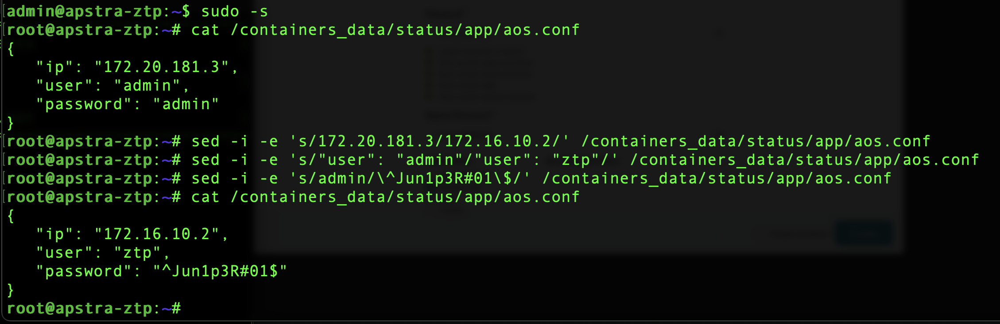 

12. Save the file.
13. Restart container **status**

        docker restart status

    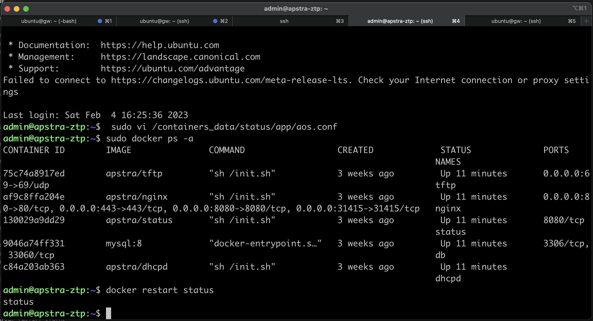

14. On Apstra dashbord, under **Devices** > **ZTP Status** > **Services**, verify that services are up and registered with Apstra server.

  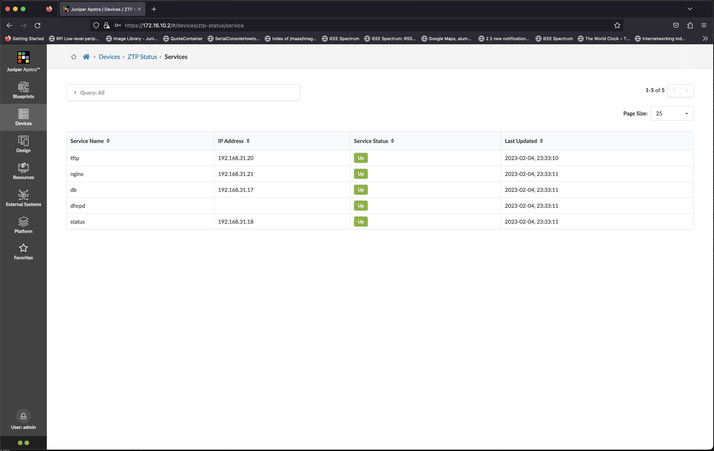

15. On node **ztp**, edit file /containers_data/tftp/ztp.json

        sudo vi /containers_data/tftp/ztp.json

16. for entry **junos-versions** add the current version of Junos being used in the lab, for example 21.2R3-S1.7

    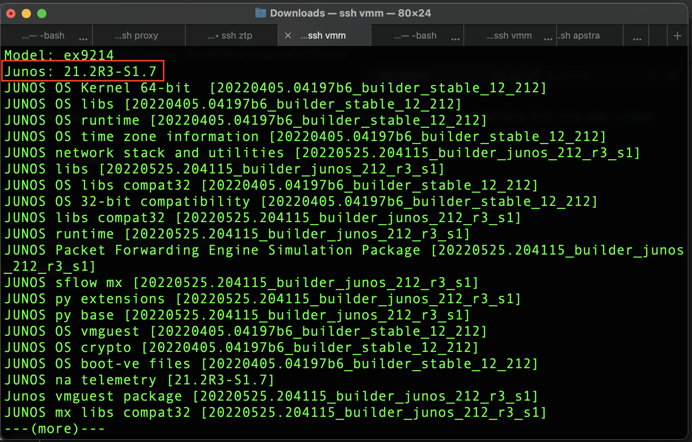
    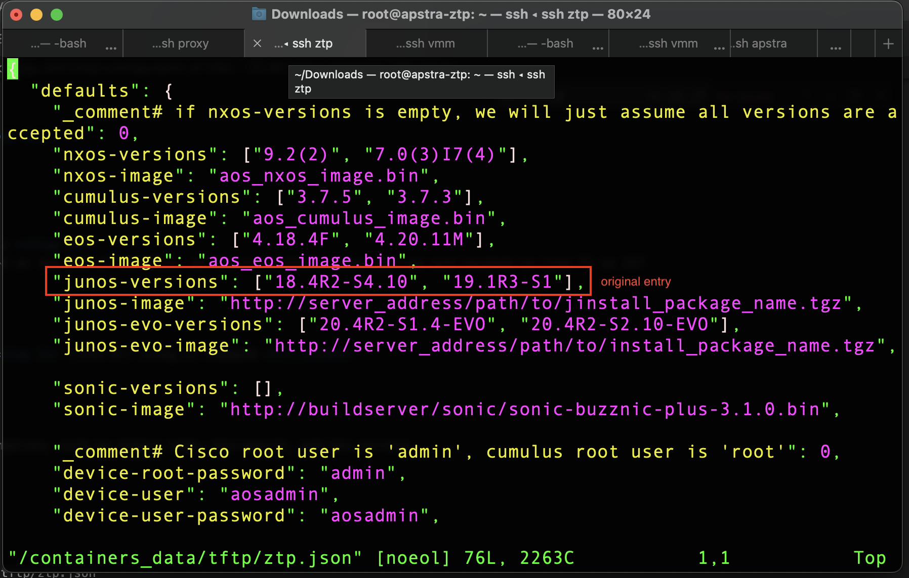
    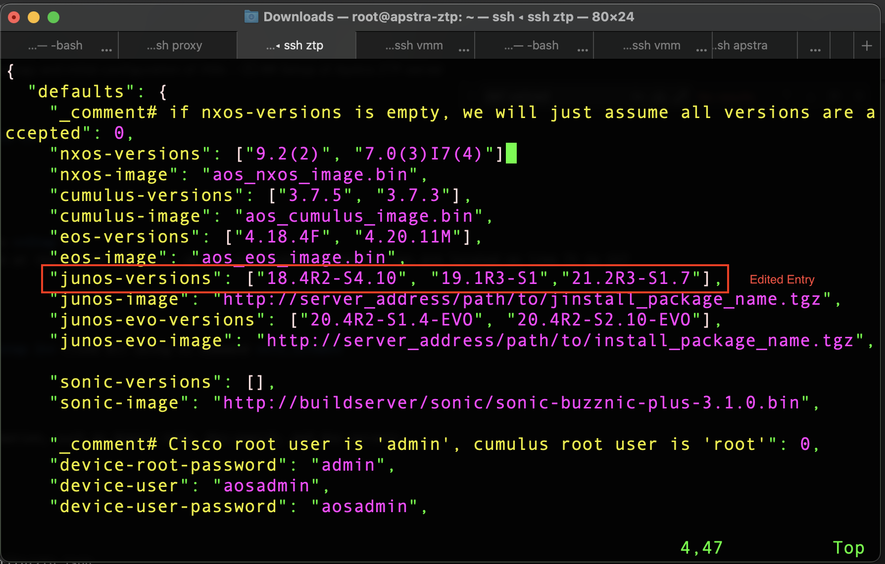

17. under key "junos" add another key "custom-config"

        "junos": {
            "device-root-password": "root123",
            "device-user-password": "aosadmin123",
            "custom-config": "junos_custom1.sh",
            
            ...
        }

    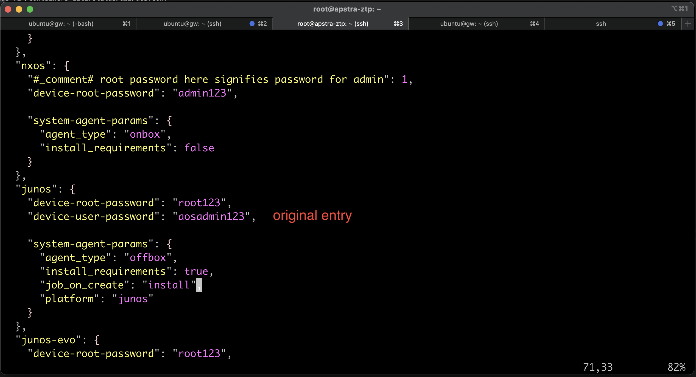
    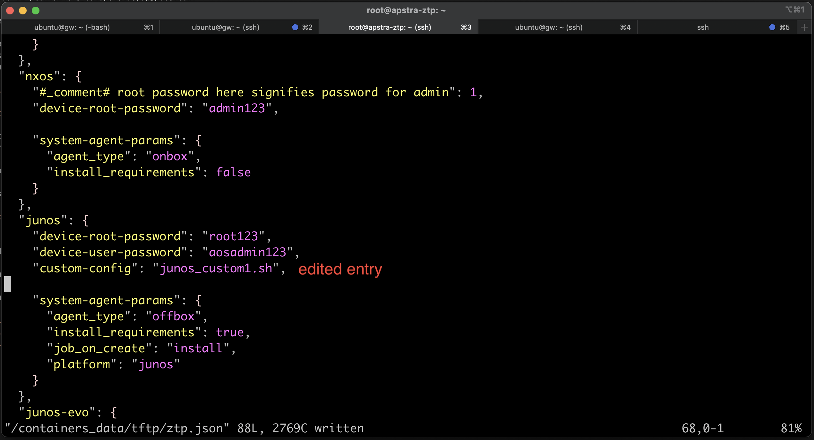

18. under key "junos-evo" add another key "custom-config"

        "junos": {
            "device-root-password": "root123",
            "device-user-password": "aosadmin123",
            "custom-config": "junosevo_custom1.sh",
            
            ...
        }

19. Save the file /containers_data/tftp/ztp.json
20. Under directory /containers_data/tftp/, create file junos_custom1.sh with the following content

        #!/bin/sh 
        cli -c "configure; set system commit synchronize; set chassis evpn-vxlan-default-switch-support; commit and-quit"
    
    or the following script can be used to create the file

        cat << EOF | sudo tee /containers_data/tftp/junos_custom1.sh
        #!/bin/sh 
        cli -c "configure; set system commit synchronize; set chassis evpn-vxlan-default-switch-support; commit and-quit"
        EOF

    this step is required because vJunosSwitch is virtual junos with EX9214 personality, and Apstra assume that it has dual RE (routing engine). On vJunosSwitch, there is only one RE, therefore when apstra try to discover vJunosSwitch it will fail.

21. Under directory /containers_data/tftp/, create file junosevo_custom1.sh with the following content

        #!/bin/sh 
        cli -c "configure; set forwarding-options tunnel-termination; commit and-quit"
    
    or the following script can be used to create the file

        cat << EOF | sudo tee /containers_data/tftp/junosevo_custom1.sh
        #!/bin/sh 
        cli -c "configure; set forwarding-options tunnel-termination; commit and-quit"
        EOF

    this step is required to allow VxLAN termination works on vJunosEvo.

20. Set file /containers_data/tftp/junos_custom1.sh and file /containers_data/tftp/junosevo_custom1.sh to be executable

        sudo chmod +x /containers_data/tftp/junos_custom1.sh
        sudo chmod +x /containers_data/tftp/junosevo_custom1.sh

21. copy file /containers_data/tftp/ztp.py to /containers_data/tftp/ztp_py3.py

        sudo cp /containers_data/tftp/ztp.py /containers_data/tftp/ztp_py3.py

22. edit file /containers_data/tftp/ztp_py3.py, and change entry with python to python3

        cd /containers_data/tftp
        sudo sed -i 's/\/bin\/python/\/bin\/python3/' ztp_py3.py
        sudo sed -i 's/ztp.py/ztp_py3.py/g' ztp_py3.py
        sudo ./poap-md5sum ztp_py3.py

23. Edit file /containers_data/dhcp/dhcpd.conf, and for Junos EVO, change the script from ztp.py to ztp_py3.py

21. Restart container **tftp**

        docker restart tftp

    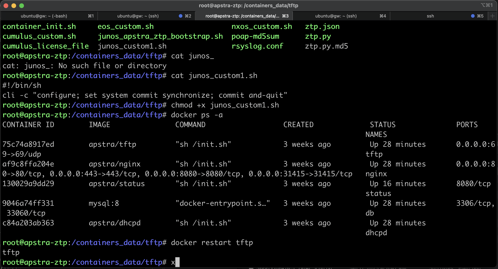
    

22. From your workstation, under directory [home directory]/git/vmm-v3-script/Lab/dc_with_vJunosSwitch/tmp, there is a file ztp_config.txt. Upload this file into node **ztp**. You may need to edit this file to include the subnet for ip pool.
    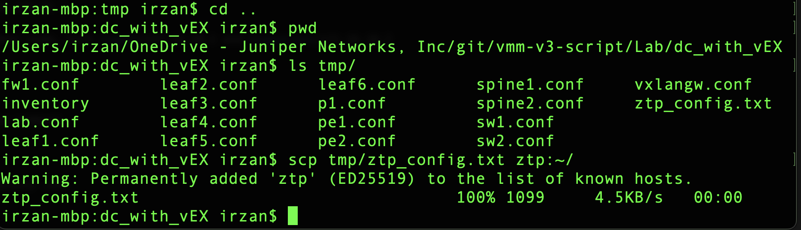

        scp tmp/ztp_config.txt ztp:~/

23. open ssh session into node **ztp**, enter admin mode, and change directory to /containers_data/dhcp

    ssh ztp
    sudo -s
    cd /containers_data/dhcp

24. add the content of file ~/ztp_config.txt into file /containers_data/dhcp/dhcpd.conf

        cat ~/ztp_config.txt | sudo tee -a  /containers_data/dhcp/dhcpd.conf

25. Edit file  /containers_data/dhcp/dhcpd.conf

        sudo vi  /containers_data/dhcp/dhcpd.conf

26. Edit section **Step 2**, delete stanza **group {}**

    
    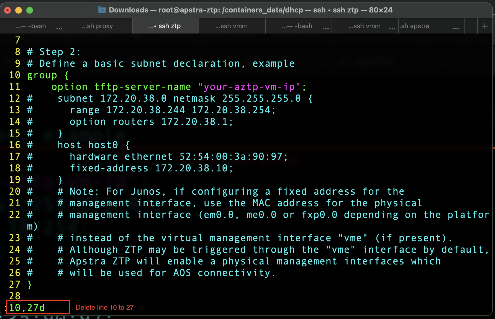
    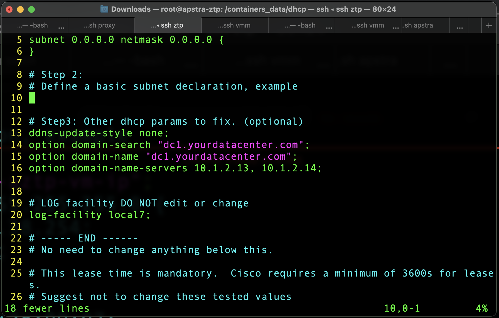

27. Under section **step 3**, edit the dns information, such as domain name, dns-search, and dns servers

    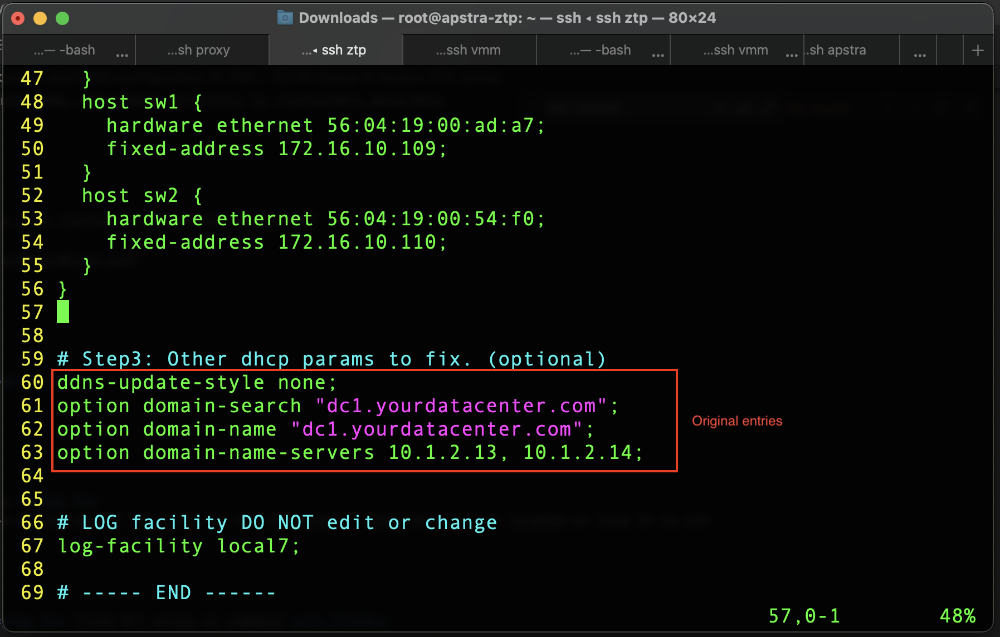
    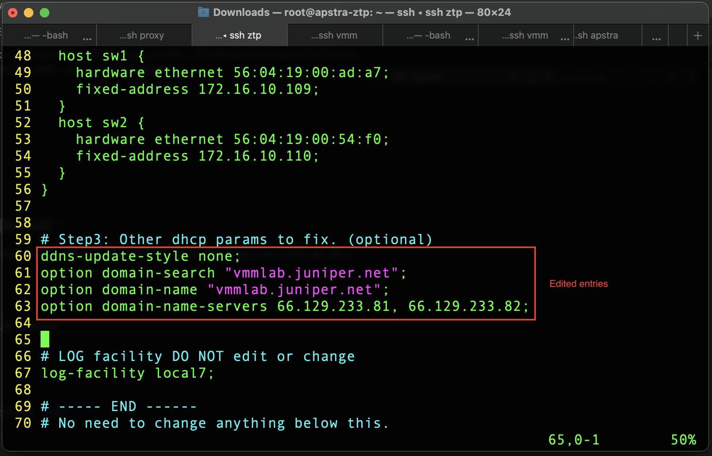

28. Save the file, ESC :wq!

29. Restart container **dhcp**

        docker restart dhcpd

    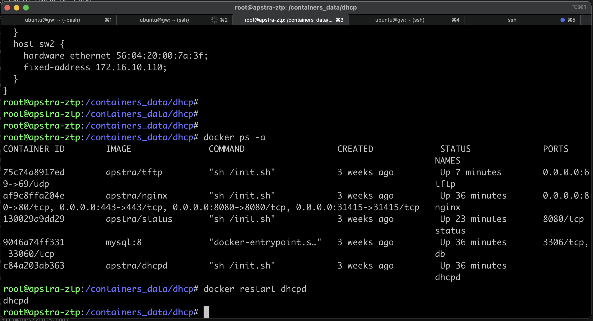

## Configure device profile (vjunos and vjunos_evolved)
if Apstra 4.1.2 is and vjunos version 23.X is used, then the following steps are needed (on Apstra 4.1.2, by default the device profile is configured for junos/junosEVO up to version 22.X)

1. On Apstra Dashboard, click **Device** > **Device Profiles**

   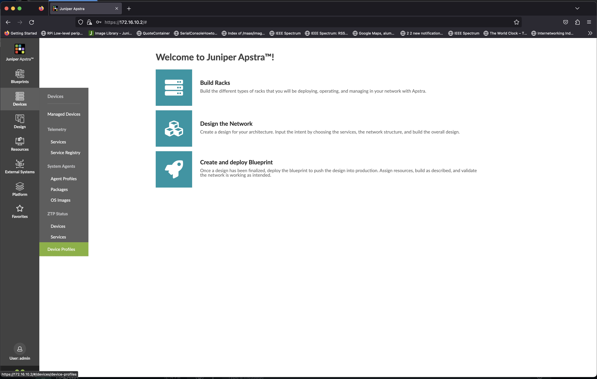

2. Search for vJunosSwitch, and clone it

   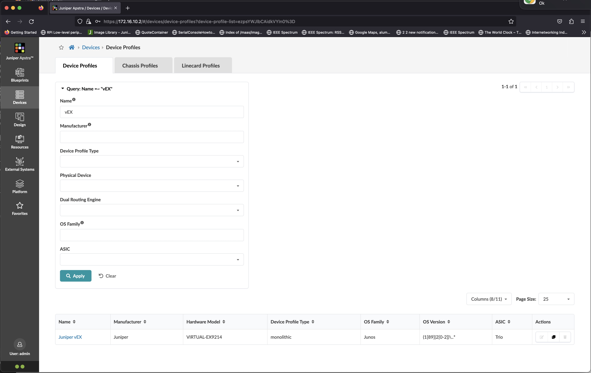
3. Set a new name, for example *Juniper vJunosSwitch 23.X"

   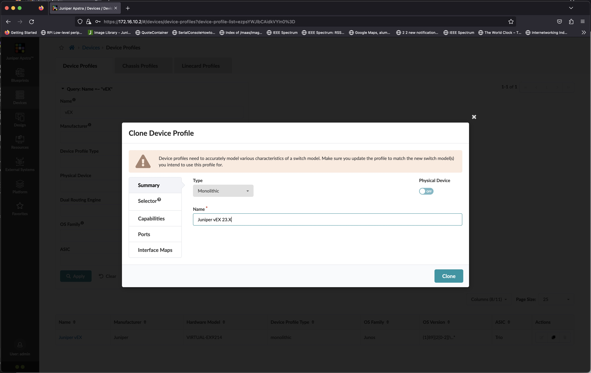
4. Click on selector, and edit field Version, change it from (1[89]|2[0-2])\..* to (1[89]|2[0-3])\..* 
5. Click **Clone** to save it.
   
   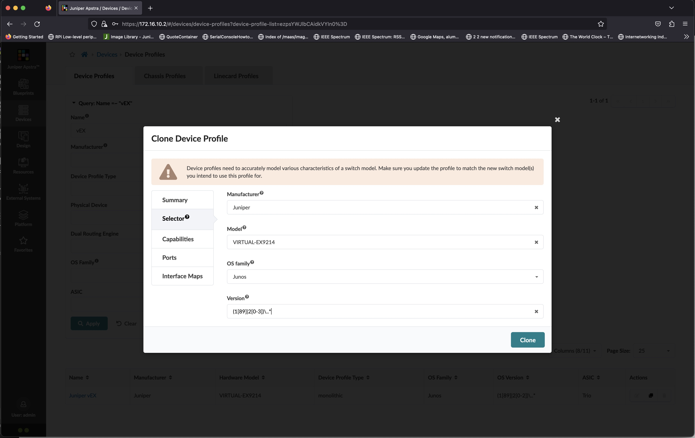

The following steps is required to create customized device profile for vjunos evolved

1. On Apstra Dashboard, click **Device** > **Device Profiles**

   

2. Search for PTX

   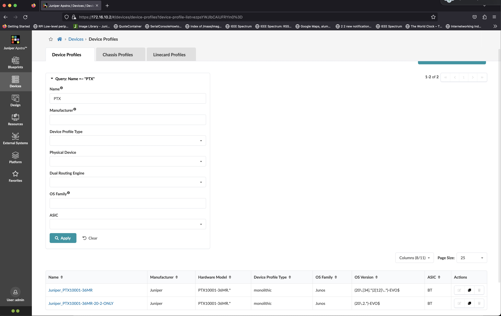

3. Clone **Juniper_PTX10001-36MR** and set a new name, for example *vJunosEvolved"

   
4. Click on **Selector**, and edit field Version, change it from (20\.[34].*|2[12]\..*)-EVO$ to (20\.[34].*|2[123]\..*)-EVO$
   
5. Click on **Port**, and delete the existing panel
6. Clic **add panel** and create 12 ports panel
7. Select all port (port 1 to 12)
8. Decrement **the Display ID** by 1 (by click negative sign)
9. Set connector type to SFP+
10. Click **add new transformation**:
   - set **speed** : 10G
   - set **Name template** : et-0/0/<port_id>
11. Click **add transformation**
12. Click **Clone** to save it.
   

   (1[89]|2[0-3])\..*

## Upload configuration into node PE1, PE2, PE3 and P1

1. router PE1, PE2, PE3, and P1 must be configured to allow ztp/dhcp traffic forwarded between DC1, DC2, DC3 and apstra management network.
2. To upload configuration, use ansible script [upload_config.yaml](router/upload_config.yaml)

        cd config/router
        ansible-playbook upload_config.yaml

3. Now routers are configured, and vJunosSwitch will go through the ZTP process.

4. On Apstra UI Dashboard, go to **Devices**>**ZTP Status**>**Devices**, to verify that network devices (swithes) are discovered through ZTP

    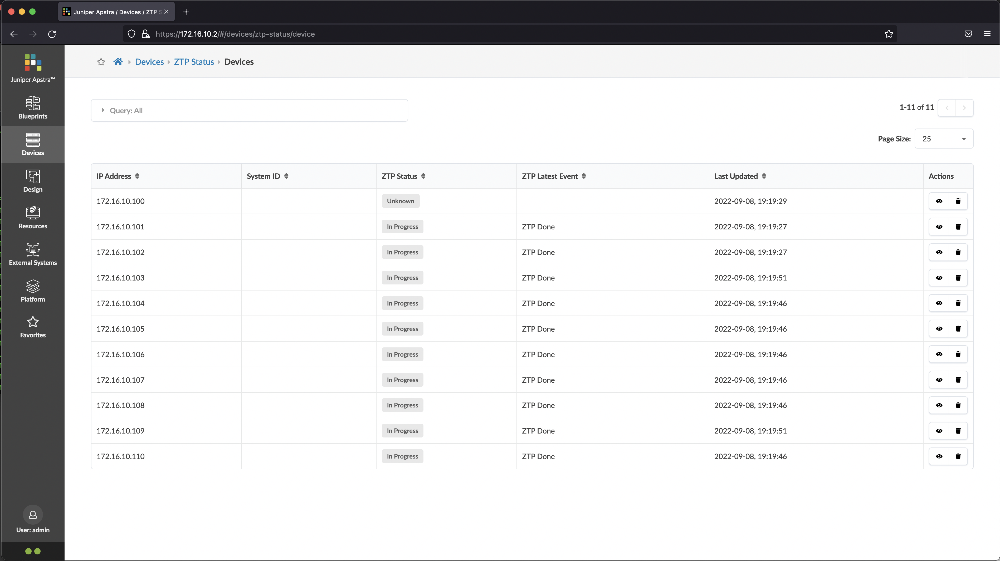

5. Wait until the **ZTP status** is **completed**

    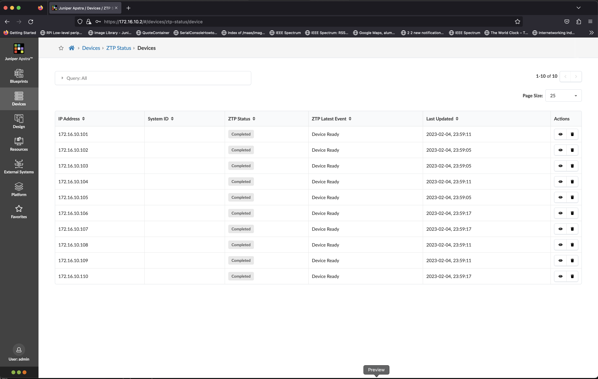

## Lab exercise

You can refer to [this document](LabExercise/README.md) for lab exercise

