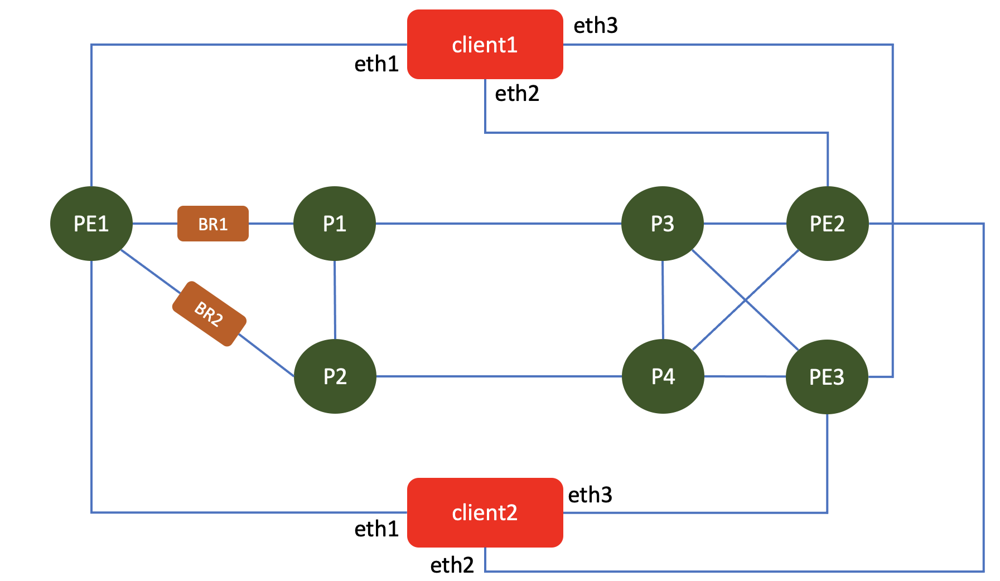

# How setup the lab
## topology
This is the topology of the lab to test EVPN-VxLAN on Juniper VMX

## Devices in the lab

- VMX : PE1, PE2, PE3, P1, P2, P3, P4
- Linux client: client1, client2 (to provide test traffic) (linux ubuntu)
- Bridge : BR1, BR2 ( linux bridge between junos node to simulate link failure, delay and packet loss) (linux alpine)

## Credential to access devices
- Ubuntu linux
    - user: ubuntu
    - password: pass01
- Alpine linux
    - user: ubuntu
    - password: pass01
- JUNOS VM
    - user: admin
    - password: pass01

## To create the lab topology and initial configuration of VMs
1. Go to directory [EVPN Lab](./)
2. Edit file [lab.yaml](./lab.yaml). Set the following parameters to choose which vmm server that you are going to use and the login credential:
    - vmmserver 
    - jumpserver
    - user 
    - adpassword
    - ssh_key_name ( please select the ssh key that you want to use, if you don't have it, create one using ssh-keygen and put it under directory **~/.ssh/** on your workstation )
3. If you want to add devices or change the topooogy of the lab, then edit file [lab.yaml](lab.yaml)
4. use [vmm.py](../../vmm.py) script to deploy the topology into the VMM. Run the following command from terminal

        ../../vmm.py upload  <-- to create the topology file and the configuration for the VMs and upload them into vmm server
        ../../vmm.py start   <-- to start the topology in the vmm server

5. Verify that you can access node **gw** using ssh (username: ubuntu,  password: pass01 ). You may have to wait for few minutes for node **gw** to be up and running
6. Run script [vmm.py](../../vmm.py) to send and run initial configuration on node **gw**

        ../../vmm.py set_gw

7. Verify that you can access other nodes (linux and junos VM), such **client1**, **pe1**, **pe2**, etc. Please use the credential to login.

        ssh client1

8. Run script [vmm.py](../../vmm.py) to send and run initial configuration on linux nodes. This script will also reboot the VM. So wait before you test connectivity into the VM

        ../../vmm.py set_host

9. Verify that you can access linux and junos VMs, such **client1**, **pe1**, **pe2**, without entering the password. You may have to wait for few minutes for the nodes to be up and running

        ssh client1
        ssh pe1
        ssh pe2

## Uploading EVPN/VxLAN configuration into node PE1, PE2, and PE3
1. you can upload the configuration that I have created. EVPN/VxLAN configuration for node PE1, PE2, and PE3 can be found [here](config/)
2. you can use [this ansible playbook](config/ansible/upload_config.yaml) to upload the configuration into the nodes.
3. to generate traffic, you can use node **client1** and **client2**,
4. Client1 and client2 has three interfaces which are connected to PE1, PE2, and PE3. to generate traffic, each interface must be assigned to different namespace. You can use script [set_client1.sh](config/set_client1.sh) on node **client1** and [set_client2.sh](config/set_client2.sh) on node **client2**

        scp set_client1.sh client1:~/
        ssh client1
        source ./set_client1.sh 
        sudo ip netns list
        alias

5. The script will create three different alias, pe1, pe2 and pe3.  For example on client1, to generate traffic on namespace **pe1**, use the following example :

        pe1 ping 10.1.102.10   <--- this will generate traffic on namespace pe1, which will be sent out on interface eth1, goes into router pe1, encapsulated into vxlan tunnel, send to pe2, de-encapsulated from vxlan tunnel, sent to interface eth2 of node client1 and goes into namespace pe2, which has the ip address of 10.1.102.10.  Namespace pe1 has ip address 10.1.101.10

6. If you want capture traffic betwen PE1 and PE2/PE3, you can ssh into br1 or br2 and do tcpdump on interface eth1 or eth2

