#  Installing kubernetes and contrail networking on Centos

[documentation](https://www.juniper.net/documentation/en_US/contrail20/topics/task/installation/how-to-install-contrail-command-and-provision-cluster.html)

##  Installing Contrail Command deployer container 

1. On terminal, enter directory [contrail_command](contrail_command/), and upload all files into node **cc**

        cd contrail_command
        scp * cc:~/

2. open ssh session into k8s node **cc**, and execute script [install_docker.sh](contrail_command.sh).

        ssh cc
        ./install_docker.sh

3. Logout from node **cc** and login in back into node **cc**

4. Run script [docker_login.sh](contrail_command/docker_login.sh)

        ./docker_login.s

5. Run script [run_deployer.sh](contrail_command/run_deployer.sh), and wait until Contrail command container is deployed

        ./run_deployer.sh

6. View the logging of contrail command logging to verify that contrail command is deployed

        docker ps -a
        docker logs -f contrail_command_deployer

7. Veirfy that contrail command is deployed

        docker ps -a

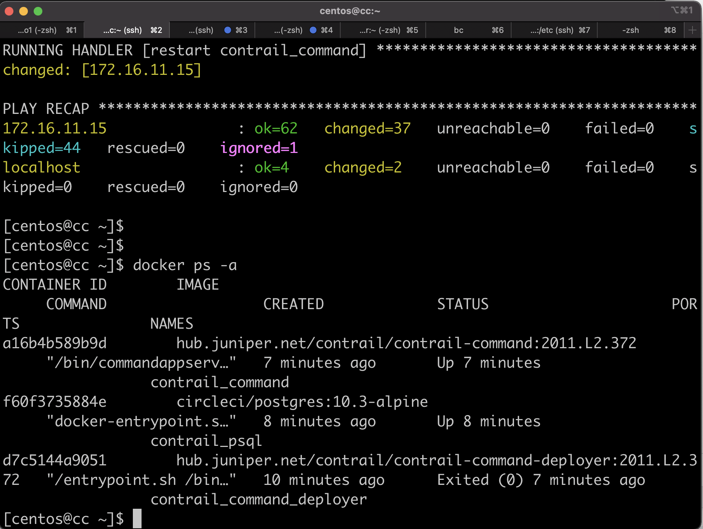

## Configuring accessing the Web Interface of Contrail Command Deployer

1. From your workstation, open ssh session to node **proxy**, run in the background and do not execute any command. This is required to provide web access into contrail command deployer

        ssh  -f -N proxy 

2. If you are using Firefox as web browser, set proxy with the following parameters
    - manual proxy configuration
    - SOCKS host : 127.0.0.1
    - PORT : 1080
    - type: SOCKS v4    
    

3. If you are using Chrome as web browser, install extension Foxy Proxy and configure it with the following parameters
    - manual proxy configuration
    - SOCKS host : 127.0.0.1
    - PORT : 1080
    - type: SOCKS v4    
    
    

4. Open http session to https://172.16.11.15:9091, and login using default credential, user/password: admin/contrail123  

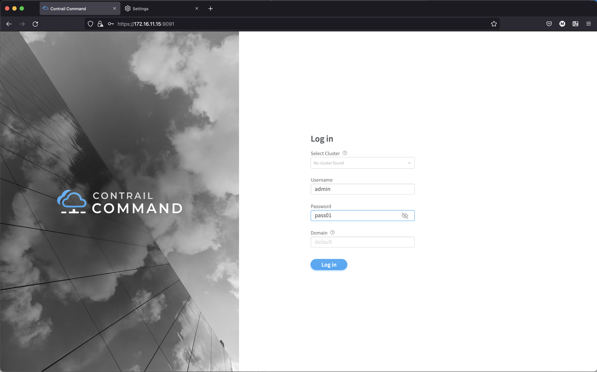

## Configuring contrail command to deploy kubernetes and contrail into the nodes
1. On step 1, click on tab **credentials**, and delete the exiting credential, and create new credential using user/password : root/pass01

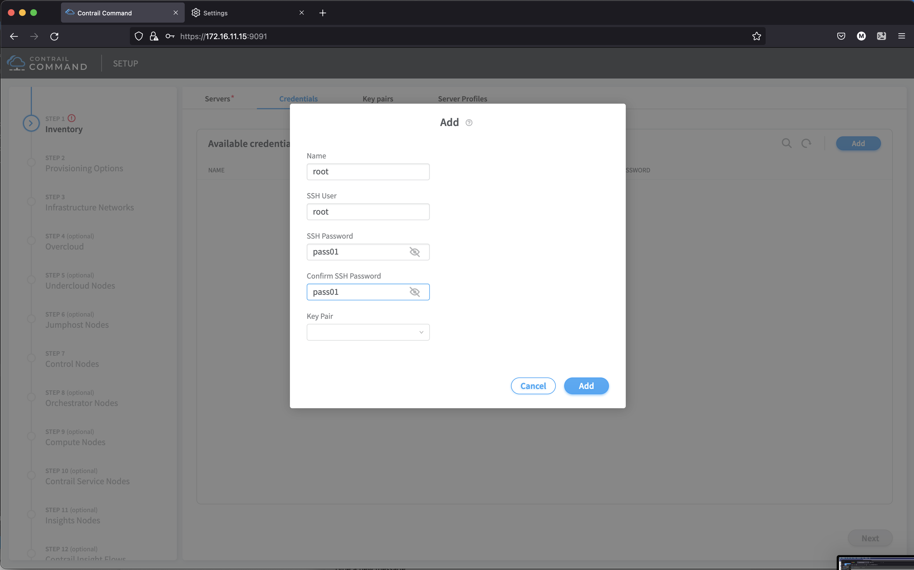

2. Click on tab **servers** and the following servers

hostname | management IP | management interface | credentials
-|-|-|-
master|172.16.11.10| eth0| root
node1|172.16.11.11| eth0| root
node2|172.16.11.12| eth0| root
node3|172.16.11.13| eth0| root

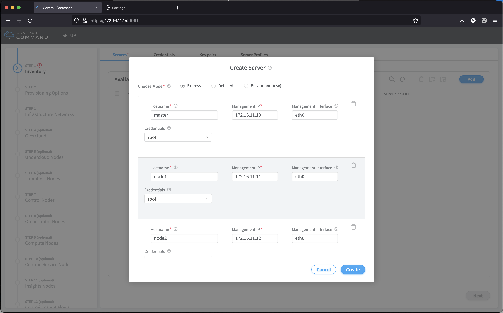
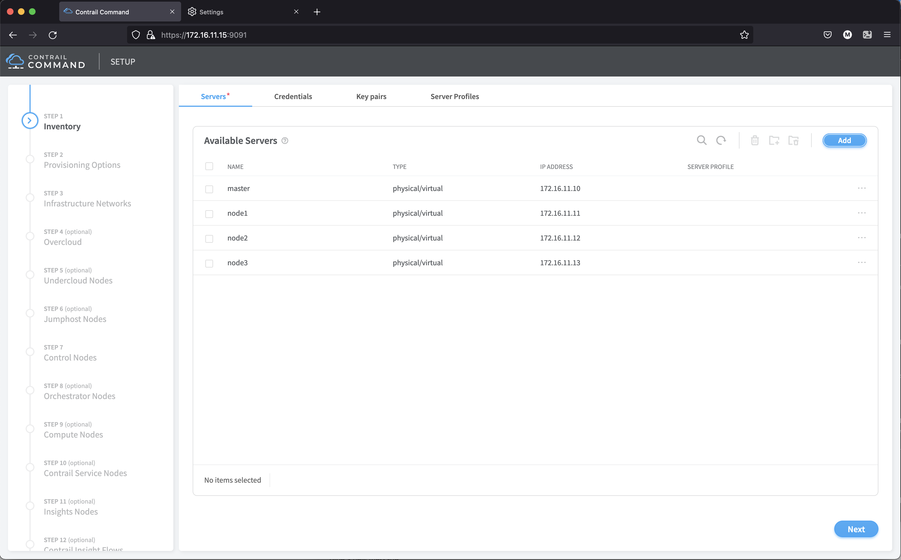

3. Click next to go to step 2
4. On step 2, provisioning options, set the following parameter

parameter | value |
-|-
Provisioning manager | Contrail enterprise multicloud
container registry | hub.juniper.net/contrail
Container Registry Name | <registry_user>
Container Registry Password | <registry_password>
Contrail Version | 2011.L2.372
Domain suffix | <leave_it_blank>
NTP server | ntp.juniper.net
Default Vrouter gateway | 172.16.11.1
Encapsulation Priority | MPLSoUDP, MPLSoGRE, VXLAN

Contrail Configuration

key | value
-|- 
UPGRADE_KERNEL| true
CONFIG_NODEMGR__DEFAULTS__minimum_diskGB|10
DATABASE_NODEMGR__DEFAULTS__minimum_diskGB|10
CONFIG_DATABASE_NODEMGR__DEFAULTS__minimum_diskGB|10

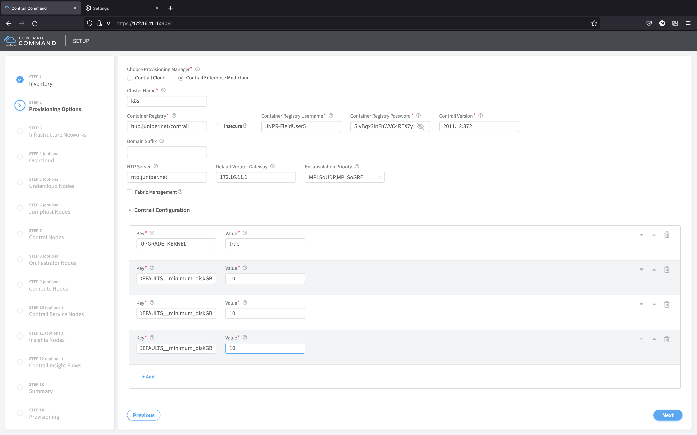

5. Click next to go to the next step
6. On Step 7, select node master as control nodes

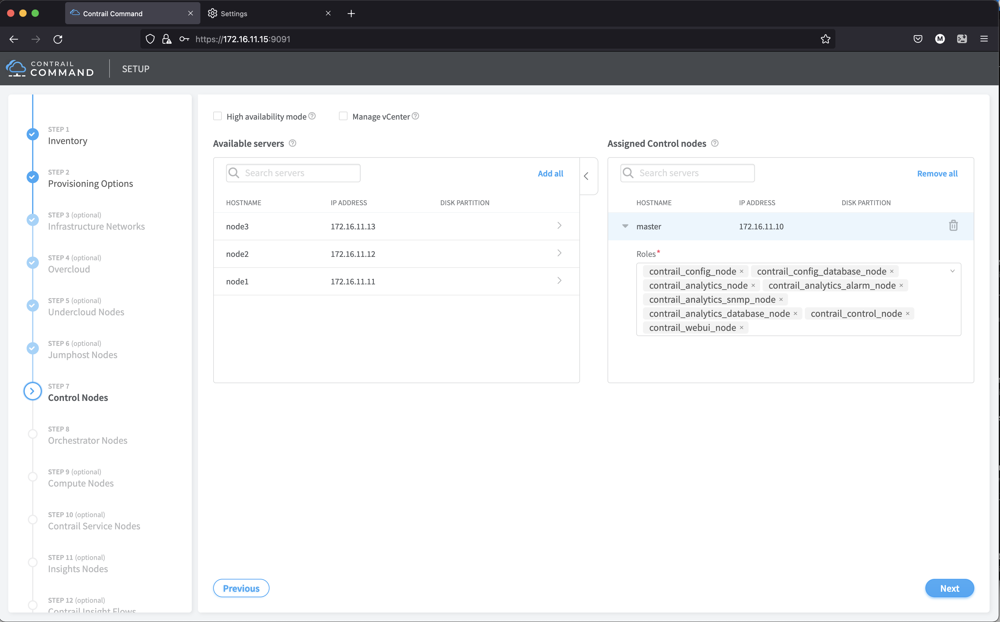

7. Click next to go to the next step
8. On Step 8, set the following 

Parameter | Value
-|-
Orchestrator type | Kubernetes
Kubernetes Node | Master
Role for kubernetes Node | kubernetes_master node, kubernetes_kubemanager_node

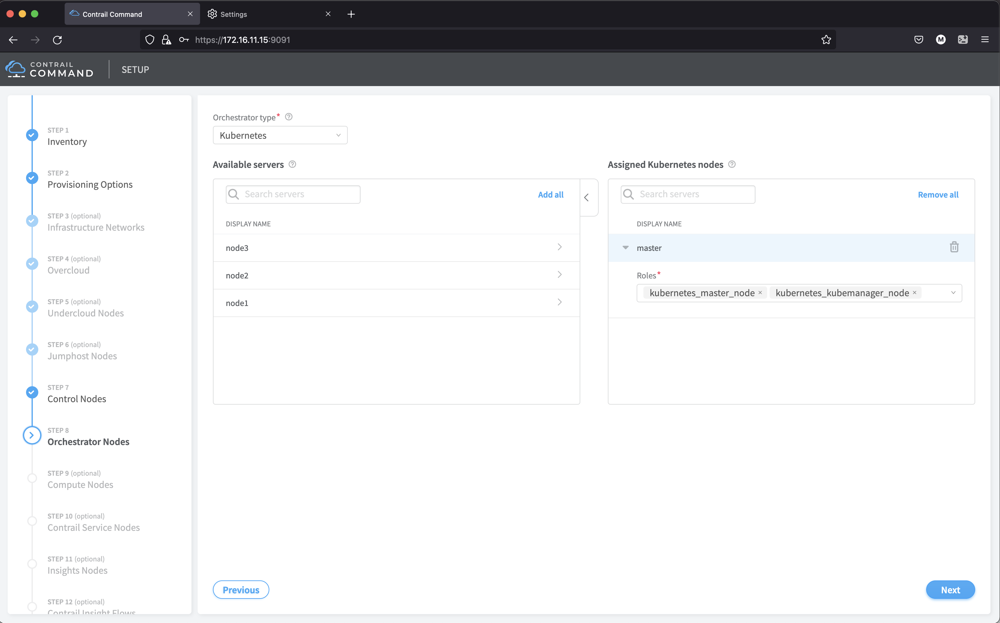

9. Click next to go to the next step
10. On step 9, 

- Assigned compute node : node1, node2, node3
- Default Vrouter gateway : 172.16.11.1
- Type : kernel

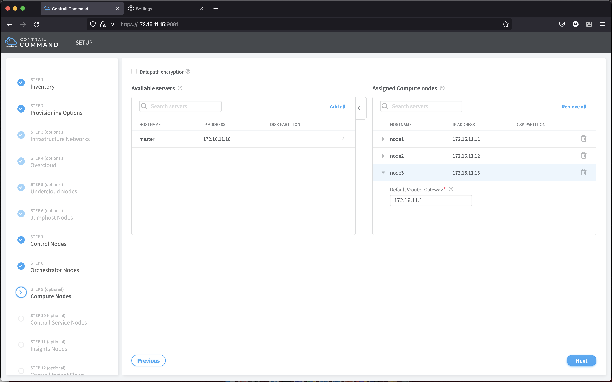

11. Click next to go to the next step (skip step 10,11, and 12)
12. On Step 13, click provisioning

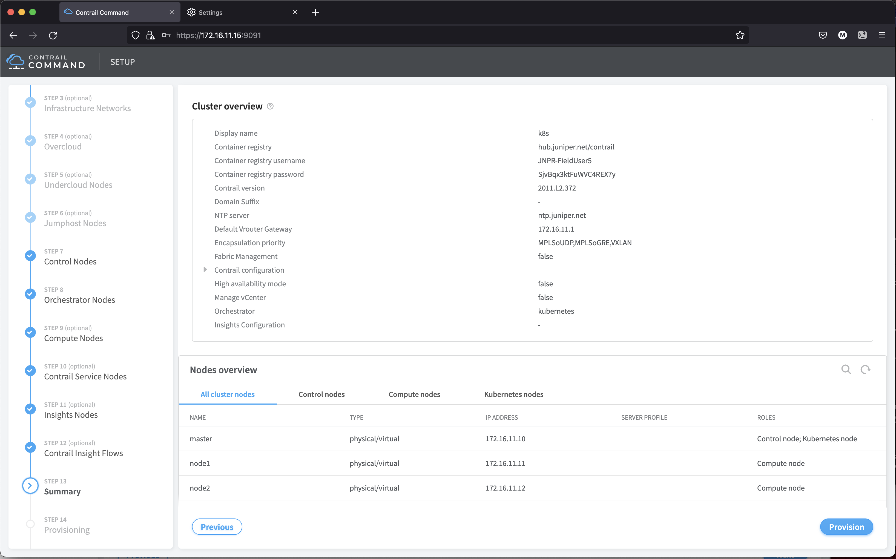

13. Open ssh session to node **cc** and run the following to view the log from contrail command container

        docker logs -f contrail_command or
        docker exec contrail_command tail -f /var/log/contrail/deploy.log

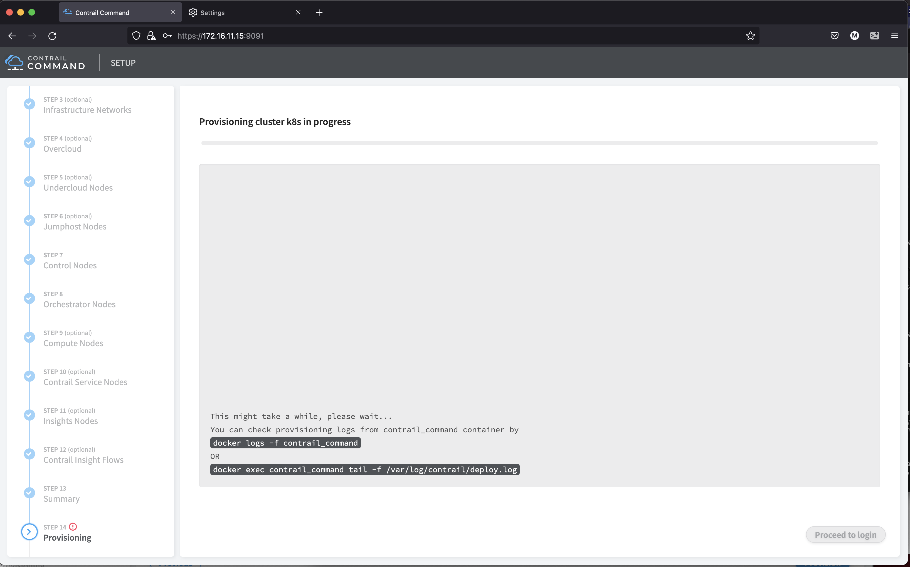

14. Wait until the provisioning of kubernetes and contrail networking is done
15. Login into node **master** as user centos.
16. Create directory /home/centos/.kube
        
        mkdir ~/.kube
17. Copy file /root/.kube/config into /home/centos/.kube/config

        sudo cp /root/.kube/config /home/centos/.kube/config
        sudo chown centos:centos /home/centos/.kube/config
18. Verify that the kubectl command can be used to communicate to Kubernetes API server

        kubect get pods -A
        kubectl get nodes

