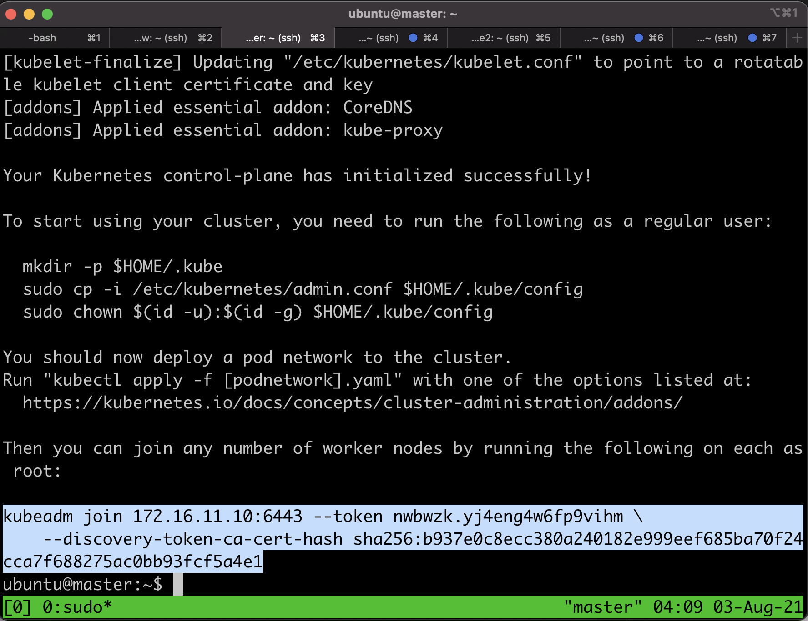
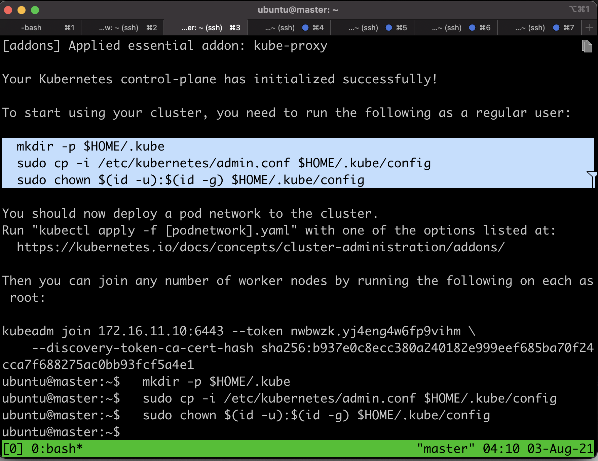
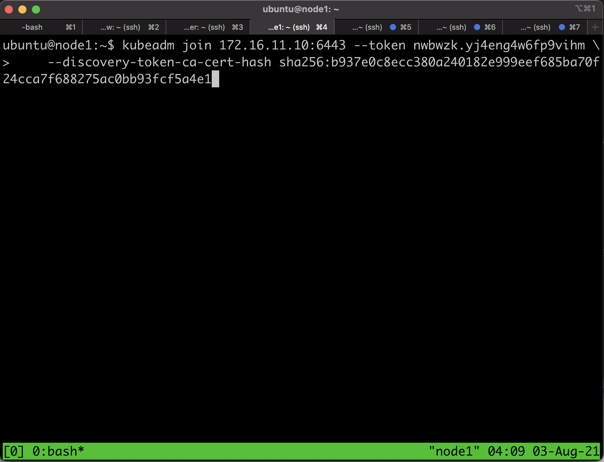
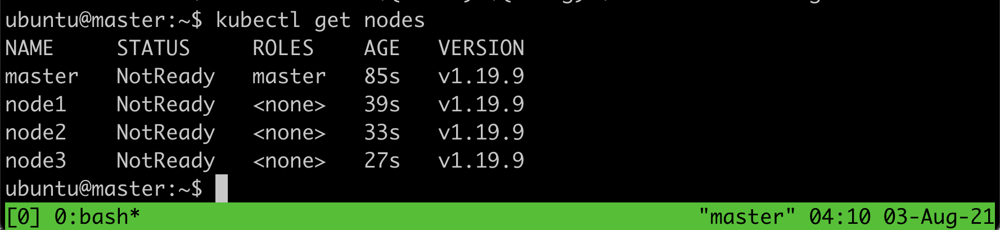
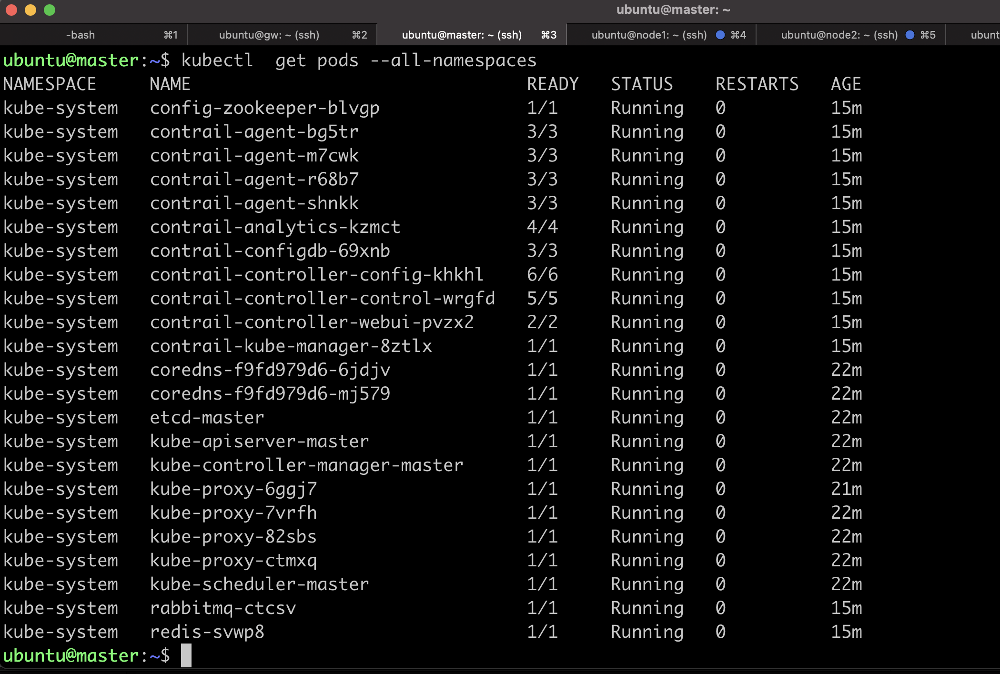

# Installing kubernetes and contrail networking on Ubuntu

##  Installing kubernetes and contrail networking into Nodes
1. On terminal, enter directory [install_on_ubuntu](install_on_ubuntu/), and execute script [upload2nodes.sh](install_on_ubuntu/upload2nodes.sh) to upload the script to install kubernetes cluster and contrail networking into the nodes (master, node1, node2, node3, and node4)

        ./upload2nodes.sh 

2. open ssh session into k8s node **master**, and execute script [install_docker_kubeadm.sh](install_on_ubuntu/install_docker_kubeadm.sh), leave it run until it reboot itself. (tmux, to terminal multiplex allow application to run when the ssh session is disconnected)

        ssh master
        tmux
        ./install_docker_kubeadm.sh

3. repeat step 2 for the other nodes, node1, node2, and node3
4. login into nfs, run script [upgrade_nfs.sh](./upgrade_nfs.sh) and wait until the node rebooted
        
        tmux
        ./upgrade_nfs.sh

5. open ssh session into node **master**, and initiate kubernetes cluster using command **sudo kubeadm init**, and wait until it finish.

        ssh master
        tmux
        sudo kubeadm init --config kube_init.yaml

6. at the end of the script, information on how to join master will be displayed. copy that information into node1, node2, and node3

7. at the end of the script, information on how to enable kube config will be displayed. Run it on node master.

8. open ssh session to node1 and execute the command to join kubernetes cluster

9. repeat step 8 on node2 and node3

11. open ssh session to node master, and execute script [set_repository](install_on_ubuntu/set_repository.sh) to create secret to access contrail repository.

        ./set_repository.sh

12. On master, we will install contrail networking. If you don't want include contrail analytic, use kubernetes manisfest file [contrail_single_wo_analytics.yaml](./contrail_single_wo_analytics.yaml), but if you want contrail analytic to be installed too, then use kubernetes manifest file [contrail_single.yaml](./contrail_single.yaml), and execute the following command

        kubectl apply -f contrail_single_wo_analytics.yaml
        
        or 

        kubectl apply -f contrail_single.yaml

14. Verify that contrail networking is installed using command **kubectl get pods -n all-namespaces**. Wait until status of all pods are running

        kubectl get nodes
        kubectl get pods --all-namespaces

 
 

15. now contrail networking is installed on the kubernetes cluster

