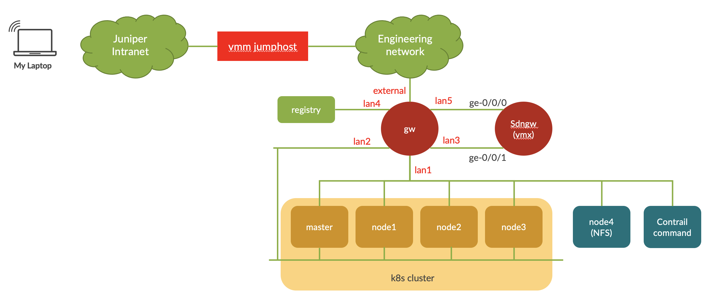
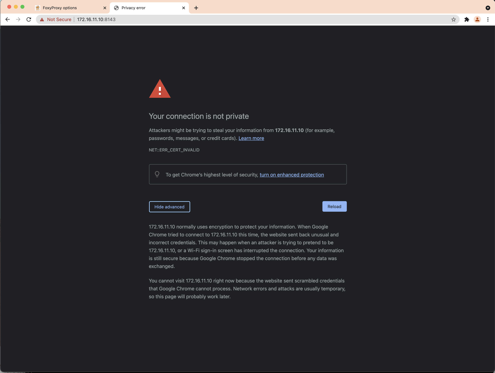
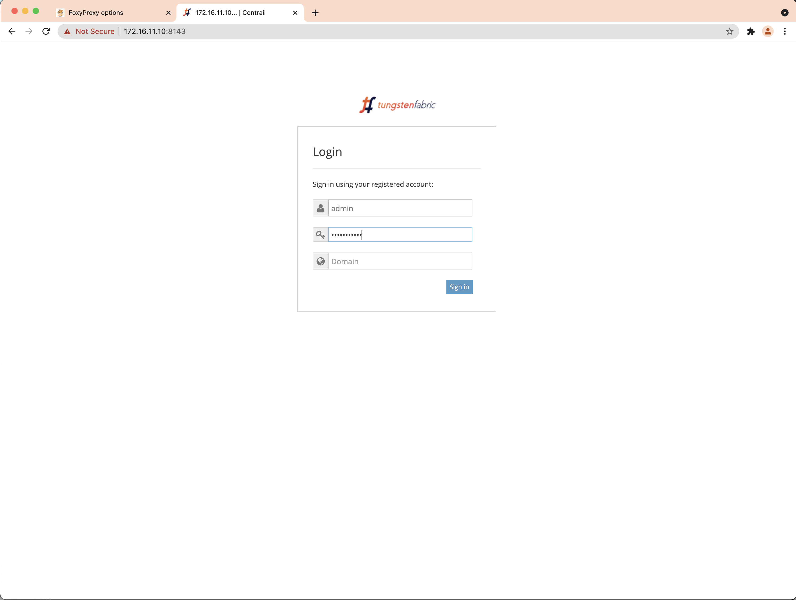
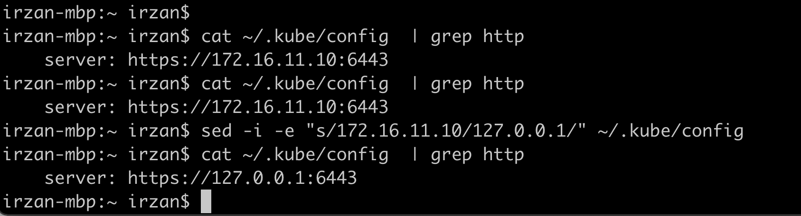
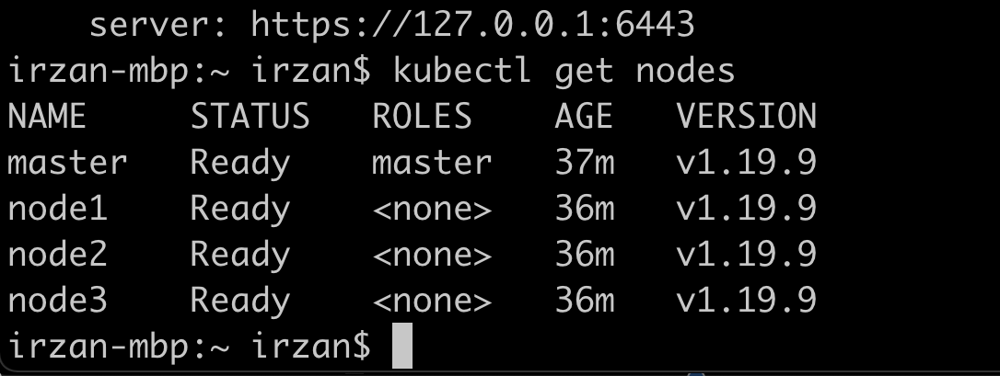
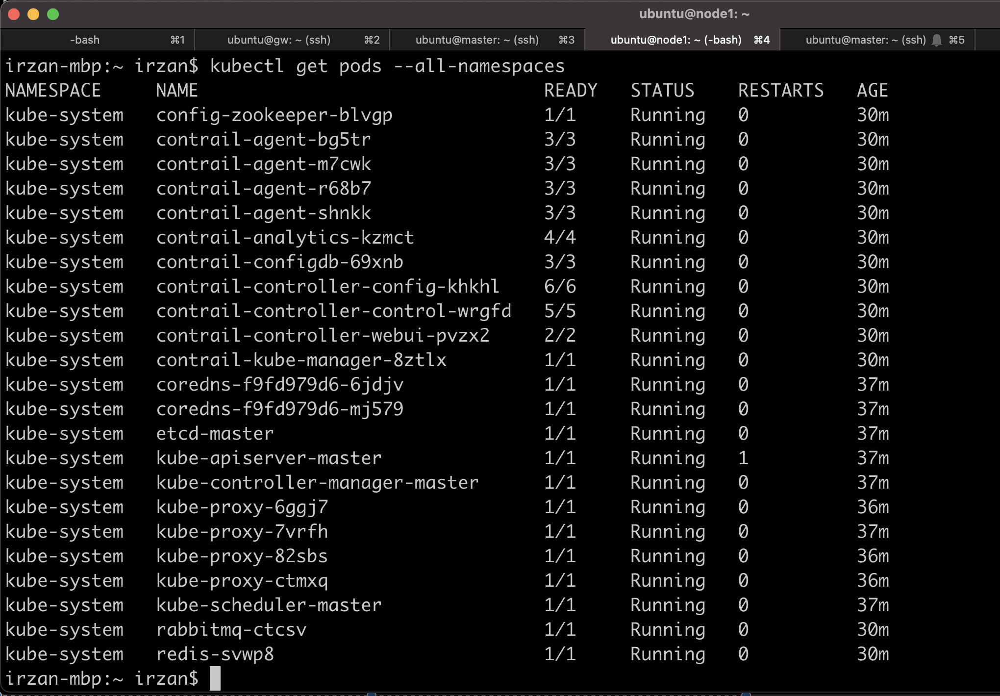

# Installing kubernetes and contrail networking
## Introduction 

This document provide guide on how to install kubernetes and contrail networking.

## note
1. This installation is using docker  version 19.03.15 and kubernetes version 1.19.9.
2. there is an issue of contrail networking with the latest version of kubernetes (1.20), and it works with version 1.19.9
3. kubernetes version 1.19.9/1.20 is tested againts docker version 19.03 (not the latest one)
4. The contrail networking installation is using single kubernetes manifest file.

## Topology

## Devices in the lab
- VMX: SDNGW , SDN gateway 

- kubernetes cluster :

        * master node: master
        * worker nodes: node1, node2, node3
        * NFS share for shared storage : node4

- External node:

        * registry : it will be used as private registry and external server
        * cc : contrail command to deploy kubernetes and contrail software

## To create the lab topology and initial configuration of VMs
1. Go to directory [k8s + contrail Lab](./)
2. There are two files available for the lab topology
    - lab-centos.yaml : this topology is using Centos for the kubernetes nodes
    - lab-ubuntu.yaml : this topology is using Ubuntu for the kubernetes nodes
3. Depend on which OS that you will used on the kubernetes nodes, link the appropriate file to lab.yaml

        # for ubuntu
        ln -s lab-ubuntu.yaml lab.yaml

        # for centos
        ln -s lab-centos.yaml lab.yaml

4. Edit file [lab.yaml](./lab.yaml). Set the following parameters to choose which vmm server that you are going to use and the login credential:
    - vmmserver 
    - jumpserver
    - user 
    - adpassword
    - ssh_key_name ( please select the ssh key that you want to use, if you don't have it, create one using ssh-keygen and put it under directory **~/.ssh/** on your workstation )
5. If you want to add devices or change the topooogy of the lab, then edit file [lab.yaml](lab.yaml)
6. use [vmm.py](../../vmm.py) script to deploy the topology into the VMM. Run the following command from terminal

        ../../vmm.py upload  <-- to create the topology file and the configuration for the VMs and upload them into vmm server
        ../../vmm.py start   <-- to start the topology in the vmm server

7. Verify that you can access node **gw** using ssh (username: ubuntu,  password: pass01 ). You may have to wait for few minutes for node **gw** to be up and running
8. Run script [vmm.py](../../vmm.py) to send and run initial configuration on node **gw**

        ../../vmm.py set_gw

9. Verify that you can access other nodes (linux and junos VM), such **master**, **node1**, **node2**, etc. Please use the credential to login.

        ssh master

10. Run script [vmm.py](../../vmm.py) to send and run initial configuration on linux nodes. This script will also reboot the VM. So wait before you test connectivity into the VM

        ../../vmm.py set_host

11. Verify that you can access linux and junos VMs, such **master**, **node1**, **sdngw**, without entering the password. You may have to wait for few minutes for the nodes to be up and running

        ssh master
        ssh node0
        ssh node1

## kubernetes and contrail network installation

1. If you are using centos for the kubernetes nodes, please follow this [instruction](Install_K8S_contrail_on_centos.md)
2. If you are using ubuntu for the kubernetes nodes, please follow this [instruction](Install_K8S_contrail_on_ubuntu.md)

## Accessing Web Interface of Contrail Networking dashboard

1. From your workstation, open ssh session to node **proxy** and keep this session open if you need to access the web dashboard of Paragon Automation platform

        ssh proxy 

2. If you are using Firefox as web browser, set proxy with the following parameters
    - manual proxy configuration
    - SOCKS host : 127.0.0.1
    - PORT : 1080
    - type: SOCKS v4    
    

3. If you are using Chrome as web browser, install extension Foxy Proxy and configure it with the following parameters
    - manual proxy configuration
    - SOCKS host : 127.0.0.1
    - PORT : 1080
    - type: SOCKS v4    
    
    

4. Open http session to https://172.16.11.10:8143, and login using default credential, user/password: admin/contrail123  
5. On chrome, if you find this page, click **advance** and type **thisisunsafe** to bypass chrome's security check
  
  
 

### How to set kubectl over sock5 https proxy
1. on your workstation set environment variable https_proxy

        export https_proxy=socks5://127.0.0.1:1080

2. open ssh session to node **proxy**

        ssh -f -N proxy 

3. copy kubectl **config** file from master node, and copy it to the local file

        scp master:~/.kube/config ~/.kube/config

4. use the **kubectl** command from your local workstation 

        kubectl <command>

## How to set kubectl over ssh tunnel
Information on how to set kubectl over ssh, can be found here [reference](https://blog.scottlowe.org/2019/07/30/adding-a-name-to-kubernetes-api-server-certificate/)

1. on Master, run 

        kubectl -n kube-system get configmap kubeadm-config -o jsonpath='{.data.ClusterConfiguration}' > kubeadm.yaml
2. edit file kubeadmin, under **apiServer:** add the following:

        apiServer:
                certSANs:
                - "127.0.0.1"
                - "172.16.11.10"
                - "10.96.0.1"

3. Move the existing API server certificate to different directory

        mkdir ~/certs
        sudo mv /etc/kubernetes/pki/apiserver.{crt,key} ./certs

4. run kubedm to just generate a new certificate

        sudo kubeadm init phase certs apiserver --config kubeadm.yaml

5. Restart the API server container :
    - run **sudo docker ps | grep kube-apiserver | grep -v pause** to get the containerID of the kubernetes API server
    - run **sudo docker kill <containerID>** to restart it.

6. copy kubectl config from node **master** to your local workstation

        mkdir ~/.kube
        scp master:~/.kube/config ~/.kube/config
        
7. On your workstation, edit file ~/.kube/config. Change the URL from https://172.16.11.10:6443 to https://127.0.0.1:6443

 

7. Open ssh session with port forwarding on 6443 to node **master** (and keep the session alive)

        ssh -L 6443:127.0.0.1:6443 master

8. Install kubectl on your workstation, and test kubectl command

        kubectl get nodes
        kubectl get pods --all-namespaces

 
 

9. Now you can run kubectl on your workstation to access the kubernetes cluster in the lab.

10. For lab exercise, you can follow the following [this lab guide](lab_exercise/README.md)

