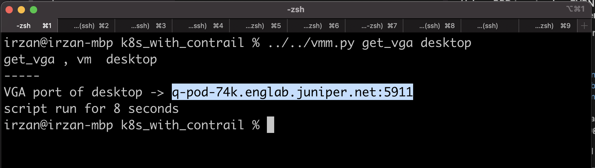

# The following document provide information on how to provide access for VNC using novnc software

1. Open ssh into node **gw**
2. update software on node **gw**

        sudo apt -y update && sudo apt -y upgrade
3. Install software **novnc** on node **gw**

        sudo apt install -y novnc
4. Create certificate required for novnc

        openssl req -x509 -nodes -newkey rsa:3072 -keyout novnc.pem -out novnc.pem -days 3650
5. from you workstation, run vmm.py script to get the vnc server and port 

        ../../vmm.py get_vga desktop
    
    

6. On node **gw**, run the following to run novnc

        websockify -D --web=/usr/share/novnc/ --cert=./novnc.pem <port_number> <output of vmm get_vga vm>

        for example 

        websockify -D --web=/usr/share/novnc/ --cert=./novnc.pem 6080 q-pod-74k.englab.juniper.net:5911

7. Now from your workstation (after bringing up ssh session to node **proxy**, you should be able to access the vnc port of node **desktop**), open web session to http://<ip of node gw>:<novnc port>/vnc.html  for example http://172.16.11.1:6080/vnc.html

