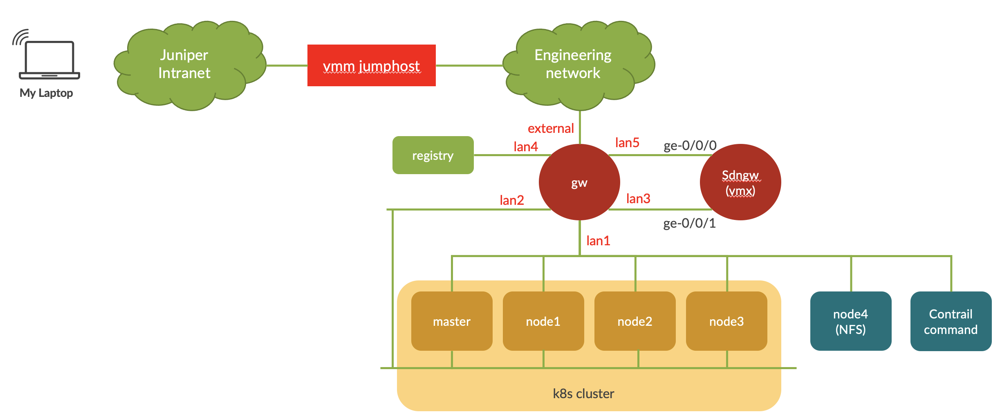

# This directory contain the scripts/yaml file required for the lab exercise

## Topology 

this is the topology of the lab.

the lab consist of the following :

- kubernetes cluster 
    * master
    * worker node : node1, node2, node3
- NFS server: node4
- Private Registry : desktop
- GW : gateway to external network
- SDNGW : SDN gateway (Juniper MX/vMX)

## Video recording 

Video recording of the lab can be found [here](https://junipernetworks.sharepoint.com/:p:/r/teams/Sales/steams/APAC/asean_se/docs/Indonesia/Container_k8s_101.pptx?d=wbc53e798b7c64166a71e109ba47676da&csf=1&web=1&e=amaKNb)

## Lab exercises

[Lab 0](lab0/creating_private_registry.md)

    - Installing private registry

[Lab 1](lab1/README.md) 

    - configuring SDN Gateway (vMX/MX)
    - deploying pods 
    - deploying multi-container pods
    - deploying services with node port
    - deploying services with load balancer
    - deploying services with ingress

[Lab 2](lab2/README.md)

    - configuring non-isolated namespace
    - configuring isolated namespace
    - configuring floating ip pool
    - deploying services with different floating ip pool
    - configuring namespace with default floating ip pool

[Lab 3](lab3/README.md)

    - configuring kubernetes policy/contrail security

[Lab 4](lab4/README.md)

    - configuring service chaining

[Lab 5](lab5/README.md)

    - configuring KubeVirt (running VM in kubernetes cluster)

[Lab 6](lab5/README.md)

    - configuring gateway-less forwarding
