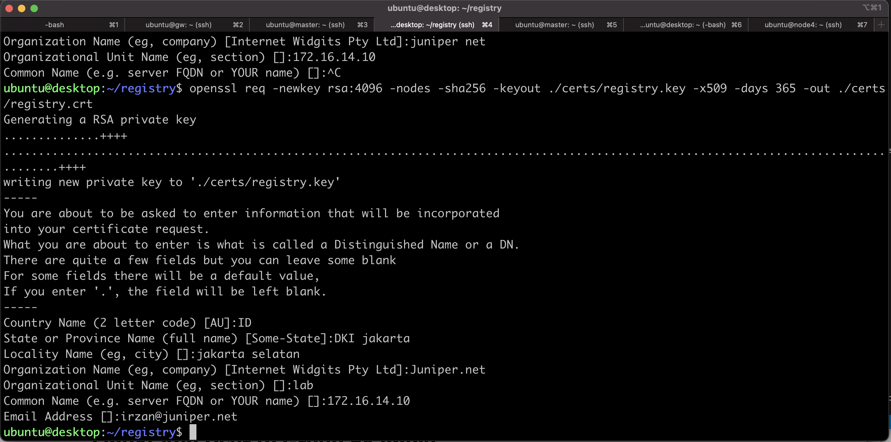
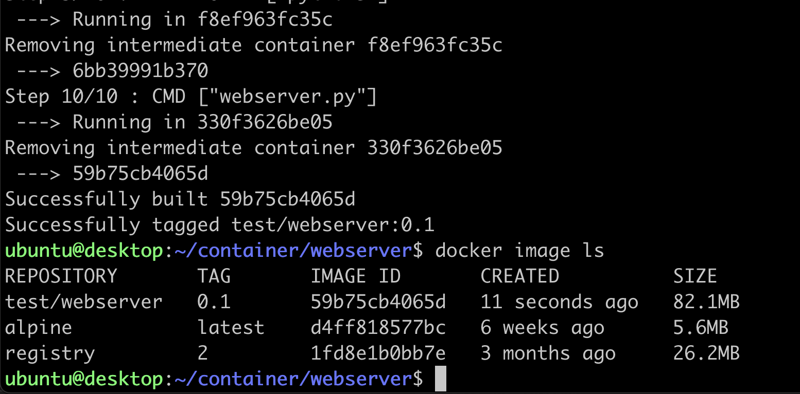
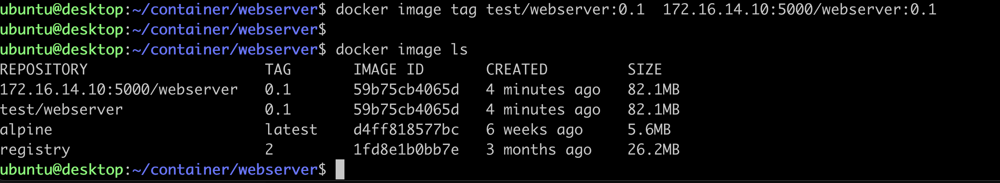
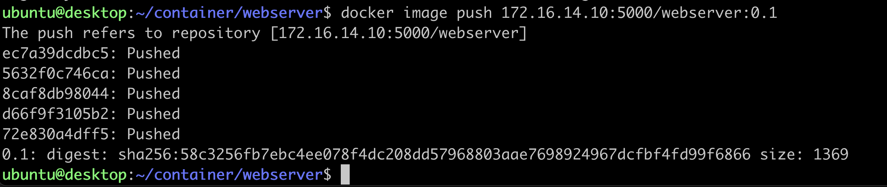
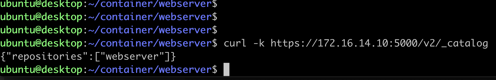

# Lab 0
in this lab, two task will be done
1. Installing and creating private registry to store local image
2. creating container image and push it into private registry

## installing private registry  and Creating private registry

1. upload file [install_container.sh](install_container.sh) into node **registry**

        scp install_container.sh registry:~/

2. ssh into node **registry**, and update the base OS 

        tmux
        sudo apt -y update
        sudo apt -y upgrade
        sudo reboot

3. ssh into node **registry** and run script install_container.sh to install CRI-O container engine. 

        tmux
        ./install_container.sh

3. On node **registry**, create home directory for the registry, for example ~/registry
4. On node **registry**, create directory for certificates, for example ~/registry/certs
5. On node **registry**, create directory for data , for example ~/registry/data

        mkdir -p ~/registry/certs
        mkdir -p ~/registry/data

8. edit file sudo vi /etc/ssl/openssl.cnf and add the following 

        [ v3_ca ]
        subjectAltName=IP:172.16.14.10
        # 172.16.14.10 is the ip address of VM registry. If the VM is using different IP address, then set it accordingly

9. create self signed certificate. use the following script. You can fill anything for the fields, except for "Common Name", you have to put the ip address of the VM where the registry is running, for example 172.16.14.10

        cd ~/registry
        openssl req -newkey rsa:4096 -nodes -sha256 -keyout ./certs/registry.key -x509 -days 365 -out ./certs/registry.crt

10. Upload script [run_registry.sh](./run_registry.sh) to VM **registry**, and run the script to start the registry container

                podman run --name registry \
                        -p 5000:5000 \
                        -v ~/registry/data:/var/lib/registry \
                        -v ~/registry/certs:/certs \
                        -e "REGISTRY_HTTP_TLS_CERTIFICATE=/certs/registry.crt" \
                        -e "REGISTRY_HTTP_TLS_KEY=/certs/registry.key" \
                        --network podman \
                        -d registry:2

11. On node **registry** make directory /etc/containers/certs.d/172.16.14.10:5000/ . If the VM is using ip address other than 172.16.14.10, then change it accordingly.

12. copy file ~/certs/registry.crt into /etc/containers/certs.d/172.16.14.10:5000/ca.crt

        sudo mkdir -p /etc/containers/certs.d/172.16.14.10:5000/
        sudo cp certs/registry.crt /etc/containers/certs.d/172.16.14.10:5000/ca.crt

## Copy registry certificate to all kubernetes nodes
1. copy registry certificate from node **registry** , in this case ~/registry/certs/registry.crt to all kubernetes nodes
2. on the kubernetes master, create the following directory /etc/docker/certs.d/172.16.14.10:5000 (or /etc/container/certs.d/172.16.14.10:5000)
3. copy file registry.crt into  /etc/docker/certs.d/172.16.14.10:5000/ca.crt (or /etc/container/certs.d/172.16.14.10:5000/ca.crt)
4. repeat step 8 and 9 on all kubernetes node. Or you can use the following script to do step 1-3

        #!/bin/bash
        # 172.16.14.10 is the ip address of the registry 
        REGISTRY_IP=172.16.14.10
        for i in master node{1..3}
        do
            scp certs/registry.crt ${i}:~/
            # the following if the k8s nodes is using containerd or crio without docker
            # ssh ${i} "sudo mkdir  -p /etc/containers/certs.d/${REGISTRY_IP}:5000; sudo cp ~/registry.crt /etc/containers/certs.d/${REGISTRY_IP}:5000/ca.crt" 
            # the following if the k8s nodes is using containerd with docker
            ssh ${i} "sudo mkdir  -p /etc/docker/certs.d/${REGISTRY_IP}:5000; sudo cp ~/registry.crt /etc/docker/certs.d/${REGISTRY_IP}:5000/ca.crt"
        done

 

## running registry container as service
1. run the following script to create systemd's registry service

        podman generate systemd --new --name registry | sudo tee /etc/systemd/system/registry.service
        systemctl enable registry

2. Stop and remove the existing registry container

        podman stop registry 
        podman remove registry

3. Start systemd registry service

        systemctl start registry

## Creating container image for the lab exercise
1. On node **registry**, create directory ~/container

        mkdir -p ~/container/webserver

2. Upload content of [directory](container/webserver) into node **registry**

        scp * registry:~/container/webserver/

3. On node **registry**, enter directory ~/container/webserver
        
        cd ~/container/webserver

4. Create container image using 

        podman build -t webserver:0.1 .

5. Verify that container image has been create

        podman image ls
 

6. Tag the container image that you created with tag 172.16.14.10:5000/webserver.0.1

        podman image tag localhost/webserver:0.1 172.16.14.10:5000/webserver:0.1
        podman image ls
 

7. Push the container image into private registry

        podman push 172.16.14.10:5000/webserver:0.1
        
 

8. Verify that container image has been pushed into private registry

        curl -k https://172.16.14.10:5000/v2/_catalog
        curl -k https://172.16.14.10:5000/v2/webserver/tags/list

  

9. Now you can continue with the lab exercise