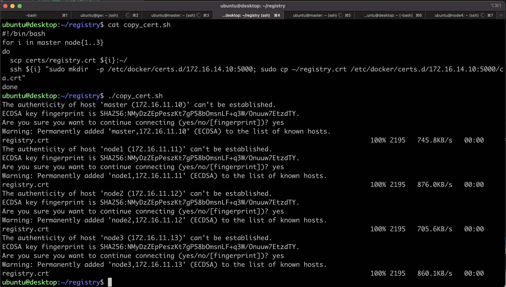
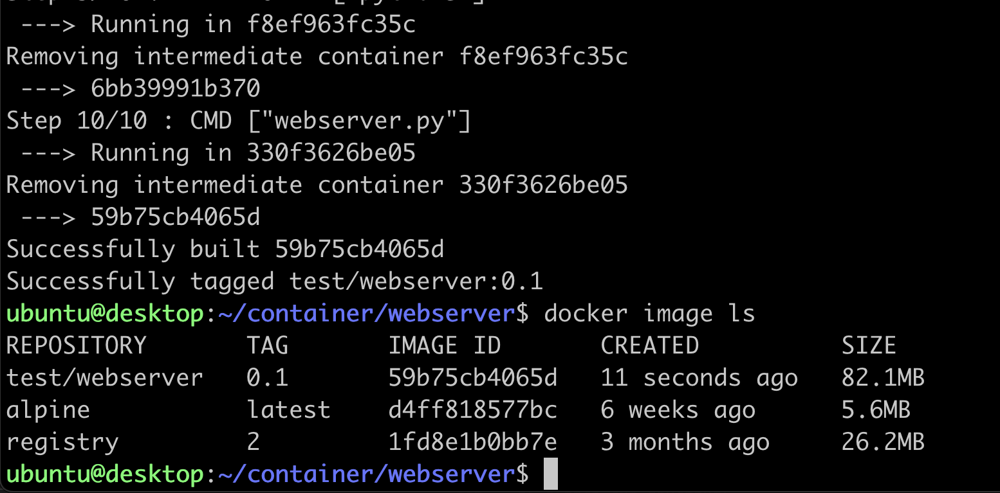
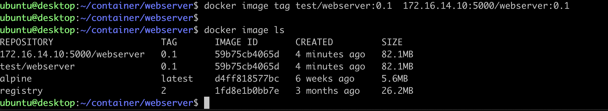
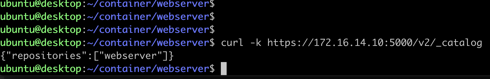

# Lab 0
in this lab, two task will be done
1. Installing and creating private registry to store local image
2. creating container image and push it into private registry

## installing private registry  and Creating private registry

1. upload file [install_docker.sh](install_docker.sh) into node **registry**

        scp install_docker.sh registry:~/

2. ssh into node **registry** and run script install_docker.sh to install docker container engine. The script will reboot the machine

        tmux
        ./install_docker.sh

3. Install docker-componse on node **registry** [how to](https://docs.docker.com/compose/install/)

        sudo curl -L "https://github.com/docker/compose/releases/download/1.29.2/docker-compose-$(uname -s)-$(uname -m)" -o /usr/local/bin/docker-compose
        sudo chmod +x /usr/local/bin/docker-compose

3. On node **registry**, create home directory for the registry, for example ~/registry
4. On node **registry**, create directory for certificates, for example ~/registry/certs
5. On node **registry**, create directory for data , for example ~/registry/data

        mkdir -p ~/registry/certs
        mkdir -p ~/registry/data

8. edit file sudo vi /etc/ssl/openssl.cnf and add the following 

        [ v3_ca ]
        subjectAltName=IP:172.16.14.10

9. create self signed certificate. use the following script. You can fill anything for the fields, except for "Common Name", you have to put the ip address of the VM where the registry is running, in this case 172.16.14.10

        cd ~/registry
        openssl req -newkey rsa:4096 -nodes -sha256 -keyout ./certs/registry.key -x509 -days 365 -out ./certs/registry.crt

10. create docker-compose.yml

        services:
          registry:
            image: registry:2
               ports:
                 - "5000:5000"
               volumes:
                 - ./certs:/certs
                 - ./data:/var/lib/registry
               environment:
                 REGISTRY_HTTP_TLS_CERTIFICATE : /certs/registry.crt
                 REGISTRY_HTTP_TLS_KEY : /certs/registry.key

8. On node **registry** make directory /etc/docker/certs.d/172.16.14.10:5000/
9. copy file ~/certs/registry.crt into /etc/docker/certs.d/172.16.14.10:5000/ca.crt

        sudo mkdir -p /etc/docker/certs.d/172.16.14.10:5000/
        sudo cp certs/registry.crt /etc/docker/certs.d/172.16.14.10:5000/ca.crt

13. restart docker services 

        sudo systemctl restart docker

14. start registry container using 
        docker-compose up -d

## Copy registry certificate to all kubernetes nodes
1. copy registry certificate from node **registry** , in this case ~/registry/certs/registry.crt to all kubernetes nodes
2. on the kubernetes master, create the following directory /etc/docker/certs.d/172.16.14.10:5000 (or /etc/container/certs.d/172.16.14.10:5000)
3. copy file registry.crt into  /etc/docker/certs.d/172.16.14.10:5000/ca.crt (or /etc/container/certs.d/172.16.14.10:5000/ca.crt)
4. repeat step 8 and 9 on all kubernetes node. Or you can use the following script to do step 1-3

        #!/bin/bash
        for i in master node{1..3}
        do
            scp certs/registry.crt ${i}:~/
            #ssh ${i} "sudo mkdir  -p /etc/docker/certs.d/172.16.14.10:5000; sudo cp ~/registry.crt /etc/docker/certs.d/172.16.14.10:5000/ca.crt"
            ssh ${i} "sudo mkdir  -p /etc/containers/certs.d/172.16.14.10:5000; sudo cp ~/registry.crt /etc/containers/certs.d/172.16.14.10:5000/ca.crt"
        done

 

## Creating container image for the lab exercise
1. On node **registry**, create directory ~/container

        mkdir -p ~/container/webserver

2. Upload content of [directory](container/webserver) into node **registry**

        scp * registry:~/container/webserver/

3. On node **registry**, enter directory ~/container/webserver
        
        cd ~/container/webserver

4. Create container image using 

        docker build -t test/webserver:0.1 .

5. Verify that container image has been create

        docker image ls
 

6. Tag the container image that you created with tag 172.16.14.10:5000/webserver.0.1

        docker image tag test/webserver:0.1 172.16.14.10:5000/webserver:0.1
        docker image ls
 

7. Push the container image into private registry

        docker image push 172.16.14.10:5000/webserver:0.1
 

8. Verify that container image has been pushed into private registry

        curl -k https://172.16.14.10:5000/v2/_catalog

  

9. Now you can continue with the lab exercise