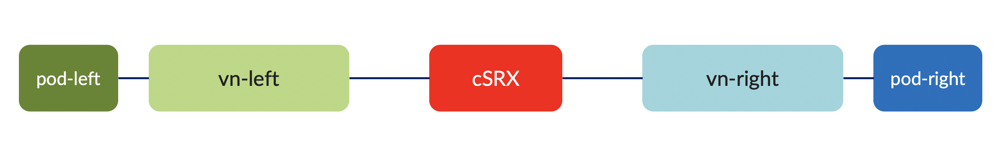
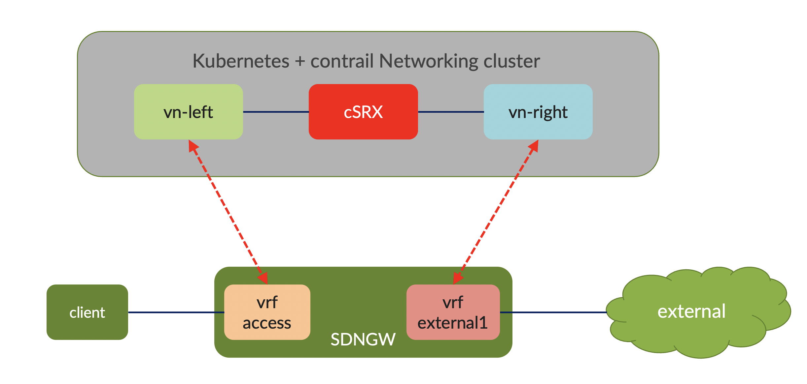

# Testing service chaining 
## Simple topology 

1. Create namespace for the lab

        kubectl apply -f lab4_ns.yaml

2. create virtual networks for the lab

        kubectl apply -f lab4_vn1.yaml

3. create pod-left and pod-right, to test connectivity between left and right 

        kubectl apply -f lab4_pod1.yaml

4. Create workload using csrx

        kubectl apply -f lab4_csrx_no_nat.yaml
        kubectl apply -f lab4_csrx1.yaml

5. On contrail dashboard
    - create policy to forward traffic between vn-left and vn-right
    - create service template with the following configuration
        * service mode : In-Network
        * service type : firewall
        * interface : left and right
    - create service instance based on the previous template and csrx instance
    - configure policy with service using the above service instance

6. Verify that traffic from pod-left to pod-right are being forwarded through service instance/csrx

## edge computing topology

1. on SDN Gateway create two routing instances, access and external2.
    - VRF Access for connection to client
    - VRF external for connection to external network/internet
2. VRF access configuration

        set interfaces ge-0/0/2 unit 0 family inet address 172.16.201.1/24
        set routing-instances access instance-type vrf
        set routing-instances access routing-options multipath vpn-unequal-cost
        set routing-instances access interface ge-0/0/2.0
        set routing-instances access vrf-target target:64512:20013
        set routing-instances access vrf-table-label
3. VRF external2 configuration

        set routing-instances external2 instance-type vrf
        set routing-instances external2 protocols bgp group to_gw neighbor 172.16.13.132 peer-as 65200
        set routing-instances external2 interface ge-0/0/0.2
        set routing-instances external2 vrf-target target:64512:20012
        set routing-instances external2 vrf-table-label
        set interfaces ge-0/0/0 unit 2 vlan-id 2
        set interfaces ge-0/0/0 unit 2 family inet address 172.16.13.133/31

4. on contrail, configure the following
    - set route target for export and import route between :
        * vn-left and VRF access
        * vn-right and VRF external1
    - configure vn-left and vn-right to allow-transit

5. Verify the content of the routing table
    - on SDN Gateway
        * VRF access routing table
        * VRF external2 routing table
    - on Contrail controller
        * vn-left routing table
        * vn-right routing table

6. Test connectivity between client and external and verify that the traffic is being forwarded through service instance csrx

