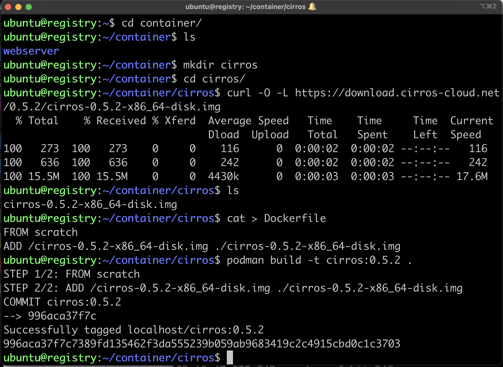
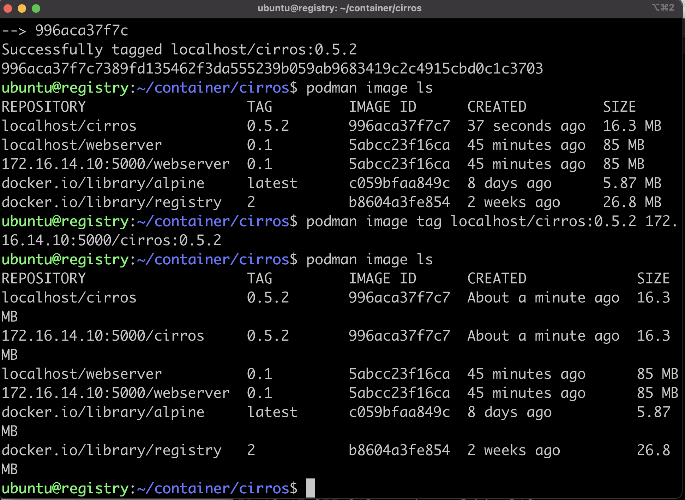
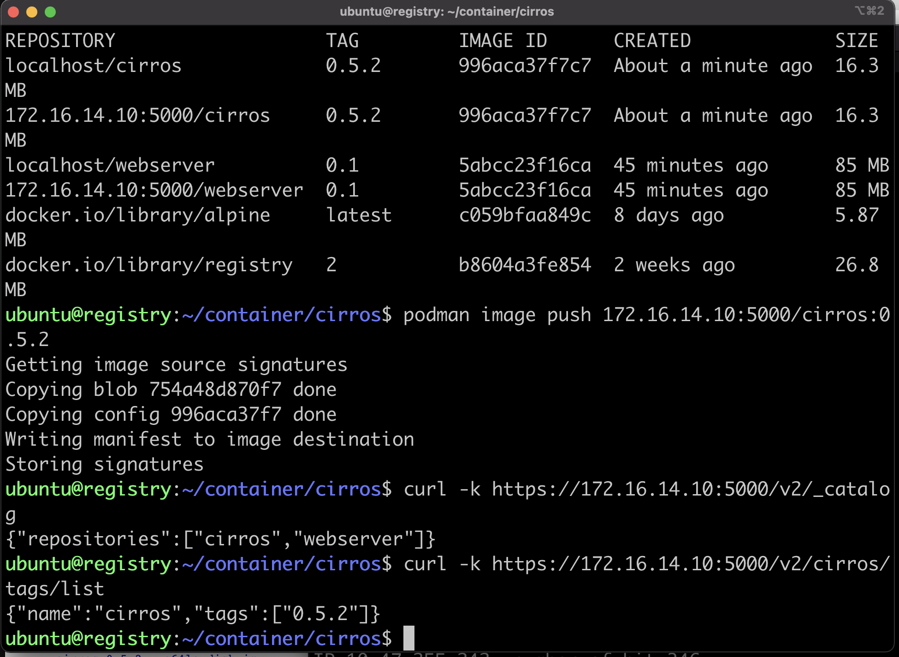
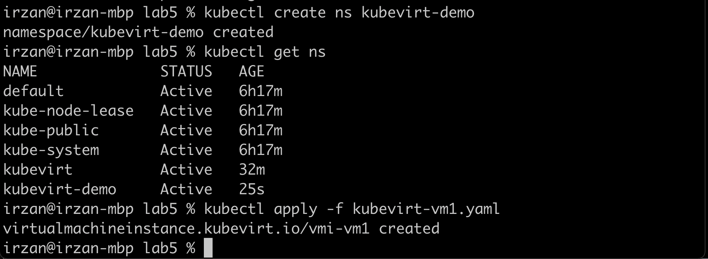
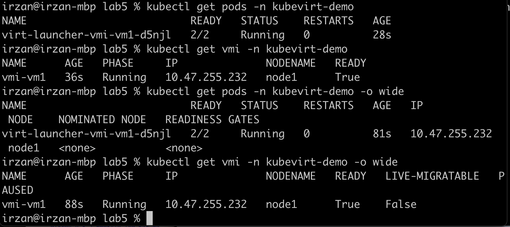
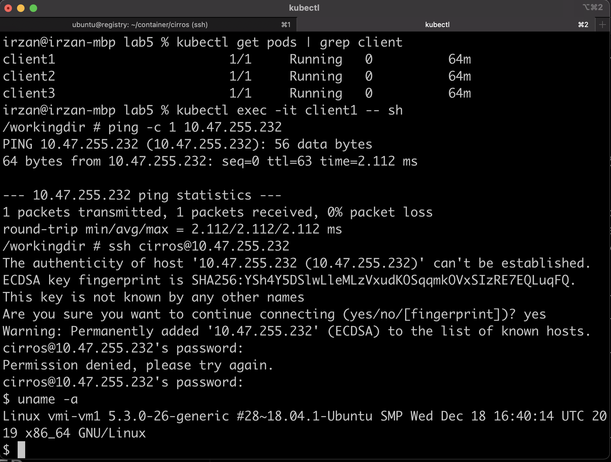

# Using Kubevirt run virtual machine on kubernetes cluster
In this lab exercise, kubevirt will be configured to allow VM(Virtual machine) to be run on kubernetes worker node.

Contrail networking will provide common virtual network for Pods/Container and Virtual Machine

## Notes

At the time this documentation was created, the working version of kubevirt with kubernetes + contrail is version 0.48.
I tried version 0.49, but the kubevirt pods keep crashing.

## Installing kubevirt 

Documentation on how to install kubevirt on k8s + contrail networking is [here](https://www.juniper.net/documentation/en_US/contrail20/topics/task/installation/how-to-enable-kubevirt-kubernetes.html)

1. check the latest version of kubevirt on [this url](https://kubevirt.io/blogs/releases.html)
2. Edit file [download_kubevirt.sh](download_kubevirt.sh), edit the version, and upload it into node **master**
3. Run the script on node master to download the yaml for kubevirt operator and kubevirt CRD

        ./download_kubevirt.sh
4. install kubevirt operator using the following command, and wait until kubevirt operator is deployed

        kubectl create -f kubevirt-operator.yaml
        kubectl get pods -n kubevirt

5. install kubevirt CRD using the following command, and wait until kubevirt CRD are deployed

        kubectl create -f kubevirt-cr.yaml
        kubectl get pods -n kubevirt

6. on the compute node, run the following command to verify that hardware virtualization is supported

        sudo virt-host-validate qemu

7. if hardware virtualization is not supported, then software emulation fallback must be enabled. do the following steps to enable software emulation

        kubectl create cm kubevirt-config -n kubevirt
        kubectl edit cm kubevirt-config -n kubevirt

        add the following entries 

            data:
                debug.useEmulation: "true"
8. Restart the virt-handler pods

        kubectl -n kubevirt delete pod -l k8s-app=virt-handler

## Creating container image for VM in the kubevirt
1. Open ssh sesssion into node **registry**
2. Download the VM image that you want to use. For example for linux cirros, you can download it from [https://download.cirros-cloud.net/](https://download.cirros-cloud.net/), or for ubuntu, you can download it here 
3. Create Dockerfile with the following content

        FROM scratch 
        ADD /cirros-0.5.2-x86_64-disk.img ./cirros-0.5.2-x86_64-disk.img

4. Build the container image using the command podman build -t <image_name>:<version> .

        podman build -t cirros:0.5.2 .

    
5. Tag the image using the ip address and port of the registry 

        podman image ls
        podman image tag <image_name>:<version> <ip_of_registry>:<port>/<image_name>:<version>

    
6. Push the image into the registry 
        
        podman  image push <ip_of_registry>:<port>/<image_name>:<version>

    

## Creating and starting virtual machine
1. Create a namespace called : kubevirt-demo

        kubectl create ns kubevirt-demo
        kubectl get ns

2. Create manifest file [kubevirt-vm1.yaml](kubevirt-vm1.yaml]), to create Virtual machine

        apiVersion: kubevirt.io/v1alpha3
        kind: VirtualMachineInstance
        metadata:
        labels:
            special: vmi-vm1
        name: vmi-vm1
        namespace: kubevirt-demo
        spec:
        domain:
            devices:
            disks:
            - disk:
                bus: virtio
                name: containerdisk
            - disk:
                bus: virtio
                name: cloudinitdisk
            interfaces:
            - name: default
                bridge: {}
            resources:
            requests:
                memory: 128M
        networks:
        - name: default
            pod: {}
        volumes:
        - containerDisk:
            image: 172.16.14.10:5000/cirros:0.5.2
            path: /cirros-0.5.2-x86_64-disk.img
            name: containerdisk
        - cloudInitNoCloud:
            userData: |-
                #cloud-config
                password: pass01
                ssh_pwauth: True
                chpasswd: { expire: False }
            name: cloudinitdisk

3. Create the virtual machine using kubectl

        kubectl apply -f kubevirt-vm1.yaml 

    

4. Check the kubevirt launcher pods status

        kubectl get pods -n kubevirt-demo -o wide
5. Check the VM status 

        kubectl get vmi -n kubevirt-demo -o wide
    

## Accessing the VM from another pods
1. Get the ip address of the VM

        kubectl get vmi -n kubevirt-demo -o wide

1. access one of the pods in the k8s cluster

        kubectl get pods | grep client
        kubectl exec -it <pod_name> -- sh 

2. From the pod, open ssh session to the VM (for cirros image, the default username/password is cirros/gocubsgo)

        ssh cirros@<ip_of_the_VM>

    

## Allowing access into VM from external
1. Create manifest file [kube-vm1-svc.yaml](kube-vm1-svc.yaml)

        apiVersion: v1
        kind: Service
        metadata:
        name: vmi-vm1-ssh-svc
        namespace: kubevirt-demo
        spec:
        ports:
        - port: 22
          targetPort: 22
          #nodePort: 32022
        selector:
            special: vmi-vm1
        type: LoadBalancer

2. Create the kuberneres services

        kubectl apply -f kube-vm1-svc.yaml

3. open ssh sesssion from external into the floating IP assigned by loadbalancer

        kubectl -n kubevirt-demo get svc
        ssh cirros@<floating IP>