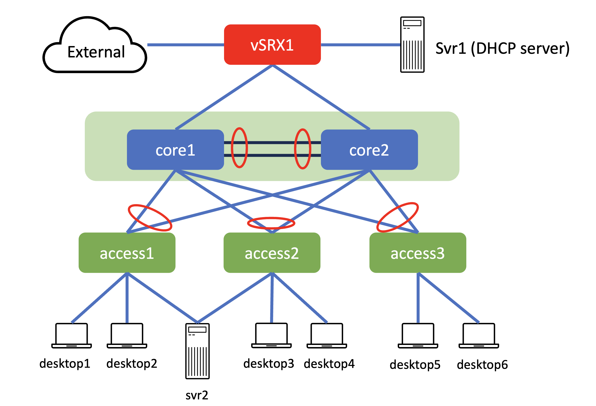
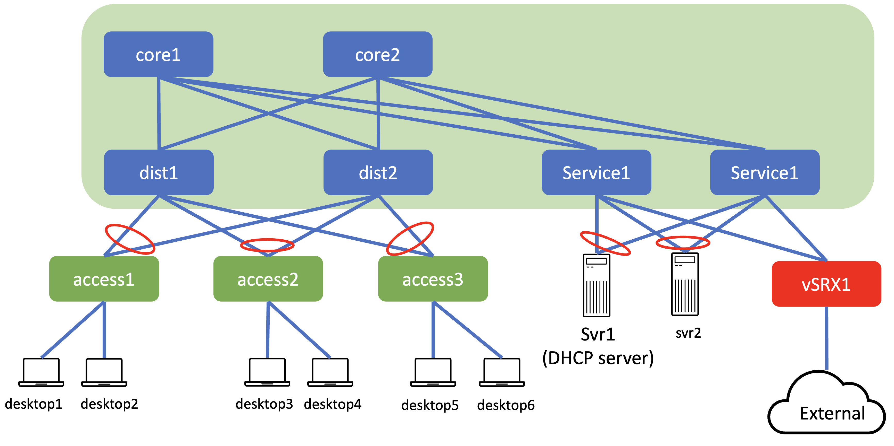
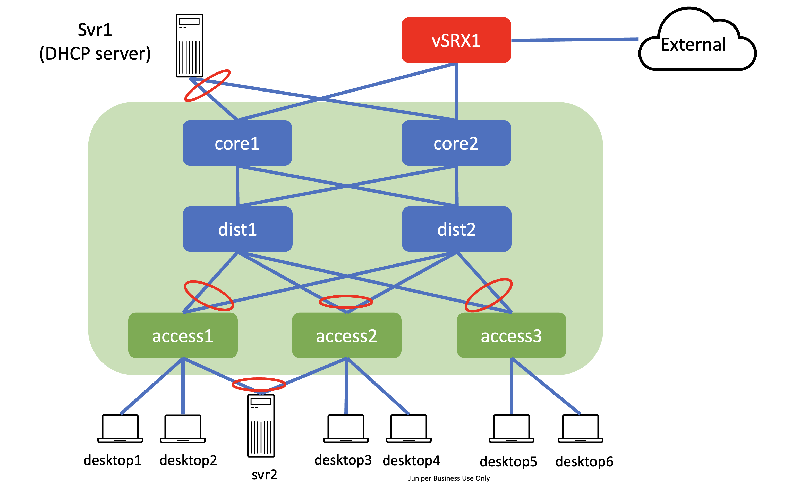
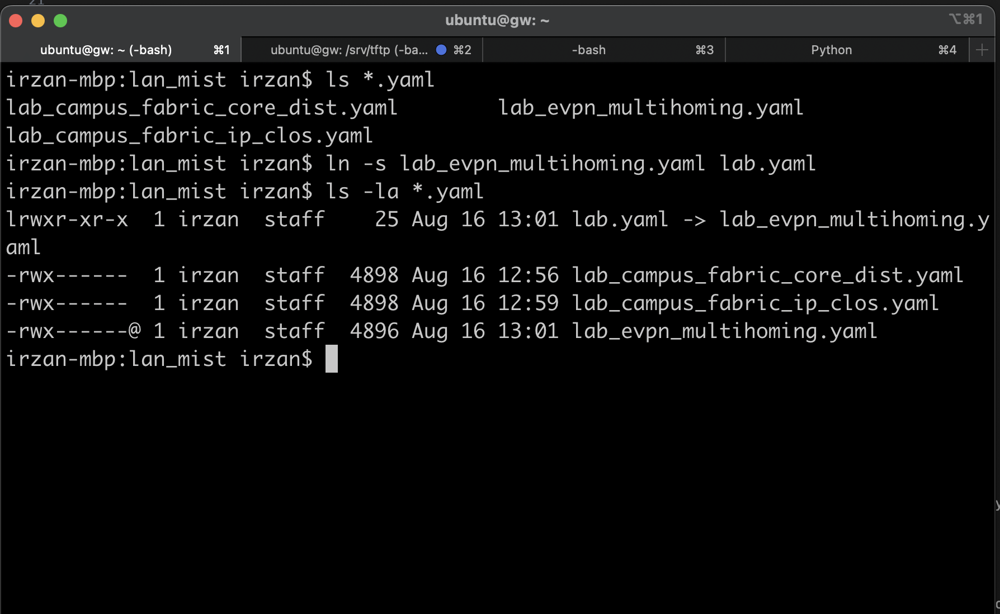
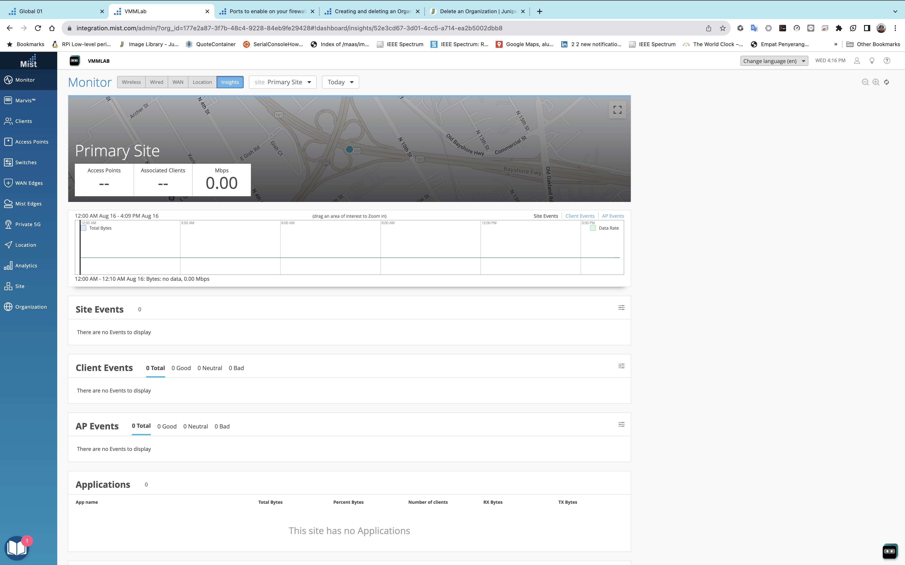
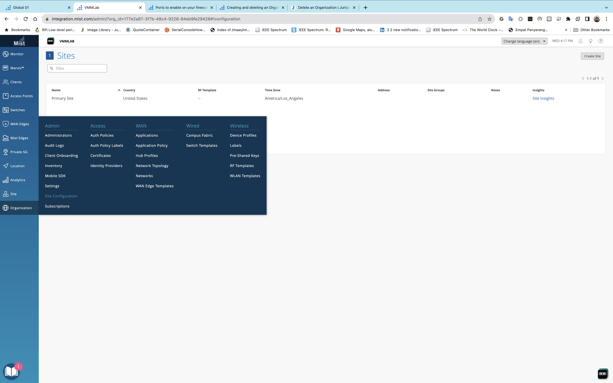
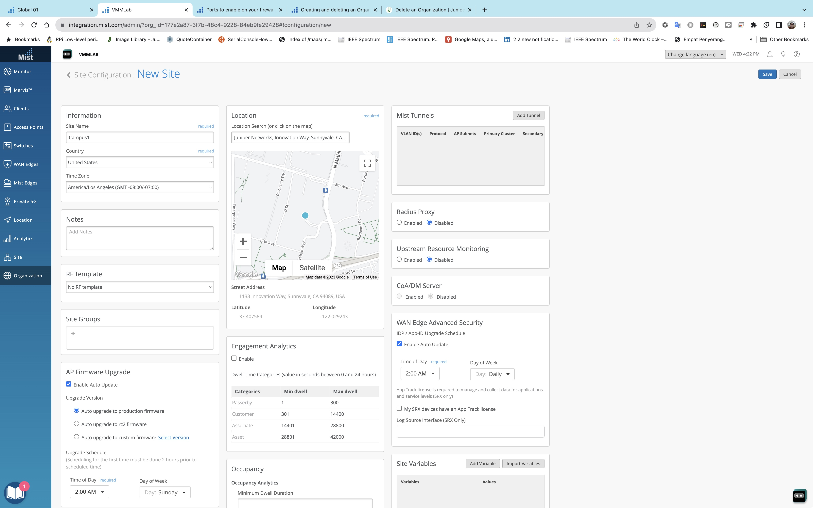
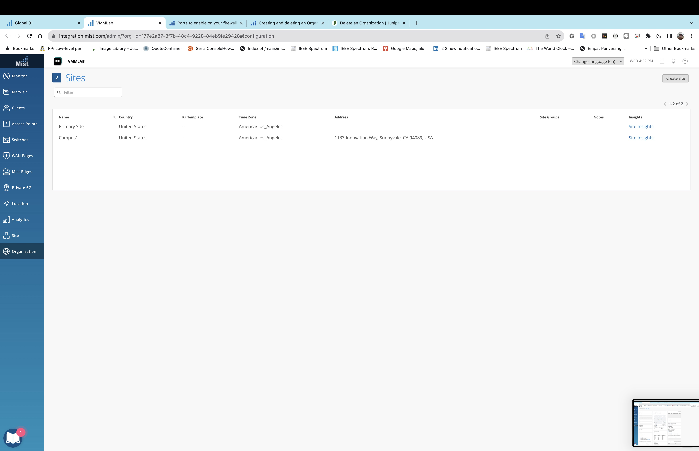

# campus network using MIST

## Topology
The logical topology of the testbed is as follows :

### Campus Fabric: EVPN multihoming

### Campus Fabric: Core-distribution EVPN

### Campus Fabric: IP Close

## Devices in the lab

- Campus switches
    - core : core1 and core2 (vJunos)
    - access: access1, access2, access3 (vJunos)
- Internet FW : vSRX
- MIST portal (https://integration.mist.com)
- User End point:
    - desktop1, desktop2, desktop3, desktop4 (Ubuntu linux with Gnome Desktop), as dhcp client
    - svr2 (ubuntu linux) as dhcp client with LAG interfaces
    - svr1 (ubuntu linux), as dhcp server

## Credential to access devices
- Ubuntu linux/Desktop
    - user: ubuntu
    - password: pass01
- vJunos
    - user: admin
    - password: pass01

# To create the lab topology and initial configuration of VMs
1. Go to directory [lan_mist](./)
2. There are three configuration for Campus EVPN/Vxlan
    - [lab_evpn_multihoming.yaml](lab_evpn_multihoming.yaml)
    - [lab_campus_fabric_core_dist.yaml](lab_campus_fabric_core_dist.yaml)
    - [lab_campus_fabric_ip_clos.yaml](lab_campus_fabric_ip_clos.yaml)

   Select which lab which will be deployed, and link the yaml configuration file into file lab.yaml

   

    
2. Edit file [lab.yaml](./lab.yaml). Set the following parameters to choose which vmm server that you are going to use and the login credential:
    - vmmserver 
    - jumpserver
    - user 
    - adpassword
    - ssh_key_name ( please select the ssh key that you want to use, if you don't have it, create one using ssh-keygen and put it under directory **~/.ssh/** on your workstation )
3. If you want to add devices or change the topooogy of the lab, then edit file [lab.yaml](lab.yaml)
4. use [vmm.py](../../vmm.py) script to deploy the topology into the VMM. Run the following command from terminal

        ../../vmm.py upload  <-- to create the topology file and the configuration for the VMs and upload them into vmm server
        ../../vmm.py start   <-- to start the topology in the vmm server

5. Verify that you can access node **gw** using ssh (username: ubuntu,  password: pass01 ). You may have to wait for few minutes for node **gw** to be up and running
6. Run script [vmm.py](../../vmm.py) to send and run initial configuration (such as ip address, dhcp server, and upload vjunos configuration into TFTP server) on node **gw**

        ../../vmm.py set_gw

7. Wait for few minutes for all vJunos devices to be up and running and download the initial configuration (through ZTP) from node **gw**
8. To verify, the following methods can be used
    a. open ssh session directly into the vJunos Devices from your workstation

    [screen recording of this method](https://asciinema.org/a/dAbsQqSd4NM9T7iCxrR87qmVa)

    b. open ssh session to GW, and test connectivity (ping and ssh ) to the vJunos Devices

    [screen recording of this method](https://asciinema.org/a/flj3yxWAhrdkSu053gX3O7VIb)
    

    c. open ssh session to VMM, and access serial console of vJunos

    [screen recording of this method](https://asciinema.org/a/mfLyNwOSnmd4Hu5F2Xvj9EXe2)

## Adopting vJunos into Mist Portal
1. open mist portal  [https://integration.mist.com](https://integration.mist.com)

2. If you don't have an account, create one.

3. Login into MIST portal

4. Create Organization to run the Lab exercise

5. From the menu, select Organization > Site Configuration, and create a new site. Save it.

    

## Setup Juniper Apstra
1. Open console of VM of juniper Apstra. Open ssh session into node vmm, and run command **vmm serial -t apstra**

        ssh vmm
        vmm serial -t apstra

2. Login into AOS using the default username/password : admin/admin, and change the default password
 

5. Currently node **apstra** is configured with dhcp for Ip address assignment. If you want change the ip address to static, change it to the following:
    - ip address : 172.16.10.2/24
    - gateway : 172.16.10.1
    - dns : 10.49.32.95, 10.49.32.97

6. Restart AOS services
7. Enter the command line of apstra server
8. on the home directory /home/admin, create directory .ssh

        mkdir /home/admin/.ssh

9. from node **gw (ip 172.16.10.1)**, copy directory /home/ubuntu/.ssh into /home/admin/.ssh on node **apstra**. username/password to access 172.16.10.1 is ubuntu/pass01

        on node apstra

        scp ubuntu@172.16.10.1:~/.ssh/* ~/.ssh/

## Accesing Web UI of AOS

1. From your workstation, open ssh session to node **proxy** and keep this session open if you need to access the web dashboard of Paragon Automation platform

        ssh proxy 

2. If you are using Firefox as web browser, set proxy with the following parameters
    - manual proxy configuration
    - SOCKS host : 127.0.0.1
    - PORT : 1080
    - type: SOCKS v4    
    

3. If you are using Chrome as web browser, install extension Foxy Proxy and configure it with the following parameters
    - manual proxy configuration
    - SOCKS host : 127.0.0.1
    - PORT : 1080
    - type: SOCKS v4    
    
    

4. Open http session to https://172.16.10.2, and login using default credential, user/password: admin/admin
  
  

5. Check the status of the devices. Select **Devices**>**Managed devices**. It should be empty, since we haven't discovered any devices yet.

    

6. Check the status of ztp of the  devices. Select **Devices**>**ZTP Status**>**devices**. It should be empty, since we haven't discovered any devices yet.

    

6. Check the status of ztp services. Select **Devices**>**ZTP Status**>**Services**. It should be empty, since we haven't configured ZTP yet.

    

7. Create one user with the following parameter. On the Apstra dashboard, select **Platform**>**User Management**>**Users**

        user: ztp
        global roles:  device_ztp
        password: J4k4rt4#01  # password for ztp user
    
    
    

8. If the lab is using vEX version 23.X and apstra version 4.1.2, then do the following steps
9. click Devices > Device profiles
10. Search for device profile **vEX**, and clone it

    
11. Set the name, for example Juniper vEX 23.X

    
11. click on selector, and edit Version from (1[89]|2[0-2])\\\..* to (1[89]|2[0-3])\\\..

    

12. Click Clone to save it.

    

## Setup of Apstra ZTP server
1. Open console of VM of Apstra ZTP. Open ssh session into node vmm, and run command **vmm serial -t ztp**

        ssh vmm
        vmm serial -t ztp
2. Login into AOS using the default username/password : admin/admin
3. Edit the network configuration of the VM, by editing file /etc/netplan/01-netcfg.yaml
4. Set the network configuration with the following parameter
    - ip address/netmask : 172.16.10.3/24
    - gateway : 172.16.10.1
    - DNS server: 66.129.233.81, 66.129.233.82

5. or make the content of file /etc/netplan/01-netcfg.yaml into the following

        cat << EOF  | sudo tee /etc/netplan/01-netcfg.yaml
        network:
            version: 2
            # renderer: networkd
            ethernets:
                eth0:
                    dhcp4: false
                    addresses: [ 172.16.10.3/24]
                    gateway4: 172.16.10.1
                    nameservers:
                        addresses: [ 8.8.8.8, 8.8.4.4 ]
        EOF

6. Apply network configuration using the following command

        ip addr show dev eth0
        sudo netplan apply
        ip addr show dev eth0

7. Verify that from node **ztp**, it can reach other node, such **gw**/172.16.10.1 and **apstra**/172.16.10.2

        ping 172.16.10.1
        ping 172.16.10.2

8. on the home directory /home/admin, create directory .ssh

        mkdir /home/admin/.ssh

9. from node **gw (ip 172.16.10.1)**, copy directory /home/ubuntu/.ssh into /home/admin/.ssh on node **aztp**

        on node ztp

        scp ubuntu@172.16.10.1:~/.ssh/* ~/.ssh/

10. On VM ZTP, edit file /containers_data/status/app/aos.conf

        sudo vi /containers_data/status/app/aos.conf

        or run the following

        cat << EOF | sudo tee /containers_data/status/app/aos.conf
        {
        "ip": "172.16.10.2",
        "user": "ztp",
        "password": "J4k4rt4#01"
        }
        EOF

11. Change the entries to the following:
    
        ip: 172.16.10.2          ## Ip address of apstra server
        user: ztp                ## ztp user that you have created on apstra server
        password: <password>     ## password that you set for user ztp   

     

12. Save the file.
13. Restart container **status**

        docker restart status

    

14. On Apstra dashbord, under **Devices** > **ZTP Status** > **Services**, verify that services are up and registered with Apstra server.

  

15. On node **ztp**, edit file /containers_data/tftp/ztp.json

        sudo vi /containers_data/tftp/ztp.json

16. for entry **junos-versions** add the current version of Junos being used in the lab, for example 21.2R3-S1.7

    
    
    

17. under key "junos" add another key "custom-config"

        "junos": {
            "device-root-password": "root123",
            "device-user-password": "aosadmin123",
            "custom-config": "junos_custom1.sh",
            
            ...
        }

    
    

18. Save the file /containers_data/tftp/ztp.json
19. Under directory /containers_data/tftp/, create file junos_customer1.sh with the following content

        #!/bin/sh 
        cli -c "configure; set system commit synchronize; set chassis evpn-vxlan-default-switch-support; commit and-quit"
    
    or the following script can be used to create the file

        cat << EOF | sudo tee /containers_data/tftp/junos_custom1.sh
        #!/bin/sh 
        cli -c "configure; set system commit synchronize; set chassis evpn-vxlan-default-switch-support; commit and-quit"
        EOF

    this step is required because vEX is virtual junos with EX9214 personality, and Apstra assume that it has dual RE (routing engine). On vEX, there is only one RE, therefore when apstra try to discover vEX it will fail.

20. Set file /containers_data/tftp/junos_custom1.sh to be executable

        sudo chmod +x /containers_data/tftp/junos_custom1.sh

21. Restart container **tftp**

        docker restart tftp

    
    

22. From your workstation, under directory [home directory]/git/vmm-v3-script/Lab/lan_mist/tmp, there is a file ztp_config.txt. Upload this file into node **ztp**. You may need to edit this file to include the subnet for ip pool.
    

        scp tmp/ztp_config.txt ztp:~/

23. open ssh session into node **ztp**, enter admin mode, and change directory to /containers_data/dhcp

    ssh ztp
    sudo -s
    cd /containers_data/dhcp

24. add the content of file ~/ztp_config.txt into file /containers_data/dhcp/dhcpd.conf

        cat ~/ztp_config.txt | sudo tee -a  /containers_data/dhcp/dhcpd.conf

25. Edit file  /containers_data/dhcp/dhcpd.conf

        sudo vi  /containers_data/dhcp/dhcpd.conf

26. Edit section **Step 2**, delete stanza **group {}**

    
    
    

27. Under section **step 3**, edit the dns information, such as domain name, dns-search, and dns servers

    
    

28. Save the file, ESC :wq!

29. Restart container **dhcp**

        docker restart dhcpd

    

## Upload configuration into node PE1, PE2, PE3 and P1

1. router PE1, PE2, PE3, and P1 must be configured to allow ztp/dhcp traffic forwarded between DC1, DC2, DC3 and apstra management network.
2. To upload configuration, use ansible script [upload_config.yaml](router/upload_config.yaml)

        cd router
        ansible-playbook upload_config.yaml

3. Now routers are configured, and vEX will go through the ZTP process.

4. On Apstra UI Dashboard, go to **Devices**>**ZTP Status**>**Devices**, to verify that network devices (swithes) are discovered through ZT6

    

5. Wait until the **ZTP status** is **completed**

    

## Lab exercise

You can refer to [this document](LabExercise/README.md) for lab exercise

