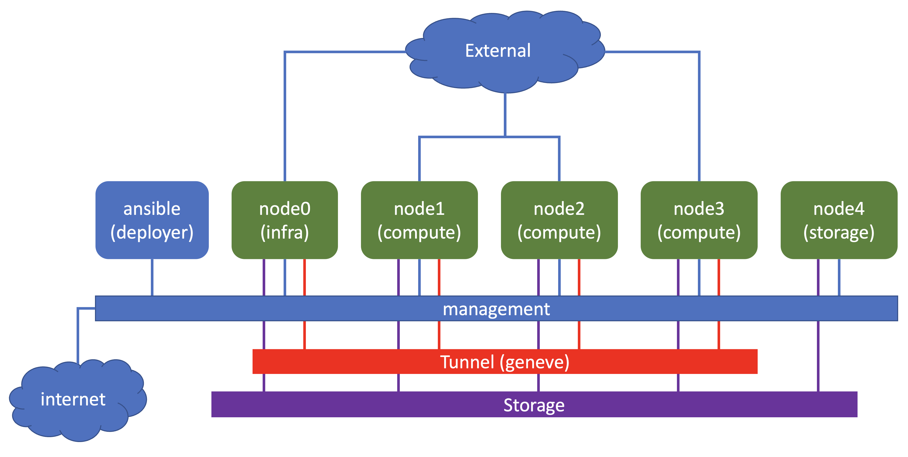

# Install openstack using ansible

Based on the following :
- [documentation](https://docs.openstack.org/project-deploy-guide/openstack-ansible/zed/)
- [blog post 1](https://satishdotpatel.github.io/openstack-ansible-ovn-deployment-part1/)
- [blog post 2](https://satishdotpatel.github.io/openstack-ansible-ovn-deployment-part2/)

## Topology

## Node
- ansible : deployer node
- node0: infrastructure node
- node1, node2, node3: compute node
- node4: storage node (cinder)

## Caveat
- iscsi initiator name on each compute nodes must be unique (/etc/iscsi/initiatorname.iscsi)

## Creating the lab topology and initial configuration of VMs
1. Go to directory [openstack_ansible](./)
2. Edit file [lab.yaml](./lab.yaml). Set the following parameters to choose which vmm server that you are going to use and the login credential:
    - vmmserver 
    - jumpserver
    - user 
    - adpassword
    - ssh_key_name ( please select the ssh key that you want to use, if you don't have it, create one using ssh-keygen and put it under directory **~/.ssh/** on your workstation )
3. If you want to add devices or change the topooogy of the lab, then edit file [lab.yaml](lab.yaml)
4. use [vmm.py](../../vmm.py) script to deploy the topology into the VMM. Run the following command from terminal

        ../../vmm.py upload  <-- to create the topology file and the configuration for the VMs and upload them into vmm server
        ../../vmm.py start   <-- to start the topology in the vmm server

5. Verify that you can access node **gw** using ssh (username: ubuntu,  password: pass01 ). You may have to wait for few minutes for node **gw** to be up and running
6. Run script [vmm.py](../../vmm.py) to send and run initial configuration on node **gw**

        ../../vmm.py set_gw
7. Run script [vmm.py](../../vmm.py) to send and run initial configuration on node **sw1** (virtual EX)

        ../../vmm.py init_junos

8. Run script [vmm.py](../../vmm.py) to send and run initial configuration on linux nodes. This script will also reboot the VM. So wait before you test connectivity into the VM

        ../../vmm.py set_host

9. change directory to [linux_node](./linux_node), and run ansible playbook [update_system.yaml](linux_node/update_system.yaml) to install the necessary software packages into the VMs.

        cd linux_node
        ansible-playbook update_system.yaml

## installation step
1. open ssh session into node ansible
2. clone the openstack ansible git

        git clone -b 26.0.1 https://opendev.org/openstack/openstack-ansible /opt/openstack-ansible
        cd /opt/openstack-ansible
        scripts/bootstrap-ansible.sh

3. copy openstack_deploy directory to /etc

        cp -R /opt/openstack-ansible/etc/openstack_deploy /etc/

4. from your workstation, copy the following files to ansible node

        scp openstack_user_config.ovn.yaml root@ansible:/etc/openstack_deploy/openstack_user_config.yml
        scp user_variables.yml root@ansible:/etc/openstack_deploy
        scp nova.yml root@ansible:/etc/openstack_deploy/env.d/
        scp neutron.yml root@ansible:/etc/openstack_deploy/env.d/
        ssh root@ansible "mkdir -p /etc/openstack_deploy/group_vars"
        scp network_hosts root@ansibe:/etc/openstack_deploy/group_vars/

5. create secret

        cd /opt/openstack-ansible
        ./scripts/pw-token-gen.py --file /etc/openstack_deploy/user_secrets.yml

6. on node ansible, run the ansible playbook

        cd /opt/openstack-ansible/playbooks 
        openstack-ansible setup-infrastructure.yml --syntax-check
        openstack-ansible setup-hosts.yml
        openstack-ansible setup-infrastructure.yml
        ansible galera_container -m shell -a "mysql -h localhost -e 'show status like \"%wsrep_cluster_%\";'"
        openstack-ansible setup-openstack.yml
        
