# Installing Openstack and contrail networking

## Introduction 
This document provide guide on how to install openstack and contrail networking.

## note
This deployment is running on centos 7 with openstack kolla.

Documentation on how to install openstack and contrail networking using contrail command can be found [here](https://www.juniper.net/documentation/en_US/contrail20/topics/task/installation/how-to-install-contrail-command-and-provision-cluster.html)

## Topology
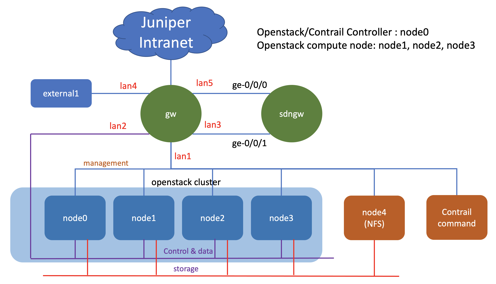

## Devices in the lab
- VMX: SDNGW , SDN gateway 

- openstack/contrail :

        * openstack and contrail controller: node0
        * openstack compute node: node1, node2, node3
        * NFS share for shared storage : node4
        * cc : contrail command to deploy openstack and contrail software

## To create the lab topology and initial configuration of VMs
1. Go to directory [openstack + contrail Lab](./)
2. Edit file [lab.yaml](./lab.yaml). Set the following parameters to choose which vmm server that you are going to use and the login credential:
    - vmmserver 
    - jumpserver
    - user 
    - adpassword
    - ssh_key_name ( please select the ssh key that you want to use, if you don't have it, create one using ssh-keygen and put it under directory **~/.ssh/** on your workstation )
    - disk image for the node. If you don't have the disk images, then you can copy it from my home directory, /homes/irzan/images/, and put them into your home directory

3. If you want to add devices or change the topology of the lab, then edit file [lab.yaml](lab.yaml)
4. use [vmm.py](../../vmm.py) script to deploy the topology into the VMM. Run the following command from terminal

        ../../vmm.py upload  <-- to create the topology file and the configuration for the VMs and upload them into vmm server
        ../../vmm.py start   <-- to start the topology in the vmm server

5. Verify that you can access node **gw** using ssh (username: ubuntu,  password: pass01 ). You may have to wait for few minutes for node **gw** to be up and running
6. Run script [vmm.py](../../vmm.py) to send and run initial configuration on node **gw**

        ../../vmm.py set_gw

7. Verify that you can access other nodes (linux and junos VM), such **master**, **node1**, **node2**, etc. Please use the credential to login.

        ssh master

8. Run script [vmm.py](../../vmm.py) to send and run initial configuration on linux nodes. This script will also reboot the VM. So wait before you test connectivity into the VM

        ../../vmm.py set_host

9. Verify that you can access linux and junos VMs, such **master**, **node1**, **sdngw**, without entering the password. You may have to wait for few minutes for the nodes to be up and running

        ssh node0
        ssh node1
        ssh cc

##  Installing Contrail Command deployer container 
1. On terminal, enter directory [contrail_command](contrail_command/), and upload all files into node **cc**

        cd contrail_command
        scp * cc:~/

2. open ssh session into node **cc**, and execute script [install_docker.sh](contrail_command.sh).

        ssh cc
        ./install_docker.sh

3. Logout from node **cc** and login in back into node **cc**

4. Run script [docker_login.sh](contrail_command/docker_login.sh)

        ./docker_login.sh

5. Run script [run_deployer.sh](contrail_command/run_deployer.sh), and wait until Contrail command container is deployed

        ./run_deployer.sh

6. View the logging of contrail command logging to verify that contrail command is deployed

        docker ps -a
        docker logs -f contrail_command_deployer

7. Veirfy that contrail command is deployed

        docker ps -a

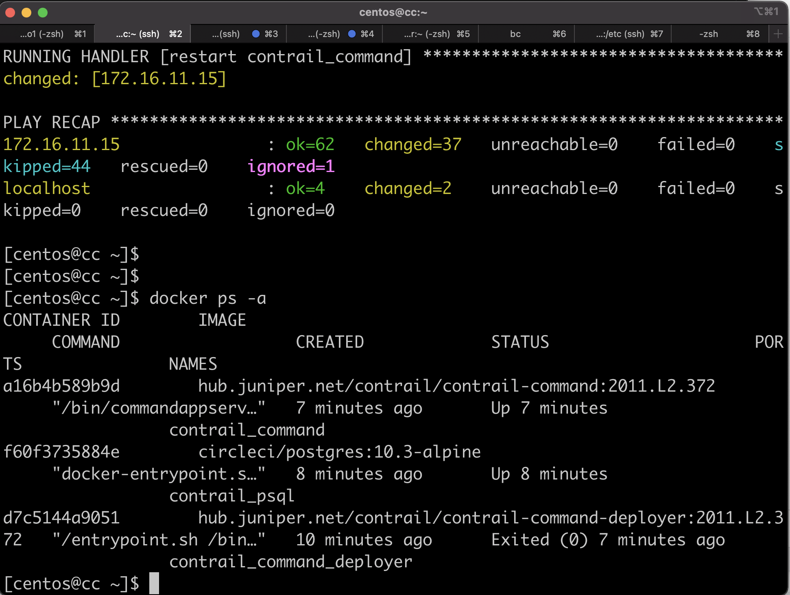

## Accessing Web Interface of the lab

1. From your workstation, open ssh session to node **proxy** and keep this session open if you need to access the web dashboard of Contrail Commmand, openstack, or contrail Web UI

        # option -f is to run ssh session in the background
        # option -N is for ssh not to execute command, such as shell login

        ssh -f -N proxy 

2. If you are using Firefox as web browser, set proxy with the following parameters
    - manual proxy configuration
    - SOCKS host : 127.0.0.1
    - PORT : 1080
    - type: SOCKS v4    
    

3. If you are using Chrome as web browser, install extension Foxy Proxy and configure it with the following parameters
    - manual proxy configuration
    - SOCKS host : 127.0.0.1
    - PORT : 1080
    - type: SOCKS v4    
    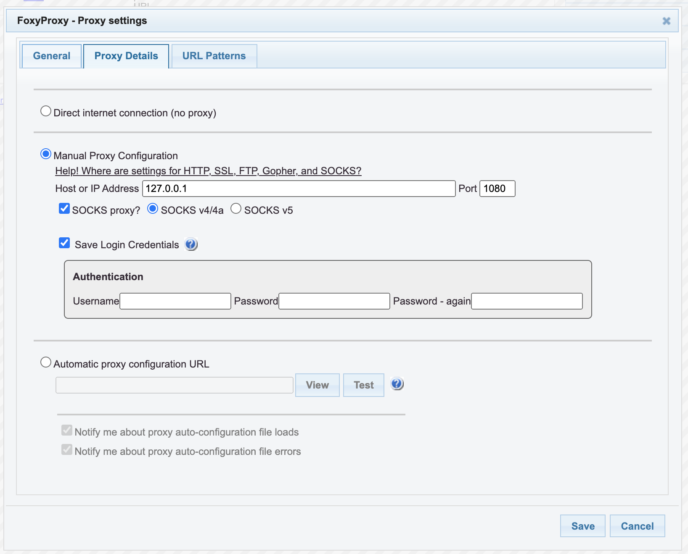
    

    It is recommended to run a different user profile to install Foxy proxy extension. 
    
    By doing this, Internet access will still be available on chrome existing user profile.

## Configuring contrail command to deploy openstack and contrail into the nodes
1. Open web dashboard of contrail command, https://172.16.11.15:9091. 
2. Use username/password: admin/pass01 , as configured on file [command_servers.yml](contrail_command/command_servers.yml)

2. If the following page is found, then click advance, and click somewhere on the page, and type "thisisunsafe" to bypass security checking on Chrome. (this method doesn't work on Firefox)

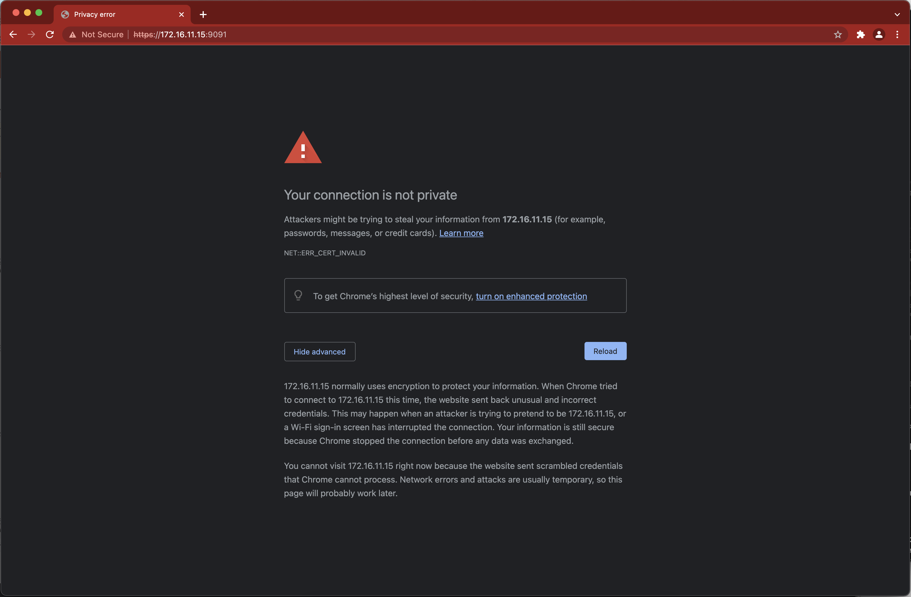
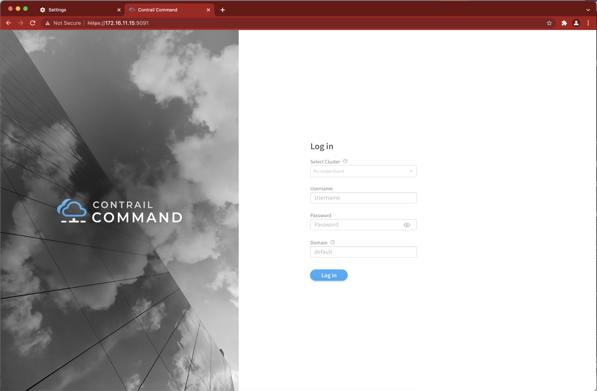

2. On step 1, click on tab **credentials**, and delete the exiting credential, and create new credential using user/password : root/pass01

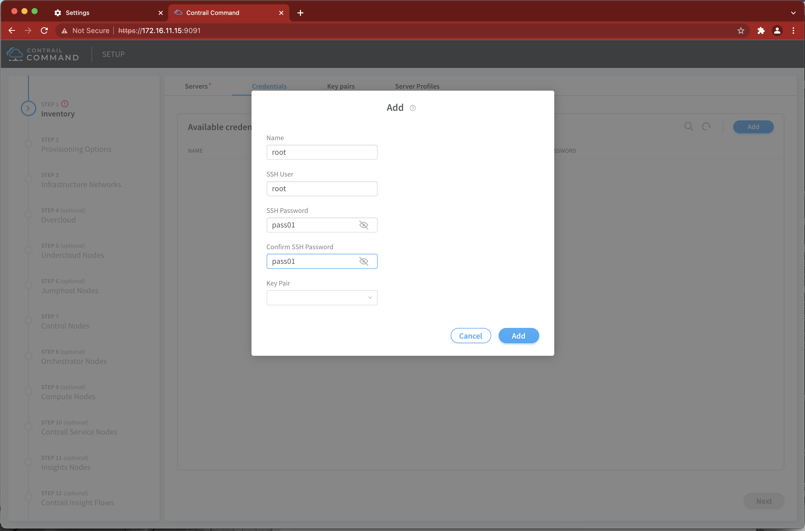

3. Click on tab **servers** and the following servers

hostname | management IP | management interface | credentials
-|-|-|-
node0|172.16.11.10| eth0| root
node1|172.16.11.11| eth0| root
node2|172.16.11.12| eth0| root
node3|172.16.11.13| eth0| root

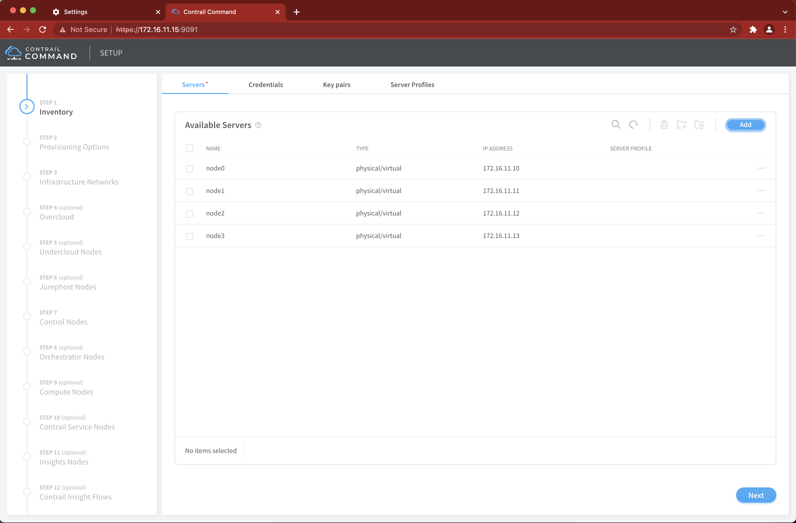

4. Click next to go to step 2
5. On step 2, provisioning options, set the following parameter

parameter | value |
-|-
Provisioning manager | Contrail enterprise multicloud
cluster name | cl1
container registry | hub.juniper.net/contrail
Container Registry Name | <registry_user>
Container Registry Password | <registry_password>
Contrail Version | 2011.L2.372 (or any version of contrail that you want to install)
Domain suffix | <leave_it_blank>
NTP server | ntp.juniper.net
Default Vrouter gateway | 172.16.12.1
Encapsulation Priority | MPLSoUDP, MPLSoGRE, VXLAN

Contrail Configuration
key | value
-|- 
UPGRADE_KERNEL| true
CONFIG_NODEMGR__DEFAULTS__minimum_diskGB|10
DATABASE_NODEMGR__DEFAULTS__minimum_diskGB|10
CONFIG_DATABASE_NODEMGR__DEFAULTS__minimum_diskGB|10
CONTROL_NODES|172.16.12.10

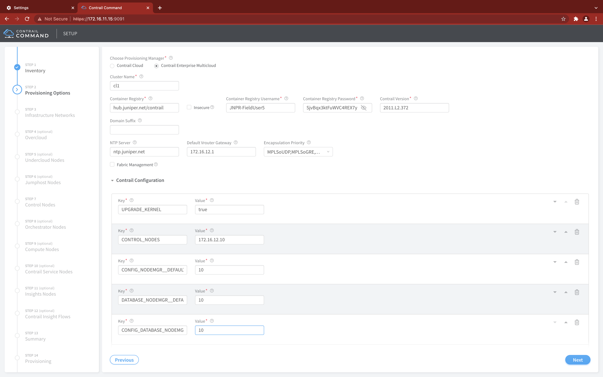

6. Click next to go to the next step
7. On Step 7, select node **node0** as control nodes

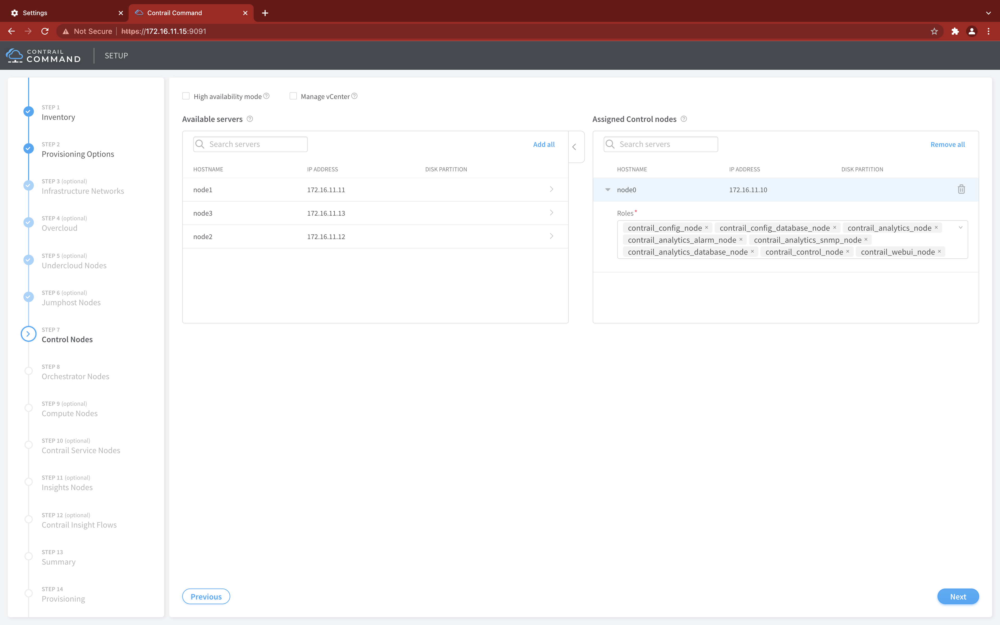

8. Click next to go to the next step
9. On Step 8, set the following 

Parameter | Value
-|-
Orchestrator type | openstack
openstack Node | node0
show advance| enabled
openstack version | queen
kolla_globals||
 |enable_haproxy|no
 |enable_swift|no
 |enable_ironic|no
kolla_passwords||
 | keystone_admin_password|pass01
 | metadata_secret|pass01

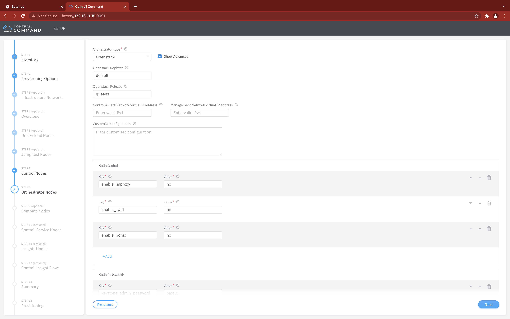

10. Click next to go to the next step
11. On step 9, 

- Assigned compute node : node1, node2, node3
- Default Vrouter gateway : 172.16.12.1
- Type : kernel

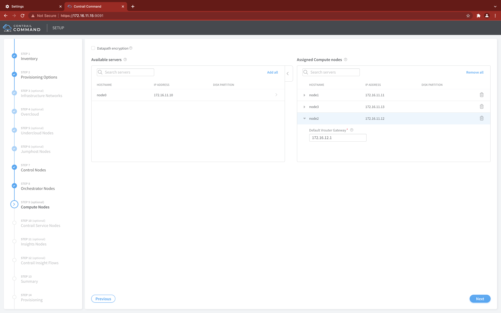

12. Click next to go to the next step (skip step 10,11, and 12)
13. On Step 13, click provisioning

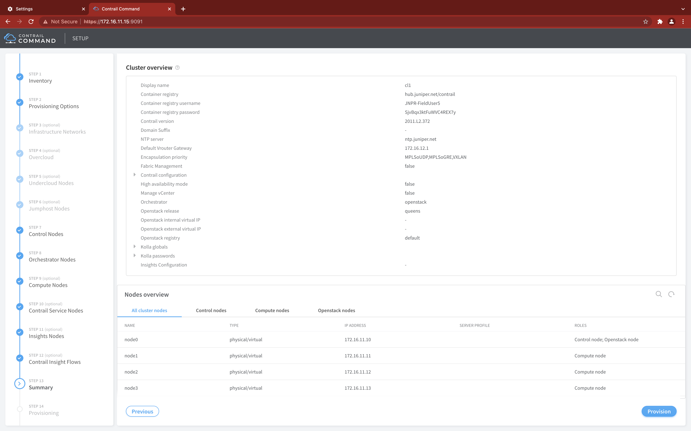

14. Open ssh session to node **cc** and run the following to view the log from contrail command container

        docker logs -f contrail_command or
        docker exec contrail_command tail -f /var/log/contrail/deploy.log

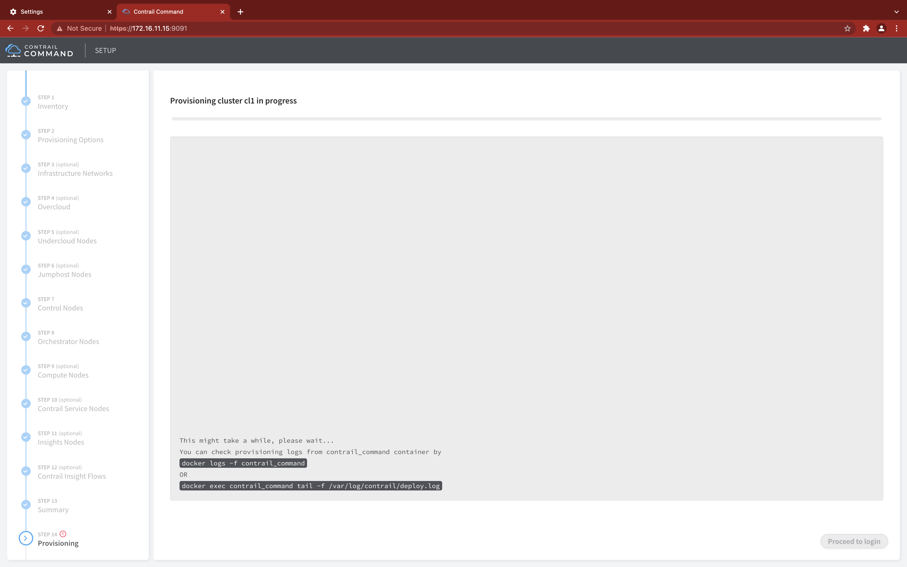

15. Wait until the provisioning of openstack and contrail networking is done

 
## Accessing web dashboard, Contrail Command, Openstack, Contrail Web UI (classic UI)

1. Use Chrome with foxy proxy installed and configured to access the web dashboard.
2. Open web dashboard of contrail command, https://172.16.11.15:9091
3. If the following page is found, then click advance, and click somewhere on the page, and type "thisisunsafe" to bypass security checking on Chrome. (this method doesn't work on Firefox)

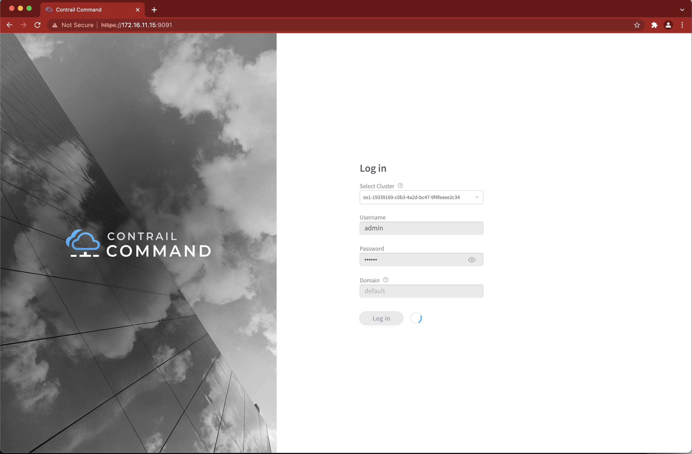

2. Open web dashboard of Openstack, https://172.16.11.10

3. Open web dashboard of Contrail Web UI (Classic UI), http://172.16.11.10:8180
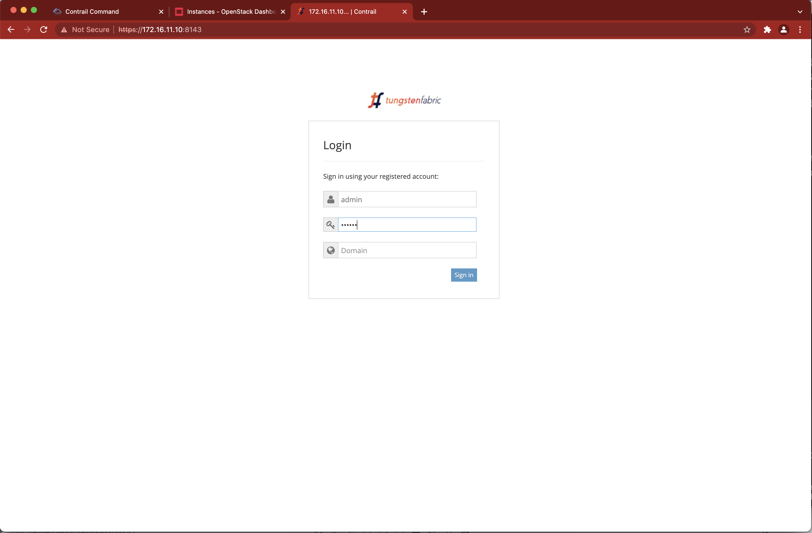

4. Now you can use the openstack with contrail networking

## upgrade and install nfs server on node4
1. upload file [upgrade_node4.sh](node4/upgrade_node4.sh) into **node4**

        scp node4/upgrade_node4.sh

2. open ssh session into **node4**, run the script and it will reboot 

        ssh node4
        tmux
        ./upgrade_node4.sh

## Configuring the SDN gateway (vMX)

1. Upload configuration [sdngw.conf](sdngw/sdngw.conf) into node **sdngw** and load it into active configuration

        scp sdngw/sdngw.conf sdngw:~/
        ssh sdngw
        edit 
        load merge relative sdngw.conf
        commit

2. open ssh session into node **gw**, and open telnet session to port 2605 to configure BGP on node **gw** (use password **pass01** to login and to enter enable mode)
3. enter the following configuration for the BGP on node **gw***

        enable
        config t
        router bgp 65200
        neighbor 172.16.13.129 remote-as 64512
        network 0.0.0.0
        end
        do write mem
4. On node **sdngw** verify that BGP Session to node **gw** (ip 172.16.13.128) is up
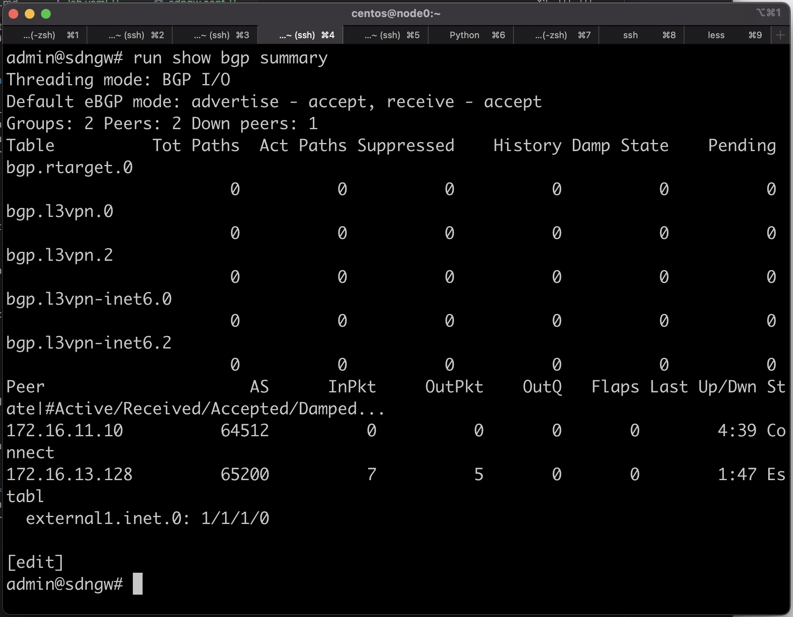

## Now you can use the lab 

