# Installing Openstack and juniper contrail networking using juju
## Introduction 

This document provide guide on how to install openstack and contrail networking on juniper VMM using Juju.

Since juniper VMM is a virtual environment, we are not going to use juju with MAAS, therefore some modification must be made to allow juju to works without MAAS (these modification are explained in the steps below)

The official documentation on deploying openstack and contrail networking using juju can be found [here](https://www.juniper.net/documentation/en_US/contrail21/topics/topic-map/deploying-contrail-using-juju-charms.html)

## Topology
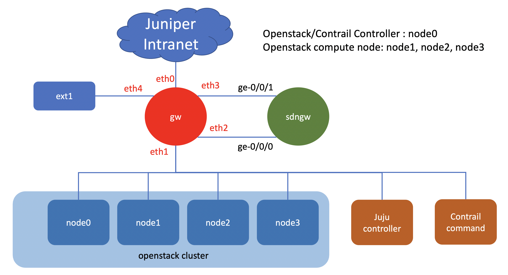

## Devices in the lab
- VMX: SDNGW , SDN gateway 

- Servers

        * juju controller : juju
        * openstack/CN controller nodes : node0
        * openstack compute nodes : node1, node2, node3
        * contrail command node : cc

- External node:

        * client1
        * ext1

## To create the lab topology and initial configuration of VMs
1. Go to directory [openstack_with_juju](./)
2. Edit file [lab.yaml](./lab.yaml). Set the following parameters to choose which vmm server that you are going to use and the login credential:
    - vmmserver 
    - jumpserver
    - user 
    - adpassword
    - ssh_key_name ( please select the ssh key that you want to use, if you don't have it, create one using ssh-keygen and put it under directory **~/.ssh/** on your workstation )
3. If you want to add devices or change the topooogy of the lab, then edit file [lab.yaml](lab.yaml)
4. use [vmm.py](../../vmm.py) script to deploy the topology into the VMM. Run the following command from terminal

        ../../vmm.py upload  <-- to create the topology file and the configuration for the VMs and upload them into vmm server
        ../../vmm.py start   <-- to start the topology in the vmm server

5. Verify that you can access node **gw** using ssh (username: ubuntu,  password: pass01 ). You may have to wait for few minutes for node **gw** to be up and running
6. Run script [vmm.py](../../vmm.py) to send and run initial configuration on node **gw**

        ../../vmm.py set_gw

7. Run script [vmm.py](../../vmm.py) to send and run initial configuration on linux nodes. This script will also reboot the VM. So wait before you test connectivity into the VM

        ../../vmm.py set_host

8. Verify that you can access linux and junos VMs, such **master**, **node1**, **sdngw**, without entering the password. You may have to wait for few minutes for the nodes to be up and running

        ssh juju
        ssh node1
        ssh node2

## update system on openstack nodes

1. open ssh session into node0, update the system and install openvswitch

        sudo apt -y update && sudo apt -y upgrade && sudo apt -y install openvswitch-switch bridge-utils

2. edit the file /etc/netplan/01_net.yaml

        sudo vi /etc/netplan/01_net.yaml
        network:
          ethernets:
            eth0:
              dhcp4: false
              addresses: [ 172.16.11.110/24 ]
              nameservers:
                addresses: [ 66.129.233.81 , 66.129.233.82]
              routes:
              - to: 0.0.0.0/0
                via: 172.16.11.1
                metric: 1

3. Replace content of file /etc/netplan/01_net.yaml with the following

        sudo vi /etc/netplan/01_net.yaml
        network:
          ethernets:
            eth0:
              dhcp4: false
          bridges:
            br-ex:
              addresses: [ 172.16.11.110/24 ]
              nameservers:
                addresses: [ 66.129.233.81 , 66.129.233.82]
              routes:
              - to: 0.0.0.0/0
                via: 172.16.11.1
                metric: 1
              openvswitch: {}
              parameters:
                forward-delay: 15
                stp: false
              interfaces:
              - eth0
4. Test the network configuration using command

        sudo netplan apply

5. Reboot node 0
6. open ssh session into node0, and initialize lxd, use default parameter, exept for **Would you like to create a new local network bridge?**, answer with no and use existing bridge **br-ex** 

        sudo lxd init
7. Add security nesting and privileged into lxc default profile. Use the following command to do that

        lxc profile set default security.nesting=true
        lxc profile set default security.privileged=true

6. Repeat step 1-7 for node1, node2, and node3

## Installing juju client, bootstrap juju controller and add machines into juju controller

1. open ssh session into node juju

        ssh juju
2. Update system 

        sudo apt -y update && sudo apt -y upgrade

3. run the following command to install juju client

        sudo snap install juju --classic

4. run the following command to add cloud into juju. Select manual for the cloud type, cloud name (for example you can use cloud1), and username and the host of the controller (ubuntu@172.16.11.100)

        juju add-cloud 

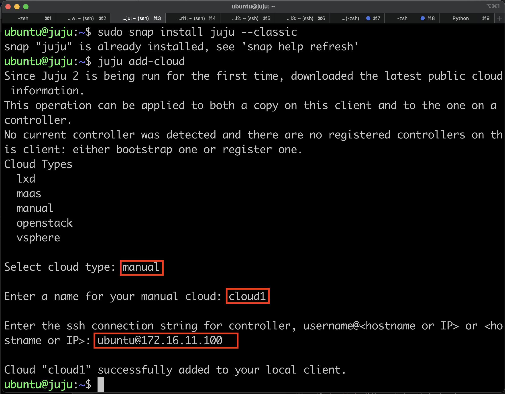

5. Run the following to boostrap juju controller and add the model to run the openstack cluster

        ​juju bootstrap cloud1 
        juju add-model openstack
        juju models # to verify that model cn has been added and selected as the current model

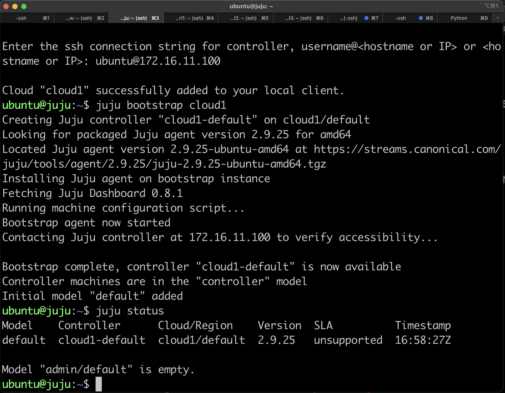

6. add nodes node0, node1, node2 and node3 into juju controller 

        juju machines

        for i in ubuntu@172.16.11.11{0..3}; do juju add-machine ssh:${i} --verbose --show-log; done

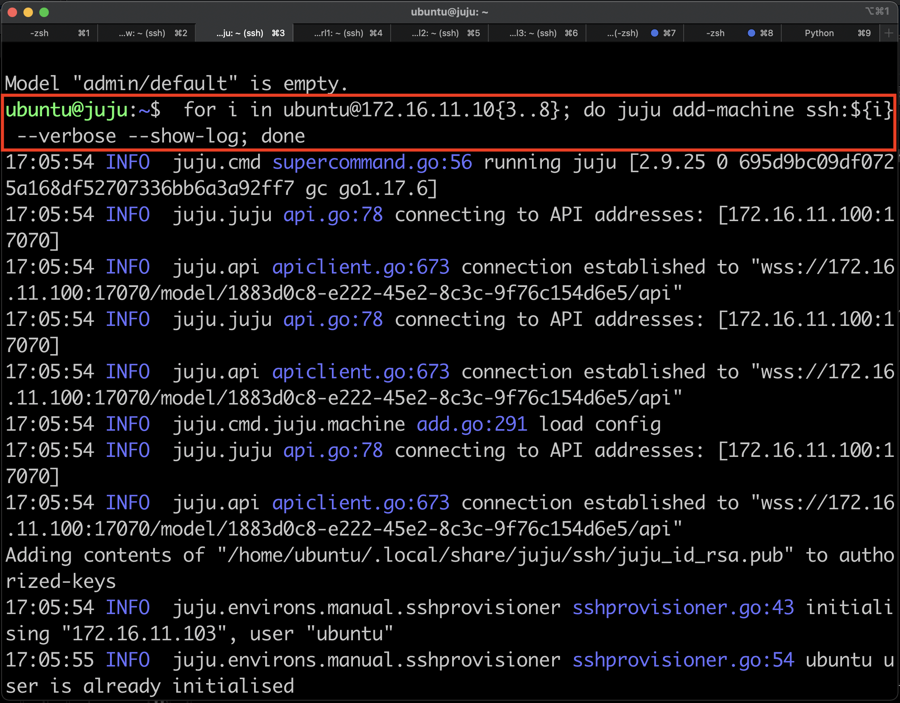

7. use this command to check the status of the machines that has been added into juju controller

        juju machines

8.  on juju controller, create a space (called lab1), and assign subnet to this space

        juju spaces
        juju add-space lab1 172.16.11.0/24
        juju spaces

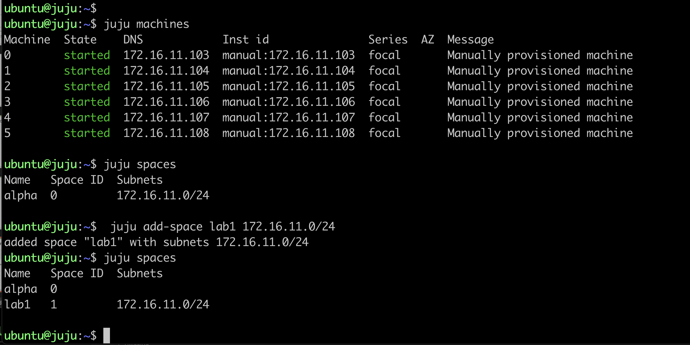
    
## installing openstack
1. Open ssh session into node juju, and install openstack charm bundle

        ssh juju
        git clone https://github.com/openstack-charmers/openstack-bundles

2. Enter directory ~/openstack-bundles/stable/openstack-base, and edit file bundle.yaml and openstack-base-spaces-overlay.yaml, and edit the content accordingly. Or you can use file [bundle.yaml](os_charm/bundle.yaml) (upload it into node juju)

3. Run the following command to deploy openstack

        juju deploy ./bundle.yaml --overlay  ./openstack-base-spaces-overlay.yaml  --map-machines=existing,0=0,1=1,2=2,3=3

4. open another ssh session into node juju, and run the following command

        watch -n 5 --color juju status

3. Open ssh session into controller node: node0. 

   Verify that docker engine has been installed, if yes then verify that the FORWARD chain on iptables is configured with DROP policy and if yes, then change the policy to ACCEPT. 

   This step is required since we are not using MAAS with juju. If you don't change the policy of chain FORWARD, then the linux container (LXC) will not get ip address, and the installation process will stall.

        ssh node0
        sudo docker ps -a
        sudo iptables -L FORWARD
        sudo iptables -P FORWARD ACCEPT

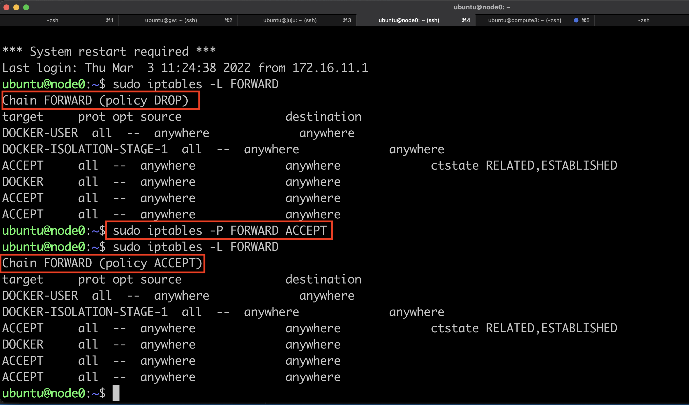

4. Wait until openstack and contrail networking applications are deployed and running. it may take 45 to 60 minutes for the installation process to finish.

        juju status

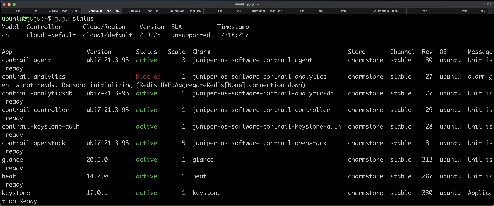
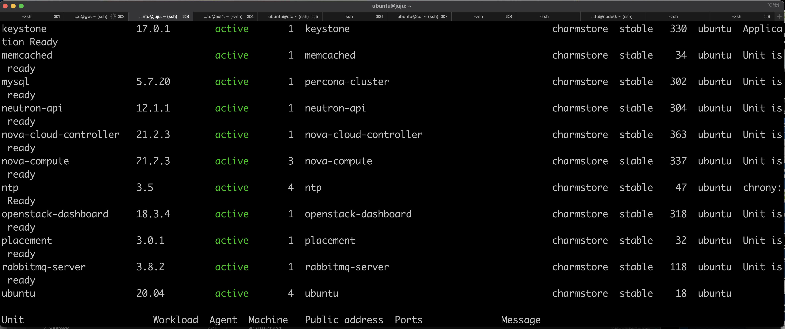
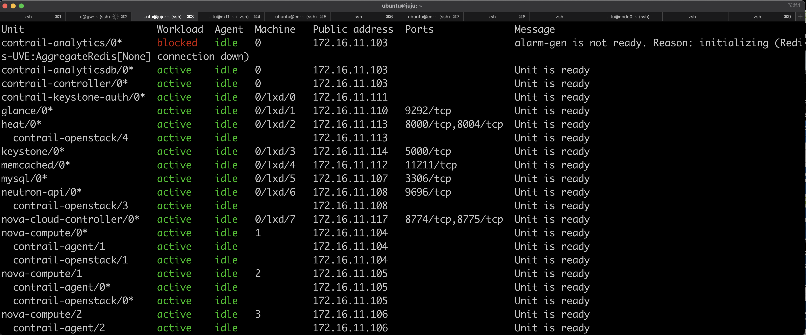
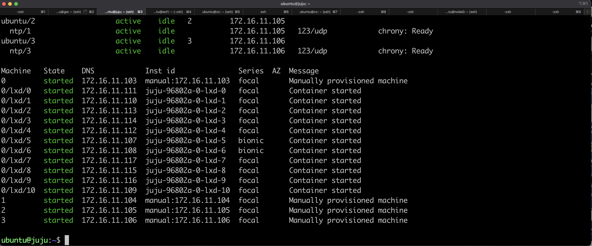

## Modifying ntp server configuration
1. When you do juju status, you may notice that some services on the openstack cluster is not enabled or not started because of the NTP synchronization. This is because the NTP client is not able to reach the ntp servers on the internet. Inside juniper VMM, the only ntp server that can be accessed is ntp.juniper.net
2. To fix this, run the following script from your workstation. This script will comment out all the external ntp server configuration from ntp configuration

        #!/bin/bash
        for i in node{0..3}
        do
                ssh ${i}  'sudo sed -i -e "s/^pool/#pool/g" /etc/chrony/chrony.conf; sudo systemctl restart chrony; chronyc sources'
        done

## Installing contrail command.
1. open ssh session into node cc

        ssh cc

2. Run the following commands to install docker into node cc

        sudo apt -y update
        sudo apt-get install -y ca-certificates curl gnupg lsb-release
        curl -fsSL https://download.docker.com/linux/ubuntu/gpg | sudo gpg --dearmor -o /usr/share/keyrings/docker-archive-keyring.gpg
        echo "deb [arch=$(dpkg --print-architecture) signed-by=/usr/share/keyrings/docker-archive-keyring.gpg] https://download.docker.com/linux/ubuntu $(lsb_release -cs) stable" | sudo tee /etc/apt/sources.list.d/docker.list > /dev/null
        sudo apt -y update
        sudo apt -y install docker-ce docker-ce-cli containerd.io
        sudo usermod -a -G docker ubuntu
        sudo reboot

3. wait until node cc is back online, and open ssh session into node cc

4. Login into hub.juniper.net and pull contrail command deployer

        docker image ls
        docker login hub.juniper.net --username ${REGISTRY_USER} --password ${REGISTRY_PASSWORD}
        docker pull hub.juniper.net/contrail/contrail-command-deployer:${CONTAINER_TAG}
        docker image ls

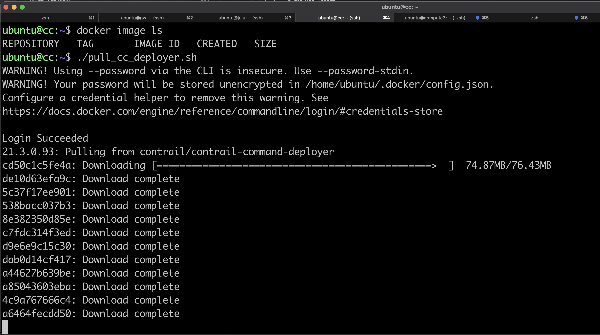
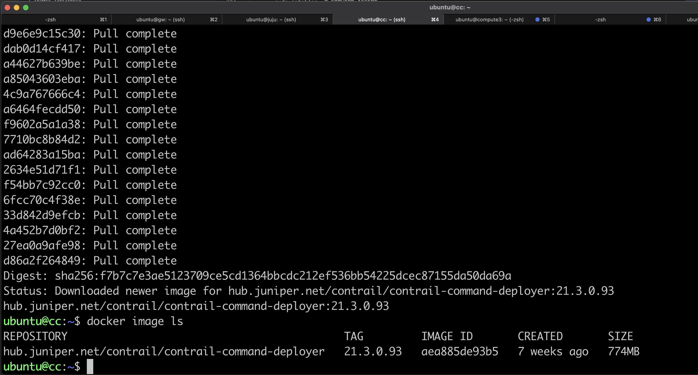

5. create command_servers.yml file, remember to set the registry username/password and container tag

        cat << EOF | tee command_servers.yml 
        ---
        command_servers:
                server1:
                        ip: 172.16.11.101
                        connection: ssh
                        ssh_user: ubuntu
                        ssh_pass: pass01
                        sudo_pass: pass01
                        ntpserver: ntp.juniper.net

                        registry_insecure: false
                        container_registry: hub.juniper.net/contrail
                        container_tag: ${CONTAINER_TAG}
                        container_registry_username: ${REGISTRY_USER}
                        container_registry_password: ${REGISTRY_PASSWORD}
                        config_dir: /etc/contrail

                        contrail_config:
                                database:
                                        type: postgres
                                        dialect: postgres
                                        password: contrail123
                                keystone:
                                        assignment:
                                                data:
                                                        users:
                                                                admin:
                                                                        password: pass01
                                insecure: true
                                client:
                                        password: pass01
        EOF

6. Before running the contrail-command-deployer, delete some files from the system

        sudo rm /usr/share/keyrings/docker-archive-keyring.gpg
        sudo rm /etc/apt/sources.list.d/docker.list
        
6. Run the following script to install contrail command. Remember to set the container tag

        docker run -dt \
                -v /home/ubuntu/command_servers.yml:/command_servers.yml \
                -e action=import_cluster \
                -e orchestrator=juju \
                -e delete_db=yes \
                -e juju_controller=172.16.11.100 \    # ip address of juju controller
                -e juju_controller_password=pass01 \  # ssh password to login into juju controller
                -e juju_controller_user=ubuntu \      # ssh user to login into juju controller
                -e juju_model=cn \                    # juju model used in juju controller to install openstack
                --name contrail_command_deployer \
                hub.juniper.net/contrail/contrail-command-deployer:${CONTAINER_TAG}

7. Do the following to monitor the logs of contrail command deployer

        docker logs -f contrail_command_deployer

8. Once contrail command is deployed, then it can be accessed.

## Installing openstack clients on node juju
1. Open ssh session to node juju

        ssh juju

2. Do the following to install openstack clients and load the credentials

        sudo snap install openstackclients --classic
        git clone https://github.com/openstack-charmers/openstack-bundles
        cd openstack-bundles/stable/openstack-base
        source openrc

## Initial openstack configuration
### Add VM disk images into openstack

        curl -L -O https://download.cirros-cloud.net/0.5.2/cirros-0.5.2-x86_64-disk.img
        curl -L -O https://cloud-images.ubuntu.com/focal/current/focal-server-cloudimg-amd64.img
        curl -L -O https://cloud.debian.org/images/cloud/bullseye/latest/debian-11-generic-amd64.qcow2
        openstack image create --file cirros-0.5.2-x86_64-disk.img --disk-format qcow2 --container-format bare --public cirros
        openstack image create --file focal-server-cloudimg-amd64.img --disk-format qcow2 --container-format bare --public ubuntu
        openstack image create --file debian-11-generic-amd64.qcow2 --disk-format qcow2 --container-format bare --public debian

### create flavor

        openstack flavor create --public --vcpu 1 --disk 1 --ram 128 --public m1.tiny
        openstack flavor create --public --vcpu 1 --disk 10 --ram 2048 --public m1.small
        openstack flavor create --public --vcpu 2 --disk 40 --ram 4096 --public m1.medium
        openstack flavor create --public --vcpu 2 --disk 80 --ram 8192 --public m1.large

### Create project

        openstack project create --domain admin_domain demo1
        openstack project create --domain admin_domain demo2
        openstack role add --user admin --project demo1 admin
        openstack role add --user admin --project demo2 admin

## Accessing web dashboard, Openstack and  Contrail Command

1. From your workstation, open ssh session to node **proxy** and keep this session open if you need to access the web dashboard of Paragon Automation platform

        ssh -f -N proxy or ssh proxy

2. If you are using Firefox as web browser, set proxy with the following parameters
    - manual proxy configuration
    - SOCKS host : 127.0.0.1
    - PORT : 1080
    - type: SOCKS v4    
    

3. If you are using Chrome as web browser, create a new profile, install Foxy Proxy extension and configure it with the following parameters
    - manual proxy configuration
    - SOCKS host : 127.0.0.1
    - PORT : 1080
    - type: SOCKS v4    
    
    

4. on the juju node, do the following to get the ip address of openstack dashboard and admin password

        juju status --format=yaml openstack-dashboard | grep public-address | awk '{print $2}' | head -1
        juju run --unit keystone/leader leader-get admin_passwd

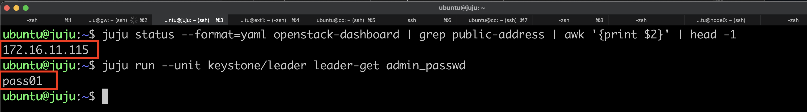

5. From the web browser which has been configured with proxy, open web session to the openstack dashboard and contrail command dashboard, and login using user **admin**, password **<admin_password>**, and domain **admin_domain**

       URL for openstack dashboard : http://<openstack_dashboard_ip>
       URL for contrail command dashboard: https://172.16.11.101:9091

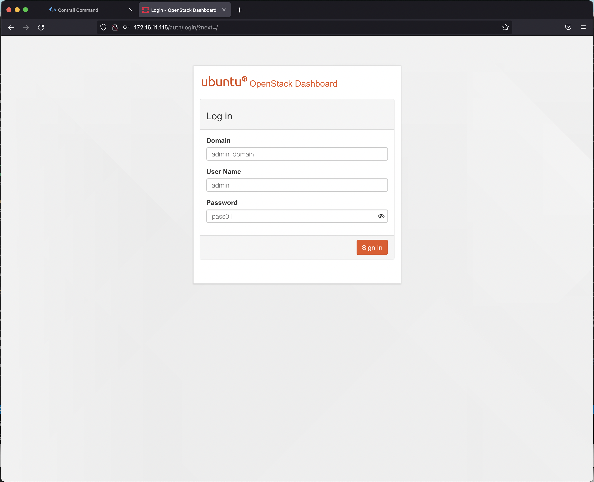
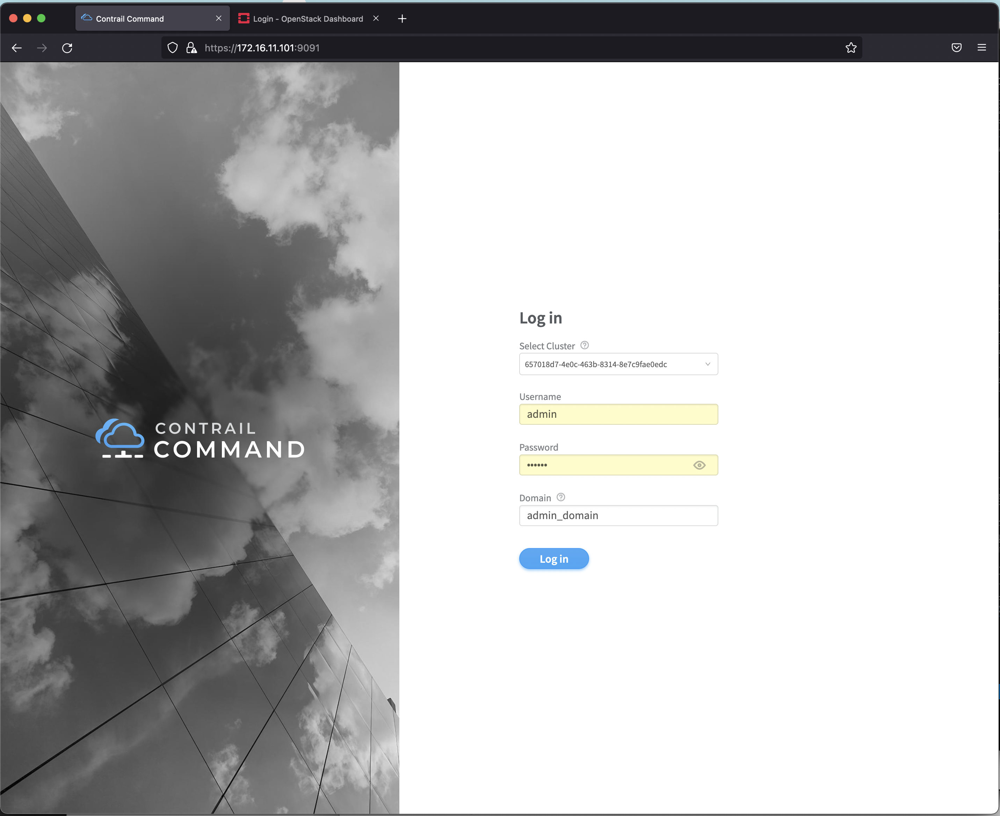

6. Now you can explore openstack + contrail networking or you can follow this [lab_exercise](lab_exercise/README.md)

