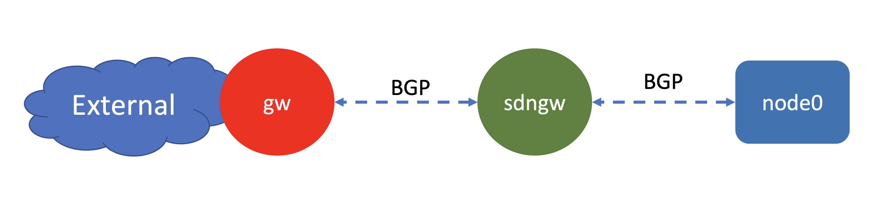
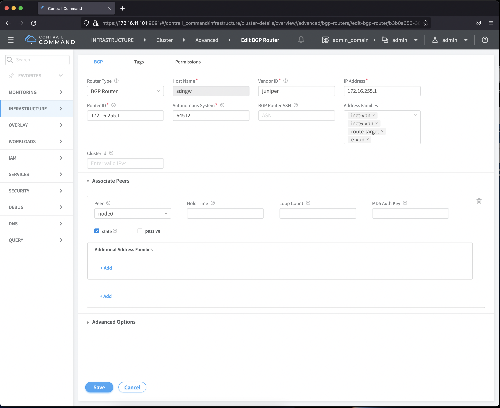
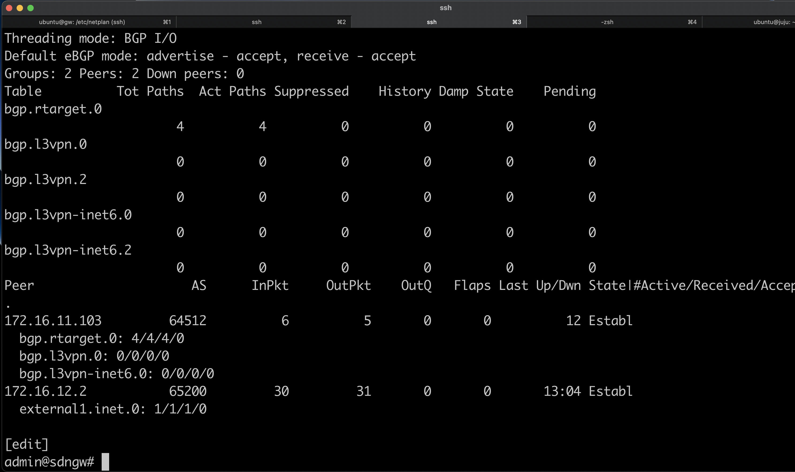

# Lab 1

In this lab exercise, the following items will be done
- configuring MX as SDN Gateway
- configuring BGP peer between Contrail Controller and SDN Gateway
- configuring BGP peer between External GW and SDNGW

## configuring SDN gateway 

1. upload [sdngw configuration](sdngw.conf) into node sdngw
2. upload [network configuration](02_net.yaml) into node **gw**, into file /etc/netplan/02_net.yaml, and activate it using sudo netplan apply
3. open ssh session into node **gw** and open access into FRR routing using sudo vtysh, and apply the following [configuration](bgpd.conf)

        router bgp 65200
            neighbor 172.16.12.3 remote-as 64512
            !
            address-family ipv4 unicast
                network 0.0.0.0/0
            exit-address-family

4. Access contrail command dashboard, from menu select Infrastructure > Cluster > Advance options > BGP Routers
5. Click Create, to create BGP router with the following configuration 
- Router Type: BGP Router
- hostname : SDNGW
- Vendor ID : Juniper
- IP Address : 172.16.255.1 (loopback of sdngw)
- Router ID : 172..16.255.1
- address family : inet-vpn, inet6-vpn, router-target, e-vpn
- associate peer : node0

6. From node sdngw, verify that BGP peer to contrail controller is up.

    run show bgp summary

[Back to main page](../README.md)

