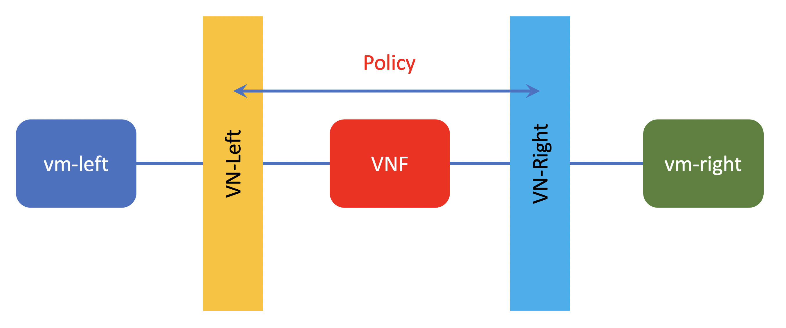

# Lab Exercise 5
In this lab exercise, a VNF (VM) will be configured between two virtual networks, and this VNF will be assigned as service instances. Then on contrail networking, a policy will be configured to route traffic from one virtual network to another virtual network through this VNF.

The topology will be the folloing

And to test service chaining, two VMs, VM-left and VM-right will be configured and traffic from VM-Left to VM-Right will be routed through the VNF 

In this lab exercise, the following will be configured
- VM as VNF
- Service Template
- Service Instance
- Policy for service chaining between virtual networks

## Creating virtual networks, VN-Left and VN-Right
1. From the web browser, open contrail command dashboard or openstack dashboard
2. select project demo2
3. Create three virtual networks, with the following paratner
   - VN1 
     - name : VN-Left
     - subnet:
       * CIDR: 192.168.201.0/24
   - VN2
     - name : VN-Right
     - subnet:
       * CIDR: 192.168.202.0/24
   - VN3
     - name : VN-Management
     - subnet:
       * CIDR: 192.168.200.0/24
   VN-Management will be connected to OOB interface of the VNF

## Create VNF and VMs (VM-Left and VM-Right)
1. In this lab exercise, juniper vsrx will be used as VNF 
2. Verify that vSRX3.0 image has been uploaded into openstack cluster. If not, then upload it using openstack CLI

        openstack image create --public --file junos-vsrx3-x86-64-21.4R1.12.qcow2 --disk-format qcow2 --container-format bare vsrx3.0
3. Open openstack dashboard, and select project demo2
4. Create a VM with the following parameters
   - Name: VNF1
   - source: vsrx3.0
   - flavor: m1.medium
   - networks:
        * VN-Management (1st interface, fxp0)
        * VN-Left (2nd interface, ge-0/0/0)
        * VN-Right (3rd interface, ge-0/0/1)
   - configuration
      * use [this file](vnf1.conf)
5. Click launch Instances to deploy the VNF
6. Fromo the menu select Project > Network > Security Groups, and click create security group.
7. Create a security group with the following parameters
   - name: allow3
   - rules 1 : 
      - direction: ingress
      - Ether Type : ipv4
      - ip protocol: icmp
      - CIDR: 0.0.0.0/0
   - rule 2
      - direction: ingress
      - Ether Type : ipv4
      - ip protocol: tcp, 
      - port: 22
      - CIDR: 0.0.0.0/0
8. Launch two VM with the following parameters
   - VM-Left :
       - flavour: m1.tiny
       - source: cirros
       - networks : VN-Left
   - VM-Right :
       - flavour: m1.tiny
       - source: cirros
       - networks : VN-right
      
9. On the contrail command dashboard, select project demo2 
10. From the menu, select Overlay > Floating IPs > All Floating IPs, and click create to create one floating ip. Select External FIP as Floating IP pool
11. From the menu, select Overlay > Virtual Ports, and select the virtual port of the VNF that connected to VN-Management, and click edit.
12. Set security group to allow3
13. Set floating ip to the floating ip allocated on step 10
13. Click Save
14. From node ext1, test connectivity to the floating ip of VNF1, and try to open ssh session using username/password: admin/pass01.
15. Now you should be able to login into node VNF

## Creating Service Template 
1. Open the contrail command dashboard and select project demo2
2. From the menu, select Services > Catalog > VNF and click create
3. Create a service template with the following parameters
   - name: FW Type 1
   - service mode: In-Network
   - Service type: Firewall
   - Add two interface:
      * left
      * right
4. From the menu, select Services > Deployments > VNF and click create
5. Create a service instances with the following parameters
   - Name: VNF1
   - Tempate: FW Type 1
   - interface type left: VN-Left
   - intrface type right: VN-Right
   - port tuples:
      * interface type left: ip address of left interface
      * interface type right: ip addres of right interface
6. Click Create to create the service instances
7. The status of the service instance should be green or active

## Creating Network Policy and applied it to the virtual networks
1. Open console to VM-left, and test connectivity to VM-Right. it should fail because routing has not been established between VN-Left and VN-Right
2. on contrail command dashboard, select project demo2
3. From the menu select Overlay > Network Policies and click create
4. Create a network policy with the following parameter
   - name: Left-to-Right
   - for policy rules
      * action: pass
      * Protocol: Any
      * Source type: Network
      * Source: VN-Left
      * Source port: any
      * Direction: <>
      * Destination type: Network
      * Destination: VN-Right
      * Destination port: any
5. Click Create
6. From the menu, select Overlay > Virtual Networks, select VN-Left and click edit
7. on network policies field, select policy Left-to-Right, and click save
8. From the menu, select Overlay > Virtual Networks, select VN-Right and click edit
7. on network policies field, select policy Left-to-Right, and click save
8. On the console of VM-Left, test connectivity to VM-Right. It should works becase now the network policy, Left-to-Right will forward traffic from left to right and vice versa.
   Currently the traffic is not yet forwarded through VNF. it can be verify by looking into the active security session on VNF1

        show security flow session
9. on Contrail Command Dashboard, select Overlay > Network Policies, select Policy Left-to-Right and click edit
10. Enable Advanced options, and on field services, select service instance VNF1, and click save to activate.
11. Now any traffic from left to right will be forwarded through service instance VNF1, to verify that login into VNF1 management cli and perform show securiy flow session with active traffic from VM-Left to VM-Right, then flow information will be displayed.

[Back to main page](../README.md)