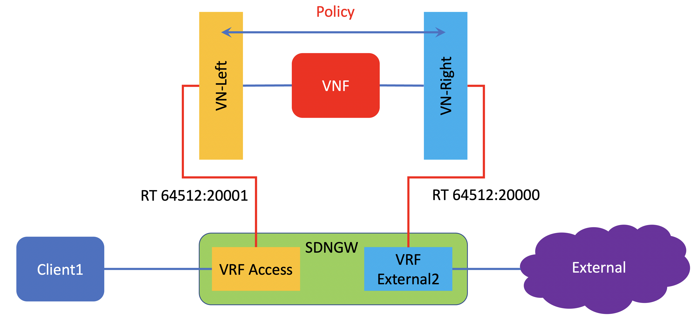

# Lab Exercise 6
In this lab exercise, the service chaining will be extended to the external network.

VN-Left will be extended to SDNGW to routing instances Access, where users are connected.

VN-Right will be extended to SDNGW to routing instances external2 where it has connection to external network.

Then traffic from users will be routed into the openstack cluster. processed by VNF, the forwarded to the external network.

The topology will be the folloing

In this lab exercise, configuraiton from the previous lab will be used, with some additional configuration :
- Route target between VN-Left and VRF Access
- Route target between VN-Right and VRF External2
- Security group to allow all traffic

## VRF access configuration
1. On the SDNGW, add the following configuration for VRF access 

      interfaces {
         ge-0/0/2 {
            unit 0 {
               family inet {
                     address 192.168.250.1/24;
               }
            }
         }
      }
      routing-instances {
         access {
            instance-type vrf;
            interface ge-0/0/2.0;
            vrf-target target:64512:20001;
            vrf-table-label;
         }
      }

2. On contrail command dashboard, configure route target for VN-Left, set it to the same route target as routing instance access

### VRF external2 configuration
1. On the SDNGW, add the following configuration for VRF external2

interfaces {
   ge-0/0/1 {
      unit 2 {
         vlan-id 2;
         family inet {
               address 172.16.12.5/31;
         }
      }
   }
}
routing-instances {
   external2 {
      instance-type vrf;
      routing-options {
         multipath {
               vpn-unequal-cost;
         }
      }
      protocols {
         bgp {
               group to_gw {
                  neighbor 172.16.12.4 {
                     local-address 172.16.12.5;
                     peer-as 65200;
                  }
               }
         }
      }
      interface ge-0/0/1.2;
      vrf-target target:64512:20000;
      vrf-table-label;
   }
}

2. On contrail command dashboard, configure route target for VN-Right, set it to the same route target as routing instance external2

## Create Security group to allow all
1. On openstack dashboard, select project demo2
2. From menu, select Project > Network > Security group, and click create Security group
3. use the following parameters for this security group
   - name: Allow_all
   - rules:
       * direction: ingress
       * ether type: ipv4
       * ip protocol: any
       * remote CIDR: 0.0.0.0/0
4. From the menu, select Project > Compute > Instances, and select VNF1, edit port security group.
5. edit security group for port connected to VN-Left, and set it to Allow_all
6. edit security group for port connected to VN-Right, and set it to Allow_all

## Modify VNF1 configuration
1. ssh into VNF1
2. set the ip address on left interface, ge-0/0/0 to static
      interfaces {
         ge-0/0/0 {
            unit 0 {
                  family inet {
                     address 192.168.51.3/24;
                  }
            }
         }
         ge-0/0/1 {
            unit 0 {
                  family inet {
                     dhcp;
                  }
            }
         }
      }
3. set static route to client subnet (192.168.250.0/24) to left vrouter

      admin@vnf1# show routing-options
      static {
         route 192.168.250.0/24 next-hop 192.168.51.1;
      }

## Testing traffic from client1
1. Access console of client1, and test connectivity to internet
2. on VNF1 verify that session security flow is recorded

[Back to main page](../README.md)