# How setup the lab, Juniper Paragon Active Assurance
## topology

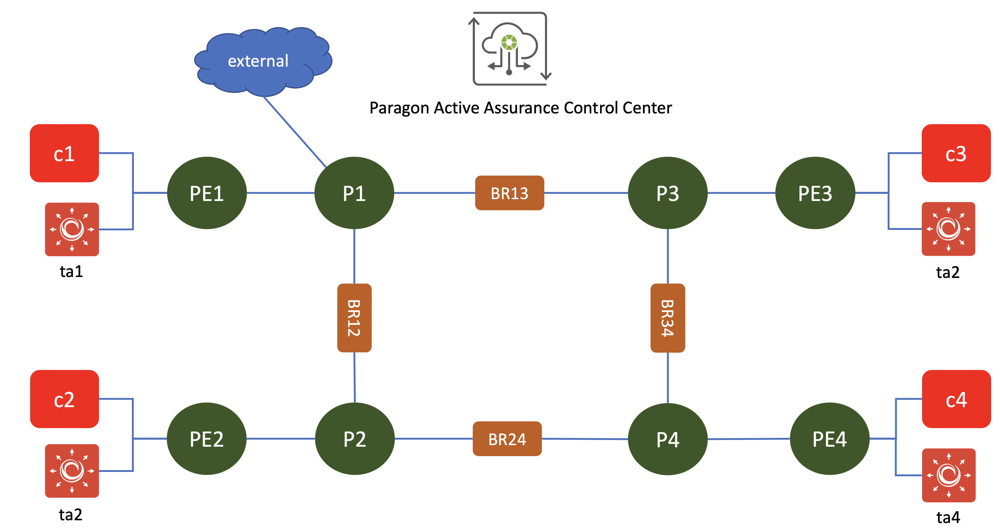

## note
Tested with : 
- paragon active assurance control center 3.2.2
- paragon active assurance test agent 3.2.1

## Documentation
[how to install ](https://www.juniper.net/documentation/us/en/software/active-assurance3.2/paa-install/index.html)

## Devices in the lab

- VMX : pe1, pe2, pe3, pe3, p1, p2, p3,p4
- Linux client: c1, c2, c3, c4 (to installed test agent application or to generate traffic)
- Test Agent appliance: ta1, ta2, ta3, ta4
- Bridge : br1 ( linux bridge between junos node to simulate link failure, delay and packet loss) (linux alpine)

## Credential to access devices
- Ubuntu linux
    - user: ubuntu
    - password: pass01
- Alpine linux
    - user: ubuntu
    - password: pass01
- JUNOS VM
    - user: admin
    - password: pass01

## Extracting test agent image from installation file
Before you start the topology on the VMM, you need to have the PAA test agent image. 

You can copy the image from my home directory on the VMM Server (such as q-pod23-vmm.englab.juniper.net or sv8-pod4-vmm.englab.juniper.net), it should be under directory /homes/irzan/images/, or you can do the following steps to extrace the PAA test agent image from the installation file.

You can do the following steps on VMM server or any linux machine (VM) or macosx (I have not tested this on MS windows)

1. get the installation files, for example paa-test-agent_3.2.1.15_all.deb

        cp /volume/download/docroot/software/paa/3.2.1/paa-test-agent_3.2.1.15_all.deb .

2. Extract the installation file using command ar

        ar x paa-test-agent_3.2.1.15_all.deb

3. Untar file data.tar

        tar xvf data.tar.xz

4. search for qcow2 image file, upload it to vmm server and put it into directory ~/images

        find * | grep qcow2

## To create the lab topology and initial configuration of VMs
1. Go to directory [PAA Lab](./)
2. Edit file [lab.yaml](./lab.yaml). Set the following parameters to choose which vmm server that you are going to use and the login credential:
    - vmmserver 
    - jumpserver
    - user 
    - adpassword
    - ssh_key_name ( please select the ssh key that you want to use, if you don't have it, create one using ssh-keygen and put it under directory **~/.ssh/** on your workstation )
    - the image files for the nodes (vmx, ubuntu, test agent, bridge, etc)
3. If you want to add devices or change the topooogy of the lab, then edit file [lab.yaml](lab.yaml)
4. use [vmm.py](../../vmm.py) script to deploy the topology into the VMM. Run the following command from terminal

        ../../vmm.py upload  <-- to create the topology file and the configuration for the VMs and upload them into vmm server
        ../../vmm.py start   <-- to start the topology in the vmm server

5. Verify that you can access node **gw** using ssh (username: ubuntu,  password: pass01 ). You may have to wait for few minutes for node **gw** to be up and running
6. Run script [vmm.py](../../vmm.py) to send and run initial configuration on node **gw**. This will configure ip address on other interfaces (such ase eth1, eth2, etc) and enable dhcp server on node gw

        ../../vmm.py set_gw

7. Verify that you can access other nodes (linux and junos VM), such **control**, *c1**, **pe1**, etc. Please use the credential to login.

        ssh control

8. Run script [vmm.py](../../vmm.py) to send and run initial configuration on linux nodes. This script will also reboot the VM. So wait before you test connectivity into the VM

        ../../vmm.py set_host

9. Verify that you can access linux and junos VMs, such **control**, **node**, **node1**, without entering the password. You may have to wait for few minutes for the nodes to be up and running

        ssh control
        ssh pe1
        ssh pe2

## Uploading Paragon Active assurance installation file
1. If you have paragon active assurance installation files on your workstation, upload it into node **control** 

        scp *.deb control:~/

3. Alternatively, you can upload the installation file from Juniper internal server. To upload file from internal server, do the following steps
4. open ssh session into node **vmm**

        ssh vmm
5. on node **vmm**, edit file ~/.ssh/config, for entry **Host gw**, change the user from **root** to **ubuntu** and set the hostname with ip address interface eth0 gw

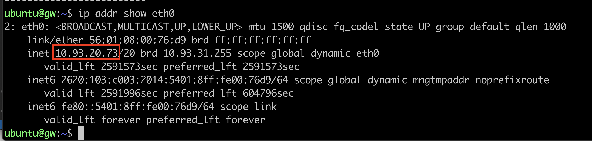

6. add the following entry into file ~/.ssh/config

        host gw
            Hostname 10.54.22.93 # this is the ip address of interface eth0 of node GW, change it accordingly
            user ubuntu

        host control
            user ubuntu
            ProxyCommand ssh -W 172.16.10.100:22 gw

    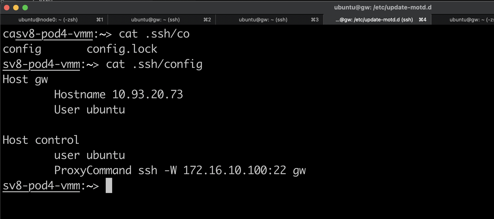

7. The paragon active assurance installation file should be under directory /volume/download/docroot/software/paa/<version>
8. Upload the file into node **control**

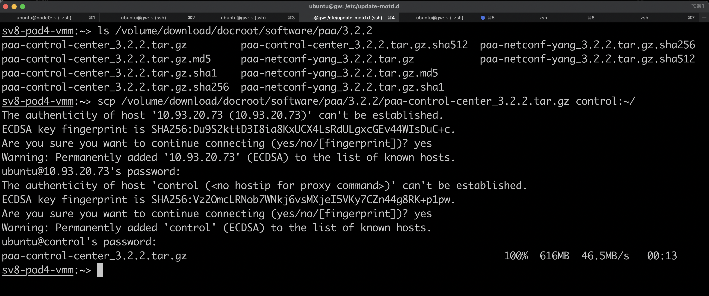

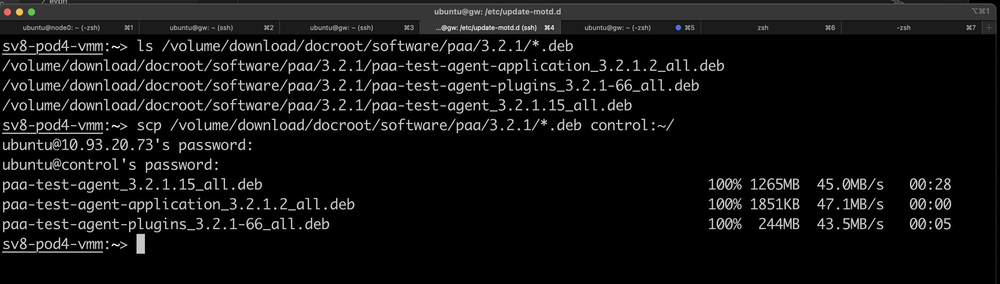

## installing required software
1. open ssh session into node **control**

        ssh control

1. set the time zone

        sudo timedatectl set-timezone Asia/Jakarta

2. edit file /etc/default/locale, and set locales to en_US.UTF-8. Add the following entries into /etc/default/local

        LANG=en_US.UTF-8
        LC_ALL=en_US.UTF-8
        LANGUAGE=en_US.UTF-8

    or you can use the following script

        echo "LANG=en_US.UTF-8
        LC_ALL=en_US.UTF-8
        LANGUAGE=en_US.UTF-8
        " | sudo tee /etc/default/locale

3. edit /etc/locale.gen, and make sure the following line is NOT commented

        en_US.UTF-8 UTF-8

4. regenerate the locale files

        sudo apt-get install locales
        sudo locale-gen

5. Disable timedatectl and install ntp

        sudo timedatectl set-ntp no
        sudo apt-get update
        sudo apt-get -y install ntp

6. Edit file /etc/ntp.conf and set the ntp server to ntp.juniper.net, or you can use the following script to edit file /etc/ntp.conf

        sudo sed -i -e '/^pool/ d' /etc/ntp.conf
        echo "server ntp.juniper.net iburst" | sudo tee -a /etc/ntp.conf
        sudo systemctl restart ntp

7. Verify that NTP servers are reachable using this command

        ntpq -pn

8. install postgresSQL

        sudo apt -y update
        sudo apt -y install postgresql
        sudo -u postgres psql -c "CREATE ROLE netrounds WITH ENCRYPTED PASSWORD 'netrounds' SUPERUSER LOGIN;"
        sudo -u postgres psql -c "CREATE DATABASE netrounds OWNER netrounds ENCODING 'UTF8' TEMPLATE 'template0';"

9. Install and configure postfix mails server

        sudo apt -y  install postfix

10. Set the postfix with internet with smarthost. Set the smtp relay host to mail.juniper.net

## Installing Paragon Active Assurance software
Please refer to the [installation guide](https://www.juniper.net/documentation/us/en/software/active-assurance3.2/paa-install/topics/concept/install-cc.html) for Paragon Active Assurance software.

1. Open ssh session into node **control**, run **tmux**  (to allow the script to keep running, even when the ssh session is disconnected), and run **apt -y update**

        ssh control
        tmux
        apt -y update

2. extract the installation file and install PAA control center software (it may take times to install the software)
        
        tar xpvfz paa-control-center_3.2.2.tar.gz
        sudo apt -y --allow-downgrades install ./paa-control-center_3.2.2/*.deb

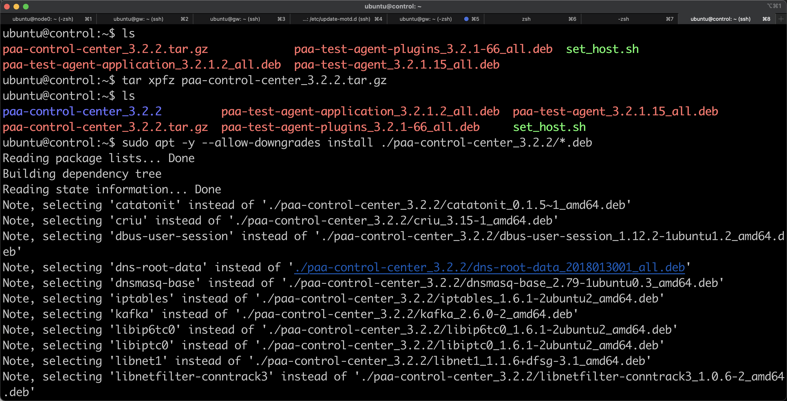

3. Run the database migration 

        sudo ncc migrate

4. Install test agent applications and plugins

        sudo apt install -y ./*.deb

5. Restart all Paragon Active Assurance services

        sudo systemctl restart "netrounds-*" apache2 openvpn@netrounds

## Create user in Control Center
1. create user

        ncc user-create <email> --password

2. create account in PAA

        ncc account-create --owner <email> --name "<full name of product account>" <short name of product account>
        
## Add license into PAA Control center
1. Create license request 

        ncc license license-request

2. Generate the license on https://internal-license.juniper.net/nckt/

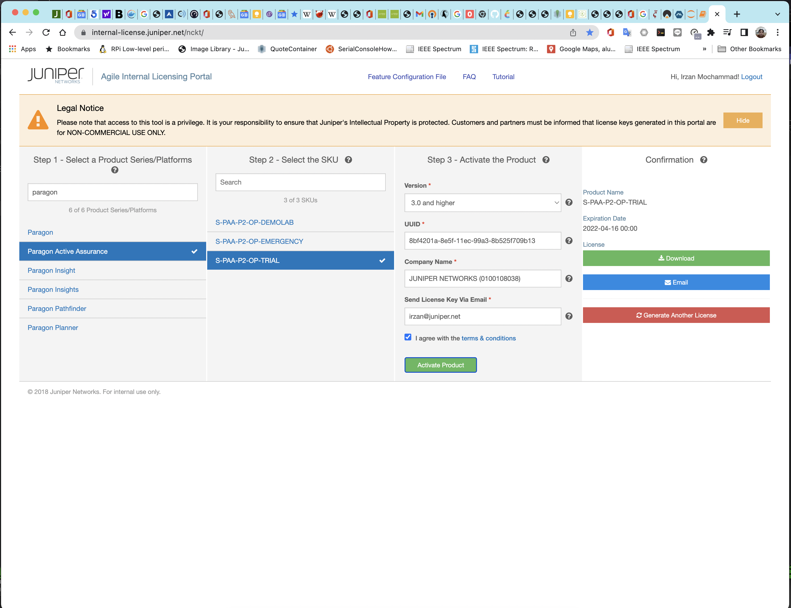

3. upload the license file into node control, and add it into PAA Control center

        ncc license activate <license_file>

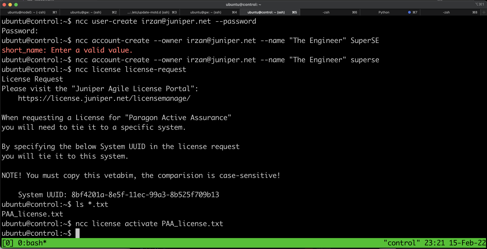

## Accessing Web Interface of Paragon Active Assurance
1. From your workstation, open ssh session to node **proxy** and keep this session open if you need to access the web dashboard of Paragon Automation platform

        ssh -f -N proxy 

2. If you are using Firefox as web browser, set proxy with the following parameters
    - manual proxy configuration
    - SOCKS host : 127.0.0.1
    - PORT : 1080
    - type: SOCKS v4    
    

3. If you are using Chrome as web browser, install extension Foxy Proxy and configure it with the following parameters
    - manual proxy configuration
    - SOCKS host : 127.0.0.1
    - PORT : 1080
    - type: SOCKS v4    
    
    

4. Open http session to https://172.16.10.100, and login using username that you created on the previous step

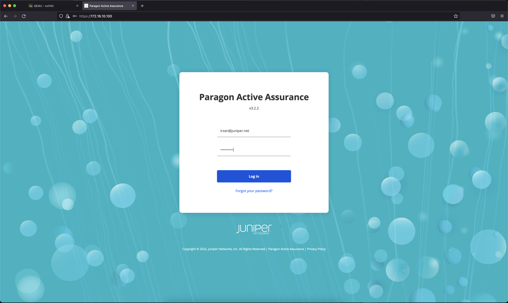 
 

## Setup PAA Test agent
There are four test agents in the lab (ta1, ta2, ta3, and ta4), and you need to configure these Test agent :
- configure ip address (or you can leave it to default, which is using dhcp)
- register the test agent with PAA Control center

Do the following steps to setup PAA test agent
1. Open another tab on the web browser, and access the URL to console of the Test agent. Information about the URL can found when you open ssh session into node **gw** (it is part of the banner)

        -------------------------
        URL access to VNC:
        console desktop : http://172.16.10.1:6081/vnc.html
        console ta1 : http://172.16.10.1:6082/vnc.html
        console ta2 : http://172.16.10.1:6083/vnc.html
        console ta3 : http://172.16.10.1:6084/vnc.html
        console ta4 : http://172.16.10.1:6085/vnc.html
        -------------------------

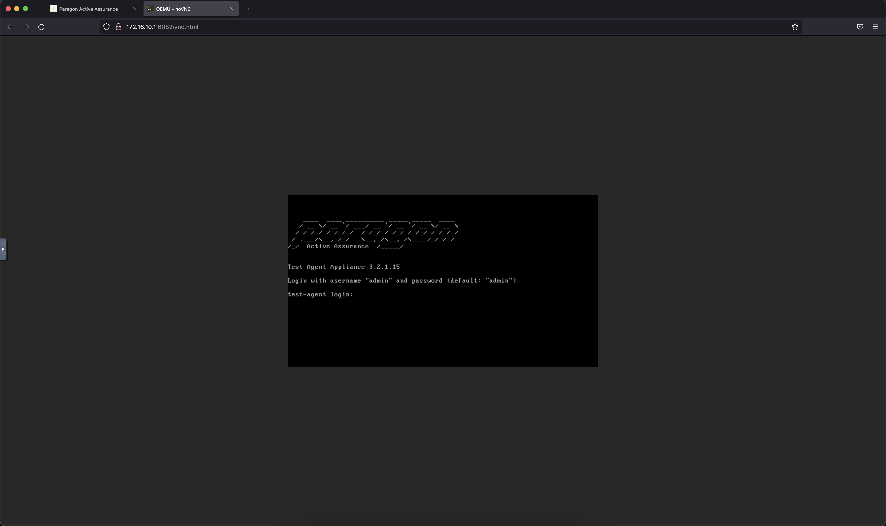

2. Login into the test agent, then you can set the ip address (by default interface eth0 is configured with DHCP, and it will get ip address from the DHCP server running on node **gw**)

3. Register to the PAA Control center. use the following information to register
  - server: 172.16.10.100
  - e-mail: <user email that you use for user>
  - Test Agent Name : <ta name>

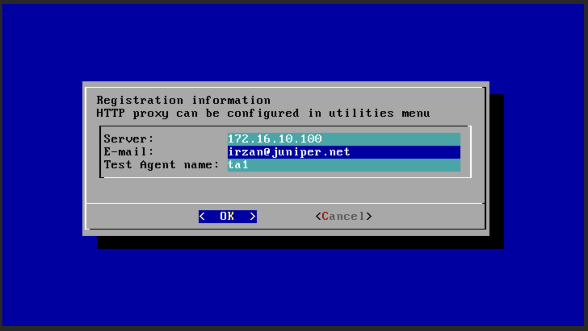

4. Verify that the test agent status is logged in
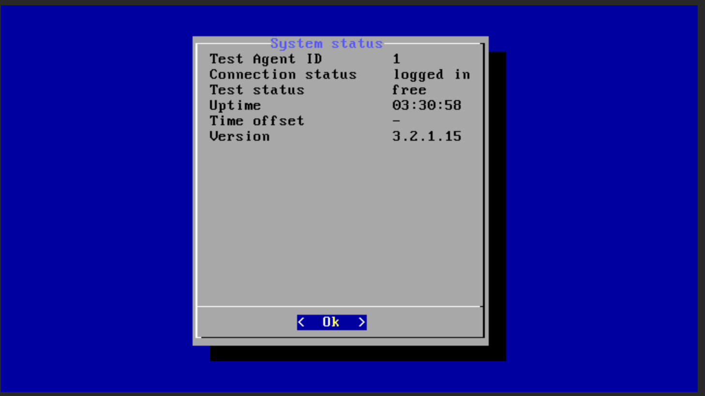

5. Repeat step 1-4 for ta2, ta3, and ta4
6. Status of test agent on PAA control center dashboard
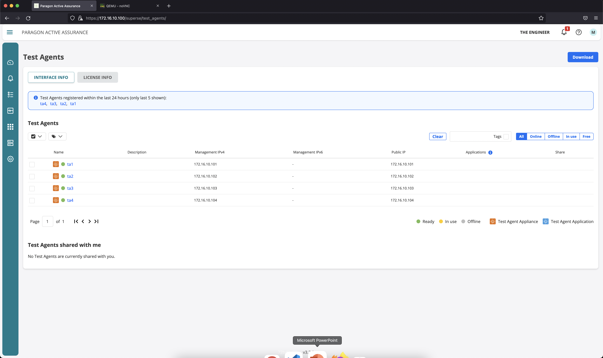

Now you can explore the Paragon Active Assurance

you can refer to [this document](LAB_EXERCISE.md) for guidelines