# How setup the lab
## topology

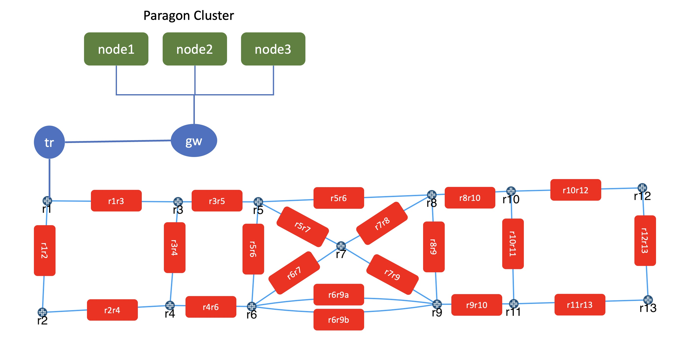

## note
Tested with paragon automation version 23.2
based on this [documentation](https://www.juniper.net/documentation/us/en/software/paragon-automation23.2/paragon-automation-installation-guide/topics/concept/paragon-installation-overview.html) and the paragon nodes require unformatted partition or disk for ceph storage.

Therefore for paragon automation installation on Juniper VMM, I have created another image (ubuntu22.04.qcow2), where it has one harddisk with the size of 300G, 250G has been allocated for base OS, and 50G is free unused disk space.

## Devices in the lab

- VMX : r1, r2, r3, r4, r5, r6, r7, r8, r9, r10, r11, r12, and r13
- VMX: ce and tr
- Linux client: client (to provide test traffic) (linux ubuntu)
- Bridge : br1, br2, br3, br4, br5 ( linux bridge between junos node to simulate link failure, delay and packet loss) (linux alpine)

- Kubernetes cluster for Paragon Automation
    - Node1, Node2, Node3 : Linux ubuntu 22.04, to run kubernetes nodes

## Bridges
node | bridges | device A | device Z
|--|--|--|--|
|br1|r1r2| r1| r2|
| | r1r3 | r1 | r3|
| | r2r4 | r2 | r4|
| | r3r4 | r3 | r4|

node | bridges | device A | device Z
|--|--|--|--|
|br2|r3r5| r3| r5|
| | r4r6 | r4 | r6|
| | r5r6 | r5 | r6|
| | r5r8 | r5 | r8|

node | bridges | device A | device Z
|--|--|--|--|
|br3|r5r7| r5| r7|
| | r6r7 | r6 | r7|
| | r6r9a | r6 | r9|
| | r6r9b | r6 | r9|

node | bridges | device A | device Z
|--|--|--|--|
|br4|r7r8| r7| r8|
| | r7r9 | r7 | r9|
| | r8r9 | r8 | r9|
| | r8r10 | r8 | r10|

node | bridges | device A | device Z
|--|--|--|--|
|br5|r9r11| r9| r11|
| | r10r11 | r10 | r11|
| | r10r12 | r10 | r12|
| | r11r13 | r11 | r13|
| | r12r13 | r12 | r13|

## Credential to access devices
- Ubuntu linux
    - user: ubuntu
    - password: pass01
- Alpine linux/Bridge
    - user: alpine
    - password: pass01
- JUNOS vMX
    - user: admin
    - password: pass01

## To create the lab topology and initial configuration of VMs
1. Go to directory [Paragon Lab](./)
2. Edit file [lab.yaml](./lab.yaml). Set the following parameters to choose which vmm server that you are going to use and the login credential:
    - vmmserver 
    - jumpserver
    - user 
    - adpassword
    - ssh_key_name ( please select the ssh key that you want to use, if you don't have it, create one using ssh-keygen and put it under directory **~/.ssh/** on your workstation )
3. If you want to add devices or change the topooogy of the lab, then edit file [lab.yaml](lab.yaml)
4. use [vmm.py](../../vmm.py) script to deploy the topology into the VMM. Run the following command from terminal

        ../../vmm.py upload  <-- to create the topology file and the configuration for the VMs and upload them into vmm server
        ../../vmm.py start   <-- to start the topology in the vmm server

5. Verify that you can access node **gw** using ssh (username: ubuntu,  password: pass01 ). You may have to wait for few minutes for node **gw** to be up and running
6. Run script [vmm.py](../../vmm.py) to send and run initial configuration on node **gw**. This will configure ip address on other interfaces (such ase eth1, eth2, etc) and enable dhcp server on node gw

        ../../vmm.py set_gw

7. Verify that you can access other nodes (linux and junos VM), such **control**, **node1**, **nod21**, etc. Please use the credential to login.

        ssh control

8. Run script [vmm.py](../../vmm.py) to send and run initial configuration on linux nodes. This script will also reboot the VM. So wait before you test connectivity into the VM

        ../../vmm.py set_host

9. Verify that you can access linux and junos VMs, such **control**, **node1**, **node2**, without entering the password. You may have to wait for few minutes for the nodes to be up and running

        ssh control
        ssh node1
        ssh r1

## update system using ansible playbook
note: the ansible script will install and setup the system to meet the requirement for paragon sotware installation.
this ansible playbook will configure the paragon nodes according to the following:
- https://www.juniper.net/documentation/us/en/software/paragon-automation23.2/paragon-automation-installation-guide/topics/topic-map/pa-ubuntu-install-prereqs.html#task_e15_krd_qjb
- https://www.juniper.net/documentation/us/en/software/paragon-automation23.2/paragon-automation-installation-guide/topics/topic-map/pa-ubuntu-install-prereqs.html#task_dz4_pr1_5rb
- https://www.juniper.net/documentation/us/en/software/paragon-automation23.2/paragon-automation-installation-guide/topics/topic-map/pa-ubuntu-multinode-install.html#task_xws_yv1_5rb

### Steps

1. On your workstation, go into directory linux_node

        cd linux_node
2. Run the ansible playbook update_system.yaml, to update system on the nodes.

        ansible-playbook update_system.yaml

3. The ansible playbook will also node0, node1, node2, node3 and control

## network configuration on node GW, TR and R1
1. Add the following configuration on node **gw**. These configuration is for SNAT (Source NAT) for any session from PA nodes (node1, node2, node3), toward network devices

       sudo iptables -t nat -A POSTROUTING -o eth4 -s 172.16.11.2/32 -d 10.100.0.0/16 -j SNAT --to-source 172.16.20.0
       sudo iptables -t nat -A POSTROUTING -o eth4 -s 172.16.11.3/32 -d 10.100.0.0/16 -j SNAT --to-source 172.16.20.0
       sudo iptables -t nat -A POSTROUTING -o eth4 -s 172.16.11.4/32 -d 10.100.0.0/16 -j SNAT --to-source 172.16.20.0

2. to make it permanent on node **gw**, add those into file /usr/local/bin/startup.sh

       export LINENUM=`grep -n 'exit ' /usr/local/bin/startup.sh | cut -f 1 -d ":"`
       sudo sed -i -e "${LINENUM}d" /usr/local/bin/startup.sh
       cat << EOF | sudo tee -a /usr/local/bin/startup.sh
       iptables -t nat -A POSTROUTING -o eth4 -s 172.16.11.2/32 -d 10.100.0.0/16 -j SNAT --to-source 172.16.20.0
       iptables -t nat -A POSTROUTING -o eth4 -s 172.16.11.3/32 -d 10.100.0.0/16 -j SNAT --to-source 172.16.20.0
       iptables -t nat -A POSTROUTING -o eth4 -s 172.16.11.4/32 -d 10.100.0.0/16 -j SNAT --to-source 172.16.20.0
       exit 1
       EOF

3. add the following configuration on node **gw** for BGP on FRR

       ssh gw
       sudo apt -y update && sudo apt -y upgrade
       sudo vtysh 
       config t
       router bgp 65412 
       no bgp ebgp-requires-policy
       neighbor 172.16.11.2 remote-as 65413
       neighbor 172.16.11.3 remote-as 65413
       neighbor 172.16.11.4 remote-as 65413
       exit
       exit
       write mem
       exit
       sudo reboot

4. Get ip address of interface ge-0/0/3 of node **r1**

       ssh r1 "show interfaces ge-0/0/3 terse"

5. add the following configuration on node **tr** to enable static route between paragon's nodes and network devices. change variable {{r1_ip}} with ip address from previous step

       configure
       set routing-options static route 10.100.0.0/22 next-hop {{ r1_ip }}
       set routing-options static route 172.16.20.0/28 next-hop 172.16.14.0
       commit
       exit

       For example:

       configure
       set routing-options static route 10.100.0.0/22 next-hop 10.100.0.4
       set routing-options static route 172.16.20.0/28 next-hop 172.16.14.0
       commit
       exit

6. Get ip address of interface ge-0/0/1 of node **tr**

       ssh tr "show interfaces ge-0/0/1 terse"

7. add the following configuration on node **r1** to enable static route. Change variable {{tr_ip}} with ip address from previous step

       configure
       set policy-options policy-statement from_static term 1 from protocol static
       set policy-options policy-statement from_static term 1 then accept
       set policy-options policy-statement from_static term default then accept
       set protocols isis export from_static
       set routing-options static route 172.16.20.0/28 next-hop {{ tr_ip }}
       commit
       exit

       For example:

       configure
       set policy-options policy-statement from_static term 1 from protocol static
       set policy-options policy-statement from_static term 1 then accept
       set policy-options policy-statement from_static term default then accept
       set protocols isis export from_static
       set routing-options static route 172.16.20.0/28 next-hop 10.100.0.5
       commit

8. Add the following configuration on node **ce**

       configure
       del protocols lldp interface ge-0/0/10
       del protocols lldp interface ge-0/0/11
       del protocols lldp interface ge-0/0/12
       del protocols lldp interface ge-0/0/13
       set protocols lldp interface ge-0/1/0
       set protocols lldp interface ge-0/1/1
       set protocols lldp interface ge-0/1/2
       set protocols lldp interface ge-0/1/3
       commit

9. From one of paragon node (node1, node2, node3), verify connectivity to loopback of the network devices , and verify that the session is coming from ip address 172.16.20.0 (SNAT configured on step 2)

       ssh node1
       ping 10.100.1.1
       ping 10.100.2.5
       ssh admin@10.100.2.5
       show system users

## Uploading Paragon Automation installation file and start the installation

1. Upload paragon automation installation file into node **control** ( Caution: The size of the installation (as for version 23.2) is around 15G, so it may take time to upload the file into node **control** from your workstation

        scp Paragon_23.2.tar.gz control:~/

2. the ansible playbook from the previous script has installed docker into node control. verify that docker has been installed on node control

3. Extract Paragon installation file 

         tar xpvfz Paragon23.2.tar.gz

4. Run file **run** from paragon installation file  to initialize configuration directory **configdir**

        chmod +x Paragon_23.2/run 
        Paragon_23.2/run -c configdir init

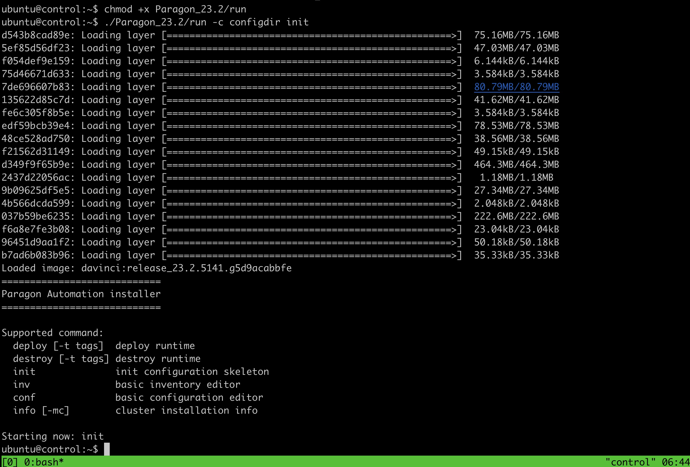

5. Run file **run** from paragon installation to fill initial configuration (ip addresses of kubernetes nodes, and password)
       
        Paragon_23.2/run -c configdir inv

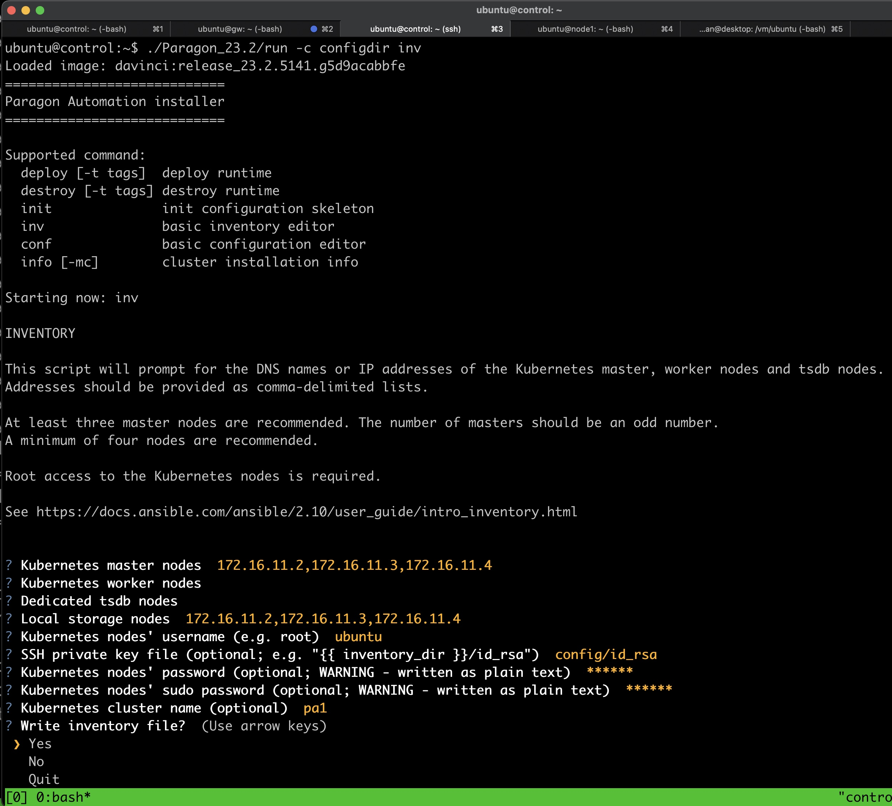

6. Copy RSA public key into directory **configdir**

       cp ~/.ssh/id_rsa ~/configdir

7. Run file **run** from paragon installation to configure paragon parameter
        
       ./Paragon_23.2/run -c configdir conf

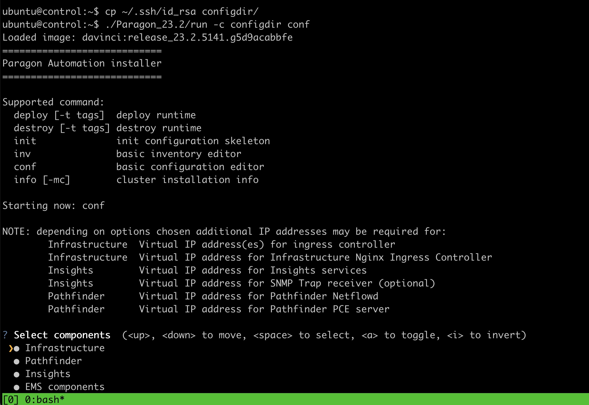

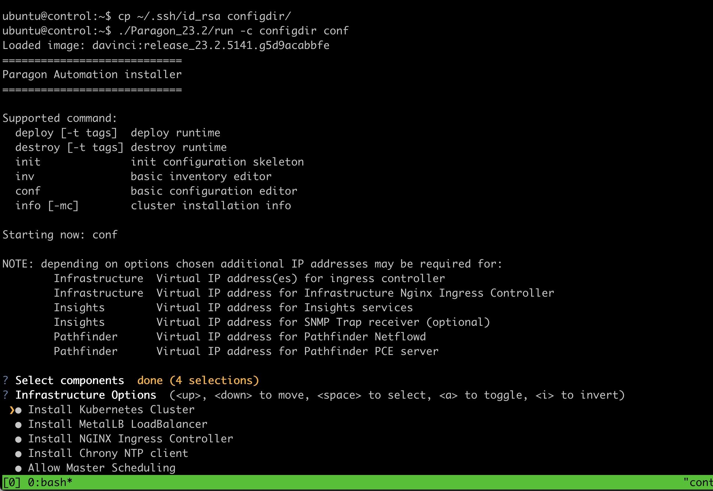

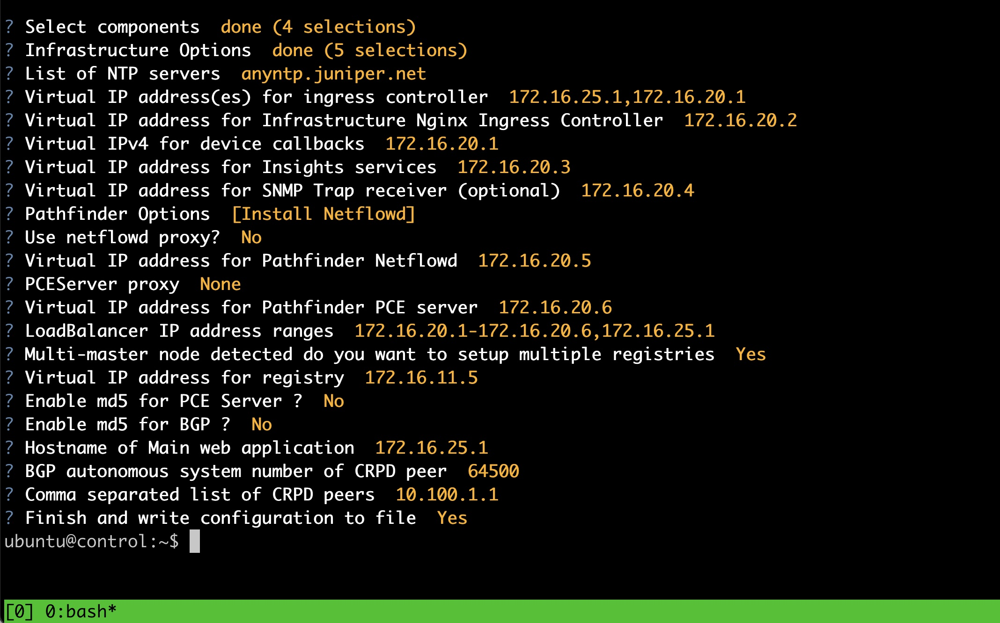

8. Edit file Paragon23.2/config.yml, and enable parameter to enable BGP for Metallb.

change the following 

       # alternatively, for metallb in L3 (BGP) mode, enable the following:
       # metallb_mode: l3
       # metallb_asn: 64500
       # metallb_peer_asn: 64501
       # metallb_peer_address: 192.168.10.1

into 

       # alternatively, for metallb in L3 (BGP) mode, enable the following:
       metallb_mode: l3
       metallb_asn: 65413
       metallb_peer_asn: 65412
       metallb_peer_address: 172.16.11.1

9. Start Paragon automation installation process. The installation proccess may take up to 90 minutes to finish.

       tmux
       ./Paragon_23.2/run -c configdir  deploy -e ignore_iops_check=yes -e offline_install=true

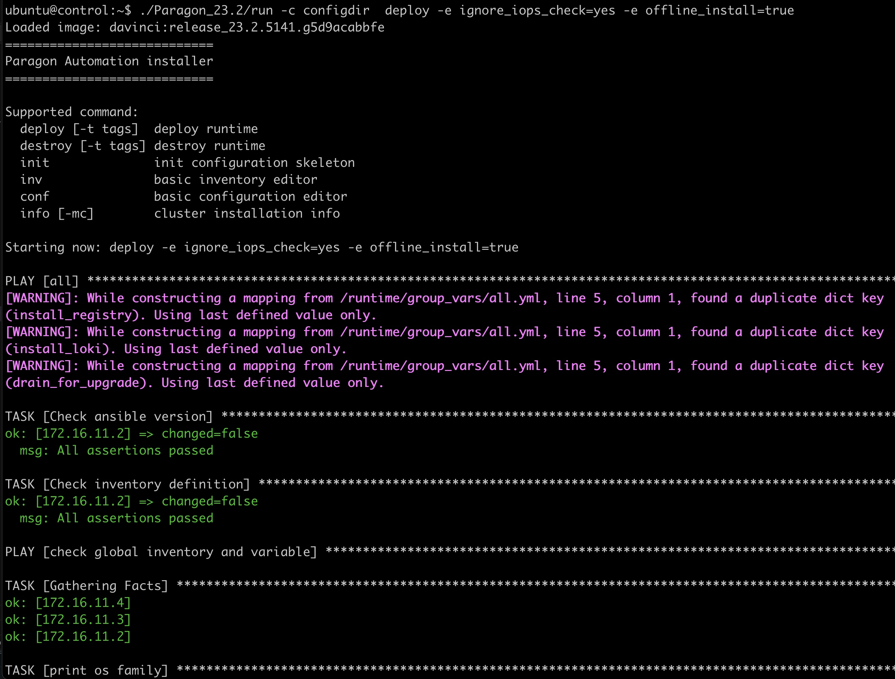

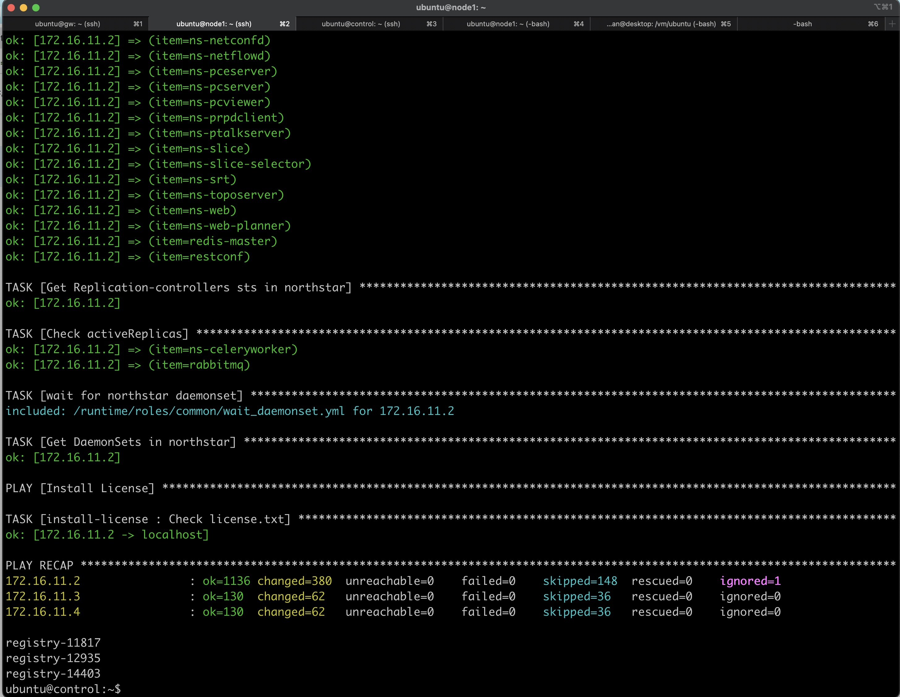

## bugs with Paragon 23.2 with multiple ingress VIP

There is a bug on PA 23.2 related to multiple ingress VIP. 
To verify that the bug exist, do the following
1. Get the list of LoadBalancer services with name start with **ambassador**

       ssh node1
       kubectl get services -A | grep LoadBalancer | grep ambassador

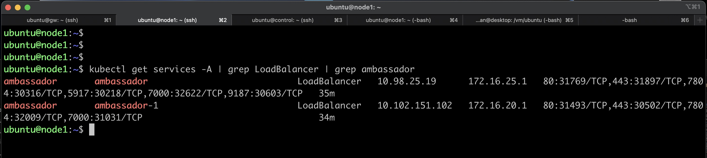

2. Get the detail information of seach service, using the following command. Those service without endpoint IP addresses is the one that has problem

       kubectl -n ambassador describe services ambassador

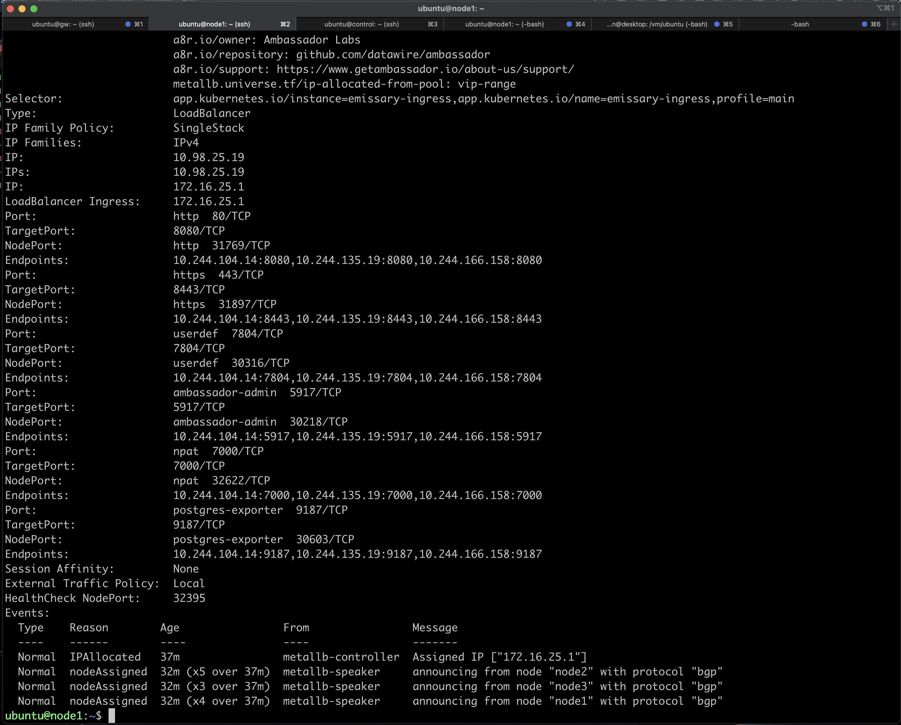

       kubectl -n ambassador describe services ambassador-1

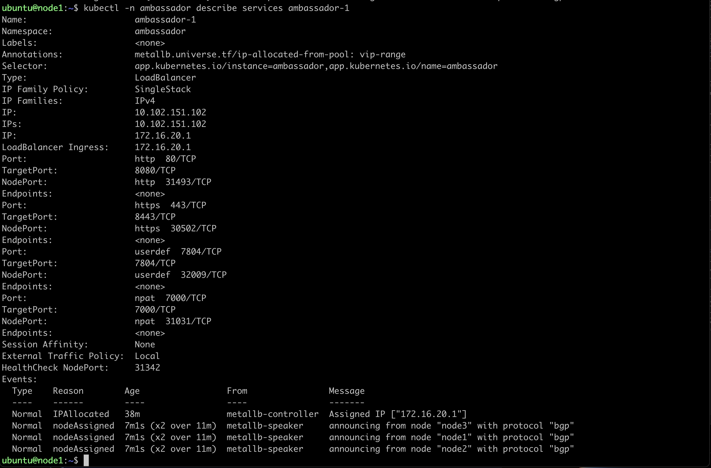

From the output above, service **ambassador-1** is the one affected by the bugs, because it doesn't have ip addresses on the endpoints.

4. To fix it, edit service **ambassador-1**, and under **selector**, change the  **instance** and the **name** from **ambassador** to **emissary-ingress**

5. To change, edit the service **ambassador-1**, using the command

        kubectl -n ambassador edit service ambassador-1

4. look for entry selector, and replace the following entries.

       selector:
          app.kubernetes.io/instance: ambassador
          app.kubernetes.io/name: ambassador

       with 
        
       selector:
          app.kubernetes.io/instance: emissary-ingress
          app.kubernetes.io/name: emissary-ingress

5. save it, and verify that the endpoints for service **ambassador-1** has been assigned with ip address

       kubectl -n ambassador describe services ambassador-1

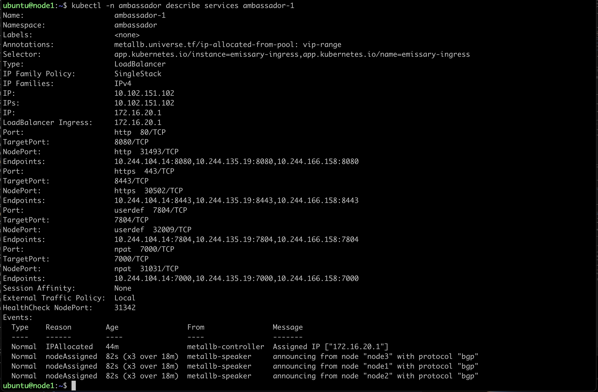

## Accessing Web Interface of Paragon automation
1. From your workstation, open ssh session to node **proxy** and keep this session open if you need to access the web dashboard of Paragon Automation platform

        ssh -f -N proxy 

2. If you are using Firefox as web browser, set proxy with the following parameters
    - manual proxy configuration
    - SOCKS host : 127.0.0.1
    - PORT : 1080
    - type: SOCKS v4    
    

3. If you are using Chrome as web browser, install extension Foxy Proxy and configure it with the following parameters
    - manual proxy configuration
    - SOCKS host : 127.0.0.1
    - PORT : 1080
    - type: SOCKS v4    
    
    

4. Open http session to https://172.16.25.1, and login using default credential, user/password: admin/Admin123!, and change the password  
 
 
 

5. By default, no license is installed on Paragon Automation platform, and access to Paragon automation function, Pathfinder, Planner and Insight, are disabled. Get the license from [Agile Internal Licensing Portal](https://internal-license.juniper.net/nckt/)

6. Install the license into Paragon automation platform, then menu to access Paragon automation function, Pathfinder, Insight, and Planner, will be accessible

or you can use [this](install/paragon_automation.txt) 

7. To enable proxy on javaws to access access into Paragon Planner Desktop, from terminal run **javaws -viewer**, and set the proxy

7. Now you can explore the Paragon automation platform. You can start doing [initial setup](Initial_setup.md)

## getting opendistro username/password

        kubectl get secret -n kube-system opendistro-es-account -o jsonpath={..username} | base64 -d
        kubectl get secret -n kube-system opendistro-es-account -o jsonpath={..password} | base64 -dk

## enable LSP latency calculation on paragon pathfinder
do the following enable LSP latency calculation

        # kubectl  -n northstar get pods | grep bmp
        # kubectl -n northstar exec -it `kubectl -n northstar get pods | grep bmp | tr -s " " | cut -f 1 -d " "` -c crpd cli
        # kubectl  -n northstar exec -it `kubectl  -n northstar get pods | grep cmgd | cut -f 1 -d " "`  -c ns-cmgd cli
        kubectl -n northstar exec -it `kubectl -n northstar get pods | grep cmgd | tr -s " " | cut -f 1 -d " "` -c ns-cmgd cli
        edit
        set northstar path-computation-server lsp-latency-interval 60s
        commit
 

 