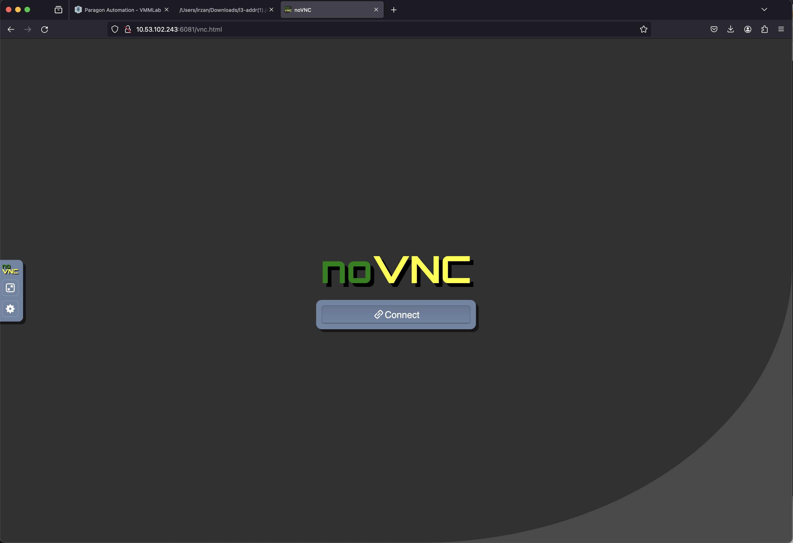
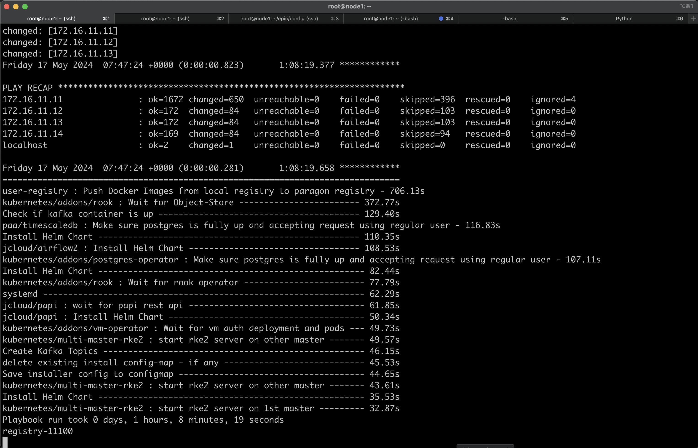
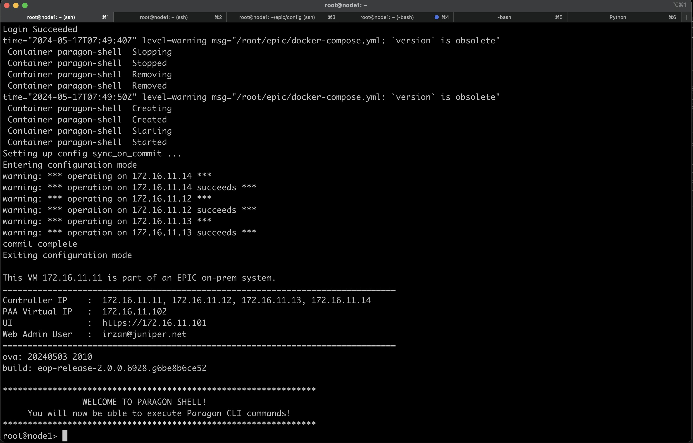
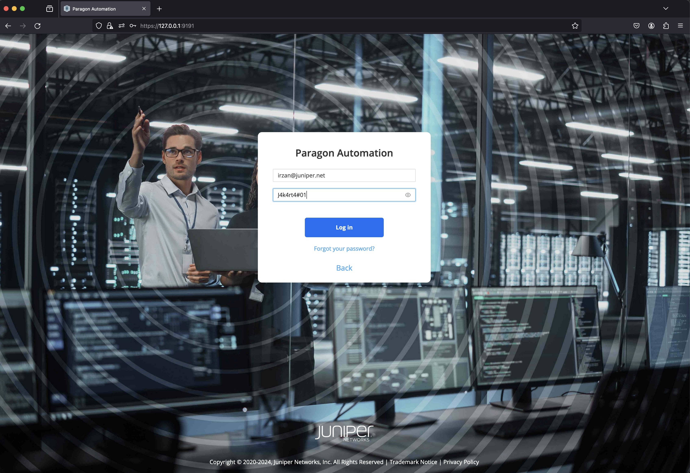
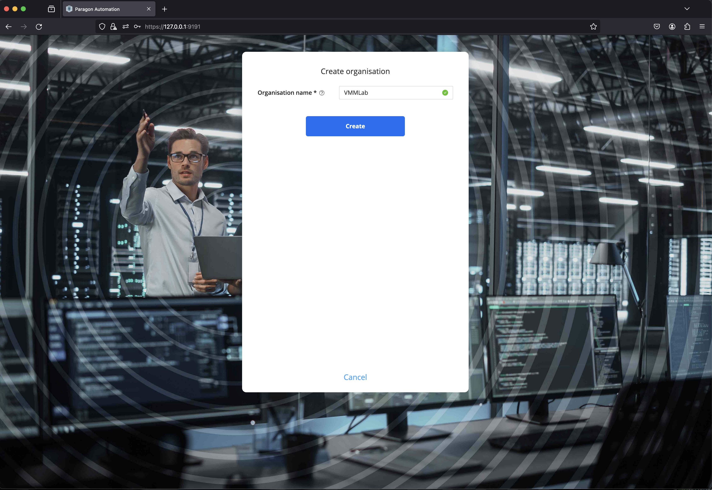

# How setup Paragon 2.0.0 Lab on VMM
## topology

## note
Tested with paragon automation 2.0.0
based on this [documentation](https://www.juniper.net/documentation/us/en/software/juniper-paragon-automation2.0.0/installation-guide/index.html).

## Devices in the lab

- vJunosRouter : pe1, pe2, pe3, pe4, p1, p2, p3, p4, pe5
- Linux client: client (to provide test traffic) (linux ubuntu)
- Bridge : br1, br2, br3 ( linux bridge between junos node to simulate link failure, delay and packet loss) (linux alpine)

- Kubernetes cluster for Paragon Automation
    - Node1, Node2, Node3, Node4 : Paragon 2.0.0 Virtual Appliance

## Credential to access devices
- Ubuntu linux
    - user: ubuntu
    - password: pass01
- Alpine linux/Bridge
    - user: alpine
    - password: pass01
- vJunos Router
    - user: admin
    - password: pass01

## Getting disk image for Paragon 2.0.0
As for the current version of Paragon Automation platform, version 2.0.0, the disk image is as only available as OVA package.

To install paragon virtual appliance on vmm, it requires the disk image, in VMDK or QCOW format.

so you need to extract the disk image from the OVA package, and put it into your home directory.

the challenge is the size of the disk image is 20G++, so you need to ensure that your VMM account has enough quota on the VMM directory.

you can copy the disk image from my home directory on VMM /vmm/data/user_disks/irzan/images 

## To create the lab topology and initial configuration of VMs
1. Go to directory [Paragon Lab](./)
2. link file [lab_pa2.yaml](./lab_pa2.yaml) to file [lab.yaml](./lab.yaml)
3. Edit file [lab.yaml](./lab.yaml). Set the following parameters to choose which vmm server that you are going to use and the login credential:
    - vmmserver 
    - jumpserver
    - user 
    - adpassword
    - ssh_key_name ( please select the ssh key that you want to use, if you don't have it, create one using ssh-keygen and put it under directory **~/.ssh/** on your workstation )
3. If you want to add devices or change the topooogy of the lab, then edit file [lab.yaml](lab.yaml)
4. use [vmm.py](../../vmm.py) script to deploy the topology into the VMM. Run the following command from terminal

        ../../vmm.py upload  <-- to create the topology file and the configuration for the VMs and upload them into vmm server
        ../../vmm.py start   <-- to start the topology in the vmm server

5. Verify that you can access node **gw** using ssh (username: ubuntu,  password: pass01 ). You may have to wait for few minutes for node **gw** to be up and running
6. Run script [vmm.py](../../vmm.py) to send and run initial configuration on node **gw**. This will configure ip address on other interfaces (such ase eth1, eth2, etc) and enable dhcp server on node gw

        ../../vmm.py set_gw

7. Verify that you can access other nodes (linux and junos VM), such **node1**, **node2**, **nod3**, etc. Please use the credential to login.

        ssh control

8. Run script [vmm.py](../../vmm.py) to send and run initial configuration on linux nodes. This script will also reboot the VM. So wait before you test connectivity into the VM

        ../../vmm.py set_host

9. Verify that you can access linux and junos VMs, such **control**, **node1**, **node2**, without entering the password. You may have to wait for few minutes for the nodes to be up and running

        ssh control
        ssh node1
        ssh r1
## update and upgrade package on node GW
1. open ssh session to node GW
2. update and upgrade package on node GW

        ssh gw
        sudo apt -y update && sudo apt -y upgrade
        sudo reboot

3. Wait until it rebooted.

## set ip address on Paragon virtual appliance
1. To access graphic console of Paragon virtual appliance using VNC, open ssh session to node **gw**, and the login banner will provide the URL to access VNC port of node1, node2, node2, node3

        ----------------------------------------------
        To access console of VM, use the following URL
        ----------------------------------------------
        console node1 : http://10.53.102.243:6081/vnc.html
        console node2 : http://10.53.102.243:6082/vnc.html
        console node3 : http://10.53.102.243:6083/vnc.html
        console node4 : http://10.53.102.243:6084/vnc.html
        console client : http://10.53.102.243:6085/vnc.html

2. on node **gw**, run the script to start web proxy to access the vnc port

        /usr/local/bin/start_vnc.sh

3. To configure node1, on web browser of your workstation open session to url of node1

        http://10.53.102.243:6081/vnc.html

     
     
4. Click connect to open VNC connection to node1

5. Set the password, hostname, and ip address of node1

6. Use the following table to set ip address on the nodes. DNS 10.49.32.95/97 are internal DNS server. it is requires to be able to access ntp.juniper.net (the internal NTP server)

node | ip address | gateway | dns1 | dns2
-|-|-|-|-
node1|172.16.11.11/24|172.16.11.1|10.49.32.95|10.49.32.97
node2|172.16.11.12/24|172.16.11.1|10.49.32.95|10.49.32.97
node3|172.16.11.13/24|172.16.11.1|10.49.32.95|10.49.32.97
node4|172.16.11.14/24|172.16.11.1|10.49.32.95|10.49.32.97

7. Exit from the CLI, but don't create the cluster... just exit, and test connectivity to 172.16.11.1
8. Repat step 4 to 7 for node2, node3, and node4

## create paragon cluster
1. From your workstation, open ssh session into node1, and you will enter paragon shell

        ssh node1

2. Enter the following configuration on paragon shell. change the web-admin-user to your email

        configure
        set paragon cluster nodes kubernetes 1 address 172.16.11.11
        set paragon cluster nodes kubernetes 2 address 172.16.11.12
        set paragon cluster nodes kubernetes 3 address 172.16.11.13
        set paragon cluster nodes kubernetes 4 address 172.16.11.14
        set paragon cluster ntp ntp-servers ntp.juniper.net
        set paragon cluster common-services ingress ingress-vip 172.16.11.101
        set paragon cluster applications active-assurance test-agent-gateway-vip 172.16.11.102
        set paragon cluster applications web-ui web-admin-user irzan@juniper.net
        set paragon cluster applications web-ui web-admin-password "J4k4rt4#01"
        commit
        exit

3. Create the configuration file by running this command on paragon shell

        request paragon config

4. Create ssh-key to allow access between nodes. Use user **root** and the password that you setup on the node initialization

        request paragon ssh-key

5. Start deploying cluster

        request paragon deploy cluster input "-e ignore_iops_check=yes"

6. It will take around 60minutes ++ for paragon cluster deployment
7. The installation progress can be monitored using this command

        monitor start /epic/config/log
8. or from the linux shell, run the following command

        tail -f /root/epic/config/log
    
    

9. Once the cluster is done, exit from the Paragon shell, and login again to finish the installation

    

10. Now the paragon 2.0.0 cluster is installed.

## access the web dashboard of Paragon appliance
1. on your workstation, open ssh session to node **gw** with port forwarding to ip address 172.16.11.101 (VIP of Web Dashboard) port 443

        ssh -L 9191:172.16.11.101:443 gw

2. From your workstation, open web session to https://127.0.0.1:9191, and login user the username/password that you specify during cluster installation.

    
    
    
    

3. Now you have access into Paragon 2.0.0

## Lab Exercise
Now you can start exploring Juniper Paragon 2.0.0

you can use the following [document](pa_2.0.0/LabExercise.md) as guideline 

