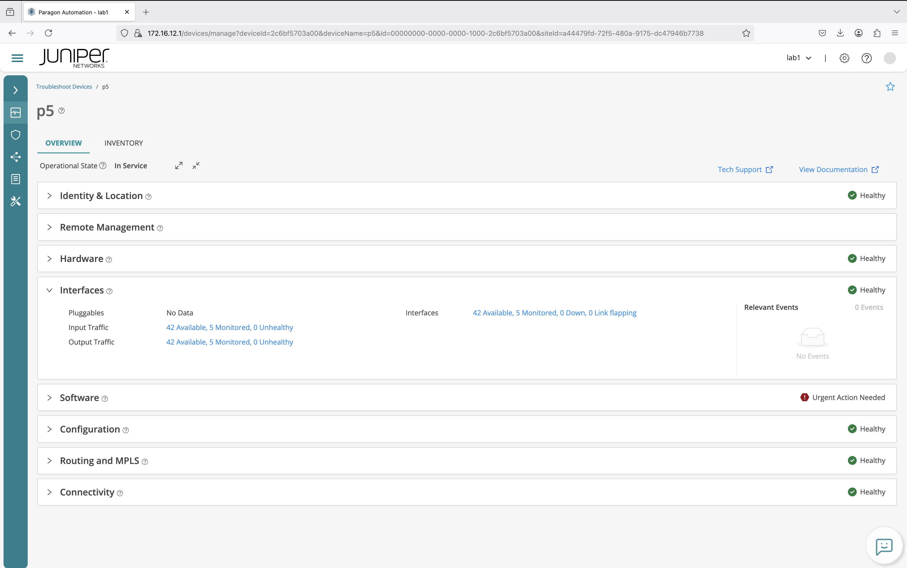
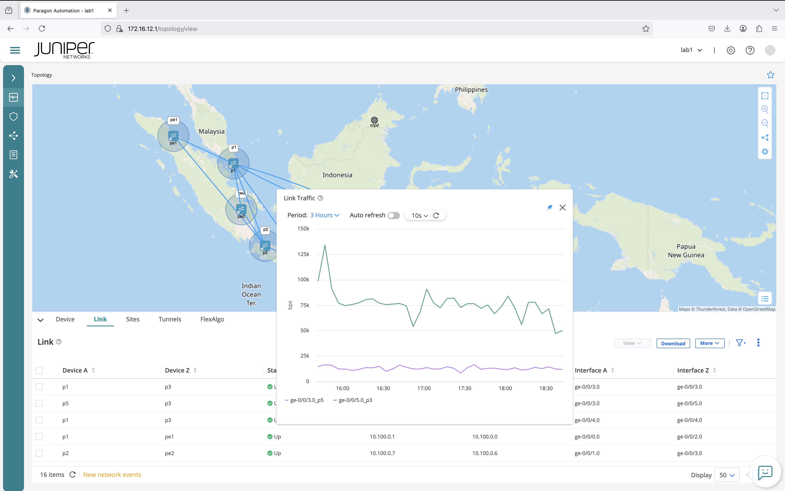

# Brownfield deployment with NIP with device profile, interface profile, and links between node

## NIP (network implementation plan)
NIP : [plan.lab1_brownfield.json](plan.lab1_brownfield.json)

## configuration the nodes

node [P1](./router/p1.conf)

node [P2](./router/p2.conf)

node [P3](./router/p3.conf)

node [P4](./router/p4.conf)

node [P5](./router/p5.conf)

node [PE1](./router/pe1.conf)

node [PE2](./router/pe2.conf)

node [PE3](./router/pe3.conf)

node [PE4](./router/pe4.conf)

## sensor configurations

sensors [config](./router/sensors.conf)

## screenshoot Troubleshoot > Devices > node > interfaces

## screenshoot Network > topology > Links

Delay 

Traffic

