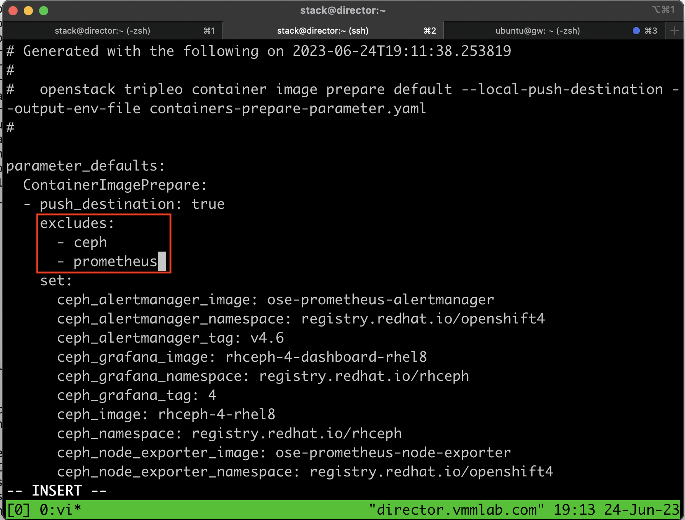
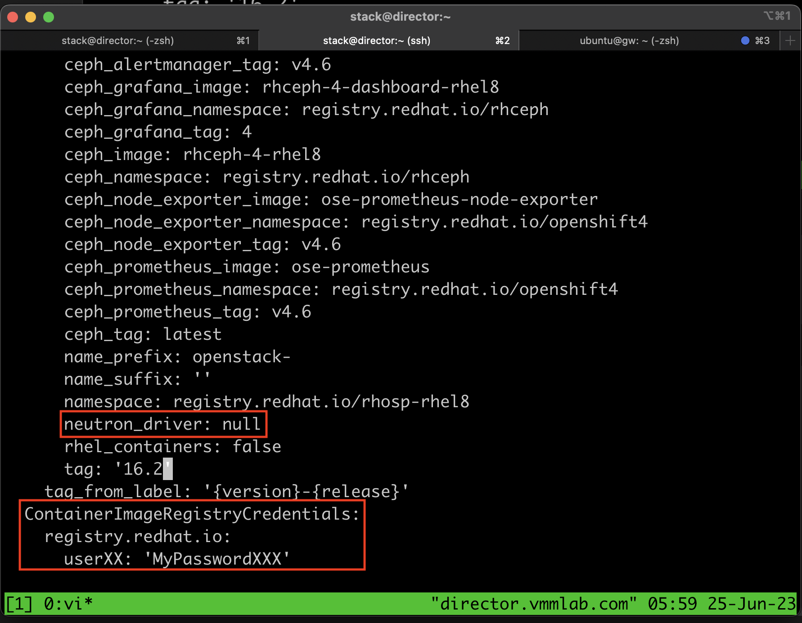
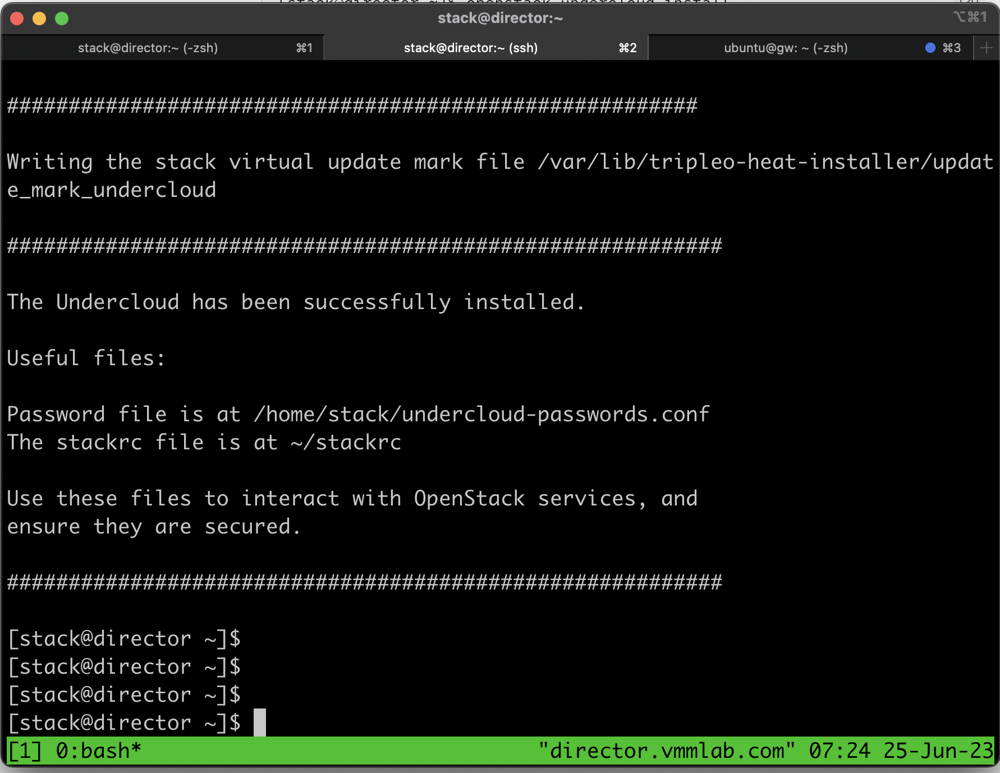

# Deploying RHOSP with Contrail networking

## Deploying lab topology

##

## installing triple-o-client on directory
1. open ssh into node director

        ssh director 

2. add user stack and enable it for sudo 

        useradd stack
        #password stack 
        echo "stack ALL=(root) NOPASSWD:ALL" | tee -a /etc/sudoers.d/stack
        chmod 0440 /etc/sudoers.d/stack
3. Register to Redhat subscription, and and enable repository for installing openstack

        sudo subscription-manager register --username $1 --password $2
        sudo subscription-manager list --available --all --matches="Red Hat OpenStack"
        sudo subscription-manager attach --pool=Pool-ID
        sudo subscription-manager release --set=8.4
        sudo subscription-manager repos --disable=*
        sudo subscription-manager repos \
        --enable=rhel-8-for-x86_64-baseos-eus-rpms \
        --enable=rhel-8-for-x86_64-appstream-eus-rpms \
        --enable=rhel-8-for-x86_64-highavailability-eus-rpms \
        --enable=ansible-2.9-for-rhel-8-x86_64-rpms \
        --enable=openstack-16.2-for-rhel-8-x86_64-rpms \
        --enable=fast-datapath-for-rhel-8-x86_64-rpms
        sudo dnf module reset container-tools
        sudo dnf module enable -y container-tools:3.0
        sudo dnf update -y
        sudo reboot

4. Install command line tools for director installation and configuration

        ssh stack@director
        sudo dnf install -y python3-tripleoclient

5. Create directory for the installation images

        mkdir ~/images
        mkdir ~/templates

6. Generate the default container image preparation file

        sudo openstack tripleo container image prepare default \
        --local-push-destination \
        --output-env-file containers-prepare-parameter.yaml
        sudo chown stack:stack containers-prepare-parameter.yaml

7. Edit file containers-prepare-parameter.yaml, and add the following entries (to exclude cehp and disable OVN for contrail installation)

    
    

        parameter_defaults:
           ContainerImagePrepare:
           - push_destination: true
             excludes:
               - ceph
               - prometheus
                ...
                ...
             set:
                ...
                ...
               neutron_driver: null
                ...
                ...
             tag_from_label: '{version}-{release}'
           ContainerImageRegistryCredentials:
              registry.redhat.io:
                userlogin: 'password'

8. Copy undercloud.conf into home directory

        cp \
        /usr/share/python-tripleoclient/undercloud.conf.sample \
        ~/undercloud.conf

9. edit file undercloud.conf and add the following entries

        [DEFAULT]
        container_images_file = /home/stack/containers-prepare-parameter.yaml
        generate_service_certificate = false
        local_interface=eth1
        overcloud_domain_name = vmmlab.com
        undercloud_ntp_servers = ntp.juniper.net
        local_ip=172.16.12.9/24
        cidr=172.16.12.0/24
        dhcp_end = 172.16.12.200
        dhcp_start = 172.16.12.101
        gateway =172.16.12.1

10. delete file **/etc/sysconfig/network-scripts/ifcfg-enp1s0** and **/etc/sysconfig/network-scripts/ifcfg-eth1**

        sudo rm /etc/sysconfig/network-scripts/ifcfg-enp1s0
        sudo rm /etc/sysconfig/network-scripts/ifcfg-eth1

11. Run the following command to install director on the undercloud:

        tmux
        openstack undercloud install

12. Director installation is successfull

    

## enabling Redhat subscription on overcloud node 
1. Open ssh session into node OS using user stack

        ssh stack@os0

2. Run the following script to enable Redhat software subscriptioni 

        sudo subscription-manager register --username $1 --password $2
        POOL_ID=`sudo subscription-manager list --available --all --matches="Red Hat OpenStack" | grep  "Pool ID"  | head -1 | cut -f 2 -d ":" | sed -e 's/^[ \t]*//'`
        # sudo subscription-manager list --available --all --matches="Red Hat OpenStack"
        sudo subscription-manager attach --pool=${POOL_ID}
        sudo subscription-manager release --set=8.4
        sudo subscription-manager repos --disable=*
        sudo subscription-manager repos \
        --enable=rhel-8-for-x86_64-baseos-eus-rpms \
        --enable=rhel-8-for-x86_64-appstream-eus-rpms \
        --enable=rhel-8-for-x86_64-highavailability-eus-rpms \
        --enable=ansible-2.9-for-rhel-8-x86_64-rpms \
        --enable=openstack-16.2-for-rhel-8-x86_64-rpms \
        --enable=fast-datapath-for-rhel-8-x86_64-rpms
        sudo dnf module reset container-tools
        sudo dnf module enable -y container-tools:3.0
        sudo dnf update -y
        sudo reboot

3. Repeat step 1 and 2 for other overcloud node: cc0, cadb0, can0, compute0, compute1, and compute2

## Configuring for overcloud

1. Copy the templates to local directory

        rsync -a /usr/share/openstack-tripleo-heat-templates/. ~/tripleo-heat-templates
2. upload Contrail triple-O template into node director, and copy its content into directory ~/templates

        tar xvfz contrail-tripleo-heat-templates-RHOSP16-21.4.L2.329.tgz
        rsync -a contrail-tripleo-heat-templates-RHOSP-16/. ~/tripleo-heat-templates

3. download the container image for contrail

        cd /home/stack/tripleo-heat-templates/tools/contrail
        ./upload_containers.sh -r enterprise-hub.juniper.net/contrail-container-prod -u $HUB_USER -p $HUB_PASSWD -t 21.4.L2.329
        openstack tripleo container image list

4. Template process

        cd ~/tripleo-heat-templates/tools
        ./process-templates.py -r ~/tripleo-heat-templates/roles_data_contrail.yaml -p ~/tripleo-heat-templates/

5. on os0, cc0, cadb0, can0, compute0, compute1, compute2

        sudo rm /etc/sysconfig/network-scripts/ifcfg-eth0
        sudo rm /etc/sysconfig/network-scripts/ifcfg-eth1

