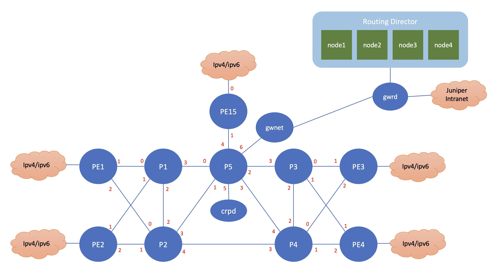

# How setup Routing Director on VMM
## topology

This lab consist of two topology (lab configuration) on VMM:
1. [Routing director](RD/lab.yaml)
2. [Network devices](network/lab.yaml)

For topology **Routing director**, it consists of the following nodes:
- Routing director appliance: node1, node2, node2, node 4
- GW : gateway for connection to Juniper's Intranet.

for topology **network**, it consists of the following:
- vJunos-Router: PE1, PE2, PE3, PE4, PE5, P1, P2, P3, P4, P5
- linux VM to run cRPD: crpd
- Linux VM to simulate CE or subscriber's devices: client
- GW: gateway for connection to Juniper's Intranet

This documentation provides information on how to install and setup this lab.

## note
Tested with Routing Director 2.6.0, based on this [documentation](https://www.juniper.net/documentation/us/en/software/juniper-routing-director2.6.0/installation-guide/index.html).

## Getting disk image for Routing Director
As for the current version of Routing Director Automation platform, version 2.6.0, the installation package only available as OVA package.

To install Routing Director virtual appliance on vmm, it requires the disk image in QCOW2 format.

So you need to extract the disk image from the OVA package, convert the disk image from VMDK to QCOW2, and put it into your home directory. Only disk1 is required. Disk2 will be created automatically by the script.

The challenge is the size of the disk image itself is around  36G++, so you need to ensure that your VMM account has enough quota on the VMM directory.

You can copy the disk image from my home directory on VMM /vmm/data/user_disks/irzan/images/rd.

## Deploying Routing Director lab topology and initial configuration of VMs

Screenshot recording for this can be found [here](https://asciinema.org/a/750939)

1. Go to directory [Routing Director Lab](./RD)
2. Edit file [lab.yaml](./RD/lab.yaml). Set the following parameters to choose which vmm server that you are going to use and the login credential:
    - vmmserver # for the vmmserver, use different pod on the VMM for [RD](RD/lab.yaml) and lab [network](network/lab.yaml) . They can't run on the same VMM pod
    - user 
4. use [vmm.py](../../../vmm.py) script to deploy the topology into the VMM. Run the following command from terminal

        ../../../vmm.py upload  <-- to create the topology file and the configuration for the VMs and upload them into vmm server
        ../../../vmm.py start   <-- to start the topology in the vmm server

5. Verify that you can access node **gw** using ssh (username: ubuntu,  password: pass01 ). You may have to wait for few minutes for node **gw** to be up and running
6. Run script [vmm.py](../../vmm.py) to send and run initial configuration on node **gw**. This will configure ip address on other interfaces (such ase eth1, eth2, etc), enable dhcp server and dns server on node gw

        ../../../vmm.py set_gw

## update and upgrade package on linux node

1. use ansible playbook [updates_nodes.yaml](host/update_nodes.yaml) to update and install software on node gw

        cd ~/git/vmm-v3-script/Lab/routing_director/RD/host
        ansible-playbook updates_node.yaml

2. Wait until they are rebooted.

## set ip address on Routing Director virtual appliance

To access the console of routing director appliance, it can be done using the serial console (through VMM server) or VNC interface .

### The following steps are to configure ip address on Routing Director appliances using serial console

Screenshot recording for this can be found [here](https://asciinema.org/a/741933)

1. Open ssh session into node VMM, and list the virtual machines running on VMM

        ssh vmm
        vmm list

2. Access serial console appliance **node1**

        vmm serial -t node1

3. Login using user **root**, and set the password, and follow the step to configure hostname, and ip address of the appliance
4. Use the following table for the ip address assignment for the routing director appliances

node | ip address | gateway | dns1 | dns2
-|-|-|-|-
node1|172.16.11.11/24|172.16.11.254|172.16.11.254|172.16.11.254
node2|172.16.11.12/24|172.16.11.254|172.16.11.254|172.16.11.254
node3|172.16.11.13/24|172.16.11.254|172.16.11.254|172.16.11.254
node4|172.16.11.14/24|172.16.11.254|172.16.11.254|172.16.11.254

5. Exit from the CLI, but don't create the cluster... just exit, and test connectivity to 172.16.11.254
6. Edit file **/etc/netplan/00-installer-config.yaml**, and the following entry for name search

        network:
          version: 2
            ethernets:
              ens5f0:
                dhcp4: false
                dhcp6: no
                addresses: [172.16.11.11/24]
                routes:
                - to: default
                  via: 172.16.11.254
                nameservers:
                  addresses: [172.16.11.254, 172.16.11.254]
                  search: [vmmlab.com]   # <<--- add this line

7. Activate the changes of the network configuration

        netplan apply
8. Verify that ssh service is up and running. If it is not running, restart the sshd service

        systemctl status sshd
        systemctl restart sshd
        systemctl status sshd

9. Exit serial console of node1 by presssing **CTRL ]** and **quit**

11. Repat step 2 to 8 for node2, node3, and node4
12. From node **gw**, verify that all appliance can be accessed using ssh 

        ssh gw
        ssh root@node1
        ssh root@node2
        ssh root@node3
        ssh root@node4

### The following steps are to configure ip address on Routing Director appliances using VNC interface 

1. To access graphic console of Routing Director virtual appliance using VNC, open ssh session to node **gw**, and the login banner will provide the URL to access VNC port of node1, node2, node2, node3

        ----------------------------------------------
        To access console of VM, use the following URL
        ----------------------------------------------
        console node1 : http://10.49.29.0:6081/vnc.html
        console node2 : http://10.49.29.0:6082/vnc.html
        console node3 : http://10.49.29.0:6083/vnc.html
        console node4 : http://10.49.29.0:6084/vnc.html

2. on node **gw**, run the script to start web proxy to access the vnc port

        /usr/local/bin/start_vnc.sh

3. To configure node1, on web browser of your workstation open session to url of node1

        http://10.49.1.171:6081/vnc.html

4. Click connect to open VNC connection to node1

5. Set the password, hostname, and ip address of node1

6. Use the following table to set ip address on the nodes. DNS 172.16.11.254 are internal DNS server. it is requires to be able to access ntp.juniper.net (the internal NTP server)

node | ip address | gateway | dns1 | dns2
-|-|-|-|-
node1|172.16.11.11/24|172.16.11.254|172.16.11.254|172.16.11.254
node2|172.16.11.12/24|172.16.11.254|172.16.11.254|172.16.11.254
node3|172.16.11.13/24|172.16.11.254|172.16.11.254|172.16.11.254
node4|172.16.11.14/24|172.16.11.254|172.16.11.254|172.16.11.254

7. Exit from the CLI, but don't create the cluster... just exit, and test connectivity to 172.16.11.254
8. Repat step 4 to 7 for node2, node3, and node4

## configure wireguard
The following step is to setup wireguard to allow direct access into the lab, for example to access the Routing Director dashboard directly from your workstation.

Wireguard is also used to provide connectivity to another VMM topology (lab network) where all the vJunos VMs are running.

Screenshot recording for this can be found [here](https://asciinema.org/a/741934)

1. Install wireguard into your workstation

        brew install wireguard-tool  # this for macosx

2. on your workstation, run the following script

        ../../../vmm.py get_wg_config

3. It will create configuration file for wireguard

        tmp/wg0_ws.conf : this configuration file is for your workstaiton
        tmp/wg0_gw.conf : this configuration file is for node **gw**

4. upload file wg0_gw.conf into node **gw** and run wireguard on node **gw**

        scp tmp/wg0_gw.conf gw:~/wg0.conf
        ssh gw "sudo cp wg0.conf /etc/wireguard/wg0.conf ; sudo systemctl enable wg-quick@wg0; sudo systemctl start wg-quick@wg0"

4. On your workstation, copy configuration file wg0_ws.conf into the wireguard local directory 

        sudo cp tmp/wg0_ws.conf /usr/local/etc/wireguard/wg0.conf

7. on your workstation, start wireguard session, and test connectivity to the lab

        sudo wg-quick up wg0
        ping 172.16.11.254
        ping 172.16.11.11
        ping 172.16.11.14

## configure BGP on node **gw**

If BGP is going to be enabled on MetalLB on Routing Director, then we need to configure BGP on node **gw**, 

If MetalLB on Routing Director cluster is going to use L2, then BGP is not needed on node **gw**

Screenshot recording for this can be found [here](https://asciinema.org/a/741935)

1. Enable BGP on frr on node **gw**

       ssh gw
       sudo sed -i -e "s/bgpd=no/bgpd=yes/" /etc/frr/daemons
       sudo systemctl restart frr

2. Access console for frr

       sudo vtysh 

2. put this configuration into FRR

       config t
       router bgp 65100
       no bgp ebgp-requires-policy
       neighbor 172.16.11.11 remote-as 65101
       neighbor 172.16.11.12 remote-as 65101
       neighbor 172.16.11.13 remote-as 65101
       neighbor 172.16.11.14 remote-as 65101
       exit
       !
       end
       write mem

## create Routing Director cluster

Screenshot recording for this can be found here [part1](https://asciinema.org/a/741936) and [part2](https://asciinema.org/a/742072)

1. From your workstation, open ssh session into node1, and you will enter Routing Director shell

        ssh node1 

        or

        ssh root@172.16.11.11

2. Enter the following configuration on Routing Director shell. change the web-admin-user to your email

       configure
       set deployment cluster nodes kubernetes 1 address 172.16.11.11
       set deployment cluster nodes kubernetes 2 address 172.16.11.12
       set deployment cluster nodes kubernetes 3 address 172.16.11.13
       set deployment cluster nodes kubernetes 4 address 172.16.11.14
       set deployment cluster ntp ntp-servers ntp.juniper.net
       set deployment cluster common-services ingress ingress-vip 172.16.12.1
       set deployment cluster applications active-assurance test-agent-gateway-vip 172.16.12.2
       set deployment cluster applications web-ui web-admin-user "irzan@juniper.net"   
       set deployment cluster applications web-ui web-admin-password "J4k4rt4#170845" 
       set deployment cluster applications pathfinder pce-server pce-server-vip 172.16.12.3
       set deployment cluster install enable-l3-vip true
       set deployment cluster common-services metallb metallb-bgp-peer peer-ip 172.16.11.254 peer-asn 65100 local-asn 65101 local-nodes 172.16.11.11 
       set deployment cluster common-services metallb metallb-bgp-peer peer-ip 172.16.11.254 peer-asn 65100 local-asn 65101 local-nodes 172.16.11.12
       set deployment cluster common-services metallb metallb-bgp-peer peer-ip 172.16.11.254 peer-asn 65100 local-asn 65101 local-nodes 172.16.11.13  
       set deployment cluster common-services metallb metallb-bgp-peer peer-ip 172.16.11.254 peer-asn 65100 local-asn 65101 local-nodes 172.16.11.14
       commit
       exit

       
       # optional
       # set Routing Director cluster applications routingbot routingbot-crpd-vip 172.16.12.4
       # set Routing Director cluster applications aiops install-aiml true
       # set Routing Director cluster applications aiops enable-device-health true

3. Create the configuration file by running this command on Routing Director shell

        request deployment config

4. Create ssh-key to allow access between nodes. Use user **root** and the password that you setup on the node initialization

        request deployment ssh-key

5. Start deploying cluster

        request deployment deploy cluster input "-e ignore_iops_check=yes"

6. It will take around 60++ minutes for Routing Director cluster deployment
7. If the deployment failed, just repeat step 5.
8. The installation progress can be monitored using this command

        monitor start /epic/config/log
9. or from the linux shell, run the following command

        tail -f /root/epic/config/log
    
10. Once the cluster successfully deployed, exit from the Routing Director shell, and login again to finish the installation
11. on node GW, access frr console, and verify that node **GW** has received BGP update from Routing Director cluster
        ssh gw
        sudo vtysh 
        show bgp summary 
        show ip bgp

        ubuntu@gwrd:~$ sudo vtysh

        Hello, this is FRRouting (version 8.4.4).
        Copyright 1996-2005 Kunihiro Ishiguro, et al.

        gwrd# show bgp summary

        IPv4 Unicast Summary (VRF default):
        BGP router identifier 192.168.199.0, local AS number 65100 vrf-id 0
        BGP table version 5
        RIB entries 5, using 960 bytes of memory
        Peers 4, using 2896 KiB of memory

        Neighbor        V         AS   MsgRcvd   MsgSent   TblVer  InQ OutQ  Up/Down State/PfxRcd   PfxSnt Desc
        172.16.11.11    4      65101       709       709        0    0    0 05:50:47            2        3 N/A
        172.16.11.12    4      65101       707       709        0    0    0 05:50:47            1        3 N/A
        172.16.11.13    4      65101       710       709        0    0    0 05:50:47            3        3 N/A
        172.16.11.14    4      65101       708       709        0    0    0 05:50:47            1        3 N/A

        Total number of neighbors 4
        gwrd# sho ip route
        Codes: K - kernel route, C - connected, S - static, R - RIP,
        O - OSPF, I - IS-IS, B - BGP, E - EIGRP, N - NHRP,
        T - Table, v - VNC, V - VNC-Direct, A - Babel, F - PBR,
        f - OpenFabric,
        > - selected route, * - FIB route, q - queued, r - rejected, b - backup
        t - trapped, o - offload failure

        K>* 0.0.0.0/0 [0/100] via 10.49.31.254, eth0, src 10.49.12.103, 06:30:50
        C>* 10.49.0.0/19 [0/100] is directly connected, eth0, 06:30:50
        K>* 10.49.31.254/32 [0/100] is directly connected, eth0, 06:30:50
        K>* 10.49.32.95/32 [0/100] via 10.49.31.254, eth0, src 10.49.12.103, 06:30:50
        K>* 10.49.32.97/32 [0/100] via 10.49.31.254, eth0, src 10.49.12.103, 06:30:50
        K>* 10.100.255.0/24 [0/0] is directly connected, wg1, 05:36:22
        C>* 172.16.11.0/24 is directly connected, eth1, 06:30:50
        B>* 172.16.12.1/32 [20/0] via 172.16.11.11, eth1, weight 1, 05:50:02
        *                       via 172.16.11.13, eth1, weight 1, 05:50:02
        B>* 172.16.12.2/32 [20/0] via 172.16.11.11, eth1, weight 1, 05:50:01
        *                       via 172.16.11.12, eth1, weight 1, 05:50:01
        *                       via 172.16.11.13, eth1, weight 1, 05:50:01
        *                       via 172.16.11.14, eth1, weight 1, 05:50:01
        B>* 172.16.12.3/32 [20/0] via 172.16.11.13, eth1, weight 1, 05:01:32
        C>* 192.168.199.0/31 is directly connected, wg0, 06:30:50
        C>* 192.168.199.2/31 is directly connected, wg1, 05:36:22
        gwrd#

11. Now the Routing Director cluster is up and running.

## access the web dashboard of Routing Director appliance
1. verify that wireguard session is up and running

        sudo wg show 

2. access [web dashboard of Paragaon automation ](https://172.16.12.1)
3. Login using the username (email addressess) and password that was configured during cluster deployment.
4. Create the organization, and now the Routing Director can be used.

## Deploying network devices

Screenshot recording for this can be found [here](https://asciinema.org/a/750945)

1. Go to directory [network Lab](./networks)
2. Edit file [lab.yaml](./networks/lab.yaml). Set the following parameters to choose which vmm server that you are going to use and the login credential:
    - vmmserver # for the vmmserver, use different pod on the VMM for [RD](RD/lab.yaml) and lab [network](network/lab.yaml) . They can't run on the same VMM pod
    - user 
4. use [vmm.py](../../../vmm.py) script to deploy the topology into the VMM. Run the following command from terminal

        ../../../vmm.py upload  <-- to create the topology file and the configuration for the VMs and upload them into vmm server
        ../../../vmm.py start   <-- to start the topology in the vmm server

5. Verify that you can access node **gw** using ssh (username: ubuntu,  password: pass01 ). You may have to wait for few minutes for node **gw** to be up and running
6. Run script [vmm.py](../../vmm.py) to send and run initial configuration on node **gw**. This will configure ip address on other interfaces (such ase eth1, eth2, etc), enable dhcp server and dns server on node gw

        ../../../vmm.py set_gw

7. Run script [vmm.py](../../vmm.py) to send and run initial configuration on node **crpd**, **client**, **br1**, **br2**, **br3**. This will configure ip address on other interfaces (such ase eth1, eth2, etc), enable dhcp server and dns server on node gw

        ../../../vmm.py set_host

8. use ansible playbook [updates_nodes.yaml](network/setup/host/update_nodes.yaml) to update and install software on node gw

        cd ~/git/vmm-v3-script/Lab/routing_director/network/setup/host
        ansible-playbook updates_node.yaml

9. Wait until they are rebooted. 

Additional Screenshot recording :
- install crpd [here](https://asciinema.org/a/741964)
- update vJunos configuration [here](https://asciinema.org/a/741987)

## Configuring wireguard to connect topology and topoogy network

Next we are going to configure wireguard between topology **RD** and topology **network**, to allow Routing Director software to access network devices

Screenshot recording for this steps can be found [here](https://asciinema.org/a/742028)
1. Upload file [create_wg_gwrd.sh](wireguard_config/create_wg_gwrd.sh) into node **gw** of lab **routing_director**.

        scp wireguard_config/create_gw_gwrd.sh 

2. ssh into  node **gw** of lab **routing_director** and execute script create_wg_gwrd.sh

        ssh ubuntu@172.16.11.254
        ./create_wg_gwrd.sh 

3. Verify that now, node **gw** of lab **routing_director** has two wireguard interface, wg0 and wg1

        sudo wg show

4. Get the external ip address of node **gw** of lab **routing_director**  (interface eth0), which is required for the next step

        ip addr show dev eth0

5. Upload file [create_wg_gwnet.sh](wireguard_config/create_wg_gwnet.sh) into node **gw** of lab **network**.

        scp wireguard_config/create_gw_gwnet.sh 

6. ssh into  node **gw** of lab **networkr** and execute script create_wg_gwnet.sh

        ssh gw
        ./create_wg_gwnet.sh <ip_of_gwrd>

7. Verify that node **gw** of lab **network** has one wireguard interface, wg0, and test connectivity to lab **routing_director**

        sudo wg show
        ping 192.168.199.2
        ping 172.16.11.11
        ssh root@172.16.11.11
        
8. Now lab **routing_director** and lab **network** which run on different pod of VMM are connected.
9. Open ssh session into **node1**, and test connectivity to network devices

        ssh root@node1
        ping pe1
        ssh admin@pe1
        ping p1
        ssh admin@p1

## Lab Exercise
Now you can start exploring Juniper Routing Director

you can use the following [document](lab_exercise/README.md) as guideline 
