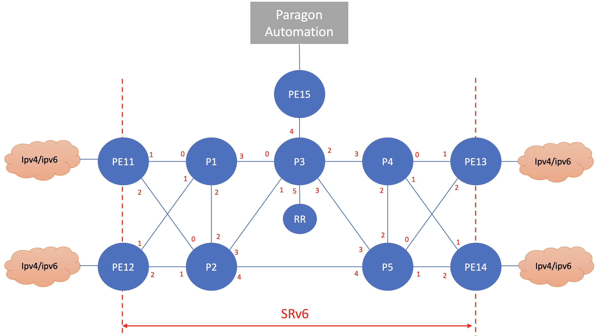

# SRv6 Lab

## Topology

## Devices in the lab

- vjunos router : pe11, pe12, p1, p2
- Linux server: ubuntu1
- Linux container (LXC) running on node ubuntu1
    * ce1, ce2, ce3, ce4, ce5, ce6, ce7, ce8: alpine linux with FRR routing software
    * c{x}ce{y}, c{x}evpn1 : x is {1..4}, y is {1..8}, alpine linux as client to test the traffic from one site to another site

## To create the lab topology and initial configuration of VMs
1. Go to directory [Paragon Lab](./)
2. Edit file [lab.yaml](./lab.yaml). Set the following parameters to choose which vmm server that you are going to use and the login credential:
    - vmmserver 
    - jumpserver
    - user 
    - adpassword
    - ssh_key_name ( please select the ssh key that you want to use, if you don't have it, create one using ssh-keygen and put it under directory **~/.ssh/** on your workstation )
3. If you want to add devices or change the topooogy of the lab, then edit file [lab.yaml](lab.yaml)
4. use [vmm.py](../../vmm.py) script to deploy the topology into the VMM. Run the following command from terminal

        ../../vmm.py upload  <-- to create the topology file and the configuration for the VMs and upload them into vmm server
        ../../vmm.py start   <-- to start the topology in the vmm server

5. Verify that you can access node **gw** using ssh (username: ubuntu,  password: pass01 ). You may have to wait for few minutes for node **gw** to be up and running
6. Run script [vmm.py](../../vmm.py) to send and run initial configuration on node **gw**. This will configure ip address on other interfaces (such ase eth1, eth2, etc) and enable dhcp server on node gw

        ../../vmm.py set_gw

7. Verify that you can access other nodes (linux and junos VM), such **pe11**, **pe12**, **ubuntu1**, etc. Please use the credential to login.

        ssh ubuntu1

8. Run script [vmm.py](../../vmm.py) to send and run initial configuration on linux nodes. This script will also reboot the VM. So wait before you test connectivity into the VM

        ../../vmm.py set_host

9. Verify that you can access linux and junos VMs, such **pe11**, **pe12**, **ubuntu1**, without entering the password. You may have to wait for few minutes for the nodes to be up and running

        ssh ubuntu1

## Upload configuration into node pe11, pe12, p1, and p2

1. router configuration can be found [here](config/router/config_lab)
2. ansible script [update_router.yaml](config/router/update_router.yaml) can be used to upload configuration into router

        ansible-playbook update_router.yaml

## update node ubuntu1
1. open ssh session into node ubuntu1
2. update system on ubuntu1

        sudo apt -y update 
        sudo apt -y upgrade
        sudo apt -y install bridge-utils openvswitch-switch openvswitch-common

3. update lxd on ubuntu1

        sudo snap refresh lxd
        
4. Initialize LXD on node ubuntu1

        sudo lxd init

5. Download LXC image, alpine edge

        lxc image copy images:alpine/edge local: --alias alpine
        lxc image ls

6. Reboot node ubuntu1

        sudo reboot

## Create LXC container : router
1. open ssh session into node ubuntu1

        ssh ubuntu1

1. Create an LXC container called **router**

        lxc launch alpine router
        lxc list

2. Access LXC router shell, update the image, and install software frr, openssh, dhcp-server and radvd

        lxc exec router sh
        apk update
        apk upgrade
        apk add frr openssh  dhcp-server radvd curl python3

3. Create ssh key for ssh server, and set ssh and frr to run at startup

        ssh-keygen -t rsa
        cp .ssh/id_rsa.pub .ssh/authorized_keys
        rc-update add sshd
        rc-update add frr
        rc-update add dhcpd
        rc-update add radvd
        service sshd start
        ssh localhost

4. Edit file /etc/frr/daemons and change entry bgpd=no to bgpd=yes

        sed -i -e "s/bgpd=no/bgpd=yes/" /etc/frr/daemons

5. Exit container router shell

        exit
6. on node ubuntu1 shell, stop container router

        lxc stop router
        lxc ls

## Create LXC container : client
1. On node **ubuntu1** shell, create an LXC container called **client**

        lxc launch alpine client

2. Access LXC router shell, update the image, and install software frr, openssh

        lxc exec client sh
        apk update
        apk ugprade
        apk add iperf3 iperf openssh python3 curl

2. Create ssh key for ssh server, and set ssh and frr to run at startup

        ssh-keygen -t rsa
        cp .ssh/id_rsa.pub .ssh/authorized_keys
        rc-update add sshd

3. Exit container client shell

        exit

4. on node ubuntu1 shell, stop container router

        lxc stop client
        lxc ls

## set interface interface eth1, eth3 and bridge on node **ubuntu1**
1. upload script [update_network_config.sh](config/ubuntu1/update_network_config.sh) into node ssh1

        scp config/ubuntu1/update_network_config.sh ubuntu1:~/

2. Open ssh session into node **ubuntu1** and run script [update_network_config.sh](config/ubuntu1/update_network_config.sh)

        ssh ubuntu1
        ./update_network_config.sh 

3. Verify that the required linux bridge has been create

        brctl show

## creating multiple LXC containers required by the lab
1. upload directory [lxc_create](config/ubuntu1/lxc_create) into node **ubuntu1**

        scp -r config/ubuntu1/lxc_create ubuntu1:~/

2. open ssh session into node **ubuntu** and enter directory lxc_create

        ssh ubuntu1
        cd lxc_create

3. Run script create_LXC_containers.sh. it will create the necessary containers for the lab

        ./create_LXC_containers.sh

4. verify that all containers are running

        lxc ls

5. Now you can play around with the lab.

    

