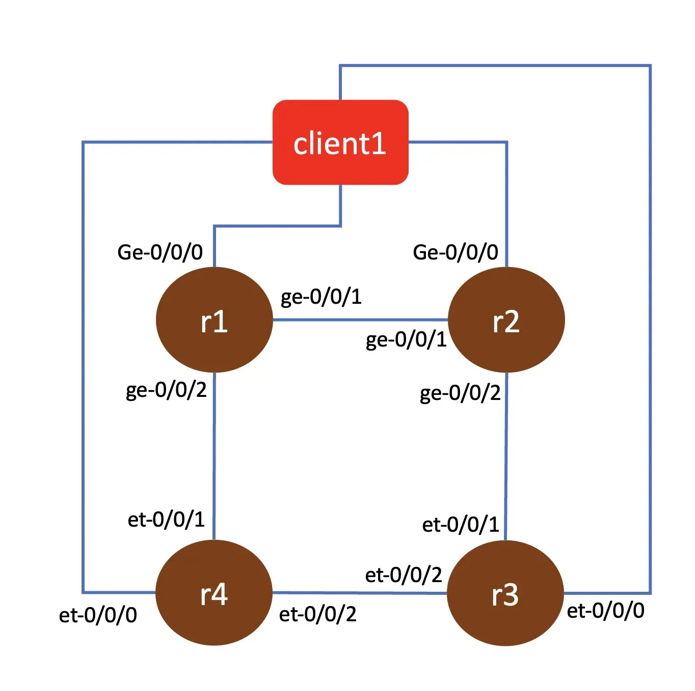
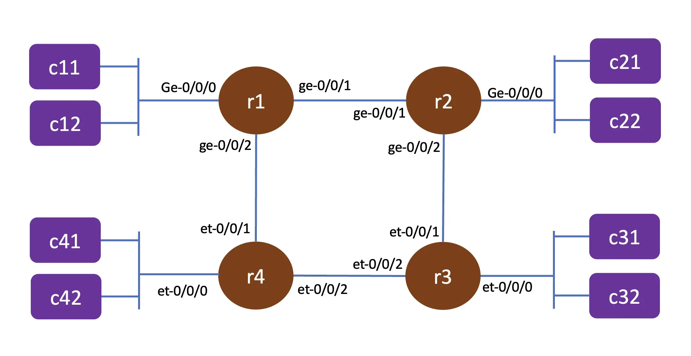

# Lab topo1

## nodes in the topology 

- r1, r2 : vJunosRouter
- r3, r4 : vJunosEvolved
- client1: ubuntu VM to simulate client

## Topology

Connection between nodes

Connection with simulated client

## Deploying the topology 

Screenshot recording for this can be found [here](https://asciinema.org/a/738390)

1. go into the **topo1** directory 

       cd ~/git/vmm-v3-script/Lab/topo1

2. upload the topology into VMM

       ../../vmm.py upload

3. start the topology 

       ../../vmm.py start

4. wait for few minutes until node **gw** is up and running
5. upload configuration into node **gw**

       ../../vmm.py set_gw

6. wait for few minutes until the ZTP process for all vjunos node are up and running
7. open ssh session into node **gw**, test connectivity to vjunos node (r1, r2, r3, r4) and open ssh session, or test connectivity to junos VM from your workstation.

       ssh gw
       ping r1
       ssh admin@r1

8. return to your workstation, and upload configuration into node **client1** (linux VM)

       ../../vmm.py set_host

9. upload file [02_net.yaml](02_net.yaml) into node client1

       scp 02_net.yaml client1:~/

9. open ssh session into node client1 to verify that it is up and running

       ssh client1
       ip addr show 

10. Install software openvswitch and lxd into node client1

       ssh client1
       tmux
       sudo apt -y update && sudo apt -y upgrade && sudo apt -y install openvswitch-switch && sudo snap install lxd

    

11. on node client1, copy file 02_net.yaml into directory /etc/netplan/, and activate the network configuration, and verify that four openswitch has been configured

       ssh client1
       sudo cp 02_net.yaml /etc/netplan/
       sudo netplan apply 
       sudo ovs-vsctl show 
    

## Upload additional configuration into node r1, r2, r3, r4

Screenshot recording for this can be found [here](https://asciinema.org/a/738391)

1. use ansible playbook [set_intf.yaml](setup/set_intf.yaml) to upload additional configuration (setting ip on interface ge-0/0/0 or et-0/0/0)

       cd ~/git/vmm-v3-script/Lab/topo1/setup
       ansible-playbook set_intf.yaml

2. open ssh session into **r1** to verify that configuration is working

       ssh r1
       show configuration 
       show route protocol isis

## create linux container to simulate client on node client1

Screenshot recording for this can be found [here](https://asciinema.org/a/738393)

1. upload script [create_client.sh](set/create_client.sh) into node client1

       scp ~/git/vmm-v3-script/Lab/topo1/setup/create_client.sh

2. initialize lxd on node client1 (answer all the question with default parameter)

3. open ssh session into node client1, and download alpine LXC image, and create an lxc container called client

       ssh client1
       lxc image copy images:alpine/edge local: --alias alpine
       lxc launch alpine client
       lxc ls

4. access container client, and add packages openssh and iperf

       lxc exec client sh
       apk update
       apk upgrade
       apk add openssh iperf

5. configure openssh to allow root login and set root password

       passwd root
       cat << EOF | tee -a /etc/ssh/sshd_config
       PermitRootLogin yes
       EOF
       rc-update add sshd
       service sshd start
       ssh root@localhost

5. exit from the shell of container client and stop the container

       exit
       lxc stop client

6. Run script  [create_client.sh](set/create_client.sh) to create multiple client to simulate users on r1, r2, r3, r4

       ./create_client.sh
       lxc ls

7. Access the simulated client and test connectivity to other client accross the network

       lxc exec c11 sh 
       ping 192.168.20.1
       ping 192.168.30.1
       ssh root@fc00:dead:beef:aa30::1000:1

