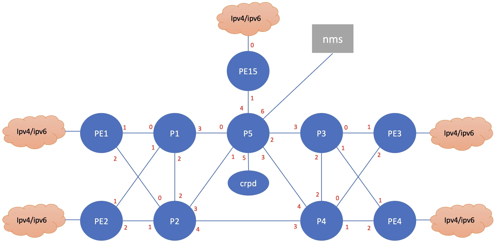

# Lab topo2

## nodes in the topology 

- pe1, pe2, pe3, pe4, pe5, p1, p2, p3, p4, p5: vJunosrouter
- client: ubuntu VM to simulate client or ce
- crpd: ubuntu VM to host cRPD software
- nms1, nms2 : ubuntu VM to host nms application
- br1, br2, br3: alpine VM to simulate delay and link failure between vJunosNode

## Topology

Connection between nodes

## Deploying the topology 

Screenshot recording for this can be found [here](https://asciinema.org/a/740334)

1. go into the **topo2** directory 

       cd ~/git/vmm-v3-script/Lab/topo2
       source ~/python3/vmmlab/bin/activate

2. upload the topology into VMM

       ../../vmm.py upload

3. start the topology 

       ../../vmm.py start

4. wait for few minutes until node **gw** is up and running
5. upload configuration into node **gw**

       ../../vmm.py set_gw

6. wait for few minutes until the ZTP process for all vjunos node are up and running
7. open ssh session into node **gw**, test connectivity to vjunos node (pe1/2/3/4/5, p1/2/3/4/5) and open ssh session, or test ssh to junos VM from your workstation.

       ssh gw
       ping pe1
       ssh admin@pe1

8. return to your workstation, and upload configuration into Linux VM :  **client**, **crpd**, **nms1**, **nms2**, **br1**, **br2**, **br3**

       ../../vmm.py set_host

9. open ssh session into node **client**, **crpd**, **nms1**, **nms2**, **br1**, **br2**, **br3** to verify that they are up and running

       ssh client
       ip addr show 

10. On your workstation, run ansible playbook [upload_nodes.yaml](setup/host/update_nodes.yaml) to update software on linux VM and upload the necessary script required for the lab exercise.

       cd setup/host
       ansible-playbook update_nodes.yaml

11. Reboot the linux VMs node (client, nms1, nms2, crpd, br1, br2, br3 using script [reboot_vm.sh](setup/host/reboot_vm.sh))

## Installing Juniper CRPD container on node crpd

Screenshot recording for this can be found [here](https://asciinema.org/a/740335)

1. Upload script [install_crpd.sh](setup/host/install_crpd.sh) into node **crpd**

       scp ./install_crpd.sh crpd:~/

2. Upload crpd software into node **crpd** and load it using podman on node **crpd**

       scp junos-routing-crpd-amd64-25.2R1.9.tgz crpd:~/
       ssh crpd
       sudo podman load -i junos-routing-crpd-amd64-25.2R1.9.tgz 
       sudo podman image ls
       
3. Run script [install_crpd.sh](setup/router/install_crpd.sh)  on node **crpd** to create container crpd

       ./install_crpd.sh crpd 25.2R1.9
       sudo podman ps -a 

4. Access crpd container and insert the initial configuration [crpd_initial.conf](setup/router/crpd_initial.conf)

       sudo podman exec -it crpd cli
       edit

5. Verify that isis adjacency has been established and crpd has received isis routes

       show isis adj
       show route protocol isis

## Upload additional configuration (BGP configuration) into vJunosRouter nodes

Screenshot recording for this can be found [here](https://asciinema.org/a/740336)

1. use ansible playbook [set_yaml.yaml](setup/router/set_bgp.yaml) to upload additional configuration (BGP configuration between PE and cRPD/RR)

       cd ~/git/vmm-v3-script/Lab/topo2/setup/router
       ansible-playbook set_bgp.yaml

2. open ssh session into **pe1** to verify that configuration is working (BGP session between PE1/2/3/4/5 and crpd has been established)

       ssh pe1
       show configuration 
       show bgp summary

