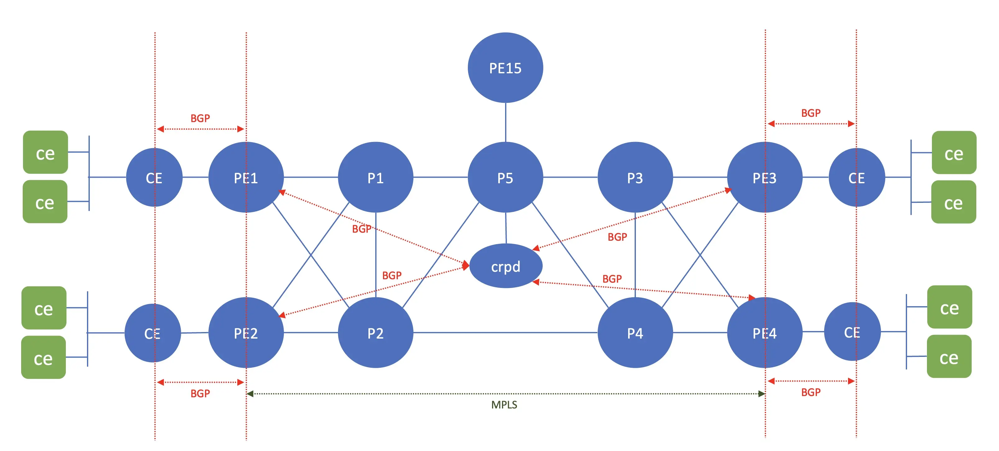

# Lab exercise 1, BGP free core

## Objective

In this lab, we are going to configure BGP free core on the ip MPLS backbone.

The following configuration will be done on the network devices
1. Configure PE routers with BGP for connection to customer and upstream internet. PE1, PE2, PE3, and PE4 are connected to CE1, CE2, CE3 and CE4 where subscribers are connected, and PE5 is connected to GW where connection to internet is available.
eBGP will be configured between PE and CE, and PE and GW, 

2. verify that on the IP MPLS Backbone, internet routes are not available, that traffic between PE will be forwarded using MPLS forwarding.

3. verify that client on site is able to access client on other site and the internet.

## Topology 

## configure node GW and vJunosRouter

Screenshot recording for this can be found [here](https://asciinema.org/a/740338)

1. Upload configuration file [03_gw_net.yaml](03_gw_net.yaml) to node **gw**, and do net apply to activate the interace configuration for interface eth2

        scp 03_gw_net.yaml gw:~/
        ssh gw "sudo netplan apply"
        ssh gw "ip addr show"

2. configure bgp on frr on node **gw**

        ssh gw
        sudo sed -i -e "s/bgpd=no/bgpd=yes/" /etc/frr/daemons
        sudo systemctl restart frr
        sudo vtysh
        config t

3. Put the following configuration into frr

        ipv6 route ::/0 Null0
        !
        router bgp 4200000000
        no bgp ebgp-requires-policy
        neighbor 172.16.210.15 remote-as 4200000001
        neighbor fc00:dead:beef:a210::15 remote-as 4200000001
        !
        address-family ipv4 unicast
        network 0.0.0.0/0
        exit-address-family
        !
        address-family ipv6 unicast
        network ::/0
        neighbor fc00:dead:beef:a210::15 activate
        exit-address-family
        exit
        !
        end
        exit
        write

4. Use ansible playbook [set_bgp.yaml](set_bgp.yaml) to upload configuration into node PE1/2/3/4/5

        cd ~/git/vmm-v3-script/Lab/topo1/lab_exercise/lab1
        ansible-playbook set_bgp.yaml

5. verify that configuration on PE1/2/3/4/5 are working 

        ssh pe3
        show bgp summary
        show route table inet.0
        show route table inet6.0

## create linux container to simulate router ce and client on node client

Screenshot recording for this can be found [here](https://asciinema.org/a/740339)

1. open ssh session into node **client**, initiate lxd

        ssh client
        sudo lxd init

2. open ssh session into node **client**, and download alpine LXC image, and create an lxc container called client

       ssh client
       lxc image copy images:alpine/edge local: --alias alpine
       lxc launch alpine client
       lxc ls

3. access container client, and add packages openssh and iperf

       lxc exec client sh
       apk update && apk upgrade
       apk add openssh iperf

4. configure openssh to allow root login and set root password

       passwd root
       cat << EOF | tee -a /etc/ssh/sshd_config
       PermitRootLogin yes
       EOF
       rc-update add sshd
       service sshd start
       ssh root@localhost
       exit
       lxc stop client

5. Create linux container **router** from container **client**

        lxc copy client router
        lxc ls
        lxc start router
        lxc exec router sh
        apk add frr
        sed -i -e "s/bgpd=no/bgpd=yes/" /etc/frr/daemons
        rc-update add frr
        exit
        lxc stop router

6. upload script [create_lxc_router.sh](create_lxc_router.sh) into node client, and run it to create lxc containers to simulate router ce1/ce2/ce3/ce4. Verify that BGP has been established between CE and PE (CE1--PE1, CE2--PE2, CE3--PE3, CE4--PE4), and CE has received and advetised ipv4 and ipv6

        ./create_lxc_router.sh
        lxc ls
        lxc exec lab1ce1 vtysh
        show bgp summary
        show ip route
        show ipv6 route

7. Create linux container to simulate clients. upload script [create_lxc_client.sh](create_lxc_client.sh) into node client, and run it. access of the client container and test connectivity to other client accross the network.

        ./create_lxc_client.sh
        lxc ls
        lxc exec lab1cl1-101 sh
        ping lab1cl3-101 
        ping6 lab1cl3-101
        ssh root@lab1cl3-101 or ssh -6 root@lab1cl3-101
        netstat -n
        ping www.juniper.net

## introduce delay in the network

Screenshot recording for this can be found [here](https://asciinema.org/a/740340)

In this lab exercise, we are going to introduce delay on the network .

Delay is introduce using linux's iproute tc command on the node bridge (br1, br2, or br3).

in this lab, we are going to test traffic between LXC lab1cl1-101 and lab1cl4-101.

Path between LXC lab1cl1-101 and lab1cl4-101 is the following:

        lab1cl1-101 ---- lab1ce1 ---- pe1 ---- p2 ----- p4 ---- pe4 ---- lab1ce4 ---- lab1cl4-101

Between PE1 and P2, there is node **BR2**, where PE1 is connected to port eth3 of BR2, and P2 is connected to port eth4 of BR2, and port eth3 and eth4 are connected to bridge pe1p2 (please refer to the file lab.yaml to verify connectivity on node **BR**)

        ssh br2
        br2:~$ brctl show
        bridge name	    bridge id		STP enabled	interfaces
        pe2p1		    8000.56041b002779	no		eth5
                                                    eth6
        pe1p1		    8000.56041b002bf0	no		eth1
                                                    eth2
        pe2p2		    8000.56041b004faa	no		eth7
                                                    eth8
        pe1p2		    8000.56041b004557	no		eth3
                                                    eth4
        br2:~$

1. open ssh session into node **client**, access LXC **lab1cl1-101**, generate ping to **lab1cl4-101** and verify that ping is under 100ms

       ssh client
       lxc exec lab1cl1-101 sh
       ping lab1cl4-101

2. open ssh session into node **br2**, and add delay 100ms to interface eth3 using iproute2 tc command

       ssh br2
       brctl show 
       sudo tc qdisc add dev eth3 root netem delay 100ms

3. Go back to session to  LXC **lab1cl1-101**, and verify that delay to **lab1cl4-101** has been increased by 100ms

4. Go back to session to node **br2** and remote the delay from interface eth3, and verify that on  LXC **lab1cl1-101** , delay to **lab1cl4-101** has been reduced by 100ms

       sudo tc qdisc del dev eth3 root netem