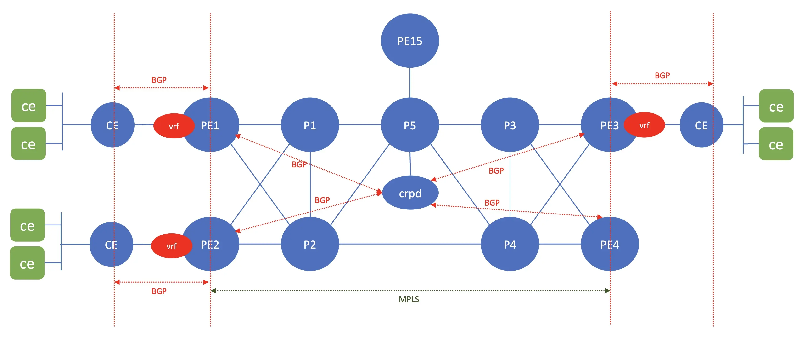
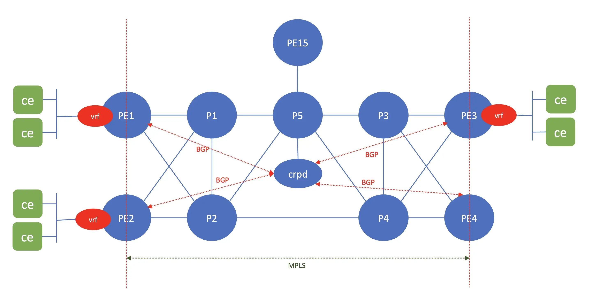
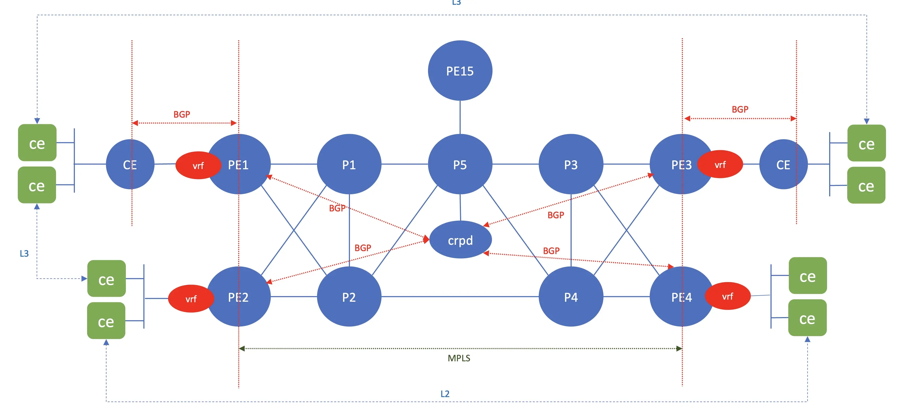

# Lab exercise 2, L3VPN and EVPN over MPLS
## Objective

In this lab, we are going to configure L3VPN and EVPN over MPLS 

The following configuration will be done on the network devices: 
1. Configure PE routers with routing instances for L3VPN and EVPN.

2. Create LXC CE and client to test the traffic

3. verify that L3VPN and EVPN are working.

## Configure PE router for L3VPN for customer1

### topology 

Screenshot recording for this can be found [here](https://asciinema.org/a/740484)

1. Routing instance for **customer1** will be configured on PE1, PE2 and PE3.
2. parameter for **customer1** are the following

| PE Router | CE Router | Subnet on CE | Subnetv6 on CE | Vlan between CE and PE| ASN on CE|
|-|-|-|-|:-:|-|
|PE1|lab2ce1| 192.168.1.0/24| fc00:dead:Beef:a001::/64| 102|4200002001|
|PE2|lab2ce2| 192.168.2.0/24| fc00:dead:Beef:a002::/64| 102|4200002002|
|PE3|lab2ce3| 192.168.3.0/24| fc00:dead:Beef:a003::/64| 102|4200002003|

3. Use ansible playbook [set_cust1.yaml](l3vpn_cust1/set_cust1.yaml) to deploy configuration to PE1/2/3

    cd ~/git/vmm-v3-script/Lab/topo2/lab_exercise/lab2/
    ansible-playbook l3vpn_cust1/set_cust1.yaml

4. Verify that configuration has been deploy to PE1/PE2/PE3

    ssh pe1
    show configuration routing-instances
    show route table cust1.inet.0 
    show route table cust1.inet6.0

## create linux container to simulate router ce and client on node client for L3VPN for customer1

1. upload script [create_lxc_router.sh](l3vpn_cust1/create_lxc_router.sh) into node client, and run it to create lxc containers to simulate router ce1/ce2/ce3. Verify that BGP has been established between CE and PE (CE1--PE1, CE2--PE2, CE3--PE3), and CE has received and advetised ipv4 and ipv6

        ./create_lxc_router.sh
        lxc ls
        lxc exec lab2cust1ce1 vtysh
        show bgp summary
        show ip route
        show ipv6 route

2. Create linux container to simulate clients. upload script [create_lxc_client.sh](l3vpn_cust1/create_lxc_client.sh) into node client, and run it. access of the client container and test connectivity to other client accross the network.

        ./create_lxc_client.sh
        lxc ls
        lxc exec lab2cust1cl1-101 sh
        ping lab2cust1cl3-101 
        ping6 lab2cust1cl3-101
        ssh root@lab2cust1cl3-101 or ssh -6 root@lab2cust1cl3-101
        netstat -n

## Configure PE router for L2 EVPN for customer2

Screenshot recording for this can be found [here](https://asciinema.org/a/740498)

1. Routing instance for **customer2** will be configured on PE1, PE2 and PE3.

2. Use ansible playbook [set_cust2.yaml](evpn_cust2/set_cust2.yaml) to deploy configuration to PE1/2/3

    cd ~/git/vmm-v3-script/Lab/topo2/lab_exercise/lab2/
    ansible-playbook evpn_cust2/set_cust2.yaml

3. Verify that configuration has been deploy to PE1/PE2/PE3

    ssh pe1
    show configuration routing-instances

## create linux container to clients on node client for EVPN for customer2

1. Create linux container to simulate clients. upload script [create_lxc_client.sh](evpn_cust2/create_lxc_client.sh) into node client, and run it. access of the client container and test connectivity to other client accross the network.

        ./create_lxc_client.sh
        lxc ls
        lxc exec lab2cust2cl11 sh
        ping lab2cust2cl31 
        ping6 lab2cust2cl31
        ssh root@llab2cust2cl31 or ssh -6 root@llab2cust2cl31
        netstat -n

## Configure PE router for EVPN type 2 and type 5 for customer3

Screenshot recording for this can be found [here](https://asciinema.org/a/740660)

In this lab, we are going to configure EVPN type2 and type 5 for customer3.

Customer3 has four different sites:
- site1 connected to PE1
- site2 connected to PE2
- site3 connected to PE3
- site4 connected to PE4

site1 and site3 are using unique subnet and connected through CE router to PE using BGP as routing protocol between CE and PE

site2 and site4 are on the same subnet and connected directly to PE

between Site1, site3, and site2/site4 are using EVPN type 5, and between site2 and site4 are using EVPN type 2.

| site | subnet | subnet6|
|-|-|-|
|site1 | 172.16.11.0/24|fc00:dead:Beef:a011::/64|
|site2 | 172.16.12.0/24|fc00:dead:Beef:a012::/64|
|site3 | 172.16.13.0/24|fc00:dead:Beef:a013::/64|
|site4 | 172.16.12.0/24|fc00:dead:Beef:a012::/64|

Screenshot recording for this can be found [here]()

### configuration steps

1. Routing instance for **customer3** will be configured on PE1, PE2, PE3, and PE4

2. Use ansible playbook [set_cust3.yaml](evpn_cust3/set_cust3.yaml) to deploy configuration to PE1/2/3/4

    cd ~/git/vmm-v3-script/Lab/topo2/lab_exercise/lab2/
    ansible-playbook evpn_cust3/set_cust3.yaml

3. Verify that configuration has been deploy to PE1/PE2/PE3/PE4

    ssh pe1
    show configuration routing-instances
    ssh pe1
    show evpn instance

## create linux container to simulate router ce and client on node client for EVPN for customer3

1. upload script [create_lxc_router.sh](l3vpn_cust1/create_lxc_router.sh) into node client, and run it to create lxc containers to simulate router ce1/ce2/ce3. Verify that BGP has been established between CE and PE (CE1--PE1, CE2--PE2, CE3--PE3), and CE has received and advetised ipv4 and ipv6

        ./create_lxc_router.sh
        lxc ls
        lxc exec lab2cust3ce1 vtysh
        show bgp summary
        show ip route
        show ipv6 route

2. Create linux container to simulate clients. upload script [create_lxc_client.sh](l3vpn_cust1/create_lxc_client.sh) into node client, and run it. access of the client container and test connectivity to other client accross the network.

        ./create_lxc_client.sh
        lxc ls
        lxc exec lab2cust3cl11 sh
        ping lab2cust3cl21
        ping6 lab2cust3cl21
        ssh root@lab2cust3cl21 or ssh -6 root@lab2cust3cl21
        netstat -n
