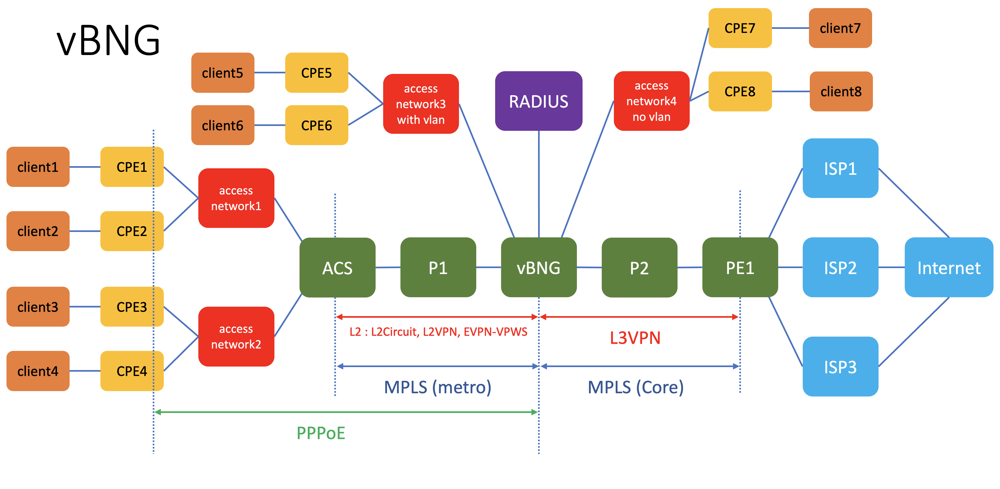

# How setup the vBNG Lab
## topology
This is the topology of the lab

## Devices in the lab

- VMX : ACS (Metro access edge), P1 (Metro P MPLS), vBNG, P2 (Core P MPLS), PE1 (GE core MPLS)
- Radius Server
- Access Network : L2 access network

## Credential to access devices
- Ubuntu linux
    - user: ubuntu
    - password: pass01
- Alpine linux
    - user: ubuntu
    - password: pass01
- JUNOS VM
    - user: admin
    - password: pass01

## To create the lab topology and initial configuration of VMs
1. Go to directory [vBNG](./)
2. Edit file [lab.yaml](./lab.yaml). Set the following parameters to choose which vmm server that you are going to use and the login credential:
    - vmmserver 
    - jumpserver
    - user 
    - adpassword
    - ssh_key_name ( please select the ssh key that you want to use, if you don't have it, create one using ssh-keygen and put it under directory **~/.ssh/** on your workstation )
3. If you want to add devices or change the topooogy of the lab, then edit file [lab.yaml](lab.yaml)
4. use [vmm.py](../../vmm.py) script to deploy the topology into the VMM. Run the following command from terminal

        ../../vmm.py upload  <-- to create the topology file and the configuration for the VMs and upload them into vmm server
        ../../vmm.py start   <-- to start the topology in the vmm server

5. Verify that you can access node **gw** using ssh (username: ubuntu,  password: pass01 ). You may have to wait for few minutes for node **gw** to be up and running
6. Run script [vmm.py](../../vmm.py) to send and run initial configuration on node **gw**

        ../../vmm.py set_gw

7. Verify that you can access other nodes (linux and junos VM), such **control**, **node**, **node1**, etc. Please use the credential to login.

        ssh control

8. Run script [vmm.py](../../vmm.py) to send and run initial configuration on linux nodes. This script will also reboot the VM. So wait before you test connectivity into the VM

        ../../vmm.py set_host

9. Verify that you can access linux and junos VMs, such **control**, **node**, **node1**, without entering the password. You may have to wait for few minutes for the nodes to be up and running

        ssh pe1
        ssh vbng
        ssh pe2

## Uploading Initial configuration into devices
1. open ssh session into node **radius**, and install freeradius server (if necessary, reboot node **radius**)

        sudo apt -y update 
        sudo apt -y upgrade
        sudo apt -y freeradius
        sudo reboot

2. Upload radius configuration from [this directory](./node_configuration/radius/)

        cd node_configuration/radius
        scp authorize radius:~/
        scp clients.conf radius:~/
        scp 02_net.yaml radius:~/
         
3. On node **radius**, copy radius configuration into its respective directory

        sudo cp authorize /etc/freeradius/3.0/mods-config/files/
        sudo cp clients.conf /etc/freeradius/3.0/
        sudo cp 02_net.yaml /etc/netplan/

4. Restart freeradius services on node **radius**

        sudo netplan apply
        sudo systemctl enable freeradius
        sudo systemctl restart freeradius
        sudo systemctl status freeradius

5. Open ssh session into nodes **acs1**, and delete the existing bridge configurationn
        
        sudo brctl show
        sudo ip ilnk set dev br0 down <---- br0 is the existing  bridge
        sudo brctl delbr br0

6. Bring up interface eth1, eth2, and eth3
        
        for i in eth{1..3}
        do 
        sudo ip link set dev eth1 up
        done
7. install openvswitch on node **acs1**

        sudo apk add openvswitch
        sudo rc-update add ovs-modules
        sudo rc-update add ovsdb-server
        sudo rc-update add ovs-vswitchd
        sudo c-service ovs-modules start
        sudo rc-service ovsdb-server start
        sudo rc-service ovs-vswitchd start

8. Repeat step 5 - 7 on node **acs2** and **acs3**
9. on node **acs1** create one ovs-switch **access**, add port eth1 to switch **access**, add port eth2 to switch **access** with vlan tag 101, and add port eth2 to switch **access** with vlan tag 102

        sudo ovs-vsctl add-br access
        sudo ovs-vsctl add-port access eth1
        sudo ovs-vsctl add-port access eth2 tag=101
        sudo ovs-vsctl add-port access eth3 tag=102
        sudo ovs-vsctl show

10. on node **acs2** create one ovs-switch **access**, add port eth1 to switch **access**, add port eth2 to switch **access** with vlan tag 103, and add port eth2 to switch **access** with vlan tag 104

        sudo ovs-vsctl add-br access
        sudo ovs-vsctl add-port access eth1
        sudo ovs-vsctl add-port access eth2 tag=103
        sudo ovs-vsctl add-port access eth3 tag=104
        sudo ovs-vsctl show

11. on node **acs2** create one ovs-switch **access**, add port eth1 to switch **access**, add port eth2 to switch **access** with vlan tag 101, and add port eth2 to switch **access** with vlan tag 102

        sudo ovs-vsctl add-br access
        sudo ovs-vsctl add-port access eth1
        sudo ovs-vsctl add-port access eth2 tag=101
        sudo ovs-vsctl add-port access eth3 tag=102
        sudo ovs-vsctl show

12. Upload configuration into junos node **acs**, **vbng**, and **pe1**. The configuration are available [here](node_configuration/junos_config). You can also use [ansible playbook](node_configuration/junos_config/upload_config.yaml) to upload the configuration

        cd node_configuration/junos_config
        ansible-playbook upload_config.yaml

13. Upload file  [02_net.yaml](node_configuration/gw/02_net.yaml) into node **gw**, and copy it into directory /etc/netplan/

        ssh gw 
        sudo cp 02_net.yaml /etc/netplan
        sudo netplan.apply <---- to activate the configuration
        ip route show   <----- to verify the configuration
        ip addr show

14. Upload file [01_net.yaml](node_configuration/external/01_net.yaml) into node **external**, and copy it into directory /etc/netplan/

        ssh gw 
        sudo cp 01_net.yaml /etc/netplan
        sudo netplan.apply <---- to activate the configuration
        ip route show   <----- to verify the configuration
        ip addr show

14. Now you can explore the vBNG lab.
