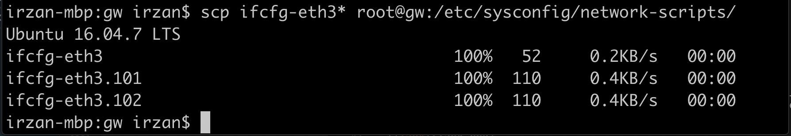
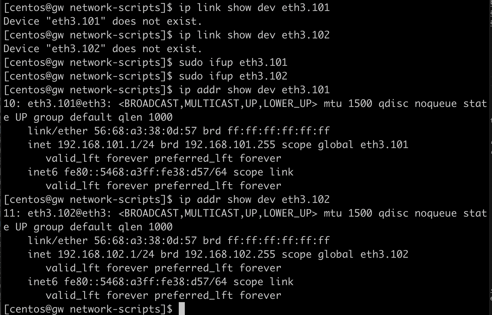
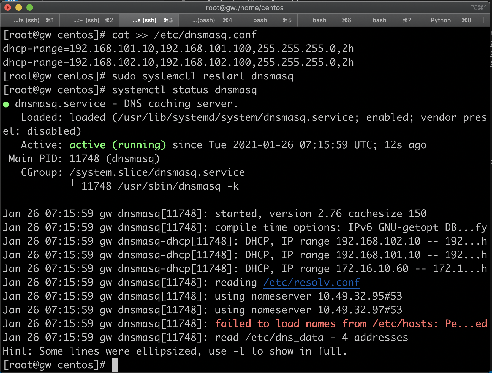
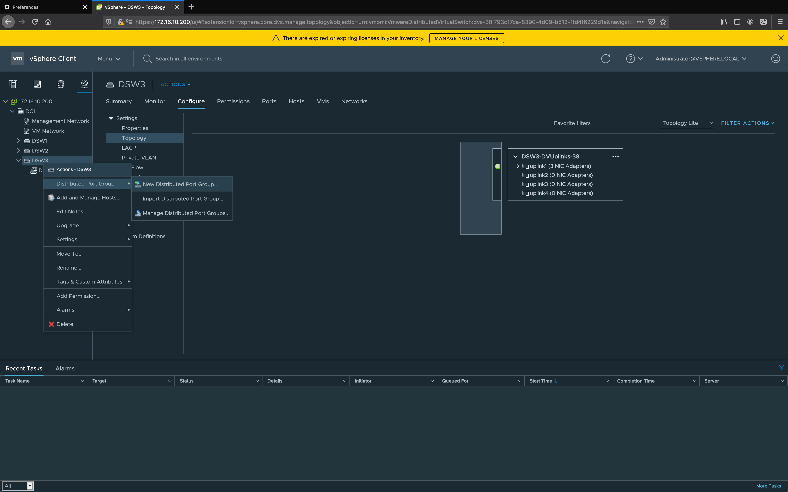
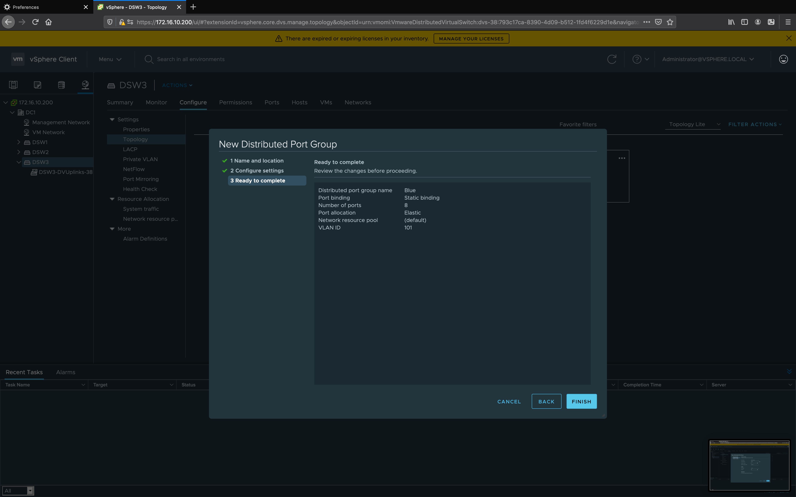
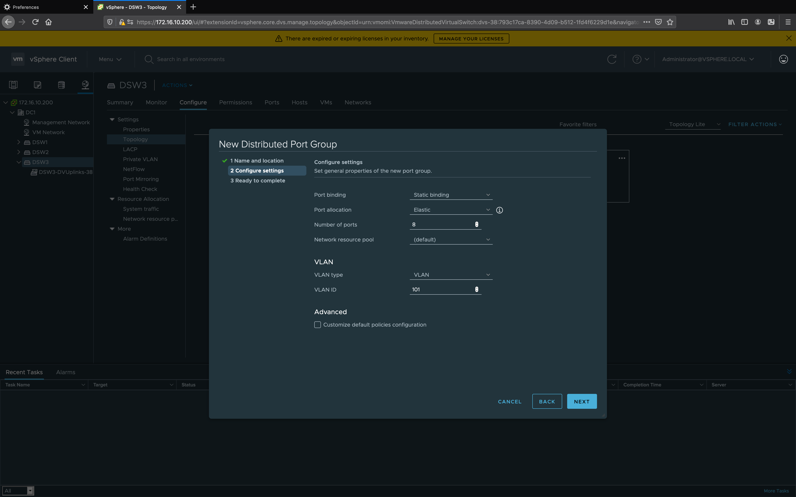
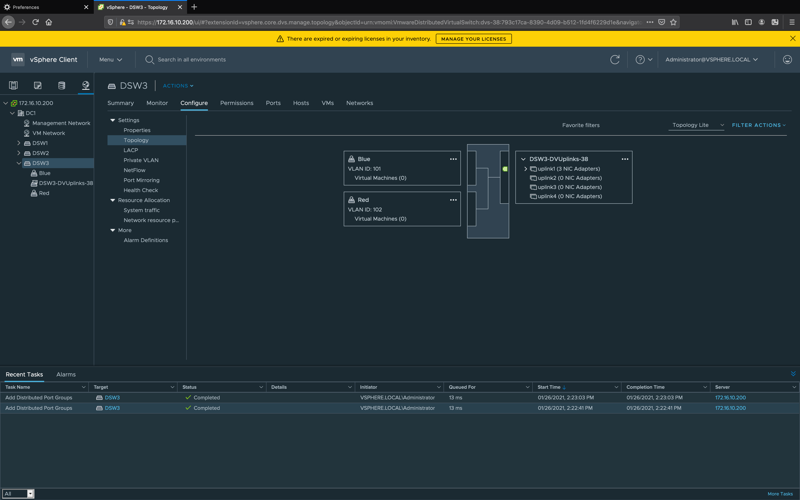

# Using vsphere lab.
In this lab exercise, the following will be done
- Gateway (GW) configuration to provide default gateway and dhcp for the VM on the vsphere
- DPG (Distributed port Group) or virtual network where Virtual machine will be connected to
- Deploying Virtual machine on vsphere

## Gateway configuration
1. upload these files into GW and put them into directory /etc/sysconfig/network-scripts
    - [ifcfg-eth3](https://github.com/Juniper-ASEANP-SE/vmware/blob/main/gw/ifcfg-eth3)
    - [ifcfg-eth3.101](https://github.com/Juniper-ASEANP-SE/vmware/blob/main/gw/ifcfg-eth3.101)
    - [ifcfg-eth3.102](https://github.com/Juniper-ASEANP-SE/vmware/blob/main/gw/ifcfg-eth3.102)

2. open ssh session into node **gw**.

3. Bring up interface eth2.101 and eth2.102

3. edit file /etc/dnsmasq.conf, and add the following entries at the end of the file

        dhcp-range=192.168.101.10,192.168.101.100,255.255.255.0,2h
        dhcp-range=192.168.102.10,192.168.102.100,255.255.255.0,2h

4. Do "sudo systemctl restart dnsmasq" to restart dhcp server

## DPG (Distributed port group configuration)
1. Distribute port group which will be configured
    DPG | vlan | 
    -|-
    Blue|101
    Red|102

2. open session to vcenter client dashboard , https://172.16.10.200/ui/
3. Select **Network** > **DSW3** . Right click on **DSW3**, select **Distributed Port Group** > **New Distributed Port Group**

4. Create DPG Blue with vlan 101, and DPG red with vlan 102

## Deploying Virtual machine
1. get the ova file for the vm. You can use the ova for linux alpine that I have created. you can download it from [here](https://junipernetworks-my.sharepoint.com/:u:/g/personal/irzan_juniper_net/ES7fcS3bNDpKll1mU_QTisIBF1xTIpAQOy0uDIm57SnQXA?e=Wr7xVD)

2. upload the ova file into node **gw**, directory /usr/share/nginx/html/file/

3. open session to vcenter client dashboard , https://172.16.10.200/ui/

4. Select **VM and templates** > **Deploy OVF Template** , select the URL (http://172.16.10.1/file/alpine.ova) or local file 

5. Set the virtual machine name, for example **VM1** and select the location **DC1**

6. Select cluster **CL1** for the compute resources. You can also select the **ESXi** node

7. Select storage : **vsanDatastore** (if VSAN is enabled) or any available datastore

8. Select destination network : **Blue**

9. Click finish and wait untuk virtual machine is deployed

10. Power on the virtual machine, access the console, and test network connectivity

11. Repeat step 4 - 10 to create another VMs which can be connected to different DPG

12. Now you can test connectivity

